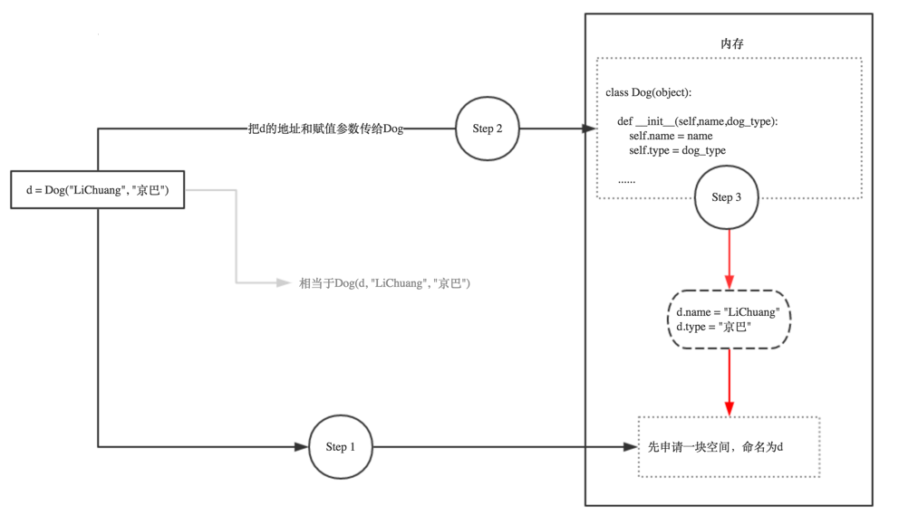

# python

## if \_\_name\_\_ == '\_\_main\_\_' <a id="1%20if%20__name__%20%3D%3D%20&apos;__main__&apos;"></a>

### 逻辑解释

通俗的理解 **name == 'main'**：假如你叫小明.py，在朋友眼中，你是小明\(**name == '小明'**\)；在你自己眼中，你是你自己\(**name == 'main'**\)。

if **name** == '**main**' 的意思是：当.py文件被直接运行时，if **name** == '**main**' 之下的代码块将被运行；当.py文件以模块形式被导入时，if **name** == '**main**' 之下的代码块不被运行。

对于很多编程语言来说，程序都必须要有一个入口，比如C，C++，以及完全面向对象的编程语言Java，C\#等。如果你接触过这些语言，对于程序入口这个概念应该很好理解，C，C++都需要有一个main函数作为程序的入口，也就是程序的运行会从main函数开始。同样，Java，C\#必须要有一个包含Main方法的主类，作为程序入口。

而Python则不同，它属于脚本语言，不像编译型语言那样先将程序编译成二进制再运行，而是动态的逐行解释运行。也就是从脚本第一行开始运行，没有统一的入口。

一个Python源码文件（.py）除了可以被直接运行外，还可以作为模块（也就是库），被其他.py文件导入。不管是直接运行还是被导入，.py文件的最顶层代码都会被运行（Python用缩进来区分代码层次），而当一个.py文件作为模块被导入时，我们可能不希望一部分代码被运行。

### **举例说明**

假设我们有一个const.py文件，内容如下

```python
PI = 3.14
 
def main():
    print("PI:", PI)
 
main()
 
# 运行结果：PI: 3.14
```

现在，我们写一个用于计算圆面积的area.py文件，area.py文件需要用到const.py文件中的PI变量。从const.py中，我们把PI变量导入area.py：

```python
from const import PI
 
def calc_round_area(radius):
    return PI * (radius ** 2)
 
def main():
    print("round area: ", calc_round_area(2))
 
main()
 
'''
运行结果：
PI: 3.14
round area:  12.56
'''
```

我们看到const.py中的main函数也被运行了，实际上我们不希望它被运行，因为const.py提供的main函数只是为了测试常量定义。这时if **name** == '**main**' 派上了用场，我们把const.py改一下，添加if **name** == "**main**"：

```python
PI = 3.14
 
def main():
    print("PI:", PI)
 
if __name__ == "__main__":
    main()
```

运行const.py，输出如下

```python
PI: 3.14
```

运行area.py，输出如下：

```python
round area:  12.56
```

如上，我们可以看到if **name** == '**main**' 相当于Python模拟的程序入口，Python本身并没有这么规定，这只是一种编码习惯。由于模块之间相互引用，不同模块可能有这样的定义，而程序入口只有一个。到底哪个程序入口被选中，这取决于**name** 的值。

## **\_init\_\_与self** <a id="2%20__init__%E4%B8%8Eself"></a>

### **逻辑解释**

self，英文单词意思很明显，表示自己，本身。python的self，是个对象（Object），是当前类的实例。

在类的代码（函数）中，需要访问当前的实例中的变量和函数的，即，访问Instance中的：

* 对应的变量（属性，property\)：Instance.ProperyName，去读取之前的值和写入新的值
* 调用对应函数（function）：Instance.function\(\)，即执行对应的动作

而需要访问实例的变量和调用实例的函数，当然需要对应的实例Instance对象本身。而Python中就规定好了，函数的第一个参数，就必须是实例对象本身，并且建议，约定俗成，把其名字写为self。如果没有用到self，即代码中，去掉self后，那种写法所使用到的变量，实际上不是你所希望的，不是真正的实例中的变量和函数，而是的访问到了其他部分的变量和函数了。甚至会由于没有合适的初始化实例变量，而导致后续无法访问的错误。

下面，就通过代码，来演示，如果去掉self，或者没有合理的使用self，会出现哪些错误。

### **举例说明**

```python
#!/usr/bin/env python
# -*- coding:utf-8 -*-
# Author: antcolonies
 
class Person(object):
    def __init__(self, name, lang, website):
        self.name = name
        self.lang = lang
        self.website = website
 
        print('self: ', self)
        print('type of self: ', type(self))
'''
未实例化时，运行程序，构造方法没有运行
'''
 
p = Person('Tim', 'English', 'www.universal.com')   
 
'''实例化后运行的结果
self:  <__main__.Person object at 0x00000000021EAF98>
type of self:  <class '__main__.Person'>
'''
```

可以看出self为实例变量p，是一个Person类型的对象。

```python
class Dog(object):       
    def __init__(self,name,dog_type):
        self.name = name
        self.type = dog_type
   
    def sayhi(self):
        print("hello,I am a dog, my name is ",self.name)
   
   
d = Dog('LiChuang',"京巴")            # 实例化
d.sayhi()
```

以下是d = Dog\('LiChuang',"京巴"\)实例化的示意图：



如下代码，完整的演示了，如果没有在类Class的最初的**init**函数中，正确的初始化实例变量，则会导致后续没有变量可用，因而出现AttributeError的错误：

```python
#!/usr/bin/env python
# -*- coding:utf-8 -*-
# Author: antcolonies
 
name = 'whole global name'
'''
注：此处全局的变量名，写成name，只是为了演示而用
实际上，好的编程风格，应该写成gName之类的名字，
以表示该变量是Global的变量
'''
 
class Person(object):
    def __init__(self, newPersonName):
        # self.name = newPersonName
        '''
        如果此处不写成self.name
        那么此处的name，只是__init__函数中的局部临时变量name而已
        和全局中的name，没有半毛钱关系
        '''
        name = newPersonName
        '''
        此处只是为了代码演示，而使用了局部变量name，
        不过需要注意的是，此处很明显，由于接下来的代码也没有利用到此处的局部变量name
        则就导致了，此处的name变量，实际上被浪费了，根本没有利用到
        '''
    def sayYourName(self):
        '''
        此处由于找不到实例中的name变量，所以会报错：
        AttributeError: Person instance has no attribute 'name'
        '''
        print('My name is %s' %self.name)
 
def selfAndInitDemo():
    personInstance = Person('Tim')
    personInstance.sayYourName()
 
if __name__ == '__main__':
    selfAndInitDemo()
 
 
'''  未使用self.name时抛异常
Traceback (most recent call last):
  File "E:/python14_workspace/s14/day06/test_1.py", line 18, in <module>
    selfAndInitDemo()
  File "E:/python14_workspace/s14/day06/test_1.py", line 15, in selfAndInitDemo
    personInstance.sayYourName()
  File "E:/python14_workspace/s14/day06/test_1.py", line 11, in sayYourName
    print('My name is %s' %self.name)
AttributeError: 'Person' object has no attribute 'name'
'''
```

从上述代码可见，由于在类的初始化（实例化）的**init**函数中，没有给self.name设置值，使得实例中，根本没有name这个变量，导致后续再去访问self.name，就会出现AttributeError的错误了。

对应的，如果写成self.name，则意思就正确了，就是初始化的时候，给实例中新增加，并且正常设置了正确的值newPersionName了，所以后续再去通过self.name，就可以访问到，当前实例中正确的变量name了。

相应的正确写法的代码如下：

```python
#!/usr/bin/env python
# -*- coding:utf-8 -*-
# Author: antcolonies
 
name = 'whole global name'
'''
注：此处全局的变量名，写成name，只是为了演示而用
实际上，好的编程风格，应该写成gName之类的名字，
以表示该变量是Global的变量
'''
 
class Person(object):
    def __init__(self, newPersonName):
        self.name = newPersonName
        '''
        此处正确的，通过访问self.name的形式，实现了：
            1.给实例中，增加了name变量
            2.并且给name赋了初值，为newPersionName
        '''
    def sayYourName(self):
        '''
        此处由于开始正确的初始化了self对象，使得其中有了name变量，
        所以此处可以正确访问了name值了
        '''
        print('My name is %s' %self.name)
 
def selfAndInitDemo():
    personInstance = Person('Tim')
    personInstance.sayYourName()
 
if __name__ == '__main__':
    selfAndInitDemo()
 
 
'''My name is Tim'''
```

在函数中，使用对应的变量，虽然代码是可以运行的，但是实际上使用的，不是实例中的变量。有时候，虽然你写的代码，可以运行，但是使用到的变量，由于没有加self，实际上是用到的不是实例的变量，而是其他的变量。此类问题，主要和Python中的变量的作用域有关，但是此处例子中，也和是否使用self有关：

```python
#!/usr/bin/env python
# -*- coding:utf-8 -*-
# Author: antcolonies
 
name = 'whole global name'
'''
注：此处全局的变量名，写成name，只是为了演示而用
实际上，好的编程风格，应该写成gName之类的名字，
以表示该变量是Global的变量
'''
 
class Person(object):
    name = 'class global name'
 
    def __init__(self, newPersonName):
        # self.name = newPersonName
        '''
        此处，没有使用self.name
        而使得此处的name，实际上仍是局部变量name
        虽然此处赋值了，但是后面没有被利用到，属于被浪费了的局部变量name
        '''
        name = newPersonName
    def sayYourName(self):
        '''
        此处，之所以没有像之前一样出现：
        AttributeError: Person instance has no attribute 'name'
        那是因为，虽然当前的实例self中，没有在__init__中初始化对应的name变量，实例self中没有对应的name变量
        但是由于实例所对应的类Person，有对应的name变量,所以也是可以正常执行代码的
        对应的，此处的self.name，实际上是Person.name
        '''
        print('My name is %s' %self.name)
        print('Name within class Person is actually the global name: %s' %name)
        print("Only access Person's name via Person.name = %s" %(Person.name))
 
def selfAndInitDemo():
    personInstance = Person('Tim')
    personInstance.sayYourName()
    print('whole global name is %s' %name)
 
if __name__ == '__main__':
    selfAndInitDemo()
 
 
'''
My name is class global name
Name within class Person is actually the global name: whole global name
Only access Person's name via Person.name = class global name
whole global name is whole global name
'''
```

其中，可见，此处开始\_init\_中，没有给self实例初始化对应的name，而后面的函数sayYourName中，虽然可以调用到self.name而没有出现AttributeError错误，但是实际上此处的值，不是所期望的，传入的name，即"Tim"，而是类中的name的值，即"class global name"。

## Source




