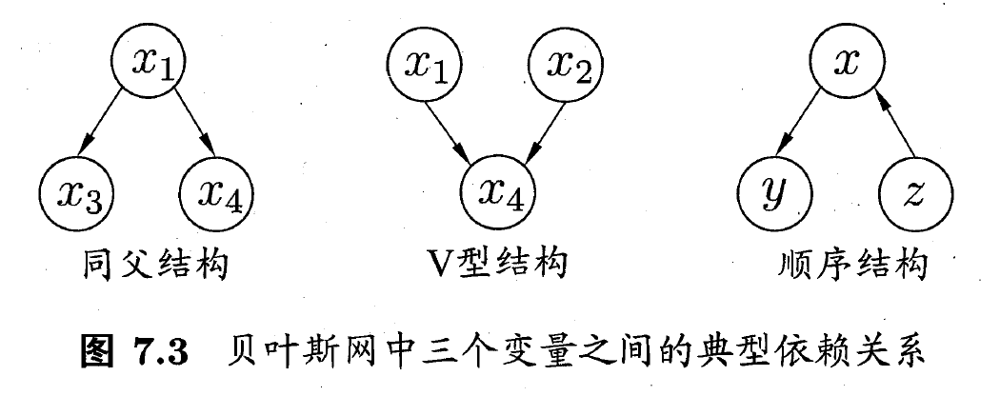
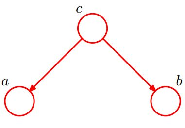
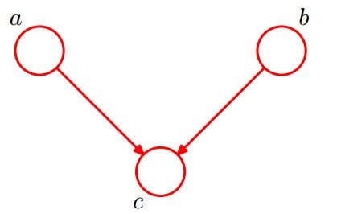

# 贝叶斯网络

贝叶斯网借助有向无环图来刻画属性之间的依赖关系，并使用条件概率来描述属性的联合概率分布。 若两个节点间以一个单箭头连接在一起，表示其中一个节点是“因\(parents\)”，另一个是“果\(children\)”，两节点就会产生一个条件概率值。 例如，假设节点 $$E$$ 直接影响到节点 $$H$$ ，即 $$E\to H$$ ，则用从 $$E$$ 指向 $$H$$ 的箭头建立结点 $$E$$ 到结点 $$H$$ 的有向弧 $$(E,H)$$ ，权值\(即连接强度\)用条件概率 $$P(H|E)$$ 来表示，如下图所示： 

把某个研究系统中涉及的随机变量，根据是否条件独立绘制在一个有向图中，就形成了贝叶斯网络

## 贝叶斯网络的定义

一个贝叶斯网 $$B$$ 由结构 $$G$$ 和参数 $$\Theta$$ 两部分组成，即 $$B =\langle G,\Theta \rangle$$ 。网络结构 $$G$$ 是一个有向无环图，其每个结点对应一个属性，若两个属性有直接依赖关系，则它们由一条边连接起来；参数 $$\Theta$$ 定量表述这种依赖关系，假设属性 $$x_i$$ 在 $$G$$ 中的父结点集为 $$\pi_i$$ ，则 $$\Theta$$ 包含了每个属性的条件概率表 $$\theta_{x_i|\pi_i}=P_B(x_i|\pi_i)$$ 

### 贝叶斯网结构

贝叶斯网络结构有效地表达了属性间的条件独立性。给定父结点集，贝叶斯网假设每个属性与它的非后裔属性独立，于是 $$B =\langle G,\Theta \rangle$$ 将属性 $$x_1,x_2,\dots,x_d$$ 的联合概率分布定义为

                                      $$P_B(x_1,x_2,\dots,x_d)=\prod\limits_{i=1}^dP_B(x_i|\pi_i)=\prod\limits_{i=1}^d\theta_{x_i|\pi_i}$$ 

贝叶斯网中三个变量之间的典型依赖关系如下图：

#### 同父结构 \(tail-to-tail\)

有$$P(a,b,c) = P(c)*P(a|c)*P(b|c)$$代入$$P(a,b|c) = \frac{P(a,b,c)}{P(c)}$$得到$$P(a,b|c) = P(a|c)*P(b|c)$$

即在 $$c$$ 给定的条件下 $$a $$ ， $$b$$ 被阻断，是独立的，称为tail-to-tail条件独立。

#### V型结构\(head-to-head\)

有 $$P(a,b,c)=P(a)*P(B)*P(c|a,b)$$ 

$$P(a,b)=\sum\limits_cP(a,b,c) = \sum\limits_cP(c|a,b)*P(a)*P(b)=P(a)*P(b)$$ 

即在 $$c$$ 未知的的条件下 $$a $$ ， $$b$$ 被阻断，是独立的，称为head-to-head条件独立，又称为“边际独立性”。

#### 顺序结构\(head-to-tail\)

有 $$P(a,b,c)=P(a)*P(c|a)*P(b|c)$$ 

$$P(a,b|c)=\frac{P(a,b,c)}{P(c)}=\frac{P(a)*P(c|a)*P(b|c)}{P(c)}=\frac{P(a,c)*P(b,c)}{P(c)}=P(a|c)*P(b|c)$$ 

即在 $$c$$ 给定的的条件下 $$a $$ ， $$b$$ 被阻断，是独立的，称为head-to-tail条件独立。

顺序结构其实就是一个链式网络，即

在 $$x_i$$ 给定的条件下， $$x_{i+1}$$ 的分布和 $$x_1,x_2,\dots,x_{i-1}$$ 条件独立。即： $$x_{i+1}$$ 的分布状态只和 $$x_i$$ 有关，和其他变量条件独立，这种顺次演变的随机过程，就叫做马尔科夫链（Markov chain）。

## 贝叶斯网络学习

若网络结构已知，即属性间的依赖关系已知，则贝叶斯网的学习过程相对简单，只需通过对训练样本“计数”，估计出每个结点的条件概率表即可。但在现实应用中我们往往不知晓网络结构，于是，贝叶斯网学习的首要任务就是根据训练数据集来找出结构最“恰当”的贝叶斯网。“评分搜索”是求解这一问题的常用办法。具体来说，我们先定义一个评分函数，以此来评估贝叶斯网与训练数据的契合程度，然后基于这个评分函数来寻找结构最优的贝叶斯网。显然，评分函数引入了关于我们希望获得什么样的贝叶斯网的归纳偏好。

## 贝叶斯网络推断

## Source



