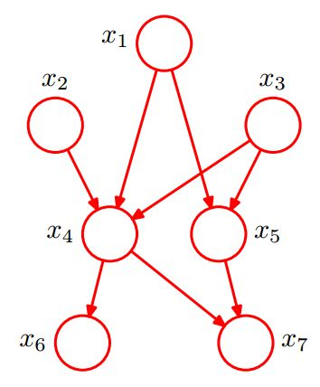

# 贝叶斯网络

贝叶斯网借助有向无环图来刻画属性之间的依赖关系，并使用条件概率来描述属性的联合概率分布。 若两个节点间以一个单箭头连接在一起，表示其中一个节点是“因\(parents\)”，另一个是“果\(children\)”，两节点就会产生一个条件概率值。 例如，假设节点 $$E$$ 直接影响到节点 $$H$$ ，即 $$E\to H$$ ，则用从 $$E$$ 指向 $$H$$ 的箭头建立结点 $$E$$ 到结点 $$H$$ 的有向弧 $$(E,H)$$ ，权值\(即连接强度\)用条件概率 $$P(H|E)$$ 来表示，如下图所示： 

把某个研究系统中涉及的随机变量，根据是否条件独立绘制在一个有向图中，就形成了贝叶斯网络

$$x_1,x_2,\dots,x_7$$的联合分布$$p(x_1)p(x_2)p(x_3)p(x_4|x_1,x_2,x_3)p(5|x_1,x_3)p(x_6|x_4)p(x_7|x_4,x_5)$$ 

## 贝叶斯网络的定义

一个贝叶斯网 $$B$$ 由结构 $$G$$ 和参数 $$\Theta$$ 两部分组成，即 $$B =\langle G,\Theta \rangle$$ 。网络结构 $$G$$ 是一个有向无环图，其每个结点对应一个属性，若两个属性有直接依赖关系，则它们由一条边连接起来；参数 $$\Theta$$ 定量表述这种依赖关系，假设属性 $$x_i$$ 在 $$G$$ 中的父结点集为 $$\pi_i$$ ，则 $$\Theta$$ 包含了每个属性的条件概率表 $$\theta_{x_i|\pi_i}=P_B(x_i|\pi_i)$$ 

### 贝叶斯网结构

贝叶斯网络结构有效地表达了属性间的条件独立性。给定父结点集，贝叶斯网假设每个属性与它的非后裔属性独立，于是 $$B =\langle G,\Theta \rangle$$ 将属性 $$x_1,x_2,\dots,x_d$$ 的联合概率分布定义为

                                      $$P_B(x_1,x_2,\dots,x_d)=\prod\limits_{i=1}^dP_B(x_i|\pi_i)=\prod\limits_{i=1}^d\theta_{x_i|\pi_i}$$ 

贝叶斯网中三个变量之间的典型依赖关系如下图：

#### 同父结构 \(tail-to-tail\)

有$$P(a,b,c) = P(c)*P(a|c)*P(b|c)$$代入$$P(a,b|c) = \frac{P(a,b,c)}{P(c)}$$得到$$P(a,b|c) = P(a|c)*P(b|c)$$

即在 $$c$$ 给定的条件下 $$a $$ ， $$b$$ 被阻断，是独立的，称为tail-to-tail条件独立。

#### V型结构\(head-to-head\)

有 $$P(a,b,c)=P(a)*P(B)*P(c|a,b)$$ 

$$P(a,b)=\sum\limits_cP(a,b,c) = \sum\limits_cP(c|a,b)*P(a)*P(b)=P(a)*P(b)$$ 

即在 $$c$$ 未知的的条件下 $$a $$ ， $$b$$ 被阻断，是独立的，称为head-to-head条件独立，又称为“边际独立性”。

#### 顺序结构\(head-to-tail\)

有 $$P(a,b,c)=P(a)*P(c|a)*P(b|c)$$ 

$$P(a,b|c)=\frac{P(a,b,c)}{P(c)}=\frac{P(a)*P(c|a)*P(b|c)}{P(c)}=\frac{P(a,c)*P(b,c)}{P(c)}=P(a|c)*P(b|c)$$ 

即在 $$c$$ 给定的的条件下 $$a $$ ， $$b$$ 被阻断，是独立的，称为head-to-tail条件独立。

顺序结构其实就是一个链式网络，即

在 $$x_i$$ 给定的条件下， $$x_{i+1}$$ 的分布和 $$x_1,x_2,\dots,x_{i-1}$$ 条件独立。即： $$x_{i+1}$$ 的分布状态只和 $$x_i$$ 有关，和其他变量条件独立，这种顺次演变的随机过程，就叫做马尔科夫链（Markov chain）。

## 贝叶斯网络学习

若网络结构已知，即属性间的依赖关系已知，则贝叶斯网的学习过程相对简单，只需通过对训练样本“计数”，估计出每个结点的条件概率表即可。但在现实应用中我们往往不知晓网络结构，于是，贝叶斯网学习的首要任务就是根据训练数据集来找出结构最“恰当”的贝叶斯网。“评分搜索”是求解这一问题的常用办法。具体来说，我们先定义一个评分函数，以此来评估贝叶斯网与训练数据的契合程度，然后基于这个评分函数来寻找结构最优的贝叶斯网。显然，评分函数引入了关于我们希望获得什么样的贝叶斯网的归纳偏好。

常用评分函数通常基于信息准则，此类准则将学习问题看作一个数据压缩任务，学习的目标是找到一个能以最短编码长度描述训练数据的模型，此时编码的长度包括了描述模型自身所需的字节长度和使用该模型描述数据所需的字节长度。对贝叶斯网络学习而言，模型就是一个贝叶斯网，同时，每个贝叶斯网描述了一个在训练数据上的概率分布，自有一套编码机制能使那些经常出现的样本有更短的编码。于是，我们应选择那个综合编码长度（包括描述网络和编码数据）最短的贝叶斯网，这就是“最小描述长度”\(Minimal Description Length, MDL\)准则。

给定训练集 $$D=\{x_1,x_,2\dots,x_m\}$$ ，贝叶斯网 $$B = \langle G,\Theta \rangle$$ 在 $$D$$ 上的评分函数可写为

                                                   $$s(B|D) = f(\theta)|B|-LL(B|D)$$ 

其中， $$|B|$$ 是贝叶斯网的参数； $$f(\theta)$$ 表示描述每个参数 $$\theta$$ 所需的字节数；而

                                                         $$LL(B|D)=\sum\limits_{i=1}^m\log P_B(x_i)$$ 

是贝叶斯网 $$B$$ 的对数似然。显然  $$s(B|D) = f(\theta)|B|-LL(B|D)$$ 的第一项是计算编码贝叶斯网 $$B$$ 所需的字节数，第二项是计算 $$B$$ 所对应的概率分布 $$P_B$$ 对 $$D$$ 描述得有多好。于是，学习任务就转化为一个优化任务，即寻找一个贝叶斯网络 $$B$$ 是评分函数 $$s(B|D)$$ 最小。

若 $$f(\theta)=1$$ ，即每个参数用 $$1$$ 字节描述，则得到AIC\(Akaike Information Criterion\)评分函数

                                                      $$AIC(B|D)=|B|-LL(B|D)$$ 

若 $$f(\theta)=\frac{1}{2}\log m$$ ，即每个参数用 $$\frac{1}{2}\log m$$ 字节描述，则得到BIC\(Bayesian Information Criterion\)评分

                                                   $$BIC(B|D)=\frac{\log m}{2}|B|-LL(B|D)$$ 

显然，若 $$f(\theta)=0$$ ，即不计算对网络进行编码的长度，则评分函数退化为负对数似然，相应的，学习任务退化为极大似然估计。

不难发现，若贝叶斯网 $$B=\langle G,\Theta \rangle$$ 的网络结构 $$G$$ 固定，则评分函数 $$s(B|D)$$ 的第一项为常数。此时，最小化 $$s(B|D)$$ 等价于对参数 $$\Theta$$ 的极大似然估计。由 $$P_B(x_1,x_2,\dots,x_d)=\prod\limits_{i=1}^dP_B(x_i|\pi_i)=\prod\limits_{i=1}^d\theta_{x_i|\pi_i}$$ 和 $$LL(B|D)=\sum\limits_{i=1}^m\log P_B(x_i)$$ 可知，参数 $$\theta_{x_i|\pi_i}$$ 能直接在训练数据 $$D$$ 上通过经验估计获得，即

                                                                     $$\theta_{x_i|\pi_i}=\hat{P}_D(x_i|\pi_i)$$ 

其中 $$\hat{P}_D(\cdot)$$ 是 $$D$$ 上的经验分布。因此，为了最小化评分函数 $$s(B|D)$$ ，只需对网络结构进行搜索，从候选结构的最优参数可直接在训练集上计算得到。

不幸的是，从所有可能的网络空间搜索最优贝叶斯网结构是一个NP hard问题，难以快速求解。有两种常用的策略能在有限时间内求得近似解：第一个是贪心算法，例如从某个网络结构出发，每次调整一条边（增加、删除或调整方向），知道评分函数值不再降低为止；第二种是通过给网络结构施加约束来削减搜索空间，例如将网络结构限定为树形结构等。

## 贝叶斯网络推断

贝叶斯网训练好之后就能用来回答“查询”\(query\)，即通过一些属性变量的观测值来推测其他属性变量的取值。例如在西瓜问题中，若我们观测到西瓜色泽青绿、敲声混响、根蒂蜷曲，想知道它是否成熟、甜度如何。这样通过已知变量观测值来推测待查询变量的过程称为“推断”，已知变量观测值称为“证据”。

最理想的是直接根据贝叶斯网定义的联合概率分布来精确计算后验概率，不幸的是，这样的“精确推断”已被证明是NP hard的；换言之，当网络结点较多、连接稠密时，难以进行精确推断，次数需借助“近似推断”，通过降低精度要求，在有限时间内求得近似解。在现实应用中，贝叶斯网的近似推断常使用吉布斯采样来完成。

令 $$Q = \{Q_1,Q_2,\dots,Q_n\}$$ 表示待查询变量， $$E = \{E_1,E_2,\dots,E_k\}$$ 为证据变量，已知其取值为 $$e=\{e_1,e_2,\dots,e_k\}$$ 。目标是计算后验概率 $$P(Q=q|E=e)$$ ，其中 $$q = \{q_1,q_2,\dots,q_n\}$$ 是待查询变量的一组取值。以西瓜问题为例，待查询变量为 $$Q = \{好瓜,甜度\}$$ ，证据变量为 $$E = \{色泽,敲声,根蒂\}$$ 且已知其取值为 $$e = \{青绿,混响,蜷缩\}$$ ，查询的目标值是 $$q=\{是,高\}$$ ，即这是好瓜且甜度高的概率有多大。

吉布斯采样算法先随机产生一个与证据 $$E = e$$ 一致的样本 $$q^0$$ 作为初始点，然后每步从当前样本出发产生下一个样本。具体来说，在第 $$t$$ 次采样中，算法先假设 $$q^t = q^{t-1}$$ ，然后对非证据变量逐个进行采样改变其取值，采样概率根据贝叶斯网络 $$B$$ 和其他变量的当前取值\(即 $$Z = z$$ \)计算获得。假定经过 $$T$$ 次采样得到的与 $$q$$ 一致的样本共有 $$n_q$$ 个，则可近似估计出后验概率

                                                              $$P(Q=q|E=e)\simeq \frac{n_q}{T}$$ 

实际上，吉布斯采样是在贝叶斯网所有变量的联合状态空间与证据 $$E = e$$ 一致的子空间中进行“随机漫步”。每一步仅依赖于前一步的状态，这是一个“马尔可夫链”。在一定条件下，无论从什么初始状态开始，马尔可夫链第 $$t$$ 步的状态分布在 $$t\to \infty$$ 时必收敛于一个平稳分布；对于吉布斯采样来说，这个分布恰好是 $$P(Q|E=e)$$ 。因此，在 $$T$$ 很大时，吉布斯采样相当于根据 $$P(Q|E=e)$$ 采样，从而保证了 $$P(Q=q|E=e)\simeq \frac{n_q}{T}$$ 收敛于 $$P(Q=q|E=e)$$ 

输入：贝叶斯网 $$B = \langle G, \Theta \rangle$$ ；采样次数 $$T$$ ；证据变量 $$E$$ 及其取值 $$e$$ ；待查询变量 $$Q$$ 及其取值 $$q$$ 

过程：

* $$n_q=0$$ ， $$q^0=$$ 对 $$Q$$ 随机赋初值
* for $$t = 1,2,\dots,T$$ ：
*          for $$Q_i\in Q$$ ：
*                     $$Z = E\cup Q\backslash \{Q_i\}$$ 
*                     $$z = e\cup q^{t-1}\backslash \{q_i^{t-1}\}$$ 
*                     根据 $$B$$ 计算分布 $$P_B(Q_i|Z=z)$$ 
*                      $$q_i^t = $$ 根据 $$P_B(Q_i|Z=z)$$ 采样所获取 $$Q_i$$ 取值
*                      $$q^t=$$ 将 $$q^{t-1}$$ 中的 $$q^{t-1}_i$$ 用 $$q_i^t$$ 替换
*          if $$q^t=q$$ ：
*                       $$n_q = n_q+1$$ 

输出： $$P(Q=q|E=e) \simeq \frac{n_q}{T}$$ 

需注意的是，由于马尔可夫链通常需要很长时间才能趋于平稳分布，因此吉布斯采样算法的收敛速度较慢。此外，若贝叶斯网中存在极端概率 $$0$$ 或 $$1$$ ，则不能保证马尔可夫链存在平稳分布，此时吉布斯采样会给出错误的估计结果。

## Source



