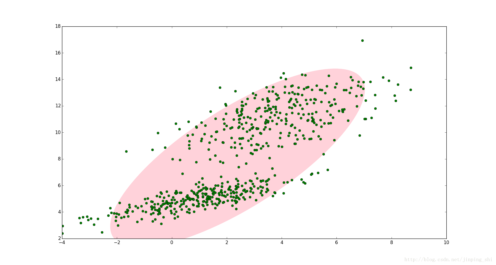

# 高斯混合模型

## 高斯混合模型例子

高斯混合模型（Gaussian Mixture Model）通常简称GMM，是一种业界广泛使用的聚类算法，该方法使用了高斯分布作为参数模型，并使用了期望最大（Expectation Maximization，简称EM）算法进行训练。 在特定约束条件下，K-means算法可以被看作是高斯混合模型（GMM）的一种特殊形式。

高斯混合模型（Gaussian Mixed Model）指的是多个高斯分布函数的线性组合，理论上GMM可以拟合出任意类型的分布，通常用于解决同一集合下的数据包含多个不同的分布的情况（或者是同一类分布但参数不一样，或者是不同类型的分布，比如正态分布和伯努利分布）。

### 例子一

如下图，图中的点在我们看来明显分成两个聚类。这两个聚类中的点分别通过两个不同的正态分布随机生成而来。但是如果没有GMM，那么只能用一个的二维高斯分布来描述下图中的数据。图中的椭圆即为二倍标准差的正态分布椭圆。这显然不太合理，毕竟肉眼一看就觉得应该把它们分成两类。

这时候就可以使用GMM了！如下图，数据在平面上的空间分布和上图一样，这时使用两个二维高斯分布来描述图中的数据，分别记为 $$\mathcal{N}(\mu_1,\sum_1)$$ 和 $$\mathcal{N}(\mu_2,\sum_2)$$ 。图中的两个椭圆分别是这两个高斯分布的二倍标准差椭圆。可以看到使用两个二维高斯分布来描述图中的数据显然更合理。实际上图中的两个聚类的中的点是通过两个不同的正态分布随机生成而来。如果将两个二维高斯分布 $$\mathcal{N}(\mu_1,\sum_1)$$ 和 $$\mathcal{N}(\mu_2,\sum_2)$$合成一个二维的分布，那么就可以用合成后的分布来描述图中的所有点。最直观的方法就是对这两个二维高斯分布做线性组合，用线性组合后的分布来描述整个集合中的数据。这就是高斯混合模型（GMM）。

### 例子二

上图为男性（蓝）和女性（红）的身高采样分布图。上图的y-轴所示的概率值，是在已知每个用户性别的前提下计算出来的。但通常情况下我们并不能掌握这个信息（也许在采集数据时没记录），因此不仅要学出每种分布的参数，还需要生成性别的划分情况 $$\varphi_i$$ 。 当决定期望值时，需要将权重值分别生成男性和女性的相应身高概率值并相加。

## 高斯混合模型定义

高斯混合模型，顾名思义，就是数据可以看作是从多个高斯分布中生成出来的。从[中心极限定理](https://en.wikipedia.org/wiki/Central_limit_theorem)可以看出，高斯分布这个假设其实是比较合理的。 为什么我们要假设数据是由若干个高斯分布组合而成的，而不假设是其他分布呢？实际上不管是什么分布，只 $$k$$ 取得足够大，这个XX Mixture Model就会变得足够复杂，就可以用来逼近任意连续的概率密度分布。只是因为高斯函数具有良好的计算性能，所GMM被广泛地应用。

每个GMM由K个高斯分布组成，每个高斯分布称为一个组件（Component），这些组件线性加成在一起就组成了GMM的概率密度函数。高斯混合模型具有如下形式的概率分布模型：

                                                             $$P(y|\theta)=\sum\limits_{k=1}^K\alpha_k\phi(y|\theta_k)$$ 

其中， $$\alpha_k$$ 是系数， $$\alpha_k\geq 0$$ ， $$\sum\limits_{k=1}^K\alpha_k=1$$ ； $$\phi(y|\theta_k)$$ 是高斯分布密度， $$\theta_k=(\mu_k,\sigma^2_k)$$ ，

                                                      $$\phi(y|\theta_k) = \frac{1}{\sqrt{2\pi}\sigma_k}\exp(-\frac{(y-\mu_k)^2}{2\sigma_k^2})$$ 

称为第 $$k$$ 个分模型。

## 高斯混合参数估计

假设观测数据 $$y_1,y_2,\dots,y_N$$ 由告诉混合模型生成

                                                                $$P(y|\theta)=\sum\limits_{k=1}^K\alpha_k\phi(y|\theta_k)$$ 

其中， $$\theta=(\alpha_1,\alpha_2,\dots,\alpha_K;\theta_1,\theta_2,\dots,\theta_K)$$ 。我们用EM算法估计高斯混合模型的参数 $$\theta$$ 。

### 1、明确变量，写出完全数据的对数似然函数

### 2、EM算法的E步：确定Q函数

### 3、确定EM算法的M步

## Source





{% embed url="https://github.com/endymecy/spark-ml-source-analysis/blob/master/%E8%81%9A%E7%B1%BB/gaussian-mixture/gaussian-mixture.md" %}

