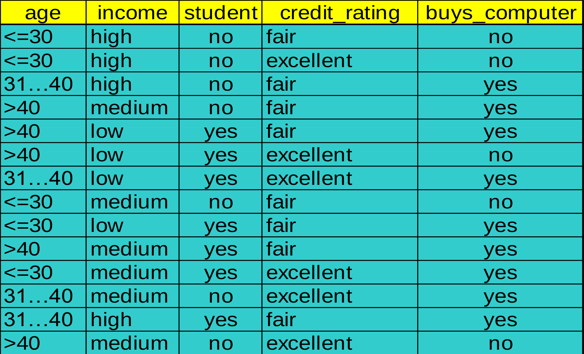

# 决策树模型

决策树是一种自上而下，对样本进行树形分类的过程，由结点和有向边组成。结点分为内部结点和叶结点，其中每个内部结点表示一个特征或属性，叶结点表示类别。从顶部根节点开始，所有样本聚在一起。经过根节点的划分，样本被分到不同的子结点中。再根据子结点的特征进一步划分，直至所有样本都被归到某一个类别\(即叶结点\)中。


输入：训练集 $$D=\{(x_1,y_1),(x_2,y_2),\dots,(x_m,y_m)\}$$ ，属性集 $$A=\{a_1,a_2,\dots,a_d\}$$ 

过程：函数TreeGenerate\(D, A\)

```text
生成结点node；
if D中样本全属于同一类别C
    将node标记为C类叶结点；return

if A为空或D中样本在A上取值相同
    将node标记为叶结点，其类别标记为D中样本最多的类；return

从A中选择较优划分属性a
for a的每一个值v
    为node生成一个分支；令Dv表示D在a上取值为v的样本子集
    if Dv为空
        将分支结点标记为叶结点，其类别标记为D中样本最多的类；return
    else
        以TreeGenerate(Dv,A\a)为分支结点
```

输出：以node为根结点的一颗决策树

显然，决策树的生成是一个递归过程，在决策树算法中，有三种情形会导致递归返回：

1、当前结点包含的样本全属于同一类别，无需划分

2、当前结点属性集为空，或是所有样本在所有属性上取值相同，无法划分

3、当前结点包含的样本集合为空，不能划分

这里情形2是在是在利用当前结点的后验分布，情形3则是把父结点的样本分布作为当前结点的先验分布

## 模型与划分

从决策树学习的逻辑可以看出，第8行和第10行，即如何找到最优划分属性和这个属性的最优划分点最为关键。随着划分过程不断进行，我们希望决策树的分支结点所包含的样本尽可能属于同一类别，即结点的”纯度“越来越高。

从样本类型的角度，ID3只能处理离散型变量，而C4.5和CART都可以处理连续型变量。C4.5处理连续型变量时，通过对数据排序之后找到类别不同的切割线作为切分点，根据切分点把连续属性转化为布尔型，从而将连续型变量转换多个取值区间的离散型变量。CART由于构建时每次都会对特征进行二值划分，因此可以很好地适用于连续型变量。

从应用角度，ID3和C4.5只能用于分类任务，而CART\(Classification and Regression Tree\)不仅可以用于分类，还可以应用于回归任务。

从其他角度，ID3对样本特征缺失值敏感，而C4.5和CART可以对缺失值进行不同方式的处理；ID3和C4.5可以在每个结点上产生出多叉分支，且每个特征在层级之间不会复用，而CART每个结点只会产生两个分支\(二叉树\)，且每个特征可以被重复使用；ID3和C4.5通过剪枝来权衡树的准确性和泛化能力，而CART直接利用全部数据发现所有可能的树结构进行对比。

以下为三个模型举例数据\(buys\_computer为类别\)：



### ID3 信息增益\(Information Gain\)

#### 信息熵\(信息熵越高说明不确定性越高\)

$$D_k$$是样本集合 $$D$$ 中属于第 $$k$$ 类的样本子集， $$|D_k|$$ 该子集的元素个数， $$|D|$$ 样本集合的元素个数：

                                           $$H(D)=-\sum \limits_{k=1}^Kp_klog_2(p_k)=-\sum \limits_{k=1}^K\frac{|D_k|}{|D|}log_2\frac{|D_k|}{|D|}$$ 

#### 经验条件熵\(按特征A划分\)

$$D_i$$ 表示 $$D$$ 中特征 $$A$$ 取第 $$i$$ 个值的样本子集， $$D_{ik}$$ 表示 $$D_i$$ 中属于第 $$k$$ 类的样本子集：

        $$H(D|A)=\sum\limits_{i=1}^np(i)H(D|A=i)=\sum\limits_{i=1}^n\frac{|D_i|}{|D|}\times H(D_i)=\sum\limits_{i=1}^n\frac{|D_i|}{|D|}(-\sum \limits_{k=1}^K\frac{|D_{ik}|}{|D_i|}log_2\frac{|D_{ik}|}{|D_i|})$$ 

#### 信息增益\(Information Gain\)：

                                                   $$Gain(A)=H(D)-H(D|A)$$

#### 示例： 

$$H(D) = I(9,5) = -\frac{9}{14}log_2(\frac{9}{14})-\frac{5}{14}log_2(\frac{5}{14}) = 0.940$$  

$$H(D|age)=\frac{5}{14}I(2,3)+\frac{4}{14}I(4,0)+\frac{5}{14}I(3,2)=0.694$$ ， $$\frac{5}{14}I(2,3)$$ 代表 $$age<=30$$ 的14个中有5个，且2个yes，3个no，同理剩下两项各代表4个 $$31<=age<=40$$ 和5个 $$age>40$$的样本

所以，$$Gain(age)=H(D)-H(D|age)=0.246$$ ，同理得 $$Gain(income)=0.029$$ ， $$Gain(student)=0.151$$ ， $$Gain(credit_rating)=0.048$$，$$Gain(age)$$ 最高，所以按年龄划分

### C4.5 增益率\(Gain ratio\)

ID3采用信息增益作为评价标准，会倾向于取值较多的特征。因为信息增益反应的是给定条件不确定性减少的程度，特征取值越多就意味着确定性高，也就是条件熵越小，信息增益越大。这在实际应用中是一个缺陷。比如我们引入“DNA”特征，每个人的“DNA”都不同，如果ID3按照“DNA"特征进行划分一定是最优的，但这种泛化能力非常弱。因此，C4.5实际上是对ID3进行优化，通过引入信息增益比，一定程度上对取值比较多的特征进行惩罚，避免ID3出现的过拟合的特性，提升决策树的泛化能力。

              $$GainRatio(A)=\frac{Gain(A)}{SplitInfo_A(D)}$$ ，其中 $$SplitInfo_A(D)=-\sum\limits_{j=1}^v\frac{|D_j|}{D}\times log_2(\frac{|D_j|}{|D|})$$ 

求得各特征增益率，选出信息增益率最大的特征进行切分

#### 示例：

$$SplitInfo_{income}(D)=-\frac{4}{14}\times log_2(\frac{4}{14})-\frac{6}{14}\times log_2(\frac{6}{14})-\frac{4}{14}\times log_2(\frac{4}{14})=1.557$$ 

$$GainRatio(income)=\frac{0.029}{1.557}=0.019$$ 

### CART 基尼指数\(Gini index\)

基尼指数描述数据的纯度，对于数据集 $$D$$ ，有 $$n$$ 个类别的话，则：

                                           $$Gini(D)=1-\sum\limits_{j=1}^np_j^2=1-\sum\limits_{j=1}^n(\frac{|D_j|}{|D|})^2$$ 

CART的特征可以重复使用，每次只产生两个分支，设根据特征 $$A$$ 将数据集分为 $$D_1$$ 和 $$D_2$$ ,则： 

                                        $$Gini_A(D)=\frac{|D_1|}{|D|}Gini(D_1)+\frac{|D_2|}{|D|}Gini(D_2)$$ 

求得各特征所有切分点的Gini index后，找到最小的进行切分

#### 示例：

$$Gini(D)=1-(\frac{9}{14})^2-(\frac{5}{14})^2=0.459$$ ，例子中有9个有电脑5个没有\(类别\)

按收入low，medium一组\(10个样本在 $$D_1$$ \)，high一组\(4个在 $$D_2$$ \)切分的话：

 $$Gini_{\{low,medium\}\in income}(D)=Gini_{\{high\}\in income}(D)$$ 

                                           $$=\frac{10}{14}Gini(D_1)+\frac{4}{14}Gini(D_2)$$ 

                                           $$=\frac{10}{14}(1-(\frac{7}{10})^2-(\frac{3}{10})^2)+\frac{4}{10}(1-(\frac{2}{4})^2-(\frac{2}{4})^2)=0.443$$ 

同理得各特征所有切分的Gini Index，找到最小的那个进行切分最优

## 剪枝处理

一颗完全生长的决策树很容易出现过拟合问题，除了常规的机器学习解决过拟合的方法外，我们可以对决策树进行剪枝，常用的剪枝方法有预剪枝\(Pre-Pruning\)和后剪枝\(Post-Pruning\)。

### 预剪枝

预剪枝的核心思想是在树中结点进行扩展之前，先计算当前的划分能否带来模型泛化能力的提升，如果不能，则不再继续生长子树。预剪枝对于何时停止决策树的生长有以下几种方法：

1、当树到达一定深度的时候，停止树的生长

2、当到达当前结点的样本数量小于某个阈值的时候，停止树的生长

3、计算每次分裂对测试集的准确度提升，当小于某个阈值的时候，不再继续拓展

预剪枝具有思想直接、算法简单、效率高等特点，适合解决大规模问题。但如何准确地估计何时停止树的生长\(即上述方法中的深度或阈值\)，针对不同问题会有很大差别，需要一定经验判断。且预剪枝存在一定局限性，有欠拟合风险，虽然当前的划分会导致测试集准确率降低，但在之后的划分中，准确率可能会有显著上升。

### 后剪枝

后剪枝的核心思想是让算法生成一颗完全生长的决策树，然后从最底层向上计算是否剪枝。剪枝过程将子树删除，用一个叶子结点替代，该节点的类别按多数投票原则进行判断。同样地，后剪枝也可以通过在测试集上的准确率进行判断，如果剪枝过后准确率有所提升，则进行剪枝。相比于预剪枝，后剪枝方法通常可以得到泛化能力更强的决策树，但时间开销会更大。

常见的后剪枝方法包括错误率降低剪枝 \(Reduced Error Pruning, REP\)，悲观剪枝\(Pessimistic Error Pruning, PEP\)、代价复杂度剪枝\(Cost Complexity Pruning, CCP\)、最小误差剪枝\(Minimum Error Pruning, MEP\)、CVP\(Critical Value Pruning\)、OPP\(Optimal Pruning\)。

## [Code实现](https://github.com/fengdu78/lihang-code/blob/master/code/%E7%AC%AC5%E7%AB%A0%20%E5%86%B3%E7%AD%96%E6%A0%91%28DecisonTree%29/DT.ipynb)

三种：ID3（基于信息增益）C4.5（基于信息增益比）CART（gini指数）

entropy： $$H(x) = -\sum_{i=1}^{n}p_i\log{p_i}$$ 

conditional entropy： $$H(X|Y)=\sum{P(X|Y)}\log{P(X|Y)}$$ 

information gain： $$g(D, A)=H(D)-H(D|A)$$ 

information gain ratio： $$g_R(D, A) = \frac{g(D,A)}{H(A)}$$ 

gini index： $$Gini(D)=\sum{k=1}^{K}p_k\log{p_k}=1-\sum{k=1}^{K}p_k^2$$ 

数据取值统计学习方法（李航）书上题目5.1

### 数据

```python
import numpy as np
import pandas as pd
import matplotlib.pyplot as plt
%matplotlib inline

from sklearn.datasets import load_iris
from sklearn.model_selection import train_test_split

from collections import Counter
import math
from math import log

import pprint

# 书上题目5.1
def create_data():
    datasets = [['青年', '否', '否', '一般', '否'],
               ['青年', '否', '否', '好', '否'],
               ['青年', '是', '否', '好', '是'],
               ['青年', '是', '是', '一般', '是'],
               ['青年', '否', '否', '一般', '否'],
               ['中年', '否', '否', '一般', '否'],
               ['中年', '否', '否', '好', '否'],
               ['中年', '是', '是', '好', '是'],
               ['中年', '否', '是', '非常好', '是'],
               ['中年', '否', '是', '非常好', '是'],
               ['老年', '否', '是', '非常好', '是'],
               ['老年', '否', '是', '好', '是'],
               ['老年', '是', '否', '好', '是'],
               ['老年', '是', '否', '非常好', '是'],
               ['老年', '否', '否', '一般', '否'],
               ]
    labels = [u'年龄', u'有工作', u'有自己的房子', u'信贷情况', u'类别']
    # 返回数据集和每个维度的名称
    return datasets, labels

datasets, labels = create_data()
train_data = pd.DataFrame(datasets, columns=labels)
```

### 手写实现

```python
# 熵
def calc_ent(datasets):
    data_length = len(datasets)
    label_count = {}
    for i in range(data_length):
        label = datasets[i][-1]
        if label not in label_count:
            label_count[label] = 0
        label_count[label] += 1
    ent = -sum([(p/data_length)*log(p/data_length, 2) for p in label_count.values()])
    return ent

# 经验条件熵
def cond_ent(datasets, axis=0):
    data_length = len(datasets)
    feature_sets = {}
    for i in range(data_length):
        feature = datasets[i][axis]
        if feature not in feature_sets:
            feature_sets[feature] = []
        feature_sets[feature].append(datasets[i])
    cond_ent = sum([(len(p)/data_length)*calc_ent(p) for p in feature_sets.values()])
    return cond_ent

# 信息增益
def info_gain(ent, cond_ent):
    return ent - cond_ent

def info_gain_train(datasets):
    count = len(datasets[0]) - 1
    ent = calc_ent(datasets)
    best_feature = []
    for c in range(count):
        c_info_gain = info_gain(ent, cond_ent(datasets, axis=c))
        best_feature.append((c, c_info_gain))
        print('特征({}) - info_gain - {:.3f}'.format(labels[c], c_info_gain))
    # 比较大小
    best_ = max(best_feature, key=lambda x: x[-1])
    return '特征({})的信息增益最大，选择为根节点特征'.format(labels[best_[0]])

info_gain_train(np.array(datasets))
```

```python
# 定义节点类 二叉树
class Node:
    def __init__(self, root=True, label=None, feature_name=None, feature=None):
        self.root = root
        self.label = label
        self.feature_name = feature_name
        self.feature = feature
        self.tree = {}
        self.result = {'label:': self.label, 'feature': self.feature, 'tree': self.tree}

    def __repr__(self):
        return '{}'.format(self.result)

    def add_node(self, val, node):
        self.tree[val] = node

    def predict(self, features):
        if self.root is True:
            return self.label
        return self.tree[features[self.feature]].predict(features)
    
class DTree:
    def __init__(self, epsilon=0.1):
        self.epsilon = epsilon
        self._tree = {}

    # 熵
    @staticmethod
    def calc_ent(datasets):
        data_length = len(datasets)
        label_count = {}
        for i in range(data_length):
            label = datasets[i][-1]
            if label not in label_count:
                label_count[label] = 0
            label_count[label] += 1
        ent = -sum([(p/data_length)*log(p/data_length, 2) for p in label_count.values()])
        return ent

    # 经验条件熵
    def cond_ent(self, datasets, axis=0):
        data_length = len(datasets)
        feature_sets = {}
        for i in range(data_length):
            feature = datasets[i][axis]
            if feature not in feature_sets:
                feature_sets[feature] = []
            feature_sets[feature].append(datasets[i])
        cond_ent = sum([(len(p)/data_length)*self.calc_ent(p) for p in feature_sets.values()])
        return cond_ent

    # 信息增益
    @staticmethod
    def info_gain(ent, cond_ent):
        return ent - cond_ent

    def info_gain_train(self, datasets):
        count = len(datasets[0]) - 1
        ent = self.calc_ent(datasets)
        best_feature = []
        for c in range(count):
            c_info_gain = self.info_gain(ent, self.cond_ent(datasets, axis=c))
            best_feature.append((c, c_info_gain))
        # 比较大小
        best_ = max(best_feature, key=lambda x: x[-1])
        return best_

    def train(self, train_data):
        """
        input:数据集D(DataFrame格式)，特征集A，阈值eta
        output:决策树T
        """
        _, y_train, features = train_data.iloc[:, :-1], train_data.iloc[:, -1], train_data.columns[:-1]
        # 1,若D中实例属于同一类Ck，则T为单节点树，并将类Ck作为结点的类标记，返回T
        if len(y_train.value_counts()) == 1:
            return Node(root=True,
                        label=y_train.iloc[0])

        # 2, 若A为空，则T为单节点树，将D中实例树最大的类Ck作为该节点的类标记，返回T
        if len(features) == 0:
            return Node(root=True, label=y_train.value_counts().sort_values(ascending=False).index[0])

        # 3,计算最大信息增益 同5.1,Ag为信息增益最大的特征
        max_feature, max_info_gain = self.info_gain_train(np.array(train_data))
        max_feature_name = features[max_feature]

        # 4,Ag的信息增益小于阈值eta,则置T为单节点树，并将D中是实例数最大的类Ck作为该节点的类标记，返回T
        if max_info_gain < self.epsilon:
            return Node(root=True, label=y_train.value_counts().sort_values(ascending=False).index[0])

        # 5,构建Ag子集
        node_tree = Node(root=False, feature_name=max_feature_name, feature=max_feature)

        feature_list = train_data[max_feature_name].value_counts().index
        for f in feature_list:
            sub_train_df = train_data.loc[train_data[max_feature_name] == f].drop([max_feature_name], axis=1)

            # 6, 递归生成树
            sub_tree = self.train(sub_train_df)
            node_tree.add_node(f, sub_tree)

        # pprint.pprint(node_tree.tree)
        return node_tree

    def fit(self, train_data):
        self._tree = self.train(train_data)
        return self._tree

    def predict(self, X_test):
        return self._tree.predict(X_test)

datasets, labels = create_data()
data_df = pd.DataFrame(datasets, columns=labels)
dt = DTree()
tree = dt.fit(data_df)

tree
dt.predict(['老年', '否', '否', '一般'])
```

### sklearn实现



```python
from sklearn.tree import DecisionTreeClassifier
from sklearn.tree import export_graphviz
import graphviz

clf = DecisionTreeClassifier()
clf.fit(X_train, y_train,)

clf.score(X_test, y_test)
clf.predict(X_test)
```

