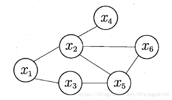

# 线性模型

## 基本形式

给定由 $$d$$ 个属性描述的示例 $$x=(x_1;x_2;\dots;x_d)$$ ，其中 $$x_i$$ 是 $$x$$ 在第 $$i$$ 个属性上的取值，线性模型试图学得一个通过属性的线性组合来进行预测的函数：

                                        $$f(x)=w_1x_1+w_2x_2+\dots+w_dx_d+b$$ 

一般用向量形式写成：

                                                  $$f(x)=w^Tx+b$$ 

其中 $$w=(w_1;w_2;\dots;w_d)$$ ， $$w$$ 和 $$b$$ 学得后，模型得以确定。

## 线性回归

### 一元线性回归

当输入的属性的数目只有一个时，进行的线性回归模型为一元线性回归。一元线性回归试图学得：

                                                       $$f(x_i)=wx_i+b$$ ，使得 $$f(x_i)\simeq y_i$$ 

通过减少 $$f(x_i)$$ 与 $$y_i$$ 的差别（即减少预测值与实际值的误差），就可以学得 $$w$$ 和 $$b$$ 即获得模型。通常使用均方差\(Mean Square Error\)来做，均方差的几何意义其实就是欧式距离：

                            $$(w^*,b^*) = \mathop{arg\ min} \limits_{(w,b)} \sum \limits_{i=1}^m(f(x_i)-y_i)^2 = \mathop{arg\ min} \limits_{(w,b)} \sum \limits_{i=1}^m(y_i-wx_i-b)^2$$ 

在线性回归中，最小二乘法（基于均方误差最小化来进行模型求解的方法）就是试图找到一条直线，使所有样本到直线的欧式距离之和最小：

                                $$E_{(w,b)} = \sum \limits_{i=1}^m (y_i-wx_i-b)^2$$ 

                                             $$= \sum \limits_{i=1}^m (y_i-(wx_i+b))^2$$ 

                                             $$= \sum \limits_{i=1}^m (y_i^2-2y_i(wx_i+b)+(wx_i+b)^2)$$ 

                                             $$= \sum \limits_{i=1}^m (y_i^2-2y_iwx_i-2y_ib+w^2x_i^2+2wx_ib+b^2)$$ 

因为 $$E_{(w,b)}$$ 是凸函数，导数为 $$0$$ 时即为我们所寻找的 $$w$$ 和 $$b$$ \(下列公式先求导再使导数为 $$0$$ 求解\)：

                                 $$\frac{\partial E_{(w,b)}}{\partial w} = \sum \limits_{i=1}^m(-2y_ix_i+2x_i^2w+2x_ib)$$ 

                                              $$= 2(\sum \limits_{i=1}^m(wx_i^2-(y_ix_i-bx_i))) $$ 

                                              $$= 2(w\sum \limits_{i=1}^mx_i^2-\sum \limits_{i=1}^m(y_i-b)x_i)$$ 

                                    $$\Rightarrow w = \frac{\sum \limits_{i=1}^m y_i(x_i-\overline{x})}{\sum \limits_{i=1}^m x_i^2-\frac{1}{m}(\sum \limits_{i-1}^m x_i)^2}\ ,\ \ \ \overline{x}=\frac{1}{m}\sum \limits_{i=1}^m x_i$$ 

                                   $$\frac{\partial E_{(w,b)}}{\partial b} = \sum \limits_{i=1}^m (-2y_i+2wx_i+2b)$$ 

                                                $$= 2(mb - \sum \limits_{i=1}^m(y_i-wx_i))$$ 

                                    $$\Rightarrow b = \frac{1}{m}\sum \limits_{i=1}^m(y_i-wx_i)$$ 

### 多元线性回归

更一般的情况即样本有多个特征：给定数据集 $$D={(x_1,y_1),(x_2,y_2),\dots,(x_m,y_m)}$$ ，其中 $$x_i=(x_{i1};x_{i2};\dots;x_{id})$$，即 $$x_i$$ 为第 $$i$$ 个样本， $$y_i$$ 为其对应类别， $$x_{id}$$ 为其第 $$d$$ 个特征属性。多元线性回归试图学得：

                                                      $$f(x_i)=w^Tx_i+b$$ ，使得 $$f(x_i)\simeq y_i$$ 

类似的，可利用最小二乘法来对 $$w$$ 和 $$b$$ 进行估计。为方便讨论，我们把 $$w$$ 和 $$b$$ 表示为向量形式 $$\hat{w}=(w;b)$$ ，相应的，把数据集 $$D$$ 表示为一个 $$m\times(d+1)$$ 大小的矩阵 $$X$$ ，其中每行对应于一个示例，该行前 $$d$$ 个元素对应于示例的第 $$d$$ 个属性值，最后一个元素恒置为1，即：

                                             $$X =  \left(  \begin{matrix}    x_{11}\ \ x_{12}\ \ \dots\ \ x_{1d}\ \ 1\\ x_{21}\ \ x_{22}\ \ \dots\ \ x_{2d}\ \ 1\\ \vdots\ \ \ \ \ \vdots\ \ \ \ \ \ddots\ \ \ \ \ \vdots\ \ \ \ \ \vdots\\ x_{m1}\ \ x_{m2}\ \ \dots\ \ x_{md}\ \ 1    \end{matrix}   \right) =\left(  \begin{matrix}    x_{1}^T\ \ 1\\ x_{2}^T\ \ 1\\ \vdots\ \ \ \ \ \vdots\\ x_{m}^T\ \ 1\\     \end{matrix}   \right) $$ 

再把标记也写成向量形式 $$y=(y_1;y_2;\dots;y_m)$$ ，则有

                                                   $$\hat{w}^*=\mathop{arg\ min}\limits_{\hat{w}}(y-X\hat{w})^T(y-X\hat{w})$$ 

令 $$E_{\hat{w}}=(y-X\hat{w})^T(y-X\hat{w})$$ ，对 $$\hat{w}$$ 求导得：

                                                             $$\frac{}{}$$ $$\frac{\partial E_{\hat{w}}}{\partial \hat{w}} = 2X^T(X\hat{w}-y)$$ 

令上式为零可得 $$\hat{w}$$ 最优解的闭式解。

### 对数线性回归

当我们希望线性模型的预测值逼近真实标记 $$y$$ 时，就得到了线性回归模型。可否令模型预测逼近 $$y$$ 的衍生物呢？譬如说，假设我们认为示例所对应的输出标记是在指数尺度上变化，那就可以将输出标记的对数作为线性模型逼近的目标，即

                                                                      $$\ln y= w^Tx+b$$ 

这就是“对数线性回归”，他实际上是在试图让 $$e^{w^Tx+b}$$ 逼近 $$y$$ 。在形式上仍然是线性回归，但实质上已是在求取输入空间到输出空间的非线性函数映射。如下图所示，这里的对数函数起到了将线性回归模型的预测值与真实标记联系起来的作用

更一般地，考虑单调可微函数 $$g(\cdot)$$ ，令

                                                                   $$y=g^{-1}(w^Tx+b)$$ 

这样得到的模型称为“广义线性模型”，其中函数 $$g(\cdot)$$ 称为“联系函数”。显然，对数线性回归是广义线性模型在 $$g(\cdot)=\ln(\cdot)$$ 时的特例。

## 逻辑回归\(对数几率回归\)

### 二项逻辑回归

考虑分类任务，比如二分类任务，其输出标记 $$y \in \{0,1\}$$ ，而线性回归模型产生的预测值 $$z=w^Tx+b$$ 是实值，于是，我们需将实值 $$z$$ 转换为 $$0/1$$ 值。最理想的是“单位阶跃函数”\(unit-step function\)

                                                                      $$y=\begin{cases}  \ 0, \ \ \ \ \ \ z<0\\ 0.5,\ \ \ \ z=0\\ \ 1,\ \ \ \ \ \ z>0 \end{cases}$$ 

即若预测值 $$z$$ 大于零就判为正例，小于零就判为反例，预测值为临界值零则可任意判别。如下图所示

单位阶跃函数\(上图红线\)不连续，因此不能直接用作联系函数 $$g^{-1}(\cdot)$$ 。于是我们希望找到能在一定程度上近似单位阶跃函数的“替代函数”，并希望它单调可微。对数几率函数\(logistic function\)正是这样一个常用的替代函数：

                                                                                 $$y=\frac{1}{1+e^{-z}}$$ 

对数几率函数是一种“Sigmoid函数”，它将 $$z$$ 值转化为一个接近 $$0$$ 或 $$1$$ 的 $$y$$ 值，并且其输出值在 $$z = 0$$ 附近变化很陡，将对数几率函数作为联系函数 $$g^{-1}(\cdot)$$ ，得到

                                                                       $$y=\frac{1}{1+e^{-(w^Tx+b)}}$$ 

可变化为：

                                                                      $$\ln\frac{y}{1-y}=w^Tx+b$$ 

若将 $$y$$ 视为样本 $$x$$ 作为正例的可能性，则 $$1-y$$ 是其反例的可能性，两者比值 $$\frac{y}{1-y}$$ 称为“几率”，反映了 $$x$$ 作为正例的相对可能性。对几率取对数则得到“对数几率”：

                                                                                 $$\ln\frac{y}{1-y}$$ 

由此可看出，实际上是在用线性回归模型的预测结果去逼近真实标记的对数几率，因此，其对应的模型称为“逻辑回归”或“对数几率回归”。特别注意的是，虽然名字是“回归”，但实际它却是一种分类学习方法。这种方法有很多优点，例如它是直接对分类可能性进行建模。无需事先假设数据分布，这样就避免了假设分布不准确所带来的问题；它不是仅预测出“类别”，而是可得到近似概率预测，这对许多需利用概率辅助决策的任务很有用。此外，对数几率是任意阶可导的凸函数，有很好的数学性质，现有的许多数值优化算法都可以直接用于求取最优解。

如何确定上式中的 $$w$$ 和 $$b$$ 。若将 $$y$$ 视为类后验概率估计 $$p(y=1|x)$$ ，则

                                                                    $$\ln \frac{p(y=1|x)}{p(y=0|x)} = w^Tx+b$$ 

显然

                                          $$p(y=1|x) = \frac{e^{w^Tx+b}}{1+e^{w^Tx+b}}$$              $$p(y=0|x) = \frac{1}{1+e^{w^Tx+b}}$$ 

于是，我们可通过极大似然法来估计 $$w$$ 和 $$b$$ ，设 $$p(y=1|x)=\pi(x)$$ ， $$p(y=0|x)=1-\pi(x)$$ 给定数据集 $$\{(x_i,y_i)\}^N_{i=1}$$ ，似然函数为：

                                                                   $$\prod\limits_{i=1}^N[\pi(x_i)]^{y_i}[1-\pi(x_i)]^{(1-y_i)}$$ 

对数似然函数为：

                                             $$L(w) = \sum\limits_{i=1}^N[y_i\log\pi(x_i)+(1-y_i)\log(1-\pi(x_i))]$$ 

                                                         $$=\sum\limits_{i-1}^N[y_i\log\frac{\pi(x_i)}{1-\pi(x_i)}+\log(1-\pi(x_i))]$$ 

                                                         $$=\sum\limits_{i=1}^N[y_i(w\cdot x_i)-\log(1+\exp(w\cdot x_i))]$$ 

对 $$L(w)$$ 求极大值，得到 $$w$$ 的估计值。这样，问题就变成了以对数似然函数为目标的最优化问题，逻辑回归学习中通常采用的方法是梯度下降法及牛顿法。假设 $$w$$ 的极大似然估计值是 $$\hat{w}$$ ，那么学到的逻辑回归模型为：

                                         $$P(y=1|x)=\frac{\exp(\hat{w}\cdot x)}{1+\exp(\hat{w}\cdot x)}$$        $$P(y=0|x)=\frac{1}{1+\exp(\hat{w}\cdot x)}$$ 

### 多项逻辑回归

上面介绍的逻辑回归模型是二项分类模型，用于二分类。可以将其推广为多项逻辑回归模型，用于多分类任务。假设离散型随机变量 $$Y$$ 的取值集合是 $$\{1,2,\dots,K\}$$ ，那么多项逻辑回归模型是：

$$P(Y=k|x)=\frac{\exp(w_k\cdot x)}{1+\sum\limits_{k=1}^{K-1}\exp(w_k\cdot x)},\ k=1,2,\dots,K-1$$          $$P(Y=K|x) = \frac{1}{1+\sum\limits_{k=1}^{K-1}\exp(w_k\cdot x)}$$ 

二项逻辑回归的参数估计法也可以推广到多项逻辑回归。

## 线性判别分析

[线性判别分析\(Linear Discriminant Analysis, LDA\)](https://chmx0929.gitbook.io/machine-learning/shu-ju-wa-jue/shu-ju-wa-jue/shu-ju-yu-chu-li/shu-ju-jiang-wei)不仅可以用来降维，也可以做分类。也就是说它的数据集的每个样本是有类别输出的，这点和PCA不同。PCA是不考虑样本类别输出的无监督降维技术。LDA的思想可以用一句话概括，就是“投影后类内方差最小，类间方差最大”，如下图所示。 我们要将数据在低维度上进行投影，我们投影后希望

1. 1、每一种类别数据的投影点尽可能的接近
2. 2、不同类别的数据的类别中心之间的距离尽可能的大

给定数据集 $$D=\{(x_i,y_i)\}_{i=1}^m,\ \ y_i\in\{0,1\}$$，

第 $$i$$ 类的集合 $$X_i$$，第 $$i$$ 类的均值向量 $$\mu_i$$ ，第 $$i$$ 类的协方差矩阵 $$\sum_i$$， $$i\in\{0,1\}$$ 即一共就两类

两类样本的中心在直线 $$w$$ 上的投影，即直线与原均值向量的内积 $$w^T\mu_0$$ 和 $$w^T\mu_1$$。所有样本点都投影到直线上，则两类样本的协方差为 $$w^T\sum_0w$$和 $$w^T\sum_1w$$ 

1. 1、投影后类内方差最小，即 $$w^T\sum_0w+w^T\sum_1w$$ 尽可能小
2. 2、类间方差最大，即 $$||w^T\mu_0-w^T\mu_1||_2^2$$ 尽可能大

同时考虑优化二者，则可得到欲最大化的目标：

                                       $$J=\frac{||w^T\mu_0-w^T\mu_1||_2^2}{w^T\sum_0w+w^T\sum_1w}=\frac{w^T(\mu_0-\mu_1)(\mu_0-\mu_1)^Tw}{w^T(\sum_0+\sum_1)w}$$ 

定义“类内散度矩阵”：$$S_w=\sum_0+\sum_1=\sum\limits_{x\in X_0}(x-\mu_0)(x-\mu_0)^T+\sum\limits_{x\in X_1}(x-\mu_1)(x-\mu_1)^T$$ 

定义“类间散度矩阵”： $$S_b=(\mu_0-\mu_1)(\mu_0-\mu_1)^T$$ 

所以，我们可将最大化目标函数 $$J$$ 写为：

                                                                       $$J=\frac{w^TS_bw}{w^TS_ww}$$ 

这就是LDA欲最大化的目标，即 $$S_b$$ 与 $$S_w$$ 的“广义瑞利商”\(Generalized Rayleigh Quotient\)

如何确定 $$w$$ 呢？注意到上式的分子和分母都是关于 $$w$$ 的二次项，因此上式的解 $$w$$ 的长度无关，只与其方向有关。不失一般性，令 $$w^TS_ww=1$$ ，上式等价于

                                                   $$\mathop{min}\limits_w( -w^TS_bw)\ \ \ \ s.t.\ \ w^TS_ww=1$$ 

由拉格朗日乘子法，上式等价于

                                                                       $$S_bw=\lambda S_ww$$ 

其中 $$\lambda$$ 是拉格朗日乘子。注意到 $$S_bw$$ 的方向恒为 $$\mu_0-\mu_1$$ ，不妨令 $$S_bw=\lambda(\mu_0-\mu_1)$$ 代入上式

                                                                     $$w=S_w^{-1}(\mu_0-\mu_1)$$ 

考虑到数值解的稳定性，在实践中通常是对 $$S_w$$ 进行奇异值分解，即 $$S_w=U\sum V^T$$ ，这里 $$\sum$$ 是一个对角矩阵，其对角线上的元素是 $$S_w$$ 的奇异值，然后再由 $$S_w^{-1}=V\sum U^T$$ 得到 $$S_w^{-1}$$ 。值得一提的是，LDA可从贝叶斯决策理论的角度来阐述，并可证明，当两类数据同先验，满足高斯分布且协方差相等时，LDA可达到最优分类。

#### 多类别映射\(分类\)

若有很多类别，还是基于LDA基本思想，每个类间距离最大，类内距离最小。假定存在 $$N$$ 个类，且第 $$i$$ 类示例数为 $$m_i$$ ，我们先定义“全局散度矩阵”：

                                                  $$S_t=S_b+S_w=\sum\limits_{i=1}^m(x_i-\mu)(x_i-\mu)^T$$ 

其中 $$\mu$$ 是所有示例的均值向量，将类内散度矩阵 $$S_w$$ 重新定义为每个类别的散度矩阵之和，即

                                            $$S_w=\sum \limits_{i=1}^NS_{w_i}, \ \ \ \ S_{w_i}=\sum\limits_{x\in X_i}(x-\mu_i)(x-\mu_i)^T$$ 

整理上面两式可得

                                                 $$S_b=S_t-S_w=\sum\limits_{i=1}^Nm_i(\mu_i-\mu)(\mu_i-\mu)^T$$ 

显然，多分类LDA可以有多种实现方法：使用 $$S_b$$ , $$S_w$$ , $$S_t$$ 三者中的任何两个即可，常见的一种实现是采用优化目标：

                                                                          $$\mathop{max}\limits_W\ \frac{tr(W^TS_bW)}{tr(W^TS_wW}$$ 

其中 $$W\in \mathbb{R}^{d\times(N-1)}$$，上式可通过广义特征值问题求解： $$S_bW=\lambda S_wW$$ 。$$W$$的闭式解则是 $$S_w^{-1}S_b$$ 的 $$d'$$ 个最大非零广义特征值所对应的特征向量组成的矩阵， $$d'\leq N-1$$ 。

若将 $$W$$ 视为一个投影矩阵，则多分类LDA将样本投影到 $$d'$$ 维空间。 $$d'$$ 通常远小于数据原有的属性数 $$d$$ 于是，可通过这个投影来减少样本点的维数，且投影过程中采用了类别信息，因此LDA也常被视为一种经典的监督降维技术。

                                              

