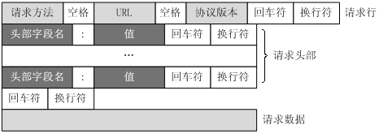
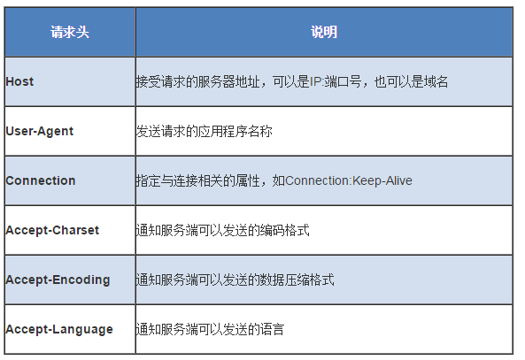
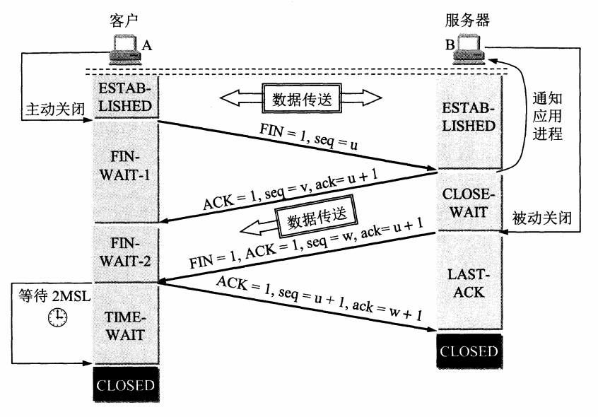

# 计算机网络

## 计算机网络体系结构

| 分层 | 作用 | 协议 |
| :---: | :---: | :---: |
| 应用层 | 允许访问OSI环境的手段（应用协议数据单元 APDU） | FTP、DNS、Telnet、SMTP、HTTP、WWW、NFS |
| 表示层 | 对数据进行翻译、加密和压缩（表示协议数据单元 PPDU） | JPEG、MPEG、ASII |
| 会话层 | 建立、管理和终止会话（会话协议数据单元 SPDU） | NFS、SQL、NETBIOS、RPC |
| 传输层 | 提供端到端的可靠报文传递和错误恢复（ 段Segment） | TCP、UDP、SPX |
| 网络层 | 负责数据包从源到宿的传递和网际互连（包 Packet） | IP、ICMP、ARP、RARP、OSPF、IPX、RIP、IGRP（路由器） |
| 数据链路层 | 将比特组装成帧和点到点的传递（帧 Frame） | PPP、FR、HDLC、VLAN、MAC（网桥，交换机） |
| 物理层 | 通过媒介传输比特，确定机械及电气规范（比特 Bit） | RJ45、CLOCK、IEEE802.3（中继器，集线器） |

## 应用层

### DNS

DNS（Domain Name System，域名系统）是互联网的一项服务。它作为将域名和 IP 地址相互映射的一个分布式数据库，能够使人更方便地访问互联网。DNS 使用 TCP 和 UDP 端口 53。当前，对于每一级域名长度的限制是 63 个字符，域名总长度则不能超过 253 个字符。

### 域名

域名 ::= {&lt;三级域名&gt;.&lt;二级域名&gt;.&lt;顶级域名&gt;}，如：blog.huihut.com

### FTP

FTP（File Transfer Protocol，文件传输协议）是用于在网络上进行文件传输的一套标准协议，使用客户/服务器模式，使用 TCP 数据报，提供交互式访问，双向传输。 

TFTP（Trivial File Transfer Protocol，简单文件传输协议）一个小且易实现的文件传输协议，也使用客户-服务器方式，使用UDP数据报，只支持文件传输而不支持交互，没有列目录，不能对用户进行身份鉴定。

### TELNET

TELNET 协议是 TCP/IP 协议族中的一员，是 Internet 远程登陆服务的标准协议和主要方式。它为用户提供了在本地计算机上完成远程主机工作的能力。

HTTP（HyperText Transfer Protocol，超文本传输协议）是用于从 WWW（World Wide Web，万维网）服务器传输超文本到本地浏览器的传送协议。

SMTP（Simple Mail Transfer Protocol，简单邮件传输协议）是一组用于由源地址到目的地址传送邮件的规则，由它来控制信件的中转方式。SMTP 协议属于 TCP/IP 协议簇，它帮助每台计算机在发送或中转信件时找到下一个目的地。

Socket 建立网络通信连接至少要一对端口号（Socket）。Socket 本质是编程接口（API），对 TCP/IP 的封装，TCP/IP 也要提供可供程序员做网络开发所用的接口，这就是 Socket 编程接口。

### WWW

WWW（World Wide Web，环球信息网，万维网）是一个由许多互相链接的超文本组成的系统，通过互联网访问

### URL

URL（Uniform Resource Locator，统一资源定位符）是因特网上标准的资源的地址（Address）

### 标准格式

协议类型:\[//服务器地址\[:端口号\]\]\[/资源层级UNIX文件路径\]文件名\[?查询\]\[\#片段ID\]

### 完整格式

协议类型:\[//\[访问资源需要的凭证信息@\]服务器地址\[:端口号\]\]\[/资源层级UNIX文件路径\]文件名\[?查询\]\[\#片段ID\]

### HTTP

HTTP（HyperText Transfer Protocol，超文本传输协议）是一种用于分布式、协作式和超媒体信息系统的应用层协议。HTTP 是万维网的数据通信的基础。

请求行分为三个部分：请求方法、请求地址和协议版本。协议版本的格式为：HTTP/主版本号.次版本号，常用的有HTTP/1.0和HTTP/1.1。

请求地址：URL:统一资源定位符，是一种自愿位置的抽象唯一识别方法。组成：&lt;协议&gt;：//&lt;主机&gt;：&lt;端口&gt;/&lt;路径&gt;。端口和路径有时可以省略（HTTP默认端口号是80）

#### 请求方法

| 方法 | 意义 |
| :---: | :---: |
| OPTIONS | 请求一些选项信息，允许客户端查看服务器的性能 |
| GET | 请求指定的页面信息，并返回实体主体 |
| HEAD | 类似于 get 请求，只不过返回的响应中没有具体的内容，用于获取报头 |
| POST | 向指定资源提交数据进行处理请求（例如提交表单或者上传文件）。数据被包含在请求体中。POST请求可能会导致新的资源的建立和/或已有资源的修改 |
| PUT | 从客户端向服务器传送的数据取代指定的文档的内容 |
| DELETE | 请求服务器删除指定的页面 |
| TRACE | 回显服务器收到的请求，主要用于测试或诊断 |

#### 状态码\(status-code\)

1xx：表示通知信息，如请求收到了或正在进行处理

* 100 Continue：继续，客户端应继续其请求 
* 101 Switching Protocols 切换协议。服务器根据客户端的请求切换协议。只能切换到更高级的协议，例如，切换到 HTTP 的新版本协议

2xx：表示成功，如接收或知道了

* 200 OK: 请求成功

3xx：表示重定向，如要完成请求还必须采取进一步的行动

* 301 Moved Permanently: 永久移动。请求的资源已被永久的移动到新 URL，返回信息会包括新的 URL，浏览器会自动定向到新 URL。今后任何新的请求都应使用新的 URL 代替

4xx：表示客户的差错，如请求中有错误的语法或不能完成

* 400 Bad Request: 客户端请求的语法错误，服务器无法理解 
* 401 Unauthorized: 请求要求用户的身份认证 
* 403 Forbidden: 服务器理解请求客户端的请求，但是拒绝执行此请求（权限不够） 
* 404 Not Found: 服务器无法根据客户端的请求找到资源（网页）。通过此代码，网站设计人员可设置 “您所请求的资源无法找到” 的个性页面

5xx：表示服务器的差错，如服务器失效无法完成请求

* 500 Internal Server Error: 服务器内部错误，无法完成请求 
* 503 Service Unavailable: 由于超载或系统维护，服务器暂时的无法处理客户端的请求。延时的长度可包含在服务器的 Retry-After 头信息中 
* 504 Gateway Timeout: 充当网关或代理的服务器，未及时从远端服务器获取请求

### 其他协议

SMTP（Simple Main Transfer Protocol，简单邮件传输协议）是在 Internet 传输 Email 的标准，是一个相对简单的基于文本的协议。在其之上指定了一条消息的一个或多个接收者（在大多数情况下被确认是存在的），然后消息文本会被传输。可以很简单地通过 Telnet 程序来测试一个 SMTP 服务器。SMTP 使用 TCP 端口 25。 

DHCP（Dynamic Host Configuration Protocol，动态主机设置协议）是一个局域网的网络协议，使用 UDP 协议工作，主要有两个用途： 1、用于内部网络或网络服务供应商自动分配 IP 地址给用户；2、用于内部网络管理员作为对所有电脑作中央管理的手段 

SNMP（Simple Network Management Protocol，简单网络管理协议）构成了互联网工程工作小组（IETF，Internet Engineering Task Force）定义的 Internet 协议族的一部分。该协议能够支持网络管理系统，用以监测连接到网络上的设备是否有任何引起管理上关注的情况。

## 表示层

表示层没什么可说的，就是对数据进行翻译、加密和压缩，用JPEG、MPEG、ASII等。

## 会话层

会话层也没什么可说的，进行建立、管理和终止会话。

## 传输层

协议：TCP（Transmission Control Protocol，传输控制协议） UDP（User Datagram Protocol，用户数据报协议）

端口：

| 应用程序 | FTP | TELNET | SMTP | DNS | TFTP | HTTP | HTTPS | SNMP |
| :---: | :---: | :---: | :---: | :---: | :---: | :---: | :---: | :---: |
| 端口号 | 21 | 23 | 25 | 53 | 69 | 80 | 443 | 161 |

### TCP

TCP（Transmission Control Protocol，传输控制协议）是一种面向连接的、可靠的、基于字节流的传输层通信协议，其传输的单位是报文段。

特点：面向连接、 只能点对点（一对一）通信、 可靠交互、 全双工通信、 面向字节流

TCP 如何保证可靠传输：确认和超时重传、 数据合理分片和排序、 流量控制、 拥塞控制、 数据校验

#### 报文结构

#### 状态控制码（Code，Control Flag）占 6 比特，含义如下：

URG：紧急比特（urgent），当 URG＝1 时，表明紧急指针字段有效，代表该封包为紧急封包。它告诉系统此报文段中有紧急数据，应尽快传送\(相当于高优先级的数据\)， 且上图中的 Urgent Pointer 字段也会被启用。

ACK：确认比特（Acknowledge）。只有当 ACK＝1 时确认号字段才有效，代表这个封包为确认封包。当 ACK＝0 时，确认号无效。

PSH：（Push function）若为 1 时，代表要求对方立即传送缓冲区内的其他对应封包，而无需等缓冲满了才送。

RST：复位比特\(Reset\)，当 RST＝1 时，表明 TCP 连接中出现严重差错（如由于主机崩溃或其他原因），必须释放连接，然后再重新建立运输连接。

SYN：同步比特\(Synchronous\)，SYN 置为 1，就表示这是一个连接请求或连接接受报文，通常带有 SYN 标志的封包表示『主动』要连接到对方的意思。

FIN：终止比特\(Final\)，用来释放一个连接。当 FIN＝1 时，表明此报文段的发送端的数据已发送完毕，并要求释放运输连接。

### TCP三次握手

1、客户端发送 SYN 给服务器，说明客户端请求建立连接； 

2、服务端收到客户端发的 SYN，并回复 SYN+ACK 给客户端（同意建立连接）； 

3、客户端收到服务端的 SYN+ACK 后，回复 ACK 给服务端（表示客户端收到了服务端发的同意报文）； 

4、服务端收到客户端的 ACK，连接已建立，可以数据传输。

#### TCP 为什么要进行三次握手？

1、因为信道不可靠，而 TCP 想在不可靠信道上建立可靠地传输，那么三次通信是理论上的最小值。（而 UDP 则不需建立可靠传输，因此 UDP 不需要三次握手。）

2、因为双方都需要确认对方收到了自己发送的序列号，确认过程最少要进行三次通信。

3、为了防止已失效的连接请求报文段突然又传送到了服务端，因而产生错误。

### TCP四次挥手

1、客户端发送 FIN 给服务器，说明客户端不必发送数据给服务器了（请求释放从客户端到服务器的连接）；

2、服务器接收到客户端发的 FIN，并回复 ACK 给客户端（同意释放从客户端到服务器的连接）；

3、客户端收到服务端回复的 ACK，此时从客户端到服务器的连接已释放（但服务端到客户端的连接还未释放，并且客户端还可以接收数据）；

4、服务端继续发送之前没发完的数据给客户端；

5、服务端发送 FIN+ACK 给客户端，说明服务端发送完了数据（请求释放从服务端到客户端的连接，就算没收到客户端的回复，过段时间也会自动释放）；

6、客户端收到服务端的 FIN+ACK，并回复 ACK 给客户端（同意释放从服务端到客户端的连接）；

7、服务端收到客户端的 ACK 后，释放从服务端到客户端的连接。

#### TCP 为什么要进行四次挥手？ / 为什么 TCP 建立连接需要三次，而释放连接则需要四次？

因为 TCP 是全双工模式，客户端请求关闭连接后，客户端向服务端的连接关闭（一二次挥手），服务端继续传输之前没传完的数据给客户端（数据传输），服务端向客户端的连接关闭（三四次挥手）。所以 TCP 释放连接时服务器的 ACK 和 FIN 是分开发送的（中间隔着数据传输），而 TCP 建立连接时服务器的 ACK 和 SYN 是一起发送的（第二次握手），所以 TCP 建立连接需要三次，而释放连接则需要四次。

#### 为什么 TCP 连接时可以 ACK 和 SYN 一起发送，而释放时则 ACK 和 FIN 分开发送呢？（ACK 和 FIN 分开是指第二次和第三次挥手）

因为客户端请求释放时，服务器可能还有数据需要传输给客户端，因此服务端要先响应客户端 FIN 请求（服务端发送 ACK），然后数据传输，传输完成后，服务端再提出 FIN 请求（服务端发送 FIN）；而连接时则没有中间的数据传输，因此连接时可以 ACK 和 SYN 一起发送。

#### 为什么客户端释放最后需要 TIME-WAIT 等待 2MSL 呢？

为了保证客户端发送的最后一个 ACK 报文能够到达服务端。若未成功到达，则服务端超时重传 FIN+ACK 报文段，客户端再重传 ACK，并重新计时。

防止已失效的连接请求报文段出现在本连接中。TIME-WAIT 持续 2MSL 可使本连接持续的时间内所产生的所有报文段都从网络中消失，这样可使下次连接中不会出现旧的连接报文段。

### TCP相关问题

#### TCP黏包问题

TCP 是一个基于字节流的传输服务（UDP 基于报文的），“流” 意味着 TCP 所传输的数据是没有边界的。所以可能会出现两个数据包黏在一起的情况。

解决：发送定长包。如果每个消息的大小都是一样的，那么在接收对等方只要累计接收数据，直到数据等于一个定长的数值就将它作为一个消息。 包头加上包体长度。包头是定长的 4 个字节，说明了包体的长度。接收对等方先接收包头长度，依据包头长度来接收包体。 在数据包之间设置边界，如添加特殊符号 \r\n 标记。FTP 协议正是这么做的。但问题在于如果数据正文中也含有 \r\n，则会误判为消息的边界。 使用更加复杂的应用层协议。

#### TCP流量控制

流量控制（flow control）就是让发送方的发送速率不要太快，要让接收方来得及接收。

#### TCP拥塞控制

拥塞控制就是防止过多的数据注入到网络中，这样可以使网络中的路由器或链路不致过载。

方法：慢开始\( slow-start \)、 拥塞避免\( congestion avoidance \)、 快重传\( fast retransmit \)、 快恢复\( fast recovery \)

### UDP

UDP（User Datagram Protocol，用户数据报协议）是 OSI（Open System Interconnection 开放式系统互联） 参考模型中一种无连接的传输层协议，提供面向事务的简单不可靠信息传送服务，其传输的单位是用户数据报。

特点：无连接； 尽最大努力交付； 面向报文； 没有拥塞控制； 支持一对一、一对多、多对一、多对多的交互通信； 首部开销小

#### 报文结构

### TCP与UDP区别

1、TCP 面向连接，UDP 是无连接的；

2、TCP 提供可靠的服务，也就是说，通过 TCP 连接传送的数据，无差错，不丢失，不重复，且按序到达；UDP 尽最大努力交付，即不保证可靠交付

3、TCP 的逻辑通信信道是全双工的可靠信道；UDP 则是不可靠信道

4、每一条 TCP 连接只能是点到点的；UDP 支持一对一，一对多，多对一和多对多的交互通信

5、TCP 面向字节流（可能出现黏包问题），实际上是 TCP 把数据看成一连串无结构的字节流；UDP 是面向报文的（不会出现黏包问题）

6、UDP 没有拥塞控制，因此网络出现拥塞不会使源主机的发送速率降低（对实时应用很有用，如 IP 电话，实时视频会议等）

7、TCP 首部开销20字节；UDP 的首部开销小，只有 8 个字节

## 网络层

IP（Internet Protocol，网际协议）是为计算机网络相互连接进行通信而设计的协议。

ARP（Address Resolution Protocol，地址解析协议）

ICMP（Internet Control Message Protocol，网际控制报文协议）

IGMP（Internet Group Management Protocol，网际组管理协议）

### IP网际协议

IP 地址 ::= {&lt;网络号&gt;,&lt;主机号&gt;}

| IP地址类别 | 网络号 | 网络范围 | 主机号 | IP地址范围 |
| :---: | :---: | :---: | :---: | :---: |
| A | 8bit，第一位固定为 0 | 0 — 127 | 24bit | 1.0.0.0 — 127.255.255.255 |
| B | 16bit，前两位固定为 10 | 128.0 — 191.255 | 16bit | 128.0.0.0 — 191.255.255.255 |
| C | 24bit，前三位固定为 110 | 192.0.0 — 223.255.255 | 8bit | 192.0.0.0 — 223.255.255.255 |
| D | 前四位固定为 1110，后面为多播地址 |  |  |  |
| E | 前五位固定为 11110，后面保留为今后所用 |  |  |  |

### IP 数据报格式

### **ICMP 网际控制报文协议**

应用：PING（Packet InterNet Groper，分组网间探测）测试两个主机之间的连通性 TTL（Time To Live，生存时间）该字段指定 IP 包被路由器丢弃之前允许通过的最大网段数量

### 内部网关协议

RIP（Routing Information Protocol，路由信息协议）、 OSPF（Open Sortest Path First，开放最短路径优先）

### 外部网关协议

BGP（Border Gateway Protocol，边界网关协议）

### IP多播

IGMP（Internet Group Management Protocol，网际组管理协议）

### 多播路由选择协议

VPN 和 NAT VPN（Virtual Private Network，虚拟专用网）、 NAT（Network Address Translation，网络地址转换）

### **路由表包含什么**

网络 ID（Network ID, Network number）：就是目标地址的网络 ID。

子网掩码（subnet mask）：用来判断 IP 所属网络

下一跳地址/接口（Next hop / interface）：就是数据在发送到目标地址的旅途中下一站的地址。其中 interface 指向 next hop（即为下一个 route）。一个自治系统（AS, Autonomous system）中的 route 应该包含区域内所有的子网络，而默认网关（Network id: 0.0.0.0, Netmask: 0.0.0.0）指向自治系统的出口。

根据应用和执行的不同，路由表可能含有如下附加信息：

花费（Cost）：就是数据发送过程中通过路径所需要的花费；路由的服务质量；路由中需要过滤的出/入连接列表

#### 将一个C类网络划分为3个子网，每个子网最少要容纳55台主机，使用的子网掩码是？

子网主机数=2的Y次方-2，这里的Y是非掩码位的位数，即子网掩码中0的个数。即 $$55\leq 2^y-2$$ ，得到 $$y = 6$$ 。所以子网掩码中6个0，所以子网掩码是：11111111 11111111 11111111 11000000，转化为十进制为255.255.255.192。

## **数据链路层**

主要信道：点对点信道、广播信道

### **点对点通道**

数据单元：帧 

点对点协议（Point-to-Point Protocol）：用户计算机和 ISP 通信时所使用的协议

三个基本问题：

* 封装成帧：把网络层的 IP 数据报封装成帧，SOH - 数据部分 - EOT 
* 透明传输：不管数据部分什么字符，都能传输出去；可以通过字节填充方法解决（冲突字符前加转义字符） 
* 差错检测：降低误码率（BER，Bit Error Rate），广泛使用循环冗余检测（CRC，Cyclic Redundancy Check）

### **广播通道**

硬件地址（物理地址、MAC 地址）

* 单播（unicast）帧（一对一）：收到的帧的 MAC 地址与本站的硬件地址相同
* 广播（broadcast）帧（一对全体）：发送给本局域网上所有站点的帧
* 多播（multicast）帧（一对多）：发送给本局域网上一部分站点的帧

## **物理层**

传输数据的单位：比特

数据传输系统：源系统（源点、发送器） --&gt; 传输系统 --&gt; 目的系统（接收器、终点）

通道：

* 单向通道（单工通道）：只有一个方向通信，没有反方向交互，如广播
* 双向交替通行（半双工通信）：通信双方都可发消息，但不能同时发送或接收
* 双向同时通信（全双工通信）：通信双方可以同时发送和接收信息

通道复用技术：

* 频分复用（FDM，Frequency Division Multiplexing）：不同用户在不同频带，所用用户在同样时间占用不同带宽资源
* 时分复用（TDM，Time Division Multiplexing）：不同用户在同一时间段的不同时间片，所有用户在不同时间占用同样的频带宽度
* 波分复用（WDM，Wavelength Division Multiplexing）：光的频分复用
* 码分复用（CDM，Code Division Multiplexing）：不同用户使用不同的码，可以在同样时间使用同样频带通信

## Source





