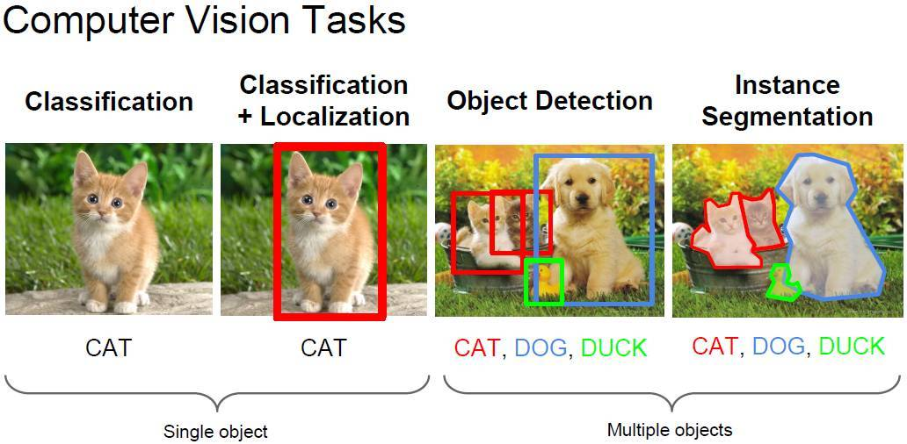
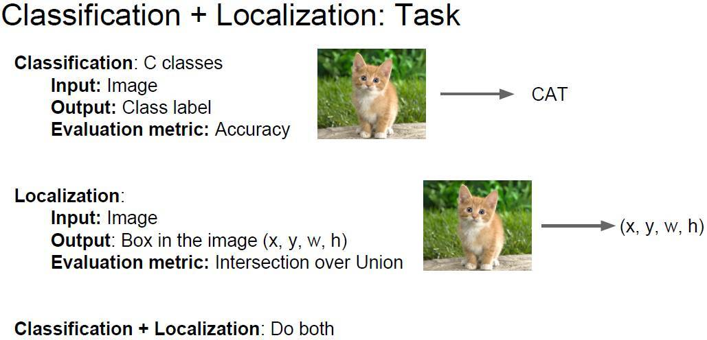

# 目标检测

普通的深度学习监督算法主要用来做分类，如下面图片所示，分类的目标是要识别出图中所示是一只猫。而在ILSVRC竞赛以及实际的应用中，还包括目标定位和目标检测等任务。其中目标定位不仅仅要识别出是什么物体（即分类），而且还要预测物体的位置，位置一般用边框（Bounding Box）标记，如下图所示。而目标检测实质上是多目标（目标数量不固定）的定位，即要在图片中定位多个目标物体，包括分类和定位。比如下图得到猫、狗、鸭子三个目标结果。

简单来说，分类、定位和检测的区别如下：

* 分类：是什么？
* 定位：在哪里？
* 检测：是什么？在哪里？

目标检测对于人类来说并不困难，通过对图片中不同颜色模块的感知很容易定位并分类出其中目标物体。但对于计算机来说，面对的是RGB像素矩阵，很难从图像中直接得到狗和猫这样的抽象概念并定位其位置，再加上有时候多个物体和杂乱的背景混杂咋一起，目标检测更加困难。但这难不倒大佬们，对一些特定的目标的检测，比如人脸检测和行人检测已经有非常成熟的技术了。

传统的目标检测一般使用滑动窗口的框架，主要包括三个步骤：

1. 利用不同尺寸的滑动窗口框住图中的某一部分作为候选区域。
2. 提取与候选区域相关的视觉特征。比如人脸检测常用的Harr特征；行人检测和普通目标检测常用的HOG特征等。
3. 利用分类器进行识别，比如常用SVM模型。

在传统的目标检测中，多尺度形变部件模型DPM（Deformable Part Model）是出类拔萃的。DPM把物体看成了多个组成的部件（比如人脸的鼻子、嘴巴等），用部件间的关系来描述物体，这个特征非常符合自然界很多物体的非刚性特征。DPM可以看做HOG+SVM的扩展，很好地继承了两者的优点，在人脸检测、行人检测等任务上取得了不错的效果。但是DPM相对复杂，检测速度也较慢，因而也出现了很多改进的方法。正当大家热火朝天改进DPM性能的时候，基于深度学习的目标检测横空出世，迅速盖过了DPM的风头，很多之前研究传统目标检测算法的研究者也开始转向深度学习。

R-CNN（Region-based Convolutional Neural Network，基于区域的额卷积神经网络）是一种结合区域提名（Region Proposal）和卷积神经网络（CNN）的目标检测方法，奠定了这个子领域的基础。其实在R-CNN之前已经有很多研究学者尝试用深度学习的方法来进行目标检测，包括OverFeat，但R-CNN是第一个真正可以工业级应用的解决方案。

目前对R-CNN这个领域的研究非常活跃，先后出现了R-CNN、SPP-net、Fast R-CNN、Faster R-CNN、R-CFN、YOLO、SSD等研究。[Ross Girshick](http://www.rossgirshick.info/)作为这个领域的开山鼻祖，像是神一样的存在，R-CNN、Fast R-CNN、Faster R-CNN、YOLO都和他有关。这些创新的工作其实很多时候是把一些传统视觉领域的方法和深度学习结合起来，比如选择性搜索（Selective Search）和图像金字塔（Pyramid）等。

与深度学习相关的目标检测方法大致分为两派

* 基于区域提名的：R-CNN、SPP-net、Fast R-CNN、Faster R-CNN、R-FCN
* 无需区域提名的：YOLO、SSD

目前来说，基于区域提名的方法依然占据上风，但无需区域提名的方法在速度上优势明显。

## Source





