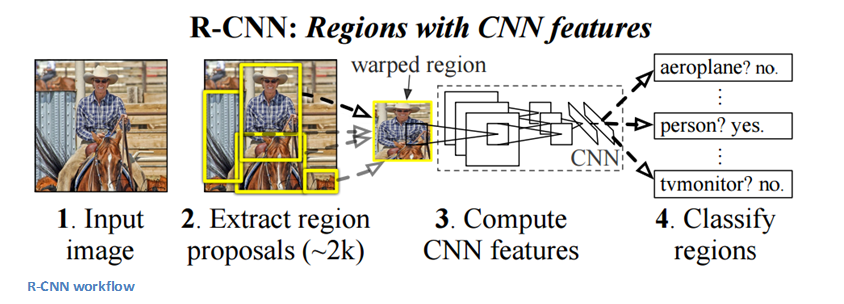

# R-CNN

## R-CNN步骤

早期的目标检测大都是使用滑动窗口的方式进行窗口提名，这种方式本质上式穷举法，R-CNN采用的是选择性搜索。以下是R-CNN的主要步骤：

（1）区域提名：通过选择性搜索（Selective Search）从原始图片中提取2000个左右的区域候选框。

（2）区域大小归一化：把所有候选框缩放成固定大小（原文采用227\*227）。

（3）特征提取：通过CNN网络提取特征。

（4）分类与回归：在特征层的基础上添加两个全连接层，再用SVM分类来进行识别，用线性回归来微调边框位置与大小，其中每个类别单独训练一个边框回归器。

下图即R-CNN流程图，图中第2步对应步骤中的1、2步，即包括区域提名和区域大小归一化。

OverFeat可以看作R-CNN的一个特殊情况，只需要把选择性搜索换成多尺度的滑动窗口，每个类别的边框回归器换成统一的边框回归器，SVM换为多层网络即可。但是OverFeat实际比R-CNN快9倍，这主要得益于与卷积相关的共享计算。

当然，R-CNN是为了提高效果来的，其中ILSVRC 2013数据集上的mAP由OverFeat的24.3%提升到31.4%，第一次有了质的改变。

## R-CNN缺点

（1）重复计算：R-CNN虽然不再穷举，但仍然有2000个左右的候选框，这些候选框都需要进行CNN操作，计算量仍然很大，其中有不少其实是重复计算。

（2）SVM模型：分类和回归使用SVM模型，而且还是线性模型，无法将梯度后向传播给卷积特征提取层，在标注数据不缺的时候显然不是最好的选择。

（3）训练测试分为多步：区域提名、特征提取、分类、回归都是断开的训练过程，中间数据还需单独保存

（4）训练的空间和时间代价很高：卷积出来的特征需要先存在硬盘上，这些特征需要几百GB的存储空间

（5）慢：前面的缺点最终导致R-CNN出奇的慢，在GPU上处理一张图片需要13秒，在CPU上需要53秒。

