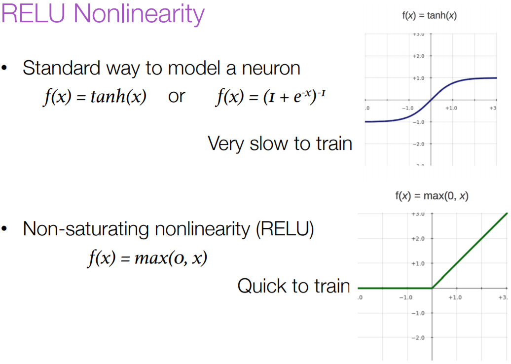
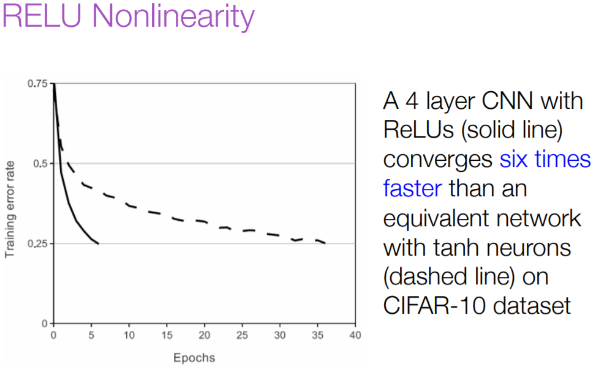
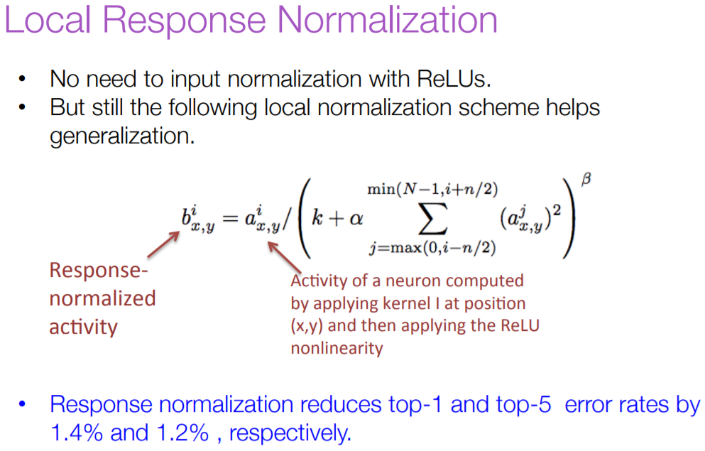
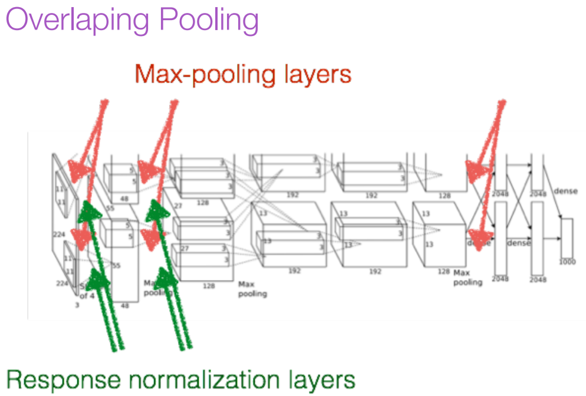
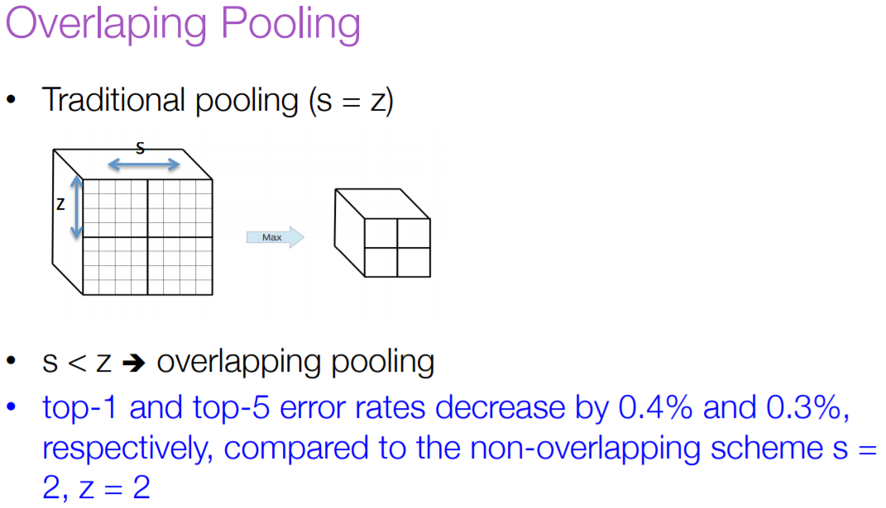
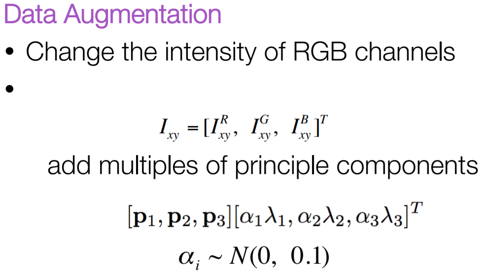

# AlexNet

AlexNet可以说是一个具有里程碑意义的网络结构。在2012年的ILSVRC 2012中一举刷新了纪录，Top-5错误率比上一年的冠军下降了十多个百分点，而且远远超过当年的第二名ISI，从而奠定了深度学习在计算机视觉领域的霸主地位。

231n中对AlexNet的评价：

* **AlexNet**. The first work that popularized Convolutional Networks in Computer Vision was the [AlexNet](http://papers.nips.cc/paper/4824-imagenet-classification-with-deep-convolutional-neural-networks), developed by Alex Krizhevsky, Ilya Sutskever and Geoff Hinton. The AlexNet was submitted to the [ImageNet ILSVRC challenge](http://www.image-net.org/challenges/LSVRC/2014/) in 2012 and significantly outperformed the second runner-up \(top 5 error of 16% compared to runner-up with 26% error\). The Network had a very similar architecture to LeNet, but was deeper, bigger, and featured Convolutional Layers stacked on top of each other \(previously it was common to only have a single CONV layer always immediately followed by a POOL layer\).

AlexNet网络包含8个学习层：5个卷积层和3个全连接层，最后的输出层为一个1000类的Softmax层。AlexNet模型中间层分为两路，明确显示了两块GPU之间的职责划分——一块GPU运行图中顶部模型部分，另一块GPU则运行图中底部模型部分。GPU之间仅在某些层相互通信。该网络的输入是150528维的，且该网络剩下的各层的神经元数分别为253440-186624-64896-64896-43264-4096-1000。


## AlexNet结构

结构如下图所示，5个卷积阶段（这里我不称为卷积层是因为这5部分不仅进行了卷积操作，还有其他运算），再接3个全连接层，最后1000维的Softmax输出。每层的维度及核数量如下下图所示。


### 第一层\(卷积\)


第一层输入数据为227\*227\*3（原始为224\*224\*3，加了padding，为了保证卷积之后图像尺寸依然是整数）的图像，这个图像被11\*11\*3的卷积核进行卷积运算，卷积核对原始图像的每次卷积都生成一个新的像素。卷积核沿原始图像的 $$x$$ 轴方向和 $$y$$ 轴方向两个方向移动，移动的步长是4个像素。因此，卷积核在移动的过程中会生成 $$(227-11)/4+1=55$$ 个像素\(227个像素减去11再除以4，正好是54，即生成54个像素，再加上被减去的11也对应生成一个像素\)，行和列的55\*55个像素形成对原始图像卷积之后的像素层。共有96个卷积核，会生成55\*55\*96个卷积后的像素层。96个卷积核分成2组，每组48个卷积核。对应生成2组55\*55\*48的卷积后的像素层数据。这些像素层经过ReLU单元的处理，生成激活像素层，尺寸仍为2组55\*55\*48的像素层数据。

这些像素层经过池化处理，池化的尺寸为3\*3，运算的步长为2，则池化有图像的尺寸为 $$(55-3)/2+1=27$$ 。即池化后像素的规模为27\*27\*96；然后经过归一化处理，归一化运算的尺度为5\*5；第一卷积层运算结束后形成的像素层的规模为27\*27\*96。分别对应96个卷积核所运算形成。这96层像素层分为2组，每组48个像素层，每组在一个独立的GPU上进行运算。

反向传播时，每个卷积核对应一个偏差值。即第一层的96个卷积核对应上层输入的96个偏差值。

### 第二层\(卷积\)


第二层输入数据为第一层输出的27\*27\*96的像素层，为便于后续处理，每幅像素层的左右两边和上下两边都要填充2个像素；27\*27\*96的像素数据分成27\*27\*48的两组像素数据，两组数据分别再两个不同的GPU中进行运算。每组像素数据被 $$5*5*48$$ 的卷积核进行卷积运算，卷积核对每组数据的每次卷积都生成一个新的像素。卷积核沿原始图像的 $$x$$ 轴方向和 $$y$$ 轴方向两个方向移动，移动的步长是1个像素。因此，卷积核在移动的过程中会生成 $$(27-5+2*2)/1+1=27$$ 个像素\(27个像素减去5，正好是22，在加上上下、左右各填充的2个像素，即生成26个像素，再加上被减去的5也对应生成一个像素\)。行和列的27\*27个像素形成对原始图像卷积之后的像素层。共有256个5\*5\*48卷积核；这256个卷积核分成2组，每组针对一个GPU中的27\*27\*48的像素进行卷积运算。会生成27\*27\*128个卷积后的像素层。这些像素层经过ReLU单元的处理，生成激活像素层，尺寸仍为2组27\*27\*256的像素层。

这些像素层经过池化运算，池化的尺寸为3\*3，运算的步长为2，则池化后的图像尺寸为 $$(27-3)/2+1=13$$ 。即池化后像素的规模为2组13\*13\*128的像素层；然后经过归一化处理，归一化运算尺寸为5\*5；第二卷积层运算结束后形成的像素层的规模为2组13\*13\*128的像素层。分别对应2组128个卷积核所运算形成。每组在一个GPU上进行运算。即共256个卷积核，共2个GPU进行运算。

反向传播时，每个卷积核对应一个偏差值。即第一层的96个卷积核对应上层输入的256个偏差值。

### 第三层\(卷积\)


第三层输入数据为第二层输出的2组13\*13\*128的像素层；为便于后续处理，每幅像素层的左右两边和上下两边都要填充1个像素；2组像素层数据都被送至2个不同的GPU中进行运算。每个GPU中都有192个卷积核，每个卷积核的尺寸是3\*3\*256.因此，每个GPU中的卷积核都能对2组13\*13\*128的像素层的所有数据进行卷积运算。卷积核对每组数据的每次卷积都生成一个新的像素。卷积核沿像素层数据的 $$x$$ 轴方向和 $$y$$ 轴方向两个方向移动，移动的步长是1个像素。因此，运算后的卷积核的尺寸为 $$(13-3+1*2)/1+1=13$$ （13个像素减去3，正好是10，在加上上下、左右各填充的1个像素，即生成12个像素，再加上被减去的3也对应生成一个像素），每个GPU中共13\*13\*192个卷积核。2个GPU中共13\*13\*384个卷积后的像素层。这些像素层经过ReLU单元的处理，生成激活像素层，尺寸仍为2组13\*13\*192像素层，共13\*13\*384个像素层。

### 第四层\(卷积\)


第四层输入数据为第三层输出的2组13\*13\*192的像素层；为便于后续处理，每幅像素层的左右两边和上下两边都要填充1个像素；2组像素层数据都被送至2个不同的GPU中进行运算。每个GPU中都有192个卷积核，每个卷积核的尺寸是3\*3\*192。因此，每个GPU中的卷积核能对1组13\*13\*192的像素层的数据进行卷积运算。卷积核对每组数据的每次卷积都生成一个新的像素。卷积核沿像素层数据的 $$x$$ 轴方向和 $$y$$ 轴方向两个方向移动，移动的步长是1个像素。因此，运算后的卷积核的尺寸为 $$(13-3+1*2)/1+1=13$$ （13个像素减去3，正好是10，在加上上下、左右各填充的1个像素，即生成12个像素，再加上被减去的3也对应生成一个像素），每个GPU中共13\*13\*192个卷积核。2个GPU中共13\*13\*384个卷积后的像素层。这些像素层经过ReLU单元的处理，生成激活像素层，尺寸仍为2组13\*13\*192像素层，共13\*13\*384个像素层。

### 第五层\(卷积\)


第五层输入数据为第四层输出的2组13\*13\*192的像素层；为便于后续处理，每幅像素层的左右两边和上下两边都要填充1个像素；2组像素层数据都被送至2个不同的GPU中进行运算。每个GPU中都有128个卷积核，每个卷积核的尺寸是3\*3\*192。因此，每个GPU中的卷积核能对1组13\*13\*192的像素层的数据进行卷积运算。卷积核对每组数据的每次卷积都生成一个新的像素。卷积核沿像素层数据的 $$x$$ 轴方向和 $$y$$ 轴方向两个方向移动，移动的步长是1个像素。因此，运算后的卷积核的尺寸为 $$(13-3+1*2)/1+1=13$$ （13个像素减去3，正好是10，在加上上下、左右各填充的1个像素，即生成12个像素，再加上被减去的3也对应生成一个像素），每个GPU中共13\*13\*128个卷积核。2个GPU中共13\*13\*256个卷积后的像素层。这些像素层经过ReLU单元的处理，生成激活像素层，尺寸仍为2组13\*13\*128像素层，共13\*13\*256个像素层。

2组13\*13\*128像素层分别在2个不同GPU中进行池化运算。池化运算的尺寸为3\*3，运算步长为2，则池化后图像的尺寸为 $$(13-3)/2+1=6$$ 。即池化后像素的规模为2组6\*6\*128的像素层数据，共6\*6\*256规模的像素层数据。

### 第六层\(全连接\)


第六层输入数据的尺寸是6\*6\*256，采用6\*6\*256尺寸的滤波器对第六层的输入数据进行卷积运算；每个6\*6\*256尺寸的滤波器对第六层的输入数据进行卷积运算生成一个运算结果，通过一个神经元输出这个运算结果；共有4096个6\*6\*256尺寸的滤波器对输入数据进行卷积运算，通过4096个神经元输出运算结果；这4096个运算结果通过ReLU激活函数生成4096个值；并通过drop运算后输出4096个本层的输出结果值。

由于第六层的运算过程中，采用的滤波器的尺寸6\*6\*256与待处理的特征图的尺寸相同，即滤波器中的每个系数只与特征图中的一个像素值相乘；而其它卷积层中，每个滤波器的系数都会与多个特征图中像素值相乘；因此，将第六层称为全连接层。

第五层输出的6\*6\*256规模的像素层数据与第六层的4096个神经元进行全连接，然后经由ReLU进行处理后生成4096个数据，再经过dropout处理后输出4096个数据。

### 第七层\(全连接\)


第六层输出的4096个数据与第七层的4096个神经元进行全连接，然后经由ReLU进行处理后生成4096个数据，再经过dropout处理后输出4096个数据。

### 第八层\(全连接\)


第七层输出的4096个数据与第八层的1000个神经元进行全连接，经过训练后输出被训练的数值。

## AlexNet特点


### ReLU非线性激活函数

通常神经元对输入 $$x$$ 的激活函数使用 $$f(x)=\text{tanh}(x)$$ 或 $$f(x)=\text{sigmoid}(x)=(1+e^{-x})^{-1}$$ 。无论是tanh还是sigmoid函数，都会在 $$x$$ 取值很大或很小时进入饱和区，这时候神经元的梯度会接近于 $$0$$ 。在使用梯度下降法的反向传播过程中，这些饱和的非线性函数容易造成梯度消失，导致网络很难学习。而非饱和的非线性函数ReLU（ $$f(x)=\max(0,x)$$ ）能够在一定程度上克服这一问题。通常认为使用ReLU的深度神经网络训练速度比同样使用tanh的网络有数倍提升。

                  

### 百万数据和多GPU训练

AlexNet当时使用GTX 580 GPU进行实验。单块GTX 580 GPU只有3GB显存，这限制了在其上进行训练的最大网络规模。处理训练模型所需的128万张图片数据对于一块GPU而言太吃力，于是AlexNet被拆分到两块GPU上。GPU能够直接对其他GPU的显存进行读写，不需要通过主机内存，故而特别适合跨GPU并优化。

AlexNet的并行方案除将模型的神经元进行均分外，还采用了一种技巧：GPU之间的通信只在某些层进行。如下图所示。第三层卷积需要以第二层产生的所有特征图作为输入，而第四层卷积则只需要以第三层的特征图中处在同一块GPU的部分作为输入。选择层间特征图的连接关系是一个交叉验证问题，但这使得我们能够将通信量精确地调整到一个可接受的范围内。


与单块GPU上训练得到的每个卷积层核数减半的网络相比，上述方案使Top-1与Top-5误差率分别减少了1.7%和1.2%。（事实上，由于模型的大多数参数集中在第一个全连接层，而这个全连接层以最后一个卷积层作为输入，这里是用的单GPU模型既没有减半最后一个卷积层的核数，也没有减半全连接的尺寸。由此单GPU和双GPU网络具有大致相同的参数数量。这样的设置可能对单GPU网络更有利一些，虽然无法精确体现参数数量对模型精度的影响，但更有效地证明了使用双GPU网络的必要性。）训练双GPU网络的耗时比单GPU网络略少一些。


### 局部响应归一化

采用ReLU一个有利的属性时不需要对输入进行特别的归一化来避免激活函数进入饱和区。对于一个ReLU单元，只要训练样本中至少有一部分数据能对其产生正值的输入，这个神经元便能够进行学习。不过，AlexNet同样提出使用局部归一化\(Local Response Normalization, LRN\)有助于模型泛化。

定义 $$a^i_{x,y}$$ 表示卷积核 $$i$$ 在图像坐标 $$(x,y)$$ 处得到的神经元激活值，继而通过非线性ReLU，用 $$b^i_{x,y}$$ 表示归一化后的激活值，表达式如下图：



其中，求和部分设计了相同空间位置下 $$n$$ 个“相邻”的特征图， $$N$$ 表示该层中特征图的总数量。特征图的顺序关系可以在训练开始前任意生成。应用这样的响应归一化，形成了一种特征图间的侧向抑制，使不同激活单元的输出值相互竞争。常数 $$k,n,\alpha,\beta$$ 是超参数，通常由验证集决定，AlexNet当时使用的参数配置是 $$k=2,n=5,\alpha=10^{-4},\beta=0.75$$ 。归一化应用于某些层的ReLU非线性激活之后。

LRN这一方案与Jarrett等人提出的局部对比度归一化策略有相似之处。不过，AlexNet的归一化策略准确说来是一种“亮度归一化”，它不需要减去平均激活值。采用这一策略，使得Top-1和Top-5错误率分别下降了1.4%和1.2%。此外，CIFAR-10数据集上的实验也同样证明了响应归一化的有效性：利用一个普通的四层卷积网络，测试错误率为13%，加入归一化后错误率下降到11%。

### 重叠池化



在卷积网络中池化层可以视为对同一特征图中相邻神经元输出的一种概括。传统上，相邻的池化单元是互不重叠的。更准确地说，一个池化层可以被想象成由间隔 $$s$$ 像素的若干池化网格单元组成，每个网格单元将对以该单元位置为中心、尺寸 $$z\times z$$ 的邻域进行处理。



若设 $$s = z$$ ，我们便得到了CNN中常见的传统池化层；若设 $$s < z$$ ，得到的便是一个有重叠的池化层。在AlexNet中，取 $$s = 2,\ z=3$$ 时，模型Top-1和Top-5错误率比采用不重叠的 $$s = 2,\ z=2$$ 分别下降了0.4%和0.3%。

同时在AlexNet的训练过程中也观测到，有重叠的池化层相比传统池化层出现过拟合现象的问题也略有缓解

### 整体网络结构

AlexNet网络包含8个学习层：5个卷积层和3个全连接层，最后的输出层为一个1000类的Softmax层，产生一个1000类标签的分布。网络优化目标是最大化多分类逻辑回归，也等价于在最大化预测分布下训练样本中正确标签的对数概率平均值。

第二、四、五个卷积层只连接到前一个卷积层中也位于同一块GPU上的那些特征图，第三个卷积层则连接着第二个卷积层中的所有特征图，全连接层中的神经元连接前一层所有的神经元。


如下图，在第一和第二卷积层后面各接了一个局部响应归一化层。在局部响应归一化层和第五个卷积层之后接的最大池化层采用了前文介绍的重叠池化方式。所有卷积层和全连接层都采用ReLU作为非线性激活函数。网络输入层仍采用224\*224\*3的输入图像（加padding变为227\*227\*3）。第一个卷积层包含96个尺寸为11\*11\*3、步长为4个像素的卷积核。第二层卷积层将第一个卷积层的输出作为输入（包含局部响应归一化和池化），该层包含256个5\*5\*48的卷积核。第三、四、五个卷积层顺序连接、其间不采用池化和归一化。第三个卷积层包含384个尺寸为3\*3\*256的卷积核，与第二个卷积层相连（归一化、池化）。第四个卷积层由384个尺寸为3\*3\*192的卷积核组成，而第五个卷积层则由256个尺寸为3\*3\*192的卷积核组成。每个全连接层都包含4096个神经元。


### 降低过拟合

AlexNet包含6000万个参数，650000个神经元。尽管ILSVRC的1000个类别使得每个训练样本都能够为从图像到标签提供10bit的约束，但是对学习如此数量庞大的参数模型还是会出现明显的过拟合现象。当时AlexNet采用了两种对抗过拟合的方法：数据增强，Dropout

#### 数据增强

很多时候，大规模神经网络的效果直接取决于训练数据的规模，通常充足、丰富的训练数据能够有效地提高网络精度。正因如此，克服过拟合最简单、直接的方法是对标注数据进行一系列变换，并将新产生的数据集作为补充加入训练数据中。其中，通用的图像数据变形包括裁剪、平移、尺度变化、水平翻转，以及增加一些随机的光照、色彩变换。

AlexNet采用了两种数据增强的变换方式：

（1）第一种变换方式由生成图像裁剪和水平翻转组成。在256\*256的训练数据原图上随机裁剪尺寸为224\*224的片段（及它们的水平翻转），并在这些数据上训练网络。这使得训练集规模扩大了2048倍，但显然这样产生的训练样本之间具有高度依赖性。如果不采用这样的策略，网络模型可能过拟合严重，从而迫使我们使用比较小的网络。实际中，这种数据增强的方法往往是比较有效的。

在测试阶段，在输入图片的四角和中心裁剪5个224\*224的图像块及它们的水平翻转都送入网络进行预测，最后对10个由Softmax层产生的输出进行平均作为最终的预测结果。


（2）第二种变换方式是改变训练数据中RGB通道的强度。具体来说，就是对整个ImageNet训练数据的RGB像素值做主成分分析\(PCA\)。变换过程是，将一个训练数据的RGB叠加上PCA得到的主成分所对应的特征向量乘以一个零均值、标准差为0.1的高斯分布的随机变量。这样，RGB的每个像素值为：

                             $$I'_{x,y}=[I^R_{x,y},I^G_{x,y},I^B_{x,y}]^\top+[p_1,p_2,p_3][\alpha_1\lambda_1,\alpha_2\lambda_2,\alpha_3\lambda_3]^\top$$ 

其中， $$p_i$$ 和 $$\lambda_i$$ 表示RGB像素值对应的3\*3协方差矩阵中第 $$i$$ 个特征向量和特征值， $$\alpha_i$$ 则是上文中提到的随机系数。采用这种变换能够使网络近似地学习到自然物体识别中一个很重要的属性，即物体识别应该对光照强度和颜色保持不变性。



#### Dropout

结合多个模型的预测结果能有效地降低测试误差，但对于需要花费数天来训练的大型神经网络来说，这样做显得太过昂贵。然而，模型融合有一个非常高效的版本“Dropout”。“Dropout”以一定的概率将一个神经元输出设置为0.以这种被关闭的神经元在前向、后向传播过程中都不起作用。这样每次来一个输入，网络便采样出一个不同的结构，但这些结构共享一套参数。由于一个神经元不能只依赖有某些特定的神经元，这种技术降低了神经元间复杂的共适性。这样，强迫神经元学习更为鲁棒的特征，从而适应与其他神经元的不同随机子集相结合。


## Code实现

```python
def AlexNet():
    model = Sequential()
    model.add(Conv2D(96,(11,11),strides=(4,4),input_shape=(227,227,3),padding='valid',activation='relu',kernel_initializer='uniform'))
    model.add(MaxPooling2D(pool_size=(3,3),strides=(2,2)))
    model.add(Conv2D(256,(5,5),strides=(1,1),padding='same',activation='relu',kernel_initializer='uniform'))
    model.add(MaxPooling2D(pool_size=(3,3),strides=(2,2)))
    model.add(Conv2D(384,(3,3),strides=(1,1),padding='same',activation='relu',kernel_initializer='uniform'))
    model.add(Conv2D(384,(3,3),strides=(1,1),padding='same',activation='relu',kernel_initializer='uniform'))
    model.add(Conv2D(256,(3,3),strides=(1,1),padding='same',activation='relu',kernel_initializer='uniform'))
    model.add(MaxPooling2D(pool_size=(3,3),strides=(2,2)))
    model.add(Flatten())
    model.add(Dense(4096,activation='relu'))
    model.add(Dropout(0.5))
    model.add(Dense(4096,activation='relu'))
    model.add(Dropout(0.5))
    model.add(Dense(1000,activation='softmax'))
    return model
```

## Source












