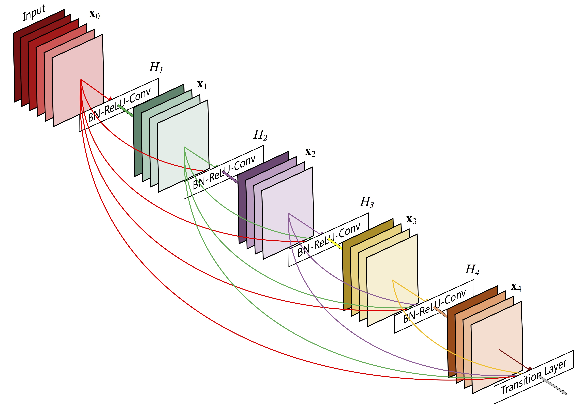
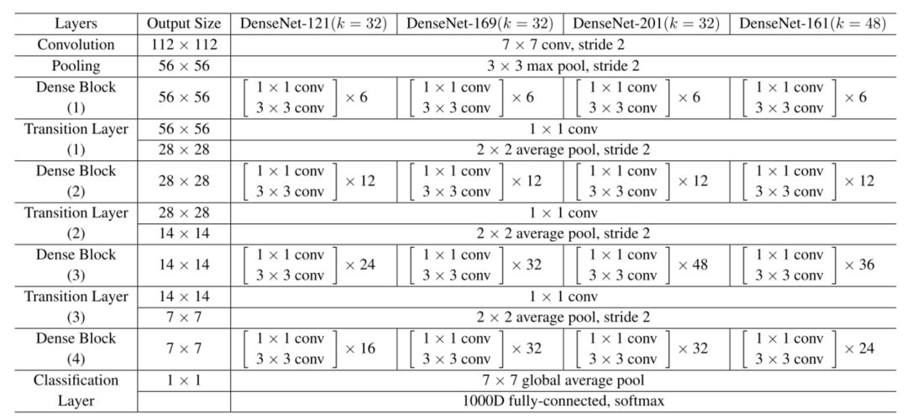

# DenseNet

ResNet在一定程度上解决了过深模型（比如几百甚至上千层）梯度发散导致无法训练的问题，其关键之处在于层间的快速连接。受此启发，能否进一步增加连接，充分利用所有层的特征呢？[DenseNe](https://github.com/liuzhuang13/DenseNet)t就是这样的模型。

## DenseNet结构

DenseNet模块中的核心模块Dense Block如下图所示，相比ResNet的残差模块，DenseNet具有更多的跨层快捷连接，从输入层开始，每层都作为后面各层的输入。



在具体实现上，在ResNet中，第 $$l$$ 层的输入 $$x_{l-1}$$ 经过层的转换函数 $$H_l$$ 后得到对应的输出 $$H_l(x_{l-1})$$ ，该输出与输入 $$x_{l-1}$$ 的线性组合就成了下一层的输入 $$x_l$$ 。即：

                                                                $$x_l = H_l(x_{l-1})+x_{l-1}$$ 

而在Dense Block中，第 $$l$$ 层的新增输入 $$x_{l-1}$$ 与之前的所有输入 $$x_0,x_1,\dots,x_{l-3},x_{l-2}$$ 按照通道拼接在一起组成真正的输入，即 $$[x_0,x_1,\dots,x_{l-2},x_{l-1}]$$ ，该输入经过一个Batch Normalization层、ReLU和卷积层得到对应的隐层输出 $$H_l$$ ，该隐层输出就是下一层的新增输入 $$x_l$$ ，即：

                                                     $$x_l=H_l([x_0,x_1,\dots,x_{l-2},x_{l-1}])$$ 

$$x_l$$ 再与之前的所有输入拼接为 $$[x_0,x_1,\dots,x_{l-1},x_{l}]$$ 作为下一层的输入。一般来说，每层新增输入 $$x_l$$ 的通道数量 $$k$$ 都很小，在上图中为 $$4$$ ，原论文中的模型一般取 $$k = 12$$ 。这个新增通道数量 $$k$$ 有一个专门的名字叫增长率（Growth Rate）。由于采用这种拼接方式，同时每个隐层特别瘦（即增长率 $$k$$ 较小），使得DenseNet看起来连接很密集，但实际参数数量及对应运算量反而较少。DenseNet相比ResNet在性能上有一定的优势，在ImageNet分类数据集上达到同样的准确率，DenseNet的参数数量及运算量可能只需要ResNet的一半左右。

最终的DenseNet由Dense Block以及转换层（Transition Layer）组成，转换层一般由一个Batch Normalization层、卷积核大小为1\*1的卷积层和池化层组成，其中1\*1的卷积主要用于瘦身，即降低通道数量。如下图所示，是包含三个Dense Block的DenseNet模型。


用于ImageNet的DenseNet架构



## Code实现

```python
def DenseNet121(nb_dense_block=4, growth_rate=32, nb_filter=64, reduction=0.0, dropout_rate=0.0, weight_decay=1e-4, classes=1000, weights_path=None):
    '''Instantiate the DenseNet 121 architecture,
        # Arguments
            nb_dense_block: number of dense blocks to add to end
            growth_rate: number of filters to add per dense block
            nb_filter: initial number of filters
            reduction: reduction factor of transition blocks.
            dropout_rate: dropout rate
            weight_decay: weight decay factor
            classes: optional number of classes to classify images
            weights_path: path to pre-trained weights
        # Returns
            A Keras model instance.
    '''
    eps = 1.1e-5

    # compute compression factor
    compression = 1.0 - reduction

    # Handle Dimension Ordering for different backends
    global concat_axis
    if K.image_dim_ordering() == 'tf':
      concat_axis = 3
      img_input = Input(shape=(224, 224, 3), name='data')
    else:
      concat_axis = 1
      img_input = Input(shape=(3, 224, 224), name='data')

    # From architecture for ImageNet (Table 1 in the paper)
    nb_filter = 64
    nb_layers = [6,12,24,16] # For DenseNet-121

    # Initial convolution
    x = ZeroPadding2D((3, 3), name='conv1_zeropadding')(img_input)
    x = Convolution2D(nb_filter, 7, 7, subsample=(2, 2), name='conv1', bias=False)(x)
    x = BatchNormalization(epsilon=eps, axis=concat_axis, name='conv1_bn')(x)
    x = Scale(axis=concat_axis, name='conv1_scale')(x)
    x = Activation('relu', name='relu1')(x)
    x = ZeroPadding2D((1, 1), name='pool1_zeropadding')(x)
    x = MaxPooling2D((3, 3), strides=(2, 2), name='pool1')(x)

    # Add dense blocks
    for block_idx in range(nb_dense_block - 1):
        stage = block_idx+2
        x, nb_filter = dense_block(x, stage, nb_layers[block_idx], nb_filter, growth_rate, dropout_rate=dropout_rate, weight_decay=weight_decay)

        # Add transition_block
        x = transition_block(x, stage, nb_filter, compression=compression, dropout_rate=dropout_rate, weight_decay=weight_decay)
        nb_filter = int(nb_filter * compression)

    final_stage = stage + 1
    x, nb_filter = dense_block(x, final_stage, nb_layers[-1], nb_filter, growth_rate, dropout_rate=dropout_rate, weight_decay=weight_decay)

    x = BatchNormalization(epsilon=eps, axis=concat_axis, name='conv'+str(final_stage)+'_blk_bn')(x)
    x = Scale(axis=concat_axis, name='conv'+str(final_stage)+'_blk_scale')(x)
    x = Activation('relu', name='relu'+str(final_stage)+'_blk')(x)
    x = GlobalAveragePooling2D(name='pool'+str(final_stage))(x)

    x = Dense(classes, name='fc6')(x)
    x = Activation('softmax', name='prob')(x)

    model = Model(img_input, x, name='densenet')

    if weights_path is not None:
      model.load_weights(weights_path)

    return model


def conv_block(x, stage, branch, nb_filter, dropout_rate=None, weight_decay=1e-4):
    '''Apply BatchNorm, Relu, bottleneck 1x1 Conv2D, 3x3 Conv2D, and option dropout
        # Arguments
            x: input tensor 
            stage: index for dense block
            branch: layer index within each dense block
            nb_filter: number of filters
            dropout_rate: dropout rate
            weight_decay: weight decay factor
    '''
    eps = 1.1e-5
    conv_name_base = 'conv' + str(stage) + '_' + str(branch)
    relu_name_base = 'relu' + str(stage) + '_' + str(branch)

    # 1x1 Convolution (Bottleneck layer)
    inter_channel = nb_filter * 4  
    x = BatchNormalization(epsilon=eps, axis=concat_axis, name=conv_name_base+'_x1_bn')(x)
    x = Scale(axis=concat_axis, name=conv_name_base+'_x1_scale')(x)
    x = Activation('relu', name=relu_name_base+'_x1')(x)
    x = Convolution2D(inter_channel, 1, 1, name=conv_name_base+'_x1', bias=False)(x)

    if dropout_rate:
        x = Dropout(dropout_rate)(x)

    # 3x3 Convolution
    x = BatchNormalization(epsilon=eps, axis=concat_axis, name=conv_name_base+'_x2_bn')(x)
    x = Scale(axis=concat_axis, name=conv_name_base+'_x2_scale')(x)
    x = Activation('relu', name=relu_name_base+'_x2')(x)
    x = ZeroPadding2D((1, 1), name=conv_name_base+'_x2_zeropadding')(x)
    x = Convolution2D(nb_filter, 3, 3, name=conv_name_base+'_x2', bias=False)(x)

    if dropout_rate:
        x = Dropout(dropout_rate)(x)

    return x


def transition_block(x, stage, nb_filter, compression=1.0, dropout_rate=None, weight_decay=1E-4):
    ''' Apply BatchNorm, 1x1 Convolution, averagePooling, optional compression, dropout 
        # Arguments
            x: input tensor
            stage: index for dense block
            nb_filter: number of filters
            compression: calculated as 1 - reduction. Reduces the number of feature maps in the transition block.
            dropout_rate: dropout rate
            weight_decay: weight decay factor
    '''

    eps = 1.1e-5
    conv_name_base = 'conv' + str(stage) + '_blk'
    relu_name_base = 'relu' + str(stage) + '_blk'
    pool_name_base = 'pool' + str(stage) 

    x = BatchNormalization(epsilon=eps, axis=concat_axis, name=conv_name_base+'_bn')(x)
    x = Scale(axis=concat_axis, name=conv_name_base+'_scale')(x)
    x = Activation('relu', name=relu_name_base)(x)
    x = Convolution2D(int(nb_filter * compression), 1, 1, name=conv_name_base, bias=False)(x)

    if dropout_rate:
        x = Dropout(dropout_rate)(x)

    x = AveragePooling2D((2, 2), strides=(2, 2), name=pool_name_base)(x)

    return x


def dense_block(x, stage, nb_layers, nb_filter, growth_rate, dropout_rate=None, weight_decay=1e-4, grow_nb_filters=True):
    ''' Build a dense_block where the output of each conv_block is fed to subsequent ones
        # Arguments
            x: input tensor
            stage: index for dense block
            nb_layers: the number of layers of conv_block to append to the model.
            nb_filter: number of filters
            growth_rate: growth rate
            dropout_rate: dropout rate
            weight_decay: weight decay factor
            grow_nb_filters: flag to decide to allow number of filters to grow
    '''

    eps = 1.1e-5
    concat_feat = x

    for i in range(nb_layers):
        branch = i+1
        x = conv_block(concat_feat, stage, branch, growth_rate, dropout_rate, weight_decay)
        concat_feat = merge([concat_feat, x], mode='concat', concat_axis=concat_axis, name='concat_'+str(stage)+'_'+str(branch))

        if grow_nb_filters:
            nb_filter += growth_rate

    return concat_feat, nb_filter
```

## Source








