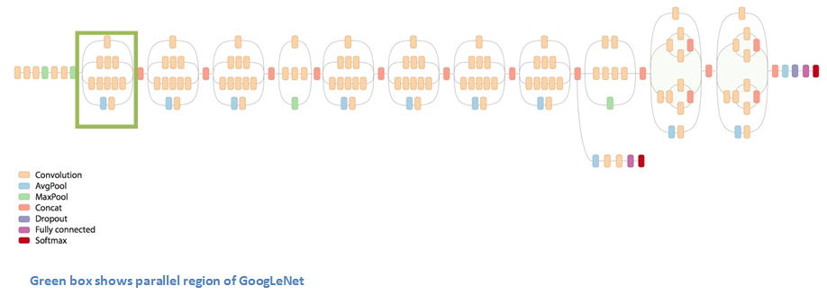
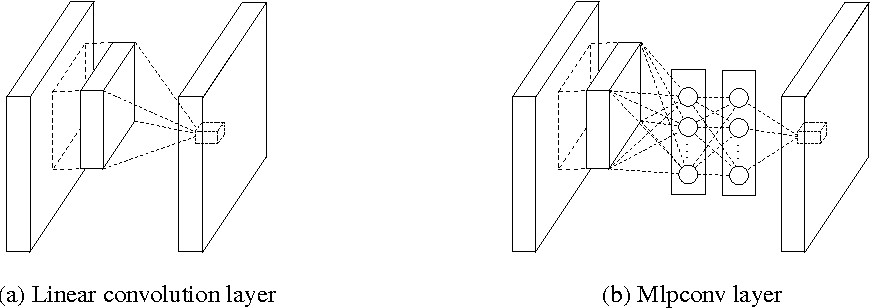

# GoogLeNet

GoogLeNet是2014年ILSVRC图像分类和定位两个任务的挑战赛冠军，用一个22层的深度网络将图像分类Top-5的错误率降低到6.67%。为了直径卷积网络的经典结构LeNet-5，同时兼顾Google的品牌，Google团队为竞赛模型齐了GoogLeNet的名字。

GoogLeNet通过精巧的网络结构设计，在保持一定计算开销的前提下增加了网络深度和宽度，有效提高了网络内计算资源的利用效率。与两年前的AlexNet相比，GoogLeNet在精度上获得了显著提升，同时模型参数减少12倍。

231n中对GoogLeNet的评价：

* **GoogLeNet**. The ILSVRC 2014 winner was a Convolutional Network from [Szegedy et al.](http://arxiv.org/abs/1409.4842) from Google. Its main contribution was the development of an _Inception Module_ that dramatically reduced the number of parameters in the network \(4M, compared to AlexNet with 60M\). Additionally, this paper uses Average Pooling instead of Fully Connected layers at the top of the ConvNet, eliminating a large amount of parameters that do not seem to matter much. There are also several followup versions to the GoogLeNet, most recently [Inception-v4](http://arxiv.org/abs/1602.07261).

## GoogLeNet/Inception-v1结构

GoogLeNet 扩大网络（多达 22 层），但也希望减少参数量和计算量。最初的 Inception 架构由 Google 发布，重点将 CNN 应用于大数据场景以及移动端。GoogLeNet 是包含 Inception 模块的全卷积结构。这些模块的目的是：通过构建由多个子模块（比如嵌套网络 - Inception）组成的复杂卷积核来提高卷积核的学习能力和抽象能力。

除了加入 Inception 模块，作者还使用了辅助分类器来提高稳定性和收敛速度。辅助分类器的想法是使用几个不同层的图像表征来执行分类任务（上图黄色框）。因此，模型中的不同层都可以计算梯度，然后使用这些梯度来优化训练。

## GoogLeNet/Inception-v1特点

为了优化网络质量，GoogLeNet的设计基于[赫布理论](https://baike.baidu.com/item/%E8%B5%AB%E5%B8%83%E7%90%86%E8%AE%BA)和多尺度处理的观点。GoogLeNet采用了一种高效的机器视觉深度神经网络结构，将其称为“Inception”。在这里，更“深”具有两层含义：一是提出了一种新的网络层形式——“Inception Module”；二是直观地增加了网络深度。

在AlexNet和VGGNet中，全连接层占据了90%的参数量，而且容易引起过拟合；而GoogLeNet用全局平均池化取代全连接层，这种组发借鉴了NIN（Network in Network）。此外，其精心设计的Inception结构如下

### GoogLeNet动机

提高深度神经网络效果最直接的方式是增大网络尺寸，包括增加深度（使用更多的层），也包括增加宽度（在层内使用更多的计算单元）。这种方法简单、稳妥，特别是当有足够标注数据时。但简单的方法也带来了两个缺陷：

1. 更大的网络尺寸，通常意味着更多的参数，使得膨胀的网络更容易过拟合。在标注数据有限的场景中，这种情况更明显。类似于ILSVRC这样需要人工甚至专业知识（有的类别很难区分）进行强标注的数据集，增大数据规模是非常昂贵的。这也成为这类思路的主要瓶颈。
2. 整体增大网络尺寸会显著提高对计算资源的需求。如在深度视觉网络中，两个卷积层级联，如果统一增加卷积核数量，那么计算量的增大将与卷积核数的增加成平方关系。更坏的情况是，如果新增的网络单元不能发挥足够的作用（如大部分权重最终被优化成0），那么大量的计算资源将被浪费。计算资源是有限的，尽管目标都是提高模型质量，但有效地分配这些资源总是优于盲目扩大网络参数的。

解决这些问题的一个基本方法是引入稀疏性，用稀疏的链接形式取代全连接，甚至在卷积内部也可以这样做。遗憾的是，今天的设备对非一致性稀疏数据的数值计算是十分低效的。就算将算数操作降到几百量级，查找和缓存未命中的开销仍为主导——使用稀疏矩阵或许得不偿失。是否存在一种折中的方法，既具有结构上的稀疏性，又能利用密集矩阵计算呢？在大量稀疏矩阵计算的文献中提到，将稀疏矩阵聚集成相对稠密的子矩阵能带来可观的性能提升。不难想象，使用相似的方法自动构建非一致结构的神经网络并不遥远。GoogLeNet中的Inception模块就可以达到此等效果。

### NIN

NIN（Network in Network）的一个动机是，在传统的CNN中卷积层实质上是一种广义的线性模型，其表达和抽象能力不足，能否使用一种表达能力更强当然也更复杂的子网络代替卷积操作，从而提升传统CNN的表达能力。一种比较简单的子网络就是多层感知机（MLP）网络，MLP由多个全连接层和非线性激活函数组成，如下图所示

相比普通的卷积网络，MLP网络能够更好地拟合局部特征，也就是增强了输入局部的表达能力。在此基础上，NIN不再像卷积一样在分层之前采用全连接网络，而是采用全局平均池化，这种全局平均池化比全连接层更具可解释性，同时不容易过拟合。

### Inception细节

### 训练方法

GoogLeNet在ILSVRC 2014时采用DistBelief分布式机器学习系统实现了一定的模型和数据并行。

## 后续改进版本

### Inception-v2：

在之前的版本中主要加入Batch Normalization；另外也借鉴了VGGNet的思想，用两个3\*3的卷积代替了5\*5的卷积，不仅降低了训练参数，而且提升了速度。

### Inception-v3

在v2的基础上进一步分解大的卷积，比如把 $$n*n$$ 的卷积拆分成两个一维的卷积： $$1*n$$ ， $$n*1$$ 。例如7\*7的卷积可以被拆分为1\*7和7\*1两个卷积。此外，采用了一些巧妙的方法进一步优化了部分卷积层的设计。

### Inception-v4

借鉴了ResNet可以构建更深网络的思想，设计了更深、更优化的模型。

## Source







