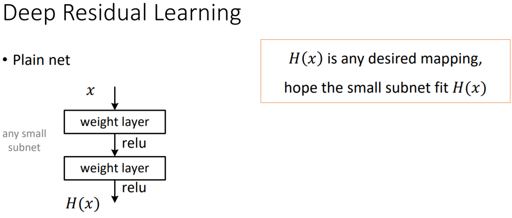
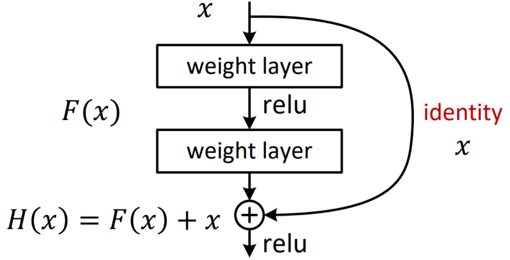
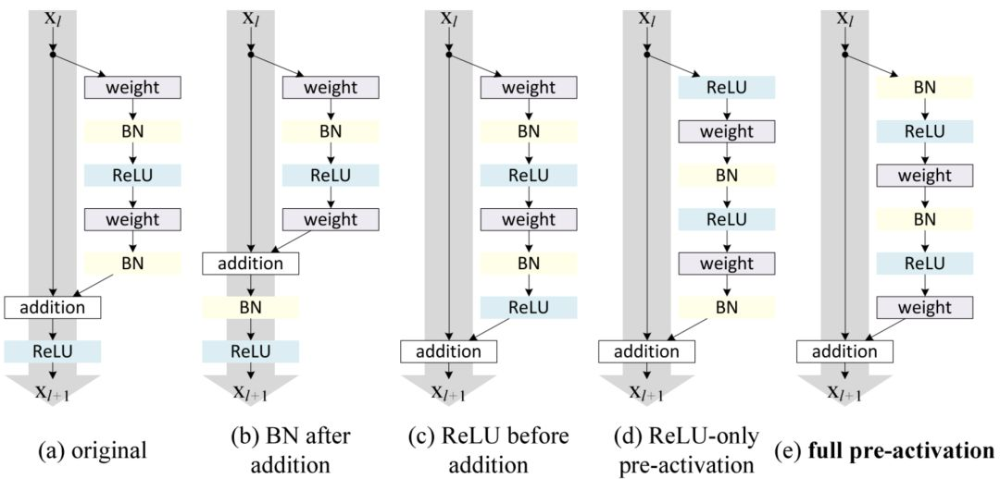
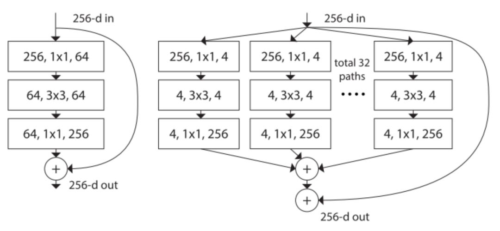
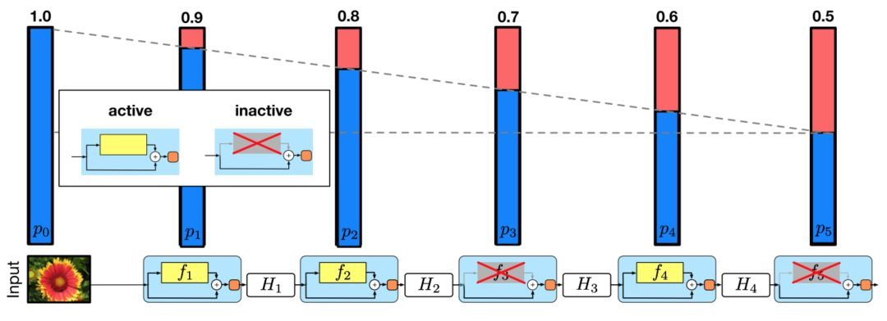

# ResNet

MSRA的深度残差网络在2015年ImageNet和COCO的5个领域：ImageNet识别、ImageNet检测、ImageNet定位、COCO检测以及COCO分割取得第一名。

231n中对ResNet的评价：

* **ResNet**. [Residual Network](http://arxiv.org/abs/1512.03385) developed by Kaiming He et al. was the winner of ILSVRC 2015. It features special _skip connections_ and a heavy use of [batch normalization](http://arxiv.org/abs/1502.03167). The architecture is also missing fully connected layers at the end of the network. The reader is also referred to Kaiming’s presentation \([video](https://www.youtube.com/watch?v=1PGLj-uKT1w), [slides](http://research.microsoft.com/en-us/um/people/kahe/ilsvrc15/ilsvrc2015_deep_residual_learning_kaiminghe.pdf)\), and some [recent experiments](https://github.com/gcr/torch-residual-networks) that reproduce these networks in Torch. ResNets are currently by far state of the art Convolutional Neural Network models and are the default choice for using ConvNets in practice \(as of May 10, 2016\). In particular, also see more recent developments that tweak the original architecture from [Kaiming He et al. Identity Mappings in Deep Residual Networks](https://arxiv.org/abs/1603.05027) \(published March 2016\).

## ResNet结构

论文中测试了不同的普通网络和残差网络，它们的具体结构如下。

### 普通网络

主要受VGGNet启发，卷积层主要采用3\*3的卷积核，并遵循以下两个设计原则。

* 如果网络层具有相同数量的特征图输出，那么它们的卷积核数量也一致。
* 如果特征图数量减半，那么卷积核数量就翻倍，从而保持每一层的时间复杂度。

ResNet通过直接将卷积层的步长设为2来实现降采样。网络的最后是一个全局的均值池化层和一个1000层路的Softmax全连接层。网络中共有34个参数层。

值得注意的是，这个配置相比VGGNet，卷积核更少，复杂度更低。34层的基础网络包含360万次乘加操作，仅是19层VGGNet网络的18%（1960万次乘加）。

### 残差网络

基于上面的普通网络，插入快捷连接，将网络转化为对应的残差版本。当输入输出维度相同时，可以直接采用恒等快捷连接（Identity Shortcut Connection），如下图右侧实现所示。当维度增加时（虚线），考虑两种选择：（1）仍然使用恒等快捷连接，增加的维度直接补0，这种方式不会引入新的参数；（2）将维度较少的低层输出映射到与高层相同的维度上（通过1\*1卷积实现）。无论怎样选择，当快捷连接跨过两层特征图时，步长设为2.


## ResNet特点

ResNet解决了超深层CNN网络的训练问题，多达152层，甚至尝试了1000层。

那么更深的网络是否更好？回答这个问题的一大障碍是梯度爆炸/消失。

当更深的网络开始收敛时，“退化”（Degradation）现象便暴露出来：随着网络深度的增加，准确率不出意料地开始饱和，随后便快速下降。何恺明团队认为，堆叠层不应降低网络性能，因为我们可以简单地在当前网络上堆叠恒等映射（该层不做任何事情），得到的架构将执行相同的操作。这表明较深的模型所产生的训练误差不应该比较浅的模型高。他们假设让堆叠层适应残差映射比使它们直接适应所需的底层映射要容易一些。

               

ResNet通过引入“深度残差学习”的框架来解决退化问题。


ResNet放弃直接拟合某个函数 $$y=H(x)$$ 的传统思路（下左图），转而拟合残差 $$F(x)=H(x)-x$$（下右图），原始映射就变成 $$H(x)=F(x)+x$$ 。ResNet的假设是残差映射比原始映射更容易优化。

                  

在极限的情况下，如果优化得到单位映射，那么继续堆叠的非线性层能很容易地你好处趋向于0的残差，而不是再学一个单位映射。


在实际情况下，单位映射不太可能是最优的情况，但是改写为残差能帮助预处理整个问题。当一个最优的函数接近于单位映射而不是零时，找到一个参照单位映射的扰动比学习一个新的函数要更容易。在实验中观察到学到的残差总体上响应很小，也证明了单位映射是一个合理的先验假设。

如上图所示，公式 $$F(x)+x$$ 被视为前馈神经网络的“快捷连接”（Shortcut Connection）。快速连接可以跳过一层或多层，在ResNet中快速连接简单地采用单位映射，并叠加到后面层的输出上。这样既没有增加新的参数，也没有增加计算复杂度。整个网络仍然可以使用SGD端到端地进行训练，并很容易地在通用库（如Caffe）上实现。



ResNet在ImageNet上对退化问题进行了全方位的实验：

1. 即使在非常深的残差网络也仍然容易优化，而对应的普通网络则随着深度的增加表现出更高的误差
2. 深度残差网络在通过增大网络深度获得精度的增益的表现上，大幅由于先前的网络。

### 残差块变体

事实上，ResNet 并不是第一个利用快捷连接的模型，Highway Networks 就引入了门控快捷连接。这些参数化的门控制流经捷径（shortcut）的信息量。类似的想法可以在长短期记忆网络（LSTM）单元中找到，它使用参数化的遗忘门控制流向下一个时间步的信息量。ResNet 可以被认为是 Highway Network 的一种特殊情况。

然而，实验结果表明 Highway Network 的性能并不比 ResNet 好，这有点奇怪。Highway Network 的解空间包含 ResNet，因此它的性能至少应该和 ResNet 一样好。这表明，保持这些「梯度高速路」（gradient highway）的畅通比获取更大的解空间更为重要。

按照这种思路，何恺明团队改进了残差块，并提出了一种残差块的预激活变体，梯度可以在该模型中畅通无阻地通过快速连接到达之前的任意一层。事实上，使用ResNet论文中的原始残差块训练一个 1202 层的 ResNet，其性能比 110 层的模型要差。



何恺明团队在其论文中通过实验表明，他们可以训练出 1001 层的深度 ResNet，且性能超越较浅层的模型。他们的训练成果卓有成效，因而 ResNet 迅速成为多种计算机视觉任务中最流行的网络架构之一。

## ResNet变体

### ResNeXt



上面图左是ResNet原论文中 ResNet 的构建块；右图是ResNeXt 的构建块，基数=32。

ResNeXt看起来和GoogLeNet中的Inception模块非常相似，它们都遵循了「分割-转换-合并」的范式。不过在ResNext中，不同路径的输出通过相加合并，而在GoogLeNet中它们是深度级联（depth concatenated）的。另外一个区别是，GoogLeNet中的每一个路径互不相同（1\*1、3\*3 和 5\*5 卷积），而在 ResNeXt 架构中，所有的路径都遵循相同的拓扑结构。

作者在论文中引入了一个叫作「基数」（cardinality）的超参数，指独立路径的数量，这提供了一种调整模型容量的新思路。实验表明，通过扩大基数值（而不是深度或宽度），准确率得到了高效提升。作者表示，与 Inception 相比，这个全新的架构更容易适应新的数据集或任务，因为它只有一个简单的范式和一个需要调整的超参数，而 Inception 需要调整很多超参数（比如每个路径的卷积层内核大小）。

这个全新的结构有三种等价形式：


在实际操作中，「分割-变换-合并」范式通常通过「逐点分组卷积层」来完成，这个卷积层将输入的特征映射分成几组，并分别执行正常的卷积操作，其输出被深度级联，然后馈送到一个 1\*1 卷积层中。

### 深度随机的深度网络

尽管 ResNet 的强大性能在很多应用中已经得到了证实，但它存在一个显著缺点：深层网络通常需要进行数周的训练时间。因此，把它应用在实际场景的成本非常高。为了解决这个问题，G. Huang 等作者在[论文](https://arxiv.org/abs/1603.09382)中引入了一种反直觉的方法，即在训练过程中随机丢弃一些层，测试中使用完整的网络。

作者使用残差块作为他们网络的构建块。因此在训练期间，当特定的残差块被启用，它的输入就会同时流经恒等快捷连接和权重层；否则，就只流过恒等快捷连接。训练时，每层都有一个「生存概率」，每层都有可能被随机丢弃。在测试时间内，所有的块都保持被激活状态，并根据其生存概率进行重新校准。

从形式上来看， $$H_l$$ 是第 $$l$$ 个残差块的输出结果， $$f_l$$ 是由第 $$l$$ 个残差块的二甲醛映射所决定的映射， $$b_l$$ 是一个伯努利随机变量（用 $$1$$ 或 $$0$$ 反映该块是否被激活）。在训练中：


当 $$b_l=1$$ 时，该块为正常的残差块；当 $$b_l=0$$ 时，上述公式为：


既然我们已经知道了 $$H_{l-1}$$ 是ReLU的输出，而且这个输出结果已经是非负的，所以上述方程可简化为将输入传递到下一层的 identity 层：


令 $$p_l$$ 表示是第 $$l$$ 层在训练中的生存概率，在测试过程中，我们得到：


作者将线性衰减规律应用于每一层的生存概率，他们表示，由于较早的层提取的低级特征会被后面的层使用，所以不应频繁丢弃较早的层。这样，规则就变成：


其中 $$L$$ 表示块的总数，因此 $$p_L$$ 就是最后一个残差块的生存概率，在整个实验中 $$p_L$$ 恒为 $$0.5$$ 。请注意，在该设置中，输入被视为第一层 $$l=0$$ ，所以第一层永远不会被丢弃。随机深度训练的整体框架如下图所示：



与 Dropout类似，训练随机深度的深度网络可被视为训练许多较小 ResNet 的集合。不同之处在于，上述方法随机丢弃一个层，而 Dropout 在训练中只丢弃一层中的部分隐藏单元。

实验表明，同样是训练一个110层的 ResNet，随机深度训练出的网络比固定深度的性能要好，同时大大减少了训练时间。这意味着 ResNet 中的一些层（路径）可能是冗余的。

### DenseNet

下一节介绍。

## Code实现

```python
def Conv2d_BN(x, nb_filter,kernel_size, strides=(1,1), padding='same',name=None):
    if name is not None:
        bn_name = name + '_bn'
        conv_name = name + '_conv'
    else:
        bn_name = None
        conv_name = None

    x = Conv2D(nb_filter,kernel_size,padding=padding,strides=strides,activation='relu',name=conv_name)(x)
    x = BatchNormalization(axis=3,name=bn_name)(x)
    return x

def Conv_Block(inpt,nb_filter,kernel_size,strides=(1,1), with_conv_shortcut=False):
    x = Conv2d_BN(inpt,nb_filter=nb_filter[0],kernel_size=(1,1),strides=strides,padding='same')
    x = Conv2d_BN(x, nb_filter=nb_filter[1], kernel_size=(3,3), padding='same')
    x = Conv2d_BN(x, nb_filter=nb_filter[2], kernel_size=(1,1), padding='same')
    if with_conv_shortcut:
        shortcut = Conv2d_BN(inpt,nb_filter=nb_filter[2],strides=strides,kernel_size=kernel_size)
        x = add([x,shortcut])
        return x
    else:
        x = add([x,inpt])
        return x

def ResNet50():
    inpt = Input(shape=(224,224,3))
    x = ZeroPadding2D((3,3))(inpt)
    x = Conv2d_BN(x,nb_filter=64,kernel_size=(7,7),strides=(2,2),padding='valid')
    x = MaxPooling2D(pool_size=(3,3),strides=(2,2),padding='same')(x)
    
    x = Conv_Block(x,nb_filter=[64,64,256],kernel_size=(3,3),strides=(1,1),with_conv_shortcut=True)
    x = Conv_Block(x,nb_filter=[64,64,256],kernel_size=(3,3))
    x = Conv_Block(x,nb_filter=[64,64,256],kernel_size=(3,3))
    
    x = Conv_Block(x,nb_filter=[128,128,512],kernel_size=(3,3),strides=(2,2),with_conv_shortcut=True)
    x = Conv_Block(x,nb_filter=[128,128,512],kernel_size=(3,3))
    x = Conv_Block(x,nb_filter=[128,128,512],kernel_size=(3,3))
    x = Conv_Block(x,nb_filter=[128,128,512],kernel_size=(3,3))
    
    x = Conv_Block(x,nb_filter=[256,256,1024],kernel_size=(3,3),strides=(2,2),with_conv_shortcut=True)
    x = Conv_Block(x,nb_filter=[256,256,1024],kernel_size=(3,3))
    x = Conv_Block(x,nb_filter=[256,256,1024],kernel_size=(3,3))
    x = Conv_Block(x,nb_filter=[256,256,1024],kernel_size=(3,3))
    x = Conv_Block(x,nb_filter=[256,256,1024],kernel_size=(3,3))
    x = Conv_Block(x,nb_filter=[256,256,1024],kernel_size=(3,3))
    
    x = Conv_Block(x,nb_filter=[512,512,2048],kernel_size=(3,3),strides=(2,2),with_conv_shortcut=True)
    x = Conv_Block(x,nb_filter=[512,512,2048],kernel_size=(3,3))
    x = Conv_Block(x,nb_filter=[512,512,2048],kernel_size=(3,3))
    x = AveragePooling2D(pool_size=(7,7))(x)
    x = Flatten()(x)
    x = Dense(1000,activation='softmax')(x)
    
    model = Model(inputs=inpt,outputs=x)
    return model
```

## Source










