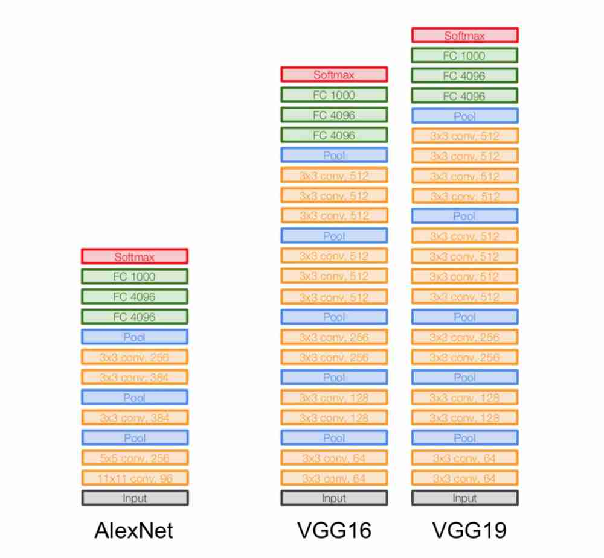
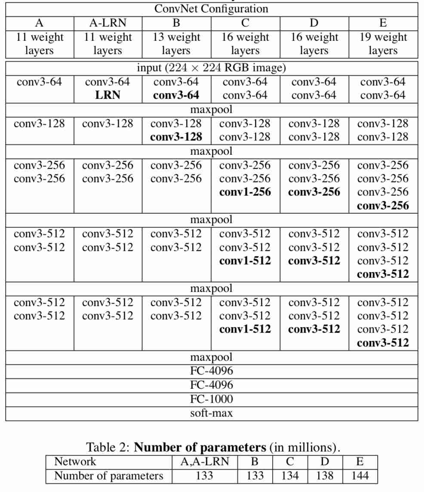
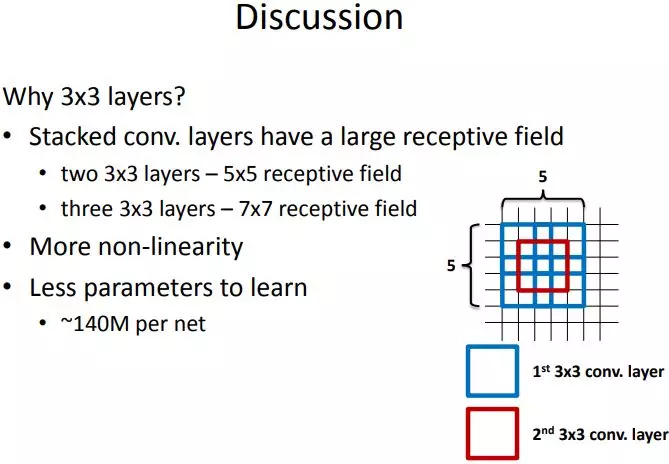
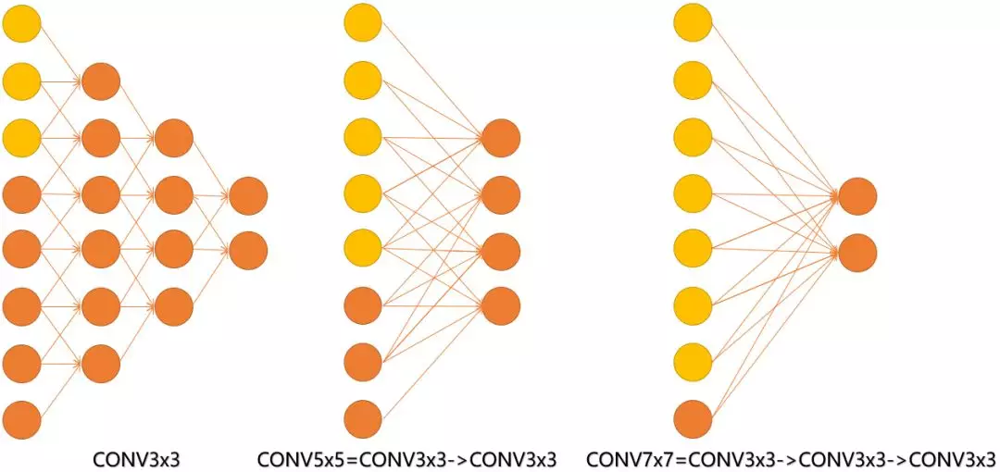
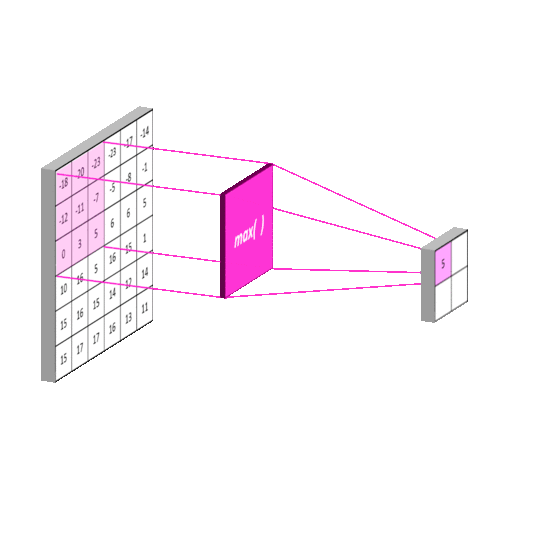

# VGGNet

VGGNet和GoogLeNet是2014年ImageNet竞赛的双雄，这两类模型结构有一个共同特点是采用了更深的网络结构。

231n中对VGGNet的评价：

* **VGGNet**. The runner-up in ILSVRC 2014 was the network from Karen Simonyan and Andrew Zisserman that became known as the [VGGNet](http://www.robots.ox.ac.uk/~vgg/research/very_deep/). Its main contribution was in showing that the depth of the network is a critical component for good performance. Their final best network contains 16 CONV/FC layers and, appealingly, features an extremely homogeneous architecture that only performs 3x3 convolutions and 2x2 pooling from the beginning to the end. Their [pretrained model](http://www.robots.ox.ac.uk/~vgg/research/very_deep/) is available for plug and play use in Caffe. A downside of the VGGNet is that it is more expensive to evaluate and uses a lot more memory and parameters \(140M\). Most of these parameters are in the first fully connected layer, and it was since found that these FC layers can be removed with no performance downgrade, significantly reducing the number of necessary parameters.

## VGGNet结构

VGGNet继承了AlexNet的很多结构，如下图所示。



网络输入是一个固定尺寸224\*224的RGB图像。这里做的唯一预处理是图像需要减去由训练集统计而得到的对应像素的RGB均值，即预处理先将图像数据中心化。

预处理之后，图像通过一系列卷积层，VGGNet采用的卷积核感受野很小：3\*3（能够包含上、下、左、右邻域信息的最小尺寸）。在其中一组配置中，VGGNet甚至采用了1\*1的卷积核，这是卷积退化成为对输入的线性变换（后面跟一个非线性单元）。卷积步长固定使用1个像素。

一簇卷积层之后是三个全连接层：前两个包含4096个激活单元，第三个对应ILSVRC的1000个分类同样采用1000个激活单元。最后一层是Softmax层。在各组配置中，全连接层的设置都是一致的。

所有的隐层都使用ReLU作为激活函数。在VGGNet的实验中，局部响应归一化（LRN）并没有带来性能的提升，却对计算资源和内存都有很多的消耗。因此除A-LRN这一组配置外，其他都没有采用LRN。具体6组配置如下图。



上图不仅列出了VGGNet实验所采用的几组网络结构配置，其中每一列代表一种配置。这几组配置的主要区别在于不同的网络深度：从A的11个参数层（8层卷积和3层全连接）到E的19个参数层（16层卷积核3层全连接）。卷积层中的特征图数量都相对较少，从第一层的64个，每经过一个最大池化层参数就会翻倍，直到最后的512个。上图的表2列出了各组配置中包含的参数数量，尽管网络深度增加很多，但模型参数并不比有较大卷积感受野和较多特征图的浅层网络多。

## VGGNet特点

### 小卷积核

虽然AlexNet有使用11\*11和5\*5的大卷积，但大多数还是3\*3卷积，对于步长为4的11\*11大卷积核，原图的尺寸很大因而冗余，最为原始的纹理细节的特征变化用大卷积核尽早捕捉到，后面的更深的层数害怕会丢失掉较大局部范围内的特征相关性，后面转而使用更多3\*3的小卷积核（和一个5\*5卷积）去捕捉细节变化

而VGGNet则清一色使用3\*3卷积。因为卷积不仅涉及到计算量，还影响到感受野。前者关系到是否方便部署到移动端、是否能满足实时处理、是否易于训练等，后者关系到参数更新、特征图的大小、特征是否提取的足够多、模型的复杂度和参数量等等。

#### 感受野

直观上来说，感受野越大越可以捕捉到特征。比如MNIST中的数字1和7两张图，只给出1和7的下半部分人眼也不好分辨到底是数字几，但增大感受野后（即可看到的像素区域多了），7的上半部分暴露出来，我们就很好分辨是数字几。其实只要网络层数加深，小感受野的信息堆叠，小感受野也可以达到大感受野捕捉特征的能力。

这里给出一张VGG作者的PPT，作者在VGGNet的实验中只用了两种卷积核大小：1\*1和3\*3。作者认为两个3\*3的卷积堆叠获得的感受野大小，相当一个5\*5的卷积；而3个3\*3卷积的堆叠获取到的感受野相当于一个7\*7的卷积。



见下图，输入的8个元素可以视为feature map的宽或者高，当输入为8个神经元经过三层conv3\*3的卷积得到2个神经元。三个网络分别对应stride=1，pad=0的conv3\*3、conv5\*5和conv7\*7的卷积核在3层、1层、1层时的结果。因为这三个网络的输入都是8，也可看出2个3\*3的卷积堆叠获得的感受野大小，相当1层5\*5的卷积；而3层的3\*3卷积堆叠获取到的感受野相当于一个7\*7的卷积。

*  input=8，3层conv3\*3后，output为2，等同于1层conv7\*7的结果；
*  input=8，2层conv3\*3后，output为2，等同于2层conv5\*5的结果。



或者我们也可以说，三层的conv3\*3的网络，最后两个输出中的一个神经元，可以看到的感受野相当于上一层是3，上上一层是5，上上上一层（也就是输入）是7。

此外，倒着看网络，也就是backprop的过程，每个神经元相对于前一层甚至输入层的感受野大小也就意味着参数更新会影响到的神经元数目。在分割问题中卷积核的大小对结果有一定的影响，在上图三层的conv3\*3中，最后一个神经元的计算是基于第一层输入的7个神经元，换句话说，反向传播时，该层会影响到第一层conv3\*3的前7个参数。从输出层往回forward同样的层数下，大卷积影响（做参数更新时）到的前面的输入神经元越多。

#### 计算量

在计算量这里，为了突出小卷积核的优势，拿同样conv3\*3、conv5\*5、conv7\*7、conv9\*9和conv11\*11，在224\*224\*3的RGB图上（设pad为1，stride为4，output\_channel为96）做卷积，卷积层的参数规模和得到的特征图的大小如下：


从上表可以看出，大卷积核带来的特征图和卷积核得参数量并不大，无论是单独去看卷积核参数或者特征图参数，不同kernel大小下这二者加和的结构都是30万的参数量，也就是说，无论大的卷积核还是小的，对参数量来说影响不大甚至持平。

增大的反而是卷积的计算量，在表格中列出了计算量的公式，最后要乘以2，代表乘加操作。为了尽可能证一致，这里所有卷积核使用的stride均为4，可以看到，conv3\*3、conv5\*5、conv7\*7、conv9\*9和conv11\*11的计算规模依次为：1600万，4500万，1.4亿、2亿，这种规模下的卷积，虽然参数量增长不大，但是计算量是惊人的。总结一下，我们可以得出两个结论：

* 同样stride下，不同卷积核大小的特征图和卷积参数差别不大；
* 越大的卷积核计算量越大。

其实对比参数量，卷积核参数的量级在十万，一般都不会超过百万。相比全连接的参数规模是上一层的feature map和全连接的神经元个数相乘，这个计算量也就更大了。其实一个关键的点——多个小卷积核的堆叠比单一大卷积核带来了精度提升，这也是最重要的一点。

#### 优点

使用小卷积核比用大卷积核的几点优势：

（1）更多的激活函数、更丰富的特征，更强的辨别能力。卷积后都伴有激活函数，更多的卷积核的使用可使决策函数更加具有辨别能力，此外就卷积本身的作用而言，3\*3比7\*7就足以捕获特征的变化：3\*3的9个格子，最中间的格子是一个感受野中心，可以捕获上下左右以及斜对角的特征变化。主要在于3个堆叠起来后，三个3\*3近似一个7\*7，网络深了两层且多出了两个非线性ReLU函数，（特征多样性和参数参数量的增大）使得网络容量更大（关于model capacity，AlexNet的作者认为可以用模型的深度和宽度来控制capacity），对于不同类别的区分能力更强（此外，从模型压缩角度也是要摒弃7\*7，用更少的参数获得更深更宽的网络，也一定程度代表着模型容量，后人也认为更深更宽比矮胖的网络好）；

（2）卷积层的参数减少。相比5\*5、7\*7和11\*11的大卷积核，3\*3明显地减少了参数量，这点可以回过头去看上面的表格。比方input channel数和output channel数均为C，那么3层conv3\*3卷积所需要的卷积层参数是： $$3*(C*3*3*C)=27*C^2$$ ，而一层conv7\*7卷积所需要的卷积层参数是： $$C*7*7*C=49*C^2$$ 。也就是说conv7\*7的卷积核参数比conv3\*3的多了 $$(49-27)/27\approx81\%$$ 的参数。

（3）小卷积核代替大卷积核的正则作用带来性能提升。用三个conv3\*3代替一个conv7\*7，认为可以进一步分解（decomposition）原本用7\*7大卷积核提到的特征，这里的分解是相对于同样大小的感受野来说的。关于正则的理解我觉得还需要进一步分析。

其实最重要的还是多个小卷积堆叠在分类精度上比单个大卷积要好。

### 小池化核

这里的“小”是相对于AlexNet的3\*3的池化核来说的。不过在说池化前，先说一下CS231n的博客里的描述网络结构的layer pattern，一般常见的网络都可以表示为：

             $$\text{Input}\to [[\text{Conv}\to \text{ReLU}]*N\to \text{Pool}?]*M\to [\text{FC}\to \text{ReLU}]*K\to \text{FC}$$ 

其中 $$\text{Pool}$$ 后面的 $$?$$ 表示 $$\text{Pool}$$ 是一个可选项。这样的pattern因为可以对小卷积核堆叠，很自然也更适合描述深层网络的构建，例如 $$\text{Input}\to\text{FC}$$ 表示一个线性分类器。

不过从layer pattern中的 $$[[\text{Conv}\to \text{ReLU}]*N\to \text{Pool}?]*M$$ 部分，可以看出卷积层一般后面接完激活函数就紧跟池化层。对于这点我的理解是，池化做的事情是根据对应的max或者average方式进行特征筛选，还是在做特征工程上的事情。



2012年的AlexNet，其pooling的kernel size全是奇数，里面所有池化采用kernel size为3\*3，stride为2的max-pooling。而VGGNet所使用的max-pooling的kernel size均为2\*2，stride为2的max-pooling。pooling kernel size从奇数变为偶数。小kernel带来的是更细节的信息捕获，且是max-pooling更见微的同时进一步知躇。

在当时也有average pooling，但是在图像任务上max-pooling的效果更胜一筹，所以图像大多使用max-pooling。在这里我认为max-pooling更容易捕捉图像上的变化，梯度的变化，带来更大的局部信息差异性，更好地描述边缘、纹理等构成语义的细节信息，这点尤其体现在网络可视化上。

### 特征图

网络在随层数递增的过程中，通过池化也逐渐忽略局部信息，特征图的宽度高度随着每个池化操作缩小50%，5个池化l操作使得宽或者高度变化过程为： $$224\to112\to56\to28\to14\to7$$ ，但是深度depth（或说是channel数），随着5组卷积在每次增大一倍： $$3\to 64\to128\to256\to512\to512$$ 特征信息从一开始输入的224\*224\*3被变换到7\*7\*512，从原本较为local的信息逐渐分摊到不同channel上，随着每次的conv和pool操作打散到channel层级上。

特征图的宽高从512后开始进入全连接层，因为全连接层相比卷积层更考虑全局信息，将原本有局部信息的特征图（既有width，height还有channel）全部映射到4096维度。也就是说全连接层前是7\*7\*512维度的特征图，估算大概是25000，这个全连接过程要将25000映射到4096，大概是5000，换句话说全连接要将信息压缩到原来的五分之一。VGGNet有三个全连接，我的理解是作者认为这个映射过程的学习要慢点来，太快不易于捕捉特征映射来去之间的细微变化，让backprop学的更慢更细一些（更逐渐）。

换句话说，维度在最后一个卷积后达到7\*7\*512，即大概25000，紧接着压缩到4096维，可能是作者认为这个过程太急，又接一个FC4096作为缓冲，同时两个FC4096后的ReLU又接Dropout0.5去过渡这个过程，因为最后即将给1k-way Softmax，所以又接了一个fc1000去降低Softmax的学习压力。

feature map维度的整体变化过程是：先将local信息压缩，并分摊到channel层级，然后无视channel和local，通过FC这个变换再进一步压缩为稠密的feature map，这样对于分类器而言有好处也有坏处，好处是将local信息隐藏于/压缩到feature map中，坏处是信息压缩都是有损失的，相当于local信息被破坏了（分类器没有考虑到，其实对于图像任务而言，单张feature map上的local信息还是有用的）。

但其实不难发现，卷积只增加feature map的通道数，而池化只减少feature map的宽高。如今也有不少做法用大stride卷积去替代池化，未来可能没有池化。

## Code实现

```python
def VGG_16():   
    model = Sequential()
    
    model.add(Conv2D(64,(3,3),strides=(1,1),input_shape=(224,224,3),padding='same',activation='relu',kernel_initializer='uniform'))
    model.add(Conv2D(64,(3,3),strides=(1,1),padding='same',activation='relu',kernel_initializer='uniform'))
    model.add(MaxPooling2D(pool_size=(2,2)))
    
    model.add(Conv2D(128,(3,2),strides=(1,1),padding='same',activation='relu',kernel_initializer='uniform'))
    model.add(Conv2D(128,(3,3),strides=(1,1),padding='same',activation='relu',kernel_initializer='uniform'))
    model.add(MaxPooling2D(pool_size=(2,2)))
    
    model.add(Conv2D(256,(3,3),strides=(1,1),padding='same',activation='relu',kernel_initializer='uniform'))
    model.add(Conv2D(256,(3,3),strides=(1,1),padding='same',activation='relu',kernel_initializer='uniform'))
    model.add(Conv2D(256,(3,3),strides=(1,1),padding='same',activation='relu',kernel_initializer='uniform'))
    model.add(MaxPooling2D(pool_size=(2,2)))
    
    model.add(Conv2D(512,(3,3),strides=(1,1),padding='same',activation='relu',kernel_initializer='uniform'))
    model.add(Conv2D(512,(3,3),strides=(1,1),padding='same',activation='relu',kernel_initializer='uniform'))
    model.add(Conv2D(512,(3,3),strides=(1,1),padding='same',activation='relu',kernel_initializer='uniform'))
    model.add(MaxPooling2D(pool_size=(2,2)))
    
    model.add(Conv2D(512,(3,3),strides=(1,1),padding='same',activation='relu',kernel_initializer='uniform'))
    model.add(Conv2D(512,(3,3),strides=(1,1),padding='same',activation='relu',kernel_initializer='uniform'))
    model.add(Conv2D(512,(3,3),strides=(1,1),padding='same',activation='relu',kernel_initializer='uniform'))
    model.add(MaxPooling2D(pool_size=(2,2)))
    
    model.add(Flatten())
    model.add(Dense(4096,activation='relu'))
    model.add(Dropout(0.5))
    model.add(Dense(4096,activation='relu'))
    model.add(Dropout(0.5))
    model.add(Dense(1000,activation='softmax'))
    
    return model
```

## Source








