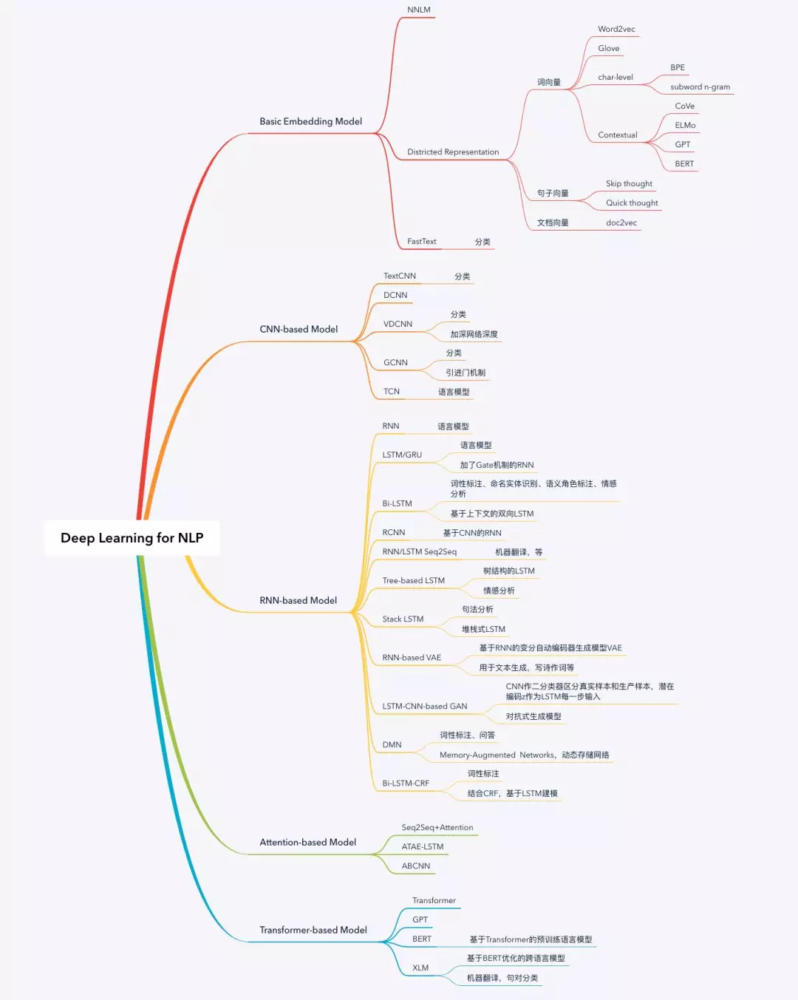

# VGGNet

VGGNet和GoogLeNet是2014年ImageNet竞赛的双雄，这两类模型结构有一个共同特点是采用了更深的网络结构。

231n中对VGGNet的评价：

* **VGGNet**. The runner-up in ILSVRC 2014 was the network from Karen Simonyan and Andrew Zisserman that became known as the [VGGNet](http://www.robots.ox.ac.uk/~vgg/research/very_deep/). Its main contribution was in showing that the depth of the network is a critical component for good performance. Their final best network contains 16 CONV/FC layers and, appealingly, features an extremely homogeneous architecture that only performs 3x3 convolutions and 2x2 pooling from the beginning to the end. Their [pretrained model](http://www.robots.ox.ac.uk/~vgg/research/very_deep/) is available for plug and play use in Caffe. A downside of the VGGNet is that it is more expensive to evaluate and uses a lot more memory and parameters \(140M\). Most of these parameters are in the first fully connected layer, and it was since found that these FC layers can be removed with no performance downgrade, significantly reducing the number of necessary parameters.

## VGGNet结构

VGGNet继承了AlexNet的很多结构，如下图所示。

网络输入是一个固定尺寸224\*224的RGB图像。这里做的唯一预处理是图像需要减去由训练集统计而得到的对应像素的RGB均值。

预处理之后，图像通过一系列卷积层，VGGNet采用的卷积核感受野很小：3\*3（能够包含上、下、左、右邻域信息的最小尺寸）。在其中一组配置中，VGGNet甚至采用了1\*1的卷积核，这是卷积退化成为对输入的线性变换（后面跟一个非线性单元）。卷积步长固定使用1个像素。

一簇卷积层之后是三个全连接层：前两个包含4096个激活单元，第三个对应ILSVRC的1000个分类同样采用1000个激活单元。最后一层是Softmax层。在各组配置中，全连接层的设置都是一致的。

所有的隐层都使用ReLU作为激活函数。在VGGNet的实验中，局部响应归一化（LRN）并没有带来性能的提升，却对计算资源和内存都有很多的消耗。因此除A-LRN这一组配置外，其他都没有采用LRN。具体6组配置如下图。

上图不仅列出了VGGNet实验所采用的几组网络结构配置，其中每一列代表一种配置。这几组配置的主要区别在于不同的网络深度：从A的11个参数层（8层卷积和3层全连接）到E的19个参数层（16层卷积核3层全连接）。卷积层中的特征图数量都相对较少，从第一层的64个，每经过一个最大池化层参数就会翻倍，直到最后的512个。上图的表2列出了各组配置中包含的参数数量，尽管网络深度增加很多，但模型参数并不比有较大卷积感受野和较多特征图的浅层网络多。

## VGGNet特点

### 小卷积核

虽然AlexNet有使用11\*11和5\*5的大卷积，但大多数还是3\*3卷积，对于步长为4的11\*11大卷积核，原图的尺寸很大因而冗余，最为原始的纹理细节的特征变化用大卷积核尽早捕捉到，后面的更深的层数害怕会丢失掉较大局部范围内的特征相关性，后面转而使用更多3\*3的小卷积核（和一个5\*5卷积）去捕捉细节变化

而VGGNet则清一色使用3\*3卷积。因为卷积不仅涉及到计算量，还影响到感受野。前者关系到是否方便部署到移动端、是否能满足实时处理、是否易于训练等，后者关系到参数更新、特征图的大小、特征是否提取的足够多、模型的复杂度和参数量等等。

#### 感受野

直观上来说，感受野越大越可以捕捉到特征。比如MNIST中的数字1和7两张图，只给出1和7的下半部分人眼也不好分辨到底是数字几，但增大感受野后（即可看到的像素区域多了），7的上半部分暴露出来，我们就很好分辨是数字几。其实只要网络层数加深，小感受野也可以达到大感受野捕捉特征的能力。

#### 计算量

在计算量这里，为了突出小卷积核的优势，拿同样conv3\*3、conv5\*5、conv7\*7、conv9\*9和conv11\*11，在224\*224\*3的RGB图上（设pad为1，stride为4，output\_channel为96）做卷积，卷积层的参数规模和得到的特征图的大小如下：

## Source





