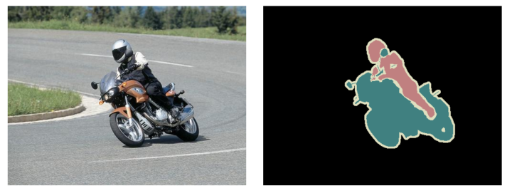
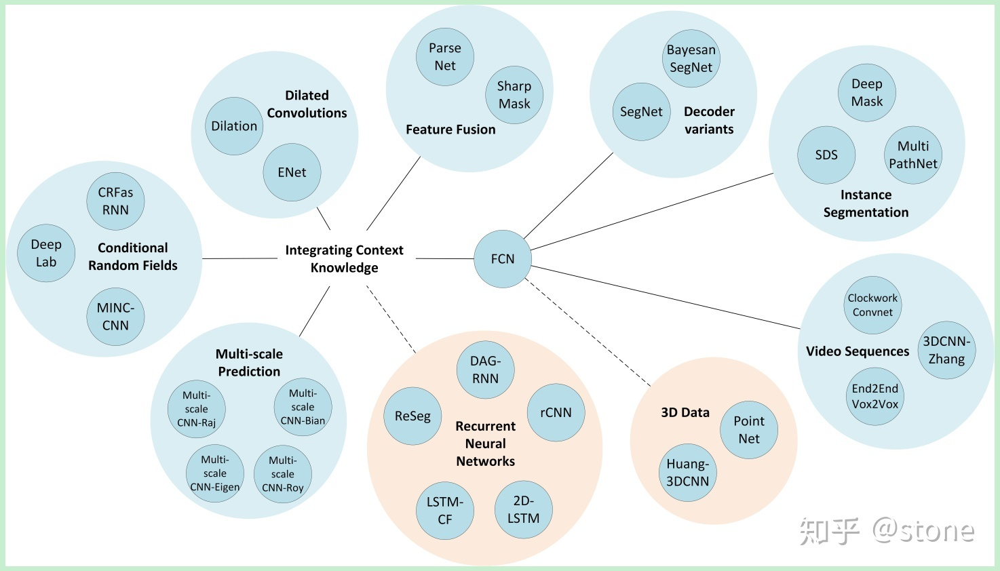
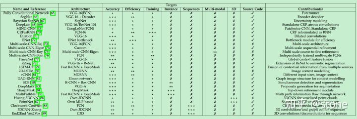

# 语义分割

图像语义分割，顾名思义，就是按照语义对每个像素点进行分类。以下图为例，语义分割问题不仅需要解决这张图片中包含哪些物体，还需要解决每个像素点属于哪个物体。[相关论文与demo](https://github.com/tangzhenyu/SemanticSegmentation_DL)。

近年来，随着深度学习尤其是CNN网络所取得的重大进展，图像语义分割的效果也有了非常大的进步。自从深度学习开始解决图像语义分割问题以来，已经形成了一个基本的流程：

1. 用全卷积神经网络来获取基准的像素分类。
2. 通过CRF/MRF来使用全局信息使得像素分类的准确率进一步提升。

大多数研究的进展都是围绕流程1或/和流程2来不断突破。流程1的代表性方法又FCN、DeconvNet、SegNet、DilatedConvNet、DeepLab等，其中FCN由于其工作的开创性获得了CVPR2015的最佳论文奖；流程2的代表性方法又DeepLab、CRFasRNN、DeepParsing。

语义分割一般只需要解决像素的分类问题，如果一张图片上具有同样种类的多个实例，那么这些像素是不需要再加以区分的，即这些像素将共享同一个标签。如果需要区分每个像素究竟属于哪个实例，那么问题更加复杂。目前用于语义分割研究的两个最重要数据集是[VOC2012](http://host.robots.ox.ac.uk/pascal/VOC/voc2012/)和[MSCOCO](http://cocodataset.org/)。

## 语义分割思路

### 传统方法

在深度学习方法流行之前，TextonForest和基于随机森林分类器等语义分割方法是用得比较多的方法。不过在深度卷积网络流行之后，深度学习方法比传统方法提升了很多，所以这里就不详细讲传统方法了。

### 深度学习方法

深度学习方法在语义分割上得到了巨大成功，深度学习方法解决语义分割问题可以概括为几种思路。下面进行详细介绍。

#### **1.Patch classification**

最初的深度学习方法应用于图像分割就是Patch classification。Patch classification方法，顾名思义，图像是切成块喂给深度模型的，然后对像素进行分类。使用图像块的主要原因是因为全连接层需要固定大小的图像。

#### **2.全卷积方法**

2014年，全卷积网络（FCN）横空出世，FCN将网络全连接层用卷积取代，因此使任意图像大小的输入都变成可能，而且速度比Patch classification方法快很多。

尽管移除了全连接层，但是CNN模型用于语义分割还存在一个问题，就是下采样操作（比如，pooling）。pooling操作可以扩大感受野因而能够很好地整合上下文信息（context中文称为语境或者上下文，通俗的理解就是综合了更多的信息来进行决策），对high-level的任务（比如分类），这是很有效的。但同时，由于pooling下采样操作，使得分辨率降低，因此削弱了位置信息，而语义分割中需要score map和原图对齐，因此需要丰富的位置信息。

#### **3.encoder-decoder架构**

encoder-decoder是基于FCN的架构。encoder由于pooling逐渐减少空间维度，而decoder逐渐恢复空间维度和细节信息。通常从encoder到decoder还有shortcut connetction（捷径连接，也就是跨层连接）。其中U-net就是这种架构很流行的一种，如下图：

#### **4.空洞卷积**

dilated/atrous （空洞卷积）架构，这种结构代替了pooling，一方面它可以保持空间分辨率，另外一方面它由于可以扩大感受野因而可以很好地整合上下文信息。如下图：

#### **5.条件随机场**

除了以上思路，还有一种对分割结果进行后处理的方法，那就是条件随机场\(Conditional Random Fields \(CRFs\)\)后处理用来改善分割效果。DeepLab系列文章基本都采用这种后处理方法，可以较好地改善分割结果，如下图：

## 方法总览

现在的深度学习语义分割模型基本上都是基于FCN发展而来的，它是开山鼻祖，一张图概括FCN的延伸方法：

## 评判标准

对图像语义分割效果的判断一般采用如下几种方式：

（1）全局均值（Global Average）：按像素正确分类的比例计算，这个指标的计算方式简单，容易应用在深度神经网络中。但是它没有考虑不同种类物体的差别，它与人类的认知也有一定的差别。

（2）分类平均准确率（Class Average Accuracy）：所有分类预测准确率的平均值。

（3）交集/并集的均值（Mean Intersection Over Unit，mIoU）：mIoU比分类平均准确率更严格，因为它惩罚了伪正例（False Positive）。但是它的缺点是，交叉熵损失不好直接优化。另外，它只是衡量了像素点正确分类的总数，并没有精确地描述切分边界的准确性。

（4）语义轮廓得分（Semantic Contour Score）：在给定容忍距离的情况下，计算预测边界和真实边界的F1-measure。语义轮廓得分和mIoU组合的方式与人类的认知最接近。

## Source





