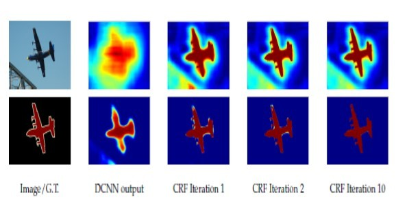

# CRFasRNN

最开始使用DenseCRF是直接加在FCN的输出后面，可想这样是比较粗糙的。而且在深度学习中，我们都追求end-to-end的系统，所以CRFasRNN这篇文章将DenseCRF真正结合进了FCN中。

这篇文章也使用了平均场近似的方法，因为分解的每一步都是一些相乘相加的计算，和普通的加减（具体公式还是看论文吧），所以可以方便的把每一步描述成一层类似卷积的计算。这样即可结合进神经网络中，并且前后向传播也不存在问题。

当然，这里作者还将它进行了迭代，不同次数的迭代得到的结果优化程度也不同（一般取10以内的迭代次数），所以文章才说是as RNN。优化结果如下：

## Source



