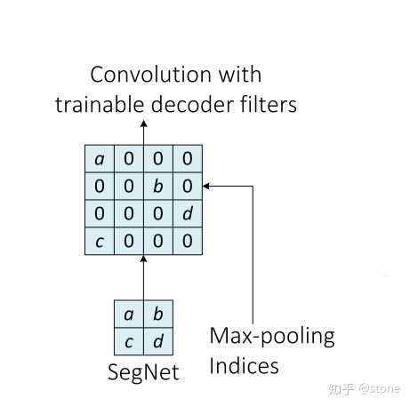

# SegNet

与FCN和DeconvNet基本同时期，剑桥大学提出SegNet，它也采用全卷积神经网络来解决图像语义分割问题。SegNet的网络结构如下图所示。编码网络由VGGNet16的前13个卷积层构成。初始化训练时采用了ImageNet数据集。为了保留图片的高分辨率，在内存一定的情况下去除了全连接层，参数数量大幅下降（134M -&gt;14.7M）。每个解码层都与一个编码层相对应，所以解码层也有13层。解码层的输出连着一个多分类的Softmax分类器。[线上demo](http://mi.eng.cam.ac.uk/projects/segnet/demo.php#demo)。

在SegNet中也采用Unpooling来进行解码。在解码阶段重用Max-Pooling参数的好处是：（1）提升了边界的描述能力；（2）减少了端到端训练的参数数量；（3）这种类型的上采样可以应用到任何编码-解码的结构中。另外，SegNet并没有使用反卷积层，而是使用了卷积层。maxpooling 的indices复制原理如下：

与FCN和DeconvNet相比，SegNet减少了原来分类网络中的全连接层，内存消耗和计算时间都有优势。由于参数数量的减少，采样SegNet比较容易实现端到端的训练。

## Source



