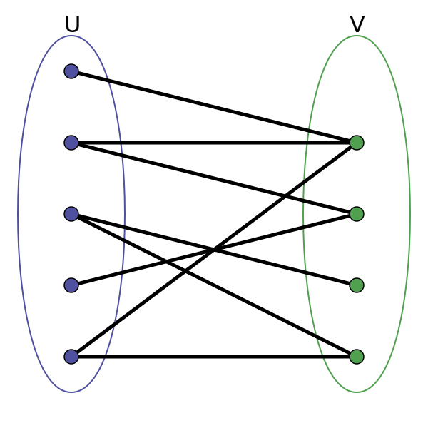

# 图谱&网络

## **现状与初衷**

**现在主流的知识图谱应用基本都是经过图谱的表示学习后，再代入神经网络进行相关任务计算。**所以现在大家的关注点都在如何进行Network Embedding\(Graph Embedding\)上。在探索怎样才能将图谱信息数字化/量化成 $$n$$ 维向量后，尽可能保证节点、链接和属性信息，即网络局部结构、全局结构、时序信息...

然而将图谱转化成向量，做到完美也不可避免的会损失掉部分信息，只能做到尽可能的保留重要信息。但是对于不同的场景\(搜索引擎、社交网络、电商网络...\)以及不同的后续任务\(搜索、推荐...\)，特征信息的重要程度是不一致的，但是都采用相同的数字化/量化\(Graph Embedding\)方法，这是不合理的。

上图是[GATNE](https://github.com/THUDM/GATNE)论文列出的针对不同类型网络的不同Embedding方法。比如不同场景相同任务，微信/微博给账号推文章 vs 淘宝/京东给账号推商品，都是推荐任务，且都是账号、物料\(文章/商品\)两种类型Node，可以采用单边 - \[阅读 vs 购买\] 或 多边 - \[\(阅读、转发、点赞...\) vs \(浏览、加购物车、购买...\)\]；相同场景不同任务，淘宝给账号返回搜索结果 vs 返回推荐结果。这些任务涉及的一个用户账号都采用同一种方法产生的同一个向量进行计算，如果Embedding方法十分完美，可以保留几乎全部信息，那不会存在问题。**但只要进行映射\(Network/Graph Embedding\)，肯定有信息损失，所以我在这里探究不进行Graph Embedding，直接将图谱与神经网络的融合，来尝试解决不同场景下的不同任务。**

## 启发与探索

总体思路简单来说，每个节点就是神经网络里的一个神经元，是一个函数 $$f(x)$$ ，而非向量。将 $$f(x)$$ 理解为激活函数，各节点链接相当于非随机的drop-out，整个网络就是一个类深度学习的神经网络，且更贴近人脑结构。

因为不像常规深度学习的网络有一层到深层逐步的顺序计算，有全链接层和输出层，所以只能称为类深度学习的神经网络。总体思路分为三步：

1. 通过已有真实网络学习出各节点的 $$f(x)$$ 
2. 利用学习得到的各节点 $$f(x)$$ 模拟构造真实网络
3. 基于真实网络和模拟构造网络的不同解决相关问题

到这里同学们可能非常困惑，有两个关键问题：

* 怎么学习得到各节点 $$f(x)$$ ？按我的描述，算法又没有定向输出，Loss怎么定？
* 这个到底怎么用，能解决什么问题？

我这里先对优化约束作解释，我们的约束是基于网络性质的启发式：

* _Small-world性质：_平均路径长度 $$\mu_L$$大小和 $$n$$\(网络中节点数\)对数比例相关
* _Clustering effect：_如果两个节点有相同邻居，那么这两个节点链接的概率高
* _Scale-free性质\(幂定律分布\)：_ 大多数节点有很少的度\(边\)，而小部分节点有很大的度\(边\)

换成易于理解的解释即：

* _Small-world性质：_真实网络的平均路径长度我们是可以计算得到的，我们模拟构造的网络平均路径长度要和真实的一致或接近。当我们将平均路径长度这个参数降低时，网络内会有新的链接生成，这些新生成的链接其实就是我们想用于解决推荐问题的边
* _Clustering effect：_我们生成模拟网络时，节点 $$a$$ 与全部 $$N-1$$ 个节点\(刨除节点 $$a$$ 自链接\)是否有链接，理论上应该算 $$N-1$$ 个概率后判断应该与哪些相连。我们的候选集基于clustering effect性质，不再需要计算全部 $$N-1$$ 个，相当于使用协同过滤方法
* _Scale-free性质\(幂定律分布\)：_幂定律即少量的节点有很多的链接，大量的节点有很少的链接。以电商场景为例，在淘宝购物越多的账号，他下一次进行购物概率要比基本不在淘宝购物的账号要高；以社交场景举例，从两个方面来看：1、有10000粉丝的号，粉丝变成10001的概率要比有100粉丝的号，粉丝变成101的概率要大；2、关注了1000个账号的账号，关注第1001个账号的概率要比关注10个账号，再关注第11个的概率要大

简单解释了启发式思想。我们针对技术商业化最重要的推荐任务展开。

* 暂且讨论的任务不涉及重复性推荐\(比如电商场景中用户重复购买消耗品的行为\)，只讨论新物料推荐问题\(用户并未与候选物料建立过链接\)，即重点讨论新链接的生成，不讨论旧链接权重变化。
* 更进一步来说，因为大部分推荐任务是非同类型推荐，而且我现在在做广告推荐，所以我们更关注类似于二分图的推荐\(给用户推荐文章/商品/广告等，推荐Node和被推荐Node类型不一致\)。对于给用户账号推荐感兴趣账号，可以直接基于启发思想的算法解决。

### 任务剖析

二分图\(Bipartite Graph\)如下图，Node可以被分为两个不同的集合空间，在实际场景中， $$U$$ 集合空间为用户， $$V$$ 为推荐内容\(文章/商品/广告等\)。**但是我们的实际场景并非纯二分图，二分图两个子集内的顶点不相邻。业务场景下子集合内的Node是相邻的，比如用户之间关注链接关系，商品之间都是同品牌的链接关系等。**

看到很多文章解读[阿里的EGES](https://arxiv.org/pdf/1803.02349.pdf)，但很少从二分图的角度去看待，EGES其实是个很典型的内含二分图思维的方法 --- 如何表示 $$V$$ 集合空间\(商品\)中的点？根据 $$U$$ 集合空间\(用户\)的链接去表示。因为我们想解决的问题，就是业务场景下推荐问题，对于知识图谱领域下的链接预测问题\(计算 $$U$$ 集合空间里某个点和 $$V$$ 集合空间某个点链接概率\)。这里EGES就不做过多展开了，只是简述我们的推荐应用场景。

### 启发应用

#### Small-word性质

Small-word性质\(6度理论\)适用于 $$U$$ 集合空间。对于 $$V$$ 集合空间来说，物料属性是固定的，可根据不同粒度/维度属性将 $$v\in V$$关联起来，比如 华为p40 - 苹果iPhoneX\(手机\)，苹果iPhoneX - 苹果AirPods\(品牌\)...

那么对于 $$U+V$$ 空间来说：

* Local：原本 $$u_a -u_b-u_c \to v_i$$ ，表示用户 $$u_a$$ 到 $$v_i$$ 的距离，Local平均路径降低后， $$u_a$$ 可能直接和 $$u_c$$ 建立链接，即变为 $$u_a - u_c \to v_i$$ 。即闺蜜从李佳琦那边了解到某色号推荐给我女朋友，现在我女朋友直接看李佳琦直播间...
* Global：原本 $$u_a -u_b-u_c \to v_i$$，表示用户 $$u_a$$ 到 $$v_i$$ 的距离，Global平均路径降低后， $$u_b$$ 可能直接和 $$v_i$$ 建立链接，即变为 $$u_a - u_b \to v_i$$ 。即淘宝今年GMV再创新高，客单价不变的情况下\(用户群固定即消费能力固定\)，每人购买的东西多了， 两集合空间链接多了。

#### Clustering effect

对于 $$U$$ 集合空间，存在账号实际相邻关系\(比如相互关注链接\)，但这个实际相邻关系只是我们想要结构的一部分，可理解为Local Structure。还有Global Structure，比如通过 $$u_a - u_b \to v_k$$ 路径给用户 $$a$$ 推物料 $$k$$ ，为什么给他推 $$k$$ 呢？因为和他相似的用户 $$b$$ 和物料 $$k$$ 有链接，这里的 $$u_a - u_b$$ 链接即Global Structure，用户 $$a$$ 和 $$b$$ 现实中没有联系，只是我们计算出了他们在 $$U$$ 集合空间中是相似的。

* Local Structure\(实际相邻\) - 两人是公司内在一个组的同事
* Global Structure\(计算相似\) - 两人是同行，不认识但都负责推荐算法

举个简单例子吧，我想囤猫粮，淘宝推给我哪款猫粮我购买的概率最高呢？Local&Global相交行为的概率最高：我两个养猫的同事分别买了A和B猫粮，淘宝计算和我购物行为相似的用户购买了B和C猫粮，通常情况下，我买B猫粮的概率最大。

