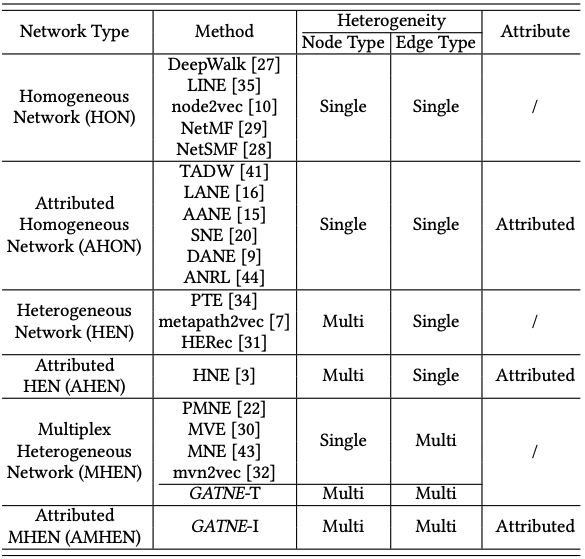

# 真·图神经网络

标题加个“真“的意思是本文针对图和神经网络的融合做了探索，而非现在主流的图+神经网络拼接形式。**现在主流的图+神经网络基本都是经过图表示学习后代入神经网络进行计算**，比如先进行DeepWalk将节点序列作为目标节点的表示，或基于拉普拉斯矩阵和傅立叶变换做节点表示等

本篇所探究的是图与神经网络的融合，每个节点就是神经网络里的一个神经元，是一个函数 $$f(x)$$ ，而非向量等，将 $$f(x)$$ 理解为激活函数，各节点链接相当于非随机的drop-out，整个网络就是一个类深度学习的神经网络。因为不像常规深度学习的网络有一层到深层逐步的顺序计算，有全链接层和输出层，所以只能称为类深度学习的神经网络。总体思路分为三步：

1. 通过已有真实网络学习出各节点的 $$f(x)$$ 
2. 利用学习得到的各节点 $$f(x)$$ 模拟构造真实网络
3. 基于真实网络和模拟构造网络的不同解决相关问题

到这里同学们可能非常困惑，有两个关键问题：

* 怎么学习得到各节点 $$f(x)$$ ？按我的描述，算法又没有定向输出，Loss怎么定？
* 这个到底怎么用，能解决什么问题？

我这里先对优化约束作解释，我们的约束是基于网络性质的启发式：

* **Small-world性质：**平均路径长度 $$\mu_L$$大小和 $$n$$\(网络中节点数\)对数比例相关： $$\mu_L \propto \log\ n$$ 
* **Clustering effect：**如果两个节点有相同邻居，那么这两个节点链接的概率高
* **Scale-free性质\(幂定律分布\)：** 绝大多数节点有很少量的度\(边\)，而小部分节点有很大的度\(边\)。一个节点有 $$k$$ 度的概率： $$f(k) \propto k^{-\gamma}$$ 。log-log图上为一条直线： $$\log f(k) = \log(\alpha k^{-\gamma})=-\gamma \log k\ +\ \log\alpha $$ 

换成易于理解的解释即：

* **Small-world性质：**真实网络的平均路径长度我们是可以计算得到的，我们模拟构造的网络平均路径长度要和真实的一致或接近。
* **Clustering effect：**我们生成模拟网络时，节点 $$a$$ 与全部 $$N-1$$ 个节点\(刨除节点 $$a$$ 自链接\)是否有链接，理论上应该算 $$N-1$$ 个概率后判断应该与哪些相连。我们的候选集

  基于clustering effect性质，不再需要计算全部 $$N-1$$ 个。

* **Scale-free性质\(幂定律分布\)：**幂定律即少量的节点有很多的链接，大量的节点有很少的链接。从两个方面来看\(以社交网络举例\)：1、有10000粉丝的号，粉丝变成10001的概率要比有100粉丝的号，粉丝变成101的概率要大；2、关注了1000个账号的账号，关注第1001个账号的概率要比关注10个账号，再关注第11个的概率要大。

简单解释了优化约束，下面我阐述问题，关于动态网络，我们更关注节点间新增链接及新增节点

