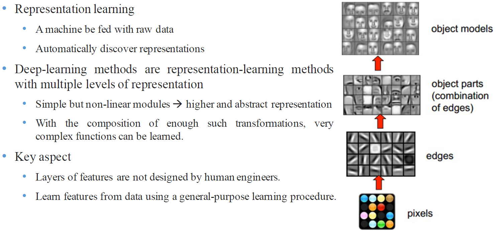

# 深度学习

这里先以三位大佬\(Yann LeCun, Yoshua Bengio & Geoffrey Hinton\)15年在《Nature》的文章简单介绍：

> Deep learning allows computational models that are composed of multiple processing layers to learn representations of data with multiple levels of abstraction. These methods have dramatically improved the state-of-the-art in speech recognition, visual object recognition, object detection and many other domains such as drug discovery and genomics. Deep learning discovers intricate structure in large data sets by using the backpropagation algorithm to indicate how a machine should change its internal parameters that are used to compute the representation in each layer from the representation in the previous layer. Deep convolutional nets have brought about breakthroughs in processing images, video, speech and audio, whereas recurrent nets have shone light on sequential data such as text and speech.

模式识别或者说机器学习最大的痛点就是处理原始数据的能力，说白了就是特征工程部分艰难，既耗时还必须需要专业经验知识指导。我们需要：1、从感受器\(麦克风等\)获得原始数据；2:、进行数据预处理\(降噪等\)；3、特征提取；4、特征选择；5、进行预测或识别

相较而言，深度学习是一种表示学习\(Representation Learning\)，即可以直接将原始数据喂给深度学习模型，模型会自动发掘特征表达。简单的非线性结构组合即可学得高级抽象特征表达，且如果组合足够，可以学的任何复杂函数映射（[万能近似定理\(Universal approximation theorem\)](https://en.wikipedia.org/wiki/Universal_approximation_theorem)）。所以，深度学习可以避免大量的特征工程工作，而且只用通用学习结构即可。

## 监督学习\(Supervised learning\)

大部分的机器学习、深度学习等都是监督学习。比如我们要给样本分类，根据模型计算出来的每个样本对应类别的值，将最高值对应的类别赋给这个样本。我们首先设计目标函数或叫损失函数来衡量预测值与真实值间的错误或距离，然后模型调整参数减少这个错误或距离。

#### 随机梯度下降

在实践中，大多数从业者使用称为随机梯度下降（SGD）的方法。这包括

1、显示几个示例的输入向量，计算输出和误差，计算这些示例的平均梯度，以及相应地调整权重。

2、对于来自训练集的许多小例子，重复该过程，直到目标函数的平均值停止减小。它被称为随机因为每个小的例子给出了对所有例子的平均梯度的噪声估计。

与更精细的优化技术相比，这种简单的程序通常能够以惊人的速度快速找到一组良好的权重。在训练之后，系统的性能在称为测试集的不同示例集上测量。这有助于测试机器的泛化能力 - 它能够在训练期间从未见过的新输入产生合理的答案。

#### 线性分类器或浅层分类器vs.深度学习

对于一些问题，线性分类器或者浅层分类器得不到好的效果。比如图片分类，线性分类器不好解决非线性问题，使用核函数可以解决一部分但效果也比较一般。而深度学习可以解决这些问题。

## 多层结构中的反向传播\(Backpropagation to train multilayer architectures\)

计算目标函数在多层模块权重的梯度的反向传播只不过是链式规则的实际应用。关键的点是目标的导数（或梯度）对于每模块的输入可以通过相对于该模块的输出（或后续模块的输入）从梯度向后工作来计算

### 链式法则

### 多层结构

### 前馈传播

### 反向传播

## Source





