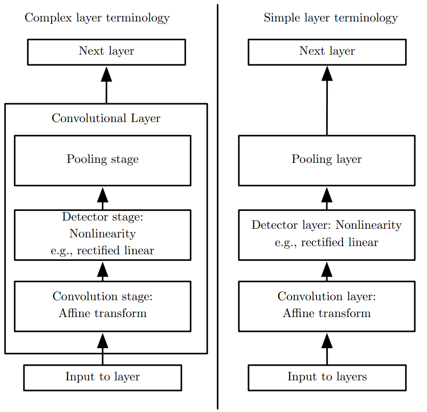

# 池化

卷积网络中一个典型层包含三级，如下图所示。在第一级中，这一层并行地计算多个卷积产生一组线性激活响应。在第二级中，每一个线性激活响应将会通过一个非线性的激活函数，例如整流线性激活函数ReLU，这一级有时也被称为探测级。在第三级中，我们使用池化函数来进一步调整这一层的输出。

池化函数使用某一位置的相邻输出的总体统计特征来代替网络在该位置的输出。例如，最大池化函数给出相邻矩形区域内的最大值。其他常用的池化函数包括相邻矩阵内的平均值、 $$L^2$$ 范数以及基于中心像素距离的加权平均函数。

不管采用什么样的池化函数，当输入作出少量平移时，池化能够帮助输入的表示近似不变。

