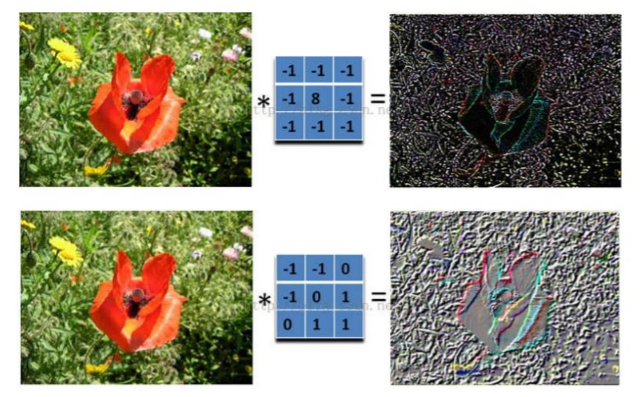

# 卷积运算

对图像（不同的数据窗口数据）和滤波矩阵（一组固定的权重：因为每个神经元的多个权重固定，所以又可以看做一个恒定的滤波器filter）做内积（逐个元素相乘再求和）的操作就是所谓的“卷积”操作，也是卷积神经网络的名字来源。

非严格意义上来讲，下图中红框框起来的部分便可以理解为一个滤波器，即带着一组固定权重的神经元。多个滤波器叠加便成了卷积层。

在下图对应的计算过程中，输入是一定区域大小\(width\*height\)的数据，和滤波器filter（带着一组固定权重的神经元）做内积后等到新的二维数据。具体来说，左边是图像输入，中间部分就是滤波器filter（带着一组固定权重的神经元），不同的滤波器filter会得到不同的输出数据，比如颜色深浅、轮廓。相当于如果想提取图像的不同特征，则用不同的滤波器filter，提取想要的关于图像的特定信息：颜色深浅或轮廓。

## 卷积运算过程

比如下图，图中左边部分是原始输入数据，图中中间部分是滤波器filter，图中右边是输出的新的二维数据

上图中，中间滤波器filter（卷积核）与数据窗口做内积，计算过程为

              $$4*0+0*0+0*0+0*0+0*1+0*1+0*0+0*1+-4*2=-8$$ 

### 相关参数

在CNN中，滤波器filter（带着一组固定权重的神经元）对局部输入数据进行卷积计算。每计算完一个数据窗口内的局部数据后，数据窗口不断平移滑动，直到计算完所有数据。这个过程中，有这么几个参数：

* 内核大小：即卷积核\(滤波器filter\)大小，定义了卷积的视野。二维常见的选择是 $$3*3$$ 或 $$5*5$$ 。
* 深度：神经元个数，决定输出的深度厚度。同时代表卷积核\(滤波器filter\)数量。
* 步长：步幅定义了遍历图像时内核移动的步长，即运算完后移动多少。
* 填充：定义样本的边框如何处理。

### 运算过程

cs231n课程中的经典卷积动图如下，清晰描述了卷积的运算过程：左边为输入（7_7_3中，7\*7代表图像的像素/长宽，3代表R、G、B 三个颜色通道）。最右边是两个不同的输出（绿色）。这个例子里内核大小为 $$3*3$$ ，深度为 $$2$$ （分别为下图中两个红色Filter w0和w1\(每个各三个因为RGB三颜色通道\)），步长为 $$2$$ （每次移动 $$2$$ 个单位），填充为 $$1$$ （即图中原数据四周灰色填 $$0$$ 区域）。

随着左边数据窗口的平移滑动，滤波器Filter w0 / Filter w1对不同的局部数据进行卷积计算。具体运算以第一个输出为例（两个输出上面的那个中左上第一项 $$1$$ 如何来的）：当前卷积核w1与每个维度数据第一个局部区域做内积，然后三个内积相加，最后加偏置项记为对应输出，如下图所示：

0维：$$1*0+1*0+(-1)*0+(-1)*0+0*0+1*1+(-1)*0+(-1)*0+0*1=1$$ 

1维： $$(-1)*0+0*0+(-1)*0+0*0+0*1+(-1)*1+1*0+(-1)*0+0*2=-1$$ 

2维： $$0*0+1*0+0*0+1*0+0*2+1*0+0*0+(-1)*0+1*0=0$$ 

求和加偏置项b0： $$1+(-1)+0+1=1$$ 

值得一提的是：

1、左边数据在变化，每次滤波器都是针对某一局部的数据窗口进行卷积，这就是所谓的CNN中的**局部感知机制**。打个比方，滤波器就像一双眼睛，人类视角有限，一眼望去，只能看到这世界的局部。如果一眼就看到全世界，你会累死，而且一下子接受全世界所有信息，你大脑接收不过来。当然，即便是看局部，针对局部里的信息人类双眼也是有偏重、偏好的。比如看美女，对脸、胸、腿是重点关注，所以这3个输入的权重相对较大。

2、数据窗口滑动，导致输入在变化，但中间滤波器Filter w0的权重（即每个神经元连接数据窗口的权重）是固定不变的，这个权重不变即所谓的CNN中的**参数（权重）共享机制**。再打个比方，某人环游全世界，所看到的信息在变，但采集信息的双眼不变。btw，不同人的双眼 看同一个局部信息 所感受到的不同，即一千个读者有一千个哈姆雷特，所以不同的滤波器 就像不同的双眼，不同的人有着不同的反馈结果。

## 不同卷积类型

## Source







{% embed url="https://www.jiqizhixin.com/articles/a-deeper-understanding-of-nnets?from=synced&keyword=%E5%8D%B7%E7%A7%AF%20%E5%8A%A8%E5%9B%BE" %}

