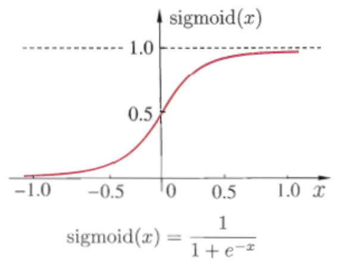

# 基于梯度的学习

神经网络的非线性导致大多数我们感兴趣的代价函数都变得非凸，这意味着神经网络的训练通常使用迭代的、基于梯度的优化，仅仅使得代价函数到到一个非常小的值；而不是像用于训练线性回归模型的线性方程求解器，或者用于训练逻辑回归或SVM的凸优化算法那样保证全局收敛。

## 代价函数

深度神经网络设计中的一个重要方面是代价函数的选择。在大多数情况下，参数模型定义了一个分布 $$p(y|x;\theta)$$ 并且简单地使用最大似然原理。这意味着我们可使用训练数据和模型预测间的交叉熵作为代价函数。有时，我们使用一个更简单的方法，不是预测 $$y$$ 的完整分布，而是仅仅预测在给定 $$x$$ 的条件下 $$y$$ 的某些统计量。用于训练神经网络的完整的代价函数，通常在我们这里描述的基本代价函数的基础上结合一个正则项。

### 最大似然学习条件分布

大多数现代的神经网络使用最大似然来训练。这意味着代价函数就是负的对数似然，它与训练数据和模型分布间的交叉熵等价。这个代价函数表示为

                                                  $$J(\theta)=-\mathbb{E}_{x,y\sim\hat{p}_{data}}\log p_{model}(y|x)$$ 

代价函数的具体形式随着模型而改变，取决于 $$\log p_{model}$$ 的具体形式。上述方程的展开形式通常会有一些项不依赖于模型的参数，我们可以舍去。例如，如果 $$p_{model}(y|x)=\mathcal{N}(y;f(x;\theta),I)$$ ，那么我们就重新得到了均方差代价

                                           $$J(\theta)=\frac{1}{2}\mathbb{E}_{x,y\sim\hat{p}_{data}}||y-f(x;\theta)||^2+const$$ 

至少系数 $$\frac{1}{2}$$ 和常数项不依赖于 $$\theta$$ 。舍弃的常数是基于高斯分布的方差，在这种情况下，我们选择不把它参数化。之前，我们看到了对输出分布的最大似然估计和对线性模型均方误差的最小化之间的等价性，但事实上，这种等价性并不要求 $$f(x;\theta)$$ 用于预测高斯分布的均值。

使用最大似然来导出代价函数的方法的一个优势是，它减轻了为每个模型设计代价函数的负担。明确一个模型 $$p(y|x)$$ 则自动地确定了一个代价函数 $$\log p(y|x)$$ 。

贯串神经网络设计的一个反复出现的主题是代价函数的梯度必须足够的大和具有足够的预测性，来为学习算法提供一个好的指引。饱和（变得非常平，比如sigmoid的两边）的函数破坏了这一目标，因为它们把梯度变得非常小。这在很多情况下都会发生，因为由于产生隐藏单元或者输出单元的输出的激活函数会饱和。负的对数似然帮助我们在很多模型中避免了这个问题。很多输出单元都会包含一个指数函数，这在它的变量取绝对值非常大的负值时会造成饱和。负对数似然代价函数中的对数函数消除了某些输出单元中的指数效果。

用于实现最大似然估计的交叉熵代价函数有一个不同寻常的特性，那就是当它被应用于实践中经常遇到的模型时，它通常没有最小值。对于离散型输出变量，大多数模型以一种特殊的形式来参数化，即它们不能表示概率零和一，但是可以无限接近。逻辑回归是其中一个例子。对于真实的输出变量，如果模型可以控制输出分布的密度（例如，通过学习高斯输出分布的方差参数），那么它可能对正确的训练集输出赋予极其高的密度，这将导致交叉熵趋向负无穷。

### 学习条件统计量

有时我们并不是想学习一个完整的概率分布 $$p(y|x;\theta)$$ ，而仅仅是想学习在给定 $$x$$ 时 $$y$$ 的某个条件统计量。例如，我们有一个预测器 $$f(x;\theta)$$ ，想用它来预测 $$y$$ 的均值。如果使用一个足够强大的神经网络，我们可以认为这个神经网络能够表示一大类函数中的任何一个函数 $$f$$ ，这个类仅仅被一些特征所限制，例如连续性和有界，而不是具有特殊的参数形式。从这个角度来看，我们可以把代价函数看作一个泛函，而不仅仅是一个函数。泛函是函数到实数的映射。因此我们可以将学习看作选择一个函数，而不仅仅是选择一组参数。可以设计代价泛函在我们想要的某些特殊函数处取得最小值。例如，我们可以设计一个代价泛函，使它的最小值处于一个特殊的函数上，这个函数将 $$x$$ 映射到给定 $$x$$ 时 $$y$$ 的期望值。对函数求解优化可以使用变分法。我们使用变分法可以导出下面两个结果：

第一个结果是优化问题： $$f^*=\mathop{\arg\max}\limits_f\mathbb{E}_{x,y\sim p_{data}}||y-f(x)||^2$$ 得到 $$f^*=\mathbb{E}_{y\sim p_{data}(y|x)}[y]$$ 

要求这个函数处在我们要优化的类里。换句话说，如果我们能够用无穷多的、来源于真实的数据生成分布的样本进行训练，最小化均方误差代价函数将得到一个函数，它可以用来对每个 $$x$$ 的值预测出 $$y$$ 的均值。

第二个变分法结果是： $$f^*=\mathop{\arg\max}\limits_f\mathbb{E}_{x,y\sim p_{data}}||y-f(x)||_1$$ 

将得到一个函数可以对每个 $$x$$ 预测 $$y$$ 取值的中位数，只要这个函数在我们要优化的函数族里。这个代价函数通常被称为平均绝对误差。

可惜的是，均方误差和平均绝对误差在使用基于梯度的优化方法时往往成效不佳。一些饱和的输出单元当结合这些代价函数时会产生非常小的梯度。这就是交叉熵代价函数比均方差或者平均绝对误差更受欢迎的原因之一，即使是在没必要估计整个 $$p(y|x)$$ 分布时。

## 输出单元

代价函数的选择与输出单元的选择紧密相关。大多数时候，我们简单地使用数据分布和模型分布间的交叉熵。选择如何表示输出决定了交叉熵函数的形式。我们假设前馈网络提供了一组定义为 $$h=f(x;\theta)$$ 的隐藏特征。输出层的作用是随后对这些特征进行一些额外的变换来完整整个网络必须完成的任务。

### 用于高斯输出分布的线性单元

一种简单的输出单元是基于仿射变换的输出单元，放射变换不具有非线性。这些单元往往被直接称为线性单元。给定特征 $$h$$ ，线性输出单元层产生一个向量 $$\hat{y}=W^Th+b$$ 。线性输出层经常被用来产生条件高斯分布的均值：

                                                                  $$p(y|x)=\mathcal{N}(y;\hat{y},I)$$ 

最大化其对数似然此时等价于最小化均方误差。最大似然框架也使得学习高斯分布的协方差矩阵更加容易，或更容易地使高斯分布的协方差矩阵作为输入的函数。然而，对于所有输入，协方差矩阵都必须被限定成一个正定矩阵。线性输出层很难满足这种设定，所以通常使用其他的输出单元来对协方差参数化。

因为线性单元不会饱和，所以它们易于采用梯度的优化算法，甚至可以使用其他多种优化算法。

### 用于伯努利输出分布的sigmoid单元

许多任务需要预测二值型变量 $$y$$ 的值。具有两个类的分类问题可以归结为这种形式。

此时最大似然的方法是定义 $$y$$ 在 $$x$$ 条件下的伯努利分布。伯努利分布仅需单个参数来定义。神经网络只需要预测 $$P(y=1|x)$$ 即可。为了使这个数是有效的概率，它必须处在区间 $$[0,1]$$ 中。

为了满足该约束条件需要一些细致的设计工作。假设我们打算使用线性单元，并且通过阈值来限制它成为一个有效的概率：

                                               $$P(y=1|x)=\max\{0,\min\{1,w^Th+b\}\}$$ 

这的确定义了一个幼小的条件概率分布，但我们无法使用梯度下降来高效地训练它。当 $$w^Th+b$$ 处于单位区间外时，模型的输出对其参数的梯度都将为 $$0$$ 。梯度为 $$0$$ 通常是有问题的，因为学习算法对于如何改善相应参数不再具有指导意义。

相反，最好是使用一种新的方法来保证无论如何模型给出了错误答案时，总能有一个较大的梯度。这种方法是基于使用sigmoid输出单元结合最大似然来实现的。sigmoid输出单元定义为：

                                                                        $$\hat{y}=\sigma(w^Th+b)$$ 

这里 $$\sigma$$ 即logistic sigmoid函数：

                                                                          $$\sigma = \frac{1}{1+\exp(-x)}$$ 

我们可以认为sigmoid输出单元具有两个部分。首先，它使用一个线性层来计算 $$z = w^Th+b$$ 。其次，它使用sigmoid激活函数将 $$z$$ 转化成概率。

### 用于多项输出分布的softmax单元

任何时候，当我们想要表示一个具有 $$n$$ 个可能取值的离散型随机变量的分布时，都可以使用softmax函数

softmax函数的形式为

                                                              $$softmax(z)_i=\frac{\exp(z_i)}{\sum\limits_j^N\exp(z_j)}$$ 

当使用最大化对数似然训练softmax来输出目标值 $$y$$ 时，使用指数函数工作地非常好。在这种情况下，我们想要最大化 $$\log P(y=i;z)=\log softmax(z)_i$$ 。将softmax定义成指数的形式是很自然的，因为对数似然中的 $$\log$$ 可以抵消softmax中的 $$\exp$$ ：

                                                      $$\log softmax(z)_i=z_i-\log\sum\limits_j\exp(z_j)$$ 

上式中的第一项表示输入 $$z_i$$ 总是对代价函数有直接的贡献。因为这一项不会饱和，所以即使 $$z_i$$ 对上式的第二项的贡献很小，学习依然可以进行。当最大化对数似然时，第一项鼓励 $$z_i$$ 被推高，而第二项则鼓励所有的 $$z$$ 被压低。

### 其他的输出类型

之前描述的线性、sigmoid、softmax输出单元是最常见的。神经网络可以推广到我们希望的几乎任何种类的输出层。最大似然原则给如何为几乎任何种类的输出层设计了一个好的代价函数提供了指导。

