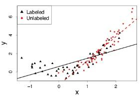
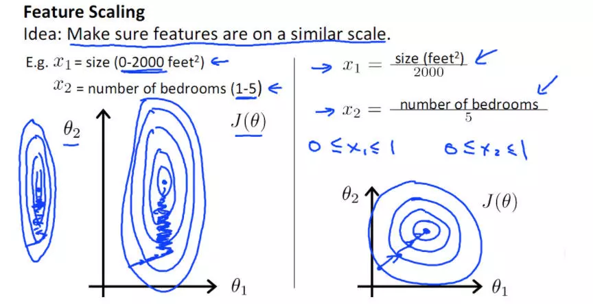
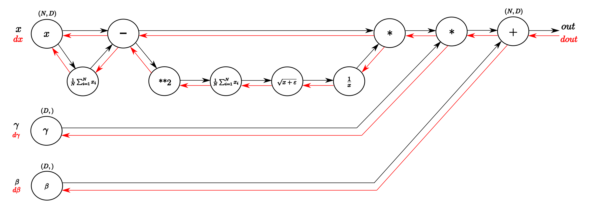

# 标准化

Normalization，即标准化，和普通的数据标准化类似，是将分散的数据统一的一种做法，也是优化神经网络的一种方法。Normalization可以将数据统一规格，能让机器学习更容易学习到数据之中的规律。

如果我们仅仅停留在使用Normalization上，那么现成的框架只需要一行就可以添加到模型中。我们真正想知道的是，隐藏在BN的背后深度学习的问题，以及这样简单的操作是如何奏效的。

## 深度学习的Normalization具体做什么

由于有多种Normalization的方法，如Batch Normalization（BN），Layer Norm（LN），Weight Norm（WN），Cosine Norm\(CN\)等，我这里以最经典的Batch Normalization为例说明Normalization到底是做的什么操作。需要知道的是，BN可以在激活函数 $$\sigma$$ 之前，也可以在 $$\sigma$$ 之后。 有如下图的神经网络：

我们定义 $$z_1^2$$ ： $$z_1^2 = w_{11}^2x_1+w_{12}^2x_2+w_{13}^2x_3+b_1^2$$ 

因此有： $$a_1^2=\sigma(z_1^2)=\sigma(w_{11}^2x_1+w_{12}^2x_2+w_{13}^2x_3+b_1^2)$$ 

我们做的BN，就是对 $$z_1^2$$ 进行标准化。假设Batch Size是1000，那么就会有1000个 $$z_1^2$$ ，我们对这1000个 $$z_1^2$$ 求标准化，使得这1000个值满足均值为0，标准差为1的高斯分布。然后进行激活，激活后的值，继续前向传播。这就是BN的过程，很简单。

我们再举一个例子，形象地说明做Normalization的好处。我们知道，在神经网络中, 数据分布对训练会产生影响. 比如某个神经元 $$x$$ 的值为 $$1$$ ，某个 $$W$$ 的初始值为 $$0.1$$ ，这样后一层神经元计算结果就是 $$Wx=0.1$$ ；又或者 $$x=20$$ ，这样 $$Wx$$ 的结果就为 $$2$$ 。现在还不能看出什么问题，但是，当我们加上一层激励函数，激活这个 $$Wx$$ 值的时候，问题就来了。如果使用像tanh的激活函数， $$Wx$$ 的激活值就变成了 $$\sim0.1$$ 和 $$\sim 1$$ ，接近于 $$1$$ 的部分已经处在了激活函数的饱和阶段，也就是如果 $$x$$ 无论再怎么扩大，tanh激活函数输出值也还是接近 $$1$$ 。换句话说，神经网络在初始阶段已经不对那些比较大的 $$x$$ 特征范围敏感了。这样很糟糕，想象我轻轻拍自己的感觉和重重打自己的感觉居然没什么差别，这就证明我的感官系统失效了。当然， $$x$$ 不仅可以是输入层，在隐含层也可能出现这样的情况。

通过下图我们可以看到BN的效果：

之前说过，计算结果在进入激活函数前的值很重要，如果我们不单单看一个值，我们可以说，计算结果值的分布对于激活函数很重要。对于数据值大多分布在这个区间的数据，才能进行更有效的传递。对比这两个在激活之前的值的分布。上者没有进行 normalization，下者进行了 normalization，这样当然是下者能够更有效地利用 tanh 进行非线性化的过程。

没有 normalize 的数据使用 tanh 激活以后，激活值大部分都分布到了饱和阶段，也就是大部分的激活值不是 $$-1$$ ，就是 $$1$$ 。而 normalize 以后，大部分的激活值在每个分布区间都还有存在。再将这个激活后的分布传递到下一层神经网络进行后续计算，每个区间都有分布的这一种对于神经网络就会更加有价值。

我们需要知道得是，Batch normalization 不仅仅 normalize 了一下数据，它还进行了反 normalize，这个会在后面提到。

## 为什么深度学习中需要Normalization

上面论述中我们已经看到了Normalization的好处。这里我们深入解释一下为什么深度学习中需要Normalization。其中一个很重要的原因是在深度学习中会存在Internal Covariate Shift（ICS）。我们先从Covariate Shift说起，Covariate Shift是缘于统计学的一个概念，它描述了源域（ $$S$$ ）和目标域（ $$T$$ ）边缘分布的不一致，即 $$P(X_{\text{text}})\neq P(X_{\text{train}})$$ ，但是他们的条件分布却是相同的，即 $$P_T(y|x)=P_S(y|x)$$ 。

简单在机器学习中来说，从概率的视角，条件分布 $$P(y|x)$$ 是我们得到的模型，如果我们的训练集 $$X_{\text{train}}$$ 分布与测试集的 $$X_{\text{text}}$$ 分布存在差异，那么就会出现Covariate Shift，此时会出现两个结果

* 我们利用从训练集得到的模型，去在测试集上做性能评估，得到的并不会是模型的真实水平。
* 训练集和测试集的分布差异太大，我们训练出的模型并不是真实的模型。

如图，在样本空间中，红色点表示训练集，黑色点表示测试集，真实的拟合直线是黑线，而我们学习到的却是红线。

我们期望数据是“独立同分布”的，即independent and identically distributed，简称为 i.i.d. 独立同分布并非所有机器学习模型的必然要求（比如 Naive Bayes 模型就建立在特征彼此独立的基础之上，而Logistic Regression 和神经网络则在非独立的特征数据上依然可以训练出很好的模型），但独立同分布的数据可以简化常规机器学习模型的训练、提升机器学习模型的预测能力，已经是一个共识。

独立同分布要求训练集和测试集的样本都从同一个分布独立采样而来，这在理论上是一个强力的保证。但在实际过程中，我们无法做出完全的iid分布，我们一般会采用权重分布来参与学习，使得训练集和测试集分布差异较小的样本点来占据更大的权重。

最重要的是，所谓的标准化就是减小分布差异的一种方式，因为预处理会让每个特征服从标准高斯分布。我们在数据预处理的时候，往往会得到训练集的均值和标准差，并将其直接用在测试集上，这种信息共享的方式可以说是将独立同分布用到了极致。

但在深度学习中，这个现象加剧为Internal Covariate Shift。从表示学习的角度来看，神经网络前面的所有层，都可以看做获得一个更好的表示，隐藏单元的最大作用是非线性，使得神经网络在最基本的乘法中获得足够的复杂性，只有最后一层将表示转化为输出，所以只有最后一层可以看作统计学习中的学习器。

正因为前面所有的层都是在获得一个更好的表示，而非直接做学习，所以经过层和激活函数的处理，我们获得的还是 $$P(x)$$ ，而非 $$P(y|x)$$ ，而这样是非常有可能加剧Covariate Shift的程度（当然，也有可能减弱），这就是Internal Covariate Shift中Internal （内部的）的含义。

大家细想便会发现，的确，对于神经网络的各层输出，由于它们经过了层内操作作用，其分布显然与各层对应的输入信号分布不同，而且差异会随着网络深度增大而增大，可是它们所能“指示”的样本标记（label）仍然是不变的，这便符合了Internal Covariate Shift的定义。

## Normalization 的通用框架与基本思想

我们以神经网络中的一个普通神经元为例。神经元接收一组输入向量 $$x = (x_1,x_2,\dots,x_d)$$ ，在将 $$x$$ 送给神经元之前，先对其做平移和伸缩变换，将 $$x$$ 的分布标准化成在固定区间范围的标准分布。

通用变换框架就如下所示：

                                                                     $$h = f(g\cdot\frac{x-\mu}{\sigma}+b)$$ 

我们来看看这个公式中的各个参数。

（1） $$\mu$$ 是平移参数（shift parameter）， $$\sigma$$ 是缩放参数（scale parameter）。通过这两个参数进行shift和scale变换：

                                                                           $$\hat{x}=\frac{x-\mu}{\sigma}$$ 

得到的数据符合均值为 $$0$$ ，方差为 $$1$$ 的标准分布。

（2） $$b$$ 是再平移参数（re-shift parameter）， $$g$$ 是再缩放参数（re-scale parameter）。将上一步得到的 $$\hat{x}$$ 进一步变换为：

                                                                        $$y = g\cdot\hat{x}+b$$ 

最终得到的数据符合均值为 $$b$$ ，方差为 $$g^2$$ 的分布。

可能有些读者会有疑问，第一步都已经得到了标准分布，第二步怎么又给变走了？答案是——为了保证模型的表达能力不因为标准化而下降。

我们可以看到，第一步的变换将输入数据限制到了一个全局统一的确定范围（均值为 $$0$$ 、方差为 $$1$$ ）。下层神经元可能很努力地在学习，但不论其如何变化，其输出的结果在交给上层神经元进行处理之前，将被粗暴地重新调整到这一固定范围。

所以，为了尊重底层神经网络的学习结果，我们将标准化后的数据进行再平移和再缩放，使得每个神经元对应的输入范围是针对该神经元量身定制的一个确定范围（均值为 $$b$$ 、方差为 $$g^2$$ ）。rescale和reshift的参数都是可学习的，这就使得Normalization层可以学习如何去尊重底层的学习结果。

除了充分利用底层学习的能力，另一方面的重要意义在于保证获得非线性的表达能力。Sigmoid 等激活函数在神经网络中有着重要作用，通过区分饱和区和非饱和区，使得神经网络的数据变换具有了非线性计算能力。而第一步的标准化会将几乎所有数据映射到激活函数的非饱和区（线性区），仅利用到了线性变化能力，从而降低了神经网络的表达能力。而进行再变换，则可以将数据从线性区变换到非线性区，恢复模型的表达能力。

那么问题又来了——经过这么的变回来再变过去，会不会跟没变一样？

不会。因为，再变换引入的两个新参数 $$b$$ 和 $$g$$ ，可以表示旧参数作为输入的同一族函数，但是新参数有不同的学习动态。在旧参数中， $$x$$ 的均值取决于上一层神经网络的复杂关联；但在新参数中， $$y=g\cdot\hat{x}+b$$ 仅由 $$b$$ 来确定，去除了与上一层计算的密切耦合。简单来说，原始的 $$\mu$$ 和 $$\sigma$$ 将输入数据限制到了一个均值为 $$0$$ 、方差为 $$1$$ 的范围，这太严格了，会使得模型的表达能力下降，现在的 $$g$$ 和 $$b$$ 将输入数据限制到了一个均值为 $$b$$ 、方差为 $$g^2$$ 的范围，既使得数据在一定的范围内，缓解了ICS的问题，又在一定程度上保证了模型的表达能力。

## 主流 Normalization 方法梳理

对照下面公式，我们来梳理主流的四种标准化方法：

                                                                $$h = f(g\cdot\frac{x-\mu}{\sigma}+b)$$ 

### Batch Normalization\(纵向标准化\)

Batch Normalization 其标准化针对单个神经元进行，利用网络训练时一个 mini-batch 的数据来计算该神经元 $$z_i$$ 的均值和方差，因而称为 Batch Normalization。符号与前面的符号定义相同。

                                                                    $$\mu_i = \frac{1}{M}\sum z_i$$ 

                                                        $$\sigma_i=\sqrt{\frac{1}{M}\sum(z_i-\mu_i)^2+\epsilon}$$ 

其中 $$M$$ 是mini-batch的大小。

如果把一层神经元看成是水平排列，BN 可以看做一种纵向的标准化，即 mini-batch 个数据叠在一起进行的标准化。由于 BN 是针对单个神经元定义的，因此标准公式中的计算均为 element-wise 的。

BN 独立地标准化每一个神经元的 $$z_i$$ ，但标准化的参数是一个 mini-batch 的均值和标准差。这就要求 每一个 mini-batch 的统计量是整体统计量的近似估计，或者说每一个 mini-batch 彼此之间，以及和整体数据，都应该是近似同分布的。如果每个 mini-batch的原始分布差别很大，那么不同 mini-batch 的数据将会进行不一样的数据变换，这就增加了模型训练的难度。

因此，BN 比较适用的场景是：每个 mini-batch 比较大，数据分布比较接近。在进行训练之前，要做好充分的 shuffle。否则效果会差很多。

### Layer Normalization\(横向标准化\)

层标准化就是针对 BN 的上述不足而提出的。与 BN 不同，LN 是一种横向的标准化，即对一层的神经元进行的标准化。它综合考虑一层所有神经元的输入，计算该层的平均输入值和输入方差，然后用同一个标准化操作来转换各个神经元的输入。

                                                                        $$\mu_i = \sum\limits_i z_i$$ 

                                                          $$\sigma_i=\sqrt{\sum\limits_i(z_i-\mu_i)^2+\epsilon}$$ 

其中 $$i$$ 枚举了该层所有的输入神经元。对应到标准公式 $$h = f(g\cdot\frac{x-\mu}{\sigma}+b)$$ 中，四大参数 $$\mu,\sigma,b,g$$ 均为标量（BN中是向量），是所有输入共享一个标准化变换。

LN 针对单个训练样本进行，不依赖于其他数据，因此可以避免 BN 中受 mini-batch 数据分布影响的问题，可以用于 小mini-batch场景、动态网络场景和 RNN，特别是自然语言处理领域。此外，LN 不需要保存 mini-batch 的均值和方差，节省了额外的存储空间。

但是，BN 的转换是针对单个神经元可训练的——不同神经元的输入经过再平移和再缩放后分布在不同的区间，而 LN 对于一整层的神经元训练得到同一个转换——所有的输入都在同一个区间范围内。如果不同输入特征不属于相似的类别（比如颜色和大小），那么 LN 的处理可能会降低模型的表达能力。

### Weight Normalization\(参数标准化\)

前面我们说到模型框架 $$h = f(g\cdot\frac{x-\mu}{\sigma}+b)$$ 中，最普遍的变换是线性变换，即 $$f_w(x) = w\cdot x$$ 。这里特别需要注意的是： $$f_w(x)$$ 中的 $$x$$ 是已经激活后的值，而公式 $$h = f(g\cdot\frac{x-\mu}{\sigma}+b)$$ 是激活前的值，这是两个不同的 $$x$$ ，或者说公式 $$h = f(g\cdot\frac{x-\mu}{\sigma}+b)$$ 的 $$x$$ 先进行标准化，再进行激活，就形成了 $$f_w(x)$$ 中的 $$x$$ 。

BN和LN均将标准化应用于输入的特征数据 $$x$$ ，而WN则另辟蹊径，将标准化应用于线性变换函数的权重 $$w$$ ，这就是WN名称的来源。

具体而言，WN提出的方案是，将权重向量 $$w$$ 分解为向量方向 $$\hat{v}$$ 和向量模 $$g$$ 两部分：

                                                                       $$w = g\cdot \hat{v}=g\cdot \frac{v}{||v||}$$ 

其中 $$v$$ 是与 $$w$$ 同维度的向量， $$||v||$$ 是二范数，因此 $$\hat{v}$$ 是单位向量，决定了 $$w$$ 的方向； $$g$$ 是标量，决定了 $$w$$ 的长度。由于 $$||w||\equiv |g|$$ （恒等于），因此这一权重分解的方式将权重向量的欧式范数进行了固定，从而实现了正则化的效果。

乍一看，这一方法似乎脱离了我们前文所讲的通用框架 $$h = f(g\cdot\frac{x-\mu}{\sigma}+b)$$ ？

## Normalization 为什么会有效

## Batch Normalization的分析

总的来说，Batch Normalization有以下特点：

* 随着网络层数的加深，BN的效果更加显著。
* BN可以改善梯度流，解决在网络训练过程中梯度消失的问题。
* BN可以减轻过拟合，在一定程度上起到 $$L^2$$ 正则的作用。

### 对前向传播影响

Batch Normalization在前向传播时有三个主要任务：

* 计算出每批训练数据的统计量
* 对数据进行标准化
* 对标准化后的数据进行扭转，将其映射到表征能力更大的空间上

#### Batch Normalization在Mini-Batch上的变换算法

#### 1、从Mini-Batch计算均值与方差

SGD通过最小化以下损失函数来求解神经网络的最优值：

                                                         $$\Theta = \mathop{\arg\min}\limits_{\Theta}\frac{1}{N}\sum\limits_{i=1}^Nl(x_i,\Theta)$$ 

其中 $$\Theta$$ 是神经网络中的参数； $$\{x_1,x_2,\dots,x_N\}$$ 是训练数据集。

为了综合随机梯度下降和批量梯度下降这两种算法的优点，Mini-Batch梯度下降在单个样本迭代和全部样本迭代之间找到了一个折中点，既加快了参数的迭代速度，也避免了单个样本数据带来的波动性。当Mini-Batch中的数据量为 $$m$$ 时，可以通过如下公式计算出梯度：

                                                           $$\Delta\Theta=\eta\cdot \frac{1}{m}\sum\limits_{i=1}^m\frac{\partial l(x_i,\Theta)}{\partial \Theta}$$ 

其中 $$\eta$$ 为学习率。

可以证明，通过小批量样本计算出的梯度可以正确地表示全部训练数据的梯度，平切没皮的数据量越大，样本梯度越接近于总体梯度。另外，得益于现代平行计算技术，使用Mini-Batch比 $$m$$ 词单样本的计算效率更高，因此比原始的随机梯度下降方法更快。

#### 2、从批量样本推断总体均值与方差

网络模型在训练阶段与测试阶段使用的统计量是不同的。训练时，每个batch使用本批的统计量来进行标准化，测试时则需要总体的统计量对数据进行转换。总体统计量可以通过如下公式从每批的样本统计量的移动平均数中推断出来。值得注意的是，推断方差时需要加上 $$m/(m-1)$$ 的校正，因为样本方差均值的 $$\frac{m}{m-1}$$ 倍才是总体方差的无偏估计。

对于多个Mini-Batch的训练集 $$X$$ ，每个batch大小为 $$m$$ ：

                       总体均值： $$E[x]\gets E_X[\mu_X]$$       总体方差： $$\text{Var}[x]\gets \frac{m}{m-1}E_X[\sigma^2_X]$$ 

#### 3、数据标准化

数据标准化又叫作数据归一化，是数据挖掘过程中常用的数据预处理方式。当我们使用真实世界中的数据进行分析时，会遇到两个问题：

* 特征变量之间的量纲单位不同
* 特征变量之间的变化尺度\(scale\)不同

特征变量的尺度不同导致参数尺度规模也不同，带来的最大问题就是在优化阶段，梯度变化会产生震荡，减慢收敛速度。经过标准化的数据，各个特征变量对梯度的影响变得统一，梯度的变化会更加稳定。

总结起来，数据标准化有以下三个优点：

* 数据标准化能够是数值变化更稳定，从而使梯度的数量级不会变化过大。
* 在某些算法中，标准化后的数据允许使用更大的步长，以提高收敛地速度。
* 数据标准化可以提高被特征尺度影响较大的算法的精度，比如k-means、kNN、带有正则的线性回归。

#### 4、缩放与偏移\(Scale-Shift\)

标准化后的数据还需要进行一定的缩放与偏移等变换，即在标准化后的数据上放大或缩小一定的比例并向上或向下平移一定的距离，变换公式为 $$y_i= \gamma\hat{x}_i+\beta$$ 。

### 对后向传播影响

#### 1、后向传播过程

后向传播是一种在训练时与梯度下降方法结合使用的优化算法，是训练人工神经网络的常用方法。该方法计算网络中所有权重的损失函数的梯度。计算出的梯度会被送给优化方法，优化方法又使用梯度来更新权重，以试图使损失函数最小化。

通过前面的介绍可知，前向传播可以分为三步：将数据标准化、对数据进行线性偏移、将数据输出到下一层，即 $$\hat{x}(\mu,\sigma^2,x)\to y(\hat{x},\gamma,\beta)\to l$$ （其中， $$\hat{x}$$ 是标准化后的输入， $$y$$ 是 $$\hat{x}$$ 的线性变换， $$l$$  代表BN的下一层）。同样地，反向传播就是按照相反地三步传递误差，即 $$l \to y(\hat{x},\gamma,\beta)\to \hat{x}(\mu,\sigma^2,x)$$ 。所以求导得过程也依次为 $$\frac{\partial l}{\partial y}\to \frac{\partial y}{\partial \hat{x}},\frac{\partial y}{\partial \gamma},\frac{\partial y}{\partial \beta}\to \frac{\partial \hat{x}}{\partial \sigma^2},\frac{\partial \hat{x}}{\partial \mu},\frac{\partial l}{\partial x_i}$$ 。如下图所示：

#### 2、梯度的推导

以下是链式法则的基本公式。

假设 $$u = u(x,y),\ x=x(r,t),\ y=y(r,t)$$，则 $$\frac{\partial u}{\partial r}=\frac{\partial u}{\partial x}\cdot\frac{\partial x}{\partial r}+\frac{\partial u}{\partial y}\cdot\frac{\partial y}{\partial r}$$ 

假设从下一层产生的误差为 $$l$$ ，则本层产生的误差为 $$\frac{\partial l}{\partial y}$$ 

（1）计算 $$\frac{\partial y}{\partial \hat{x}},\frac{\partial y}{\partial \gamma},\frac{\partial y}{\partial \beta}$$ 

* （a）$$\frac{\partial l}{\partial \gamma}=\sum\limits_{i=1}^m\frac{\partial l}{\partial y_i}\cdot\frac{\partial y_i}{\partial \gamma}=\sum\limits_{i=1}^m\frac{\partial l}{\partial y_i}\cdot \hat{x}_i$$ 
* （b）$$\frac{\partial l}{\partial \beta}=\sum\limits_{i=1}^m\frac{\partial l}{\partial y_i}\cdot \frac{\partial y_i}{\partial \beta}=\sum\limits_{i=1}^m\frac{\partial l}{\partial y_i}$$ 
* （c）$$\frac{\partial l}{\partial \hat{x}_i}=\frac{\partial l}{\partial y_i}\cdot\frac{\partial y_i}{\partial \hat{x}_i}=\frac{\partial l}{\partial y_i}\cdot \gamma$$ 

（2）计算 $$\frac{\partial \hat{x}}{\partial \sigma^2},\frac{\partial \hat{x}}{\partial \mu},\frac{\partial l}{\partial x_i}$$ 

* （a）$$\frac{\partial l}{\partial \sigma^2}=\frac{\partial l}{\partial \hat{x}}\cdot \frac{\partial \hat{x}}{\partial \sigma^2}$$ ，其中 $$\hat{x}_i=(x_i-\mu)(\sigma^2+\epsilon)^{-0.5}$$ 

  （b）$$\frac{\partial l}{\partial \mu}=\frac{\partial l}{\partial \hat{x}_i}\cdot\frac{\partial \hat{x}_i}{\partial \mu}+\frac{\partial l}{\partial \sigma^2}\cdot\frac{\partial \sigma^2}{\partial \mu}$$ ，其中 $$\hat{x}_i=\frac{(x_i-\mu)}{\sqrt{\sigma^2+\epsilon}}$$ ， $$\frac{\partial \hat{x}_i}{\partial \mu}=\frac{1}{\sqrt{\sigma^2+\epsilon}}\cdot(-1)$$ ， $$\sigma^2=\frac{1}{m}\sum\limits_{i=1}^m(x_i-\mu)^2$$ ， $$\frac{\partial \sigma^2}{\partial \mu}=\frac{1}{m}\sum\limits_{i=1}^m2\cdot(x_i-\mu)\cdot(-1)$$ 

* （c） $$\frac{\partial l}{\partial x_i}=\frac{\partial l}{\partial \hat{x}_i}\cdot\frac{\partial \hat{x}_i}{\partial x_i}+\frac{\partial l}{\partial \mu}\cdot\frac{\partial \mu}{\partial x_i}+\frac{\partial l}{\partial \sigma^2}\cdot\frac{\partial \sigma^2}{\partial x_i}$$ ，其中 $$\frac{\partial \hat{x}_i}{\partial x_i}=\frac{1}{\sqrt{\sigma^2+\epsilon}}$$ ， $$\frac{\partial \mu}{\partial x_i}=\frac{1}{m}$$ ， $$\frac{\partial \sigma^2}{\partial x_i}=\frac{2(x_i-\mu)}{m}x_i$$ 

### 有效性分析

从前面的算法介绍中可以看出，BN的原理十分简单，就是对每批的训练数据进行标准化，再做适当的线性变换，但是却可以显著提高深度神经网络的训练效果。一方面，BN可以有效地减轻神经网络的内部协移\(Internal Covariate Shift\)；另一方面，BN可以有效地改善训练过程中的梯度流的变化，解决梯度消失的问题，加快收敛。同时，BN也在一定程度上起到了 $$L^2$$ 正则的作用。

#### 1、内部协移

内部协移\(Internal Covariate Shift\)是由于神经网络中每层的输入发生了变化，造成每层的参数要不断地适应新分布的问题。传统的Covariate Shift问题是指经过学习系统后的输入数据的分布发生改变，是典型的迁移学习的问题。Internal Covariate Shift与其相似，数据分布变化的来源从学习系统变成神经网络层。假设有一个两层的神经网络模型，第一层的映射函数是 $$F_1$$ ，第二层的映射函数是 $$F_2$$ ，由此得到的输出为： $$l=F_2(F_1(u,\Theta_1),\Theta_2)$$ 。于是，我们可以得到梯度下降的公式

                                                             $$\Theta_2\gets \Theta_2-\frac{a}{m}\sum\limits_{i=1}^m\frac{\partial F_2(x_i,\Theta_2)}{\partial \Theta_2}$$ 

其中， $$x = F_1(u,\Theta_1)$$ ， $$m$$ 依然是批量数据的大小， $$\alpha$$ 是学习率。

可以看出，经过两层神经网络之后，数据已经发生很复杂的变化，这将导致每层神经元的参数都要不断地调整适应这种输入数据分布的变化，不仅使网络的收敛速度变慢，也使得每层超参数的设定变得更加复杂

BN可以在数据经过多层神经网络后，重新回到均值为 $$0$$ 、方差为 $$1$$ 的分布上，解决了以上问题，使数据的变化分布变得稳定，训练过程也随之变得平稳，超参数的调整变得简单。

#### 2、梯度流

梯度流\(Gradient Flow\)，是指梯度按照最陡峭的路径逐渐减小的流动变化，在梯度下降方法中用来描述梯度的变化过程。

（1）梯度去哪了

深度神经网络主要是通过反向传播算法来寻找最优解的，即将梯度从损失函数层向各层反向传递。在传递过程中，如果梯度没有稳定地下降，就有可能导致产生梯度爆炸或梯度消失的现象。这个问题是由于梯度通过多层神经网络传递导致最后一层产生级数积累的结果。假设网络模型中的每一层接收的梯度都是上一层的 $$K$$ 倍，那么 $$L$$ 层神经网络将会产生相对原有输入 $$K^L$$ 倍的变化，当 $$K>1$$ 时，最后一层的输入会非常大；而当 $$K<1$$ 时，最后一层的输入会变得非常小，比如 $$0.9^{10}\approx0.34867844$$ 。所以经过多层的影响后，前面的神经网络层接收到梯度可能会趋近于零，消失了。

传统的网络模型有三种方法来解决梯度消失的问题：

（a）使用ReLU激活函数。Sigmoid函数在数值过大或过小时都会进入梯度饱和区域，而且梯度的计算 $$\text{output}*(1-\text{output})$$ 衰减得特别快。相对地，ReLU采用分段激活的方法，令参数结果变得稀疏，在激活阶段，梯度稳定为 $$1$$ ，有助于网络模型的收敛。不过ReLU存在两个问题：

* 网络模型的结果并不是越稀疏越好，过于稀疏的参数会导致欠拟合
* ReLU可能会过早地关闭一些输入的神经元，使其得不到更新

（b）仔细地初始化与调试参数。参数的初始化选择对模型训练的影响很大，适合的初始值可以使模型较快地收敛到理想的结果。但由于深度学习理论尚处于快速发展的阶段，很多深度神经网络模型的实际应用没有有效的理论解释，参数的初始化与调试在一定程度上依赖于经验，仍属于复杂的黑盒问题。

（c）使用较小的学习率。当使用Sigmoid激活时，较大的学习率会使权重参数变大，导致层间输入变大，较大的数值位于激活函数的饱和区域，从而使梯度趋近于零。另外，学习率属于网络模型中的超参数，完全依靠外部设置，也会带来其他的影响。过大的学习率会使梯度产生过多的抖动，无法收敛；而较小的学习率会减少参数更新的幅度，拖慢收敛速度。当使用ReLU激活时，过大的学习率还会使模型在训练初期产生梯度爆炸，也完全无法收敛。

（2）Batch Normalization带来更好的梯度流

与之前提及的数据标准化的道理类似，BN能够减少训练时每层梯度的变化幅度，使得梯度稳定在理想的变化范围内，从而改善梯度流，产生以下收益：

* BN能够减少梯度对参数的尺度或初始值的依赖，使得调参更加容易。
* BN允许网络接受更大的学习率，这是因为 $$\text{BN}(Wu)=\text{BN}((\alpha W)u) \Rightarrow \frac{\partial \text{BN}((\alpha W)u)}{\partial u}=\frac{\partial W u}{\partial u}\Rightarrow\frac{\partial \text{BN}((\alpha W)u)}{\partial \alpha W}=\frac{1}{\alpha}\cdot\frac{\partial Wu}{\partial W}$$ ，所以学习率的尺度不会明显影响所产生的梯度的尺度。
* 由于梯度流的改善，模型能够更快地达到较高的精度。

### 使用与优化方法

BN并不是一种新的神经网络模型，它是与神经网络模型结合使用的数据处理方式。在实际应用时，可以独立模块的方式灵活嵌入到神经网络的各层之间，Caffe的官方版本采用的就是这种方式。在与卷积层结合时，BN层一般置于卷积层与激活函数之间。

为了最大的发挥BN的优势，在使用BN的网络中，可以采用以下几种优化方法。

（1）增大学习率。在BN模型中，增大学习率可以加快收敛速度，但不会对梯度流产生副作用。

（2）去掉Dropout。如前所述，BN可以实现Dropout的作用，所以可以去掉Dropout，以加快训练速度。

（3）减少 $$L^2$$ 正则的权重。如前所述，BN有一定的正则作用，所以可以适当地减少 $$L^2$$ 惩罚。

（4）提高学习率的衰减速度。使用了BN后模型会更快收敛，所以学习率也应该相应地减小到较低的值。

（5）更加彻底地随机化训练数据，以防止每批数据总是出现相同的样本。

（6）减少图片扭曲。因为BN的训练速度更快，能够观察到的图片变少了，所以应该让模型尽可能地观察真实的图片。

## Source





