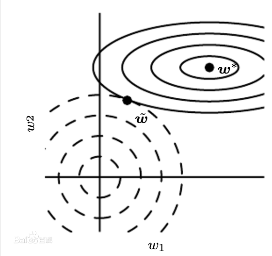

# 参数范数惩罚

许多正则化方法通过对目标函数 $$J$$ 添加一个参数范数惩罚 $$\Omega(\theta)$$，限制模型的学习能力。我们将正则化后的目标函数记为 $$\tilde{J}$$ ：

                                                        $$\tilde{J}(\theta;X,y)=J(\theta;X,y)+\alpha\Omega(\theta)$$ 

其中 $$\alpha\in[0,\infty)$$ 是权衡范数惩罚项 $$\Omega$$ 和标准目标函数 $$J(X;\theta)$$ 相对贡献的超参数。将 $$\alpha$$ 设为 $$0$$ 表示没有正则化。 $$\alpha$$ 越大，对应正则化惩罚越大。

## $$L^2$$ 正则化

这个正则化策略通过向目标函数添加一个正则项 $$\Omega(\theta)=\frac{1}{2}||w||^2_2$$ ，使权重更加接近原点。在其他学术圈， $$L^2$$ 也被称为岭回归或Tikhonov正则。DNN的 $$L^2$$ 正则化通常的做法是只针对与线性系数矩阵 $$w$$ ,而不针对偏倚系数 $$b$$ 。我们很容易可以写出DNN的 $$L^2$$ 正则化的损失函数：

                             $$\tilde{J}(w;X,y)=J(w;X,y)+\frac{\alpha}{2}||w||^2_2=J(w;X,y)+\frac{\alpha}{2}w^Tw$$ 

与之对应的梯度为

                                                $$\nabla_w\tilde{J}(w;X,y)=\nabla _wJ(w;X,y)+\alpha w$$ 

使用单步梯度下降更新权重，即执行以下更新

                                                    $$w\gets w-\epsilon(\alpha w+\nabla_wJ(w;X,y))$$ 

                                               $$= w\gets (1-\epsilon \alpha)w-\epsilon\nabla_wJ(w;X,y)$$ 

通过上式我们可以看出，加入权重衰减后会引起学习规则的修改。即在每步执行通常的梯度更新之前先收缩权重向量\( $$(1-\epsilon \alpha)w$$ 将权重向量乘以一个常数因子\)。 由于 $$\epsilon$$ 和 $$\alpha$$ 都是大于 $$0$$ 的数，因此相对于不加正则化的模型而言，正则化之后的模型权重在每步更新之后的值都要更小。

这是单个步骤发生的变化。我们进一步简化分析，令 $$w^*$$ 为未正则化的目标函数取得最小训练误差时的权重向量，即 $$w^* = \mathop{\arg\min}\limits_wJ(w)$$ ，并在 $$w^*$$ 的邻域对目标函数做二次近似。如果目标函数确实是二次的（如以均方差拟合线性回归模型的情况），则该近似是完美的。近似的 $$\tilde{J}(\theta)$$ 如下

                                            $$\tilde{J}(\theta)=J(w^*)+\frac{1}{2}(w-w^*)^TH(w-w^*)$$ 

其中 $$H$$ 是 $$J$$ 在 $$w^*$$ 处计算的Hessian矩阵（关于 $$w$$ ）。因为 $$w^*$$ 被定义为最优，即梯度消失为 $$0$$ ，所以该二次近似中没有一阶项。同样地，因为 $$w^*$$ 是 $$J$$ 的一个最优点，我们可以得出 $$H$$ 是半正定的结论。

当 $$\hat{J}$$ 取得最小时，其梯度 $$\nabla_w\hat{J}(w)=H(w-w^*)$$ 为 $$0$$。

假设 $$J$$ 是一个二次优化问题（比如采用平方损失函数）时，模型参数可以进一步表示为 $$\overline{w}=\frac{\lambda_i}{\lambda_i+\alpha}w_i$$，即相当于在原来的参数上添加了一个控制因子，其中 $$\lambda$$ 是参数Hessian矩阵的特征值。由此可见

* 当 $$\lambda_i\gg \alpha$$ 时，惩罚因子作用比较小。
* 当 $$\lambda_i\ll \alpha$$ 时，对应的参数会缩减至 $$0$$ 。

如上图，实线椭圆表没有正则化目标的等值线。虚线圆圈表示 $$L^2$$ 正则化项的等值线。在 $$\tilde{w}$$ 点，这两个竞争目标达到平衡。横轴$$w_1$$表示特征1的权重，纵轴$$w_2$$表示特征2的权重。

可以看到虚线圆圈很扁，所以当 $$w_1$$ 变化很大时才能进到实线圆圈的内圈，而 $$w_2$$ 变化一点就可以进到实线圆圈的内圈。（方便理解可以看纵轴往右平移很大一块才能碰到内一个实线圆圈；假设横轴在实线最外面圈正下方中点，向上平移一点就碰到内一个实线圆圈。或者是想象 $$w^*$$ 带着实线圆圈水平或直移动）从一个实圈到另一个实圈，相当于目标函数值变化。

只有在显著减小目标函数方向上的参数会保留的相对完好。在无助于目标函数减小的方向上改变参数不会显著增加梯度，这种不重要方向对应的分量会在训练过程中因正则化而衰减掉。沿横轴变化时，目标函数变化不大，所以正则化项对该轴具有强烈的影响，正则化项将 $$w_1$$ 拉向零。而目标函数对沿着纵轴的移动非常敏感，对应的特征值较大，表示高曲率，因此，正则化对 $$w_2$$ 位置影响相对较小。

$$L^2$$ 正则化能让学习算法“感知”到具有较高方差的输入 $$x$$ ，因此与输出目标的协方差较小（相对增加方差）的特征的权重将会收缩。即更离散的特征所占权重将会变小。

## $$L^1$$ 正则化

## $$L^2$$ 与 $$L^1$$ 区别

$$L^1$$ 相对于$$L^2$$ 能够产生更加稀疏的模型，即当 $$L^1$$ 正则在参数 $$w$$ 比较小的情况下，能够直接缩减至0。因此可以起到特征选择的作用，该技术也称之为 LASSO。 

如果从概率角度进行分析，很多范数约束相当于对参数添加先验分布，其中$$L^2$$ 范数相当于参数服从高斯先验分布； $$L^1$$ 范数相当于拉普拉斯分布。

