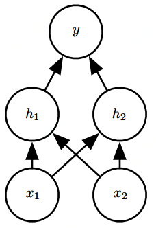

# Dropout

Dropout提供了正则化一大类模型的方法，计算方便但功能强大。Dropout可以被认为是集成大量深层神经网络的实用Bagging方法。Bagging涉及训练多个模型，并在每个测试样本上评估多个模型。当每个模型都是一个很大的神经网络时，这并不现实，因为训练和评估这样的网络需要花费大量的时间和内存。Dropout提供了一种廉价的Bagging集成近似，能够训练和评估指数级数量的神经网络。

具体而言，Dropout训练的集成包括所有从基础网络除去非输出单元后形成的子网络，如下图所示。

神经网络基于一系列仿射变换和非线性变换，我们只需将一些单元的输出乘零就能有效地删除一个单元。这个过程需要对模型进行一些修改，为了简单起见，我们这里提出乘零的简单Dropout算法，但是它被简单修改后，可以与从网络中移除单元的其他操作结合使用。

回想一下Bagging学习，我们定义 $$k$$ 个不同的模型，从训练集有放回采样构造 $$k$$ 个不同的数据集，然后在训练集 $$i$$ 上训练模型 $$f_i$$ 。Dropout的目标是在指数级数量的神经网络上近似这个过程。具体来说，在训练中使用Dropout时，我们会使用基于小批量产生较小步长的学习算法，如随机梯度下降等。我们每次在小批量中加载一个样本，然后随机抽样应用于网络中所有输入和隐藏单元的不同二值掩码。对于每个单元，掩码是独立采样的。掩码值为 $$1$$ 的采样概率（导致包含一个单元）是训练开始前一个固定的超参数。它不是模型当前参数值或输入样本的函数。通常在每一个小批量训练的神经网络中，一个输入单元被包括的概率为 $$0.8$$ ，一个隐藏单元被包括的概率为 $$0.5$$ 。然后，我们运行和之前一样的前向传播、反向传播以及学习更新。下图说明了Dropout下的前向传播

                                     

左图为我们使用的具有两个输入单元，具有两个隐藏单元以及一个输出单元的前馈网络。右图为为了执行具有Dropout的前向传播，我们随机地对向量 $$\mu$$ 进行采样，其中网络中的每个输入或隐藏单元对应一项。 $$\mu$$ 中的每项都是二值的且独立于其他项采样。超参数的采样概率为 $$1$$ ，隐藏层的采样概率通常为 $$0.5$$ ，输入的采样概率通常为 $$0.8$$ .网络中的每个单元乘以相应的掩码，然后正常地继续沿着网络的其余部分前向传播。相当于右图中随机选择一个子网络并沿着前向传播。

更正式地说，假设一个掩码向量 $$\mu$$ 指定被包括的单元， $$J(\theta,\mu)$$ 是由参数 $$\theta$$ 和掩码 $$\mu$$ 定义的模型代价。那么Dropout训练的目标是最小化 $$\mathbb{E}_\mu J(\theta,\mu)$$ 。这个期望包含多达指数级的项，但我们可以通过抽样 $$\mu$$ 获得梯度的无偏估计。

Dropout训练与Bagging训练不太一样。在Bagging的情况下，所有模型都是独立的。在Dropout的情况下，所有模型共享参数，其中每个模型继承父神经网络参数的不同子集。参数共享使得在有限可用的内存下表示指数级数量的模型变得可能。在Bagging的情况下，每一个模型在其相应训练集上训练到收敛。在Dropout的情况下，通常大部分模型都没有显示地被训练，因为通常父神经网络会很大，以致于不可能采样完所有的子网络。取而代之的，在单个步骤中我们训练一小部分的子网络，参数共享会使得剩余的子网络也能有好的参数设定。这些是仅有的区别。除了这些，Dropout与Bagging算法一样。例如，每个子网络中遇到的训练集确实是有放回采样的原始训练集的一个子集。

Bagging集成必须根据所有成员的累积投票做一个预测。在这种背景下，我们将这个过程称为推断。目前为止，我们在介绍Bagging和Dropout时没有要求模型具有明确的概率。现在，我们假定该模型的作用是输出一个概率分布。在Bagging的情况下，每个模型 $$f_i$$ 产生一个概率分布 $$p^{(i)}(y|x)$$ 。集成的预测由这些分布的算术平均给出：

                                                                        $$\frac{1}{k}\sum\limits_{i=1}^kp^{(i)}(y|x)$$ 

在Dropout的情况下，通过掩码 $$\mu$$ 定义每个子模型的概率分布 $$p(y|x,\mu)$$ 。所有掩码算术平均由下式给出

                                                                      $$\sum\limits_\mu p(\mu)p(y|x,\mu)$$ 

其中 $$p(\mu)$$ 是训练时采样 $$\mu$$ 的概率分布。

因为这个求和包含多达指数级的项，除非该模型的结构允许某种形式的简化，否则是不可能计算的。目前为止，无法得知深度神经网络是否允许某种可行的简化。相反，我们可以通过采样近似推断，即平均许多掩码的输出。即使是 $$10-20$$ 个掩码就足以获得不错的表现。

然而，一个更好的方法能不错地近似整个集成的预测，且只需一个前向传播的代价。要做到这一点，我们改用集成成员预测分布的几何平均而不是算数平均。多个模型分布的几何平均不能保证是一个概率分布。为了保证结果是一个概率分布，我们要求没有子模型给某一事件分配概率 $$0$$ ，并重新标准化所得分布。通过几何平均直接定义的非标准化概率分布由下式给出

                                                          $$\tilde{p}_{ensemble}(y|x)=\sqrt[2^d]{\prod\limits_\mu p(y|x,\mu)}$$ 

其中 $$d$$ 是可被丢弃的单元数。这里为简化介绍，我们使用均匀分布的 $$\mu$$ ，但非均匀分布也是可以的。为了作出预测，我们必须重新标准化集成：

                                                            $$p_{ensemble}(y|x)=\frac{\tilde{p}_{ensemble}(y|x)}{\sum\limits_{y'}\tilde{p}_{ensemble}(y'|x)}$$ 

涉及Dropout的一个重要观点是，我们可以通过评估模型中 $$p(y|x)$$ 来近似 $$p_{ensemble}$$ ：该模型具有所有单元，但我们将单元 $$i$$ 的输出的权重乘以单元 $$i$$ 的被包含概率。这个修改的动机是得到从该单元输出的正确期望值。我们把这种方法称为权重比例推断规则。目前还没有在深度非线性网络上对这种近似推断规则的准确性作任何理论分析，但经验上表现得很好。

因为我们通常使用 $$\frac{1}{2}$$ 的包含概率，权重比例规则一般相当于在训练结束后将权重除 $$2$$ ，然后像平常一样使用模型。实现相同结果的另一种方法是在训练期间将单元的状态乘 $$2$$ .无论哪种方式，我们的目标是确保在测试时一个单元的期望总输入与在训练时该单元的期望总输入是大致相同的。

对许多不具有非线性隐藏单元的模型族而言，权重比例推断规则是精确的。举例如下，考虑softmax函数回归分类，其中由向量 $$v$$ 表示 $$n$$ 个输入变量：

                                                     $$P(y=y|v)=softmax(W^Tv+b)_y$$ 

我们可以根据二值向量 $$d$$ 逐元素的乘法将一类子模型进行索引：

                                             $$P(y=y|v;d)=softmax(W^T(d\odot v)+b)_y$$ 

集成预测器被定义为重新标准化所有集成成员预测的几何平均：

                                                     $$P_{ensemble}(y=y|v)=\frac{\tilde{P}_{ensemble}(y=y|v)}{\sum\limits_{y'}\tilde{P}_{ensemble(y=y'|v)}}$$

其中

                                         $$\tilde{P}_{ensemble}(y=y|v)=\sqrt[2^n]{\prod\limits_{d\in \{0,1\}^n}P(y=y|v;d)}$$ 

为了证明权重比例推断规则是精确的，我们简化 $$\tilde{P}_{ensemble}$$ ：

                                        $$\tilde{P}_{ensemble}(y=y|v)=\sqrt[2^n]{\prod\limits_{d\in \{0,1\}^n}P(y=y|v;d)}$$ 

                                                        $$=\sqrt[2^n]{\prod_{d\in\{0,1\}^n}softmax(W^T(d\odot v)+b)_y}$$ 

                                                        $$=\sqrt[2^n]{\prod_{d\in\{0,1\}^n}\frac{\exp(W^T_{y,:}(d\odot v)+b_y)}{\sum\limits_{y'}\exp(W^T_{y',:}(d\odot v)+b_{y'}}}$$ 

                                                        $$=\frac{\sqrt[2^n]{\prod_{d\in\{0,1\}^n}\exp(W^T_{y,:}(d\odot v)+b_y)}}{\sqrt[2^n]{\prod_{d\in\{0,1\}^n}\sum\limits_{y'}\exp(W^T_{y',:}(d\odot v)+b_{y'})}}$$ 

由于 $$\tilde{P}$$ 将被标准化，我们可以放心地忽略那些相对 $$y$$ 不变的乘法：

                                        $$\tilde{P}_{ensemble}(y=y|v)\propto \sqrt[2^n]{\prod\limits_{d\in\{0,1\}^n}\exp(W^T_{y,:}(d\odot v)+b_y)}$$ 

                                                                              $$ = \exp(\frac{1}{2^n}\sum\limits_{d\in \{0,1\}^n}W^T_{y,:}(d\odot v)+b_y)$$ 

                                                                               $$=\exp(\frac{1}{2}W^T_{y,:}v+b_y)$$ 

代入 $$P_{ensemble}(y=y|v)=\frac{\tilde{P}_{ensemble}(y=y|v)}{\sum\limits_{y'}\tilde{P}_{ensemble(y=y'|v)}}$$ ，我们就得到了一个权重为 $$\frac{1}{2}W$$ 的softmax函数分类器。

权重比例推断规则在其他设定下也是精确的，包括条件正态输出的回归网络以及那些隐藏层不包含非线性的深度网络。然而，权重比例推断规则对具有非线性的深度模型仅仅是一个近似。虽然这个近似尚未有理论上的分析，但在实践中往往效果很好。

Dropout比其他便准的计算开销小的正则化方法（如权重衰减、过滤器范数约束和稀疏激活的正则化）更有效。Dropout也可以与其他形式的正则化合并，得到进一步的提升。

计算方便是Dropout的一个优点。训练过程中使用Dropout产生 $$n$$ 个随机二进制数与状态相乘，每个样本每次更新只需 $$O(n)$$ 的计算复杂度。根据实现，也可能需要 $$O(n)$$ 的存储空间来持续保存这些二进制数（指导反向传播阶段）。使用训练好的模型推断时，计算每个样本的代价与不使用Dropout是一样的，尽管我们必须在开始运行推断前将权重除以 $$2$$ 。

Dropout的另一个显著优点是不怎么限制适用的模型或训练过程。几乎在所有使用分布式表示并且可以用随机梯度下降训练的模型上都表现很好。包括前馈神经网络、概率模型，如受限玻尔兹曼机，以及循环神经网络。许多效果差不多的其他正则化策略对模型结构的限制更严格。

虽然Dropout在特定模型上每一步的代价是微不足道的，但在一个完整的系统上使用Dropout的代价可能非常显著。因为Dropout是一个正则化技术，它减少了模型的有效容量。为了抵消这种影响，我们必须增大模型规模。不出意外的话，使用Dropout时最佳验证集的误差会低很多，但这是以更大的模型和更多训练算法的迭代次数代价换来的。对于非常大的数据集，正则化带来的泛化误差减少得很小。在这些情况下，使用Dropout和更大规模的计算代价可能超过正则化带来的好处。

使用Dropout训练时的随机性不是这个方法成功的必要条件。它仅仅是近似所有子模型总和的一个方法。快速Dropout减小梯度计算中的随机性而获得更快的收敛速度。这种方法也可以在测试时应用，能够比权重比例推断规则更合理地（但计算也更昂贵）近似所有子网络的平均。快速Dropout在小神经网络上的性能几乎与标准的Dropout相当，但在大问题上尚未产生显著改善或者尚未应用。

随机性对实现Dropout的正则化效果不是必要的，同时也不是充分的。Dropout Boosting的方法设计了一个对照实验，具有与传统Dropout方法完全相同的噪声掩码，但缺乏正则化效果。Dropout Boosting训练整个集成以最大化训练集上的似然。从传统Dropout类似于Bagging的角度来看，这种方式类似于Boosting。如预期一样，和单一模型训练整个网络相比，Dropout Boosting几乎没有正则化效果。这表明，使用Bagging解释Dropout比使用稳健性噪声解释Dropout更好。只有当随机抽样的集成成员相互独立地训练好后，才能达到Bagging集成的正则化效果。

Dropout启发其他以随机方法训练指数量级的共享权重的集成。DropConnect是Dropout的一个特殊情况，其中一个标量权重和单个隐藏单元状态之间的每个乘积被认为是可以丢弃的一个单元。随机池化是构造卷积神经网络集成的一种随机池化的形式，其中每个卷积网络参与每个特征图的不同空间位置。目前为止，Dropout仍然是最广泛使用的隐式集成方法。

一个关于Dropout的重要见解是，通过随机行为训练网络并平均多个随机决定进行预测，实现了一种参数共享的Bagging形式。早些时候，我们将Dropout描述为通过包括或排除单元形成模型集成的Bagging。然而，这种参数共享策略不一定要基于包括和排除。原则上，任何一种随机的修改都是可接受的。在实践中，我们必须选择让神经网络能够学习对抗的修改类型。在理想情况下，我们也应该使用可以快速近似推断的模型族。我们可以认为由向量 $$\mu$$ 参数化的任何形式的修改，是对 $$\mu$$ 所有可能的值训练 $$p(y|x,\mu)$$ 的集成。注意，这里不要求 $$\mu$$ 具有有限数量的值。例如， $$\mu$$ 可以是实值。

目前为止，我们将Dropout介绍为一种纯粹高效近似Bagging的方法。然而，还有比这更进一步的Dropout观点。Dropout不仅仅是训练一个Bagging的集成模型，并且是共享隐藏单元的集成模型。这意味着无论其他隐藏单元是否在模型中，每个隐藏单元必须都能够表现良好。隐藏单元必须准备好进行模型之间的交换和互换。有性繁殖涉及到两个不同生物体之间的交换基因，进化产生的压力使得基因不仅是良好的而且要准备好不停有机体之间的交换。这样的基因和这些特点对环境的变化是非常稳健的，因为它们一定会正确适应任何一个有机体或模型不寻常的特性。因此Dropout正则化每个隐藏单元不仅是一个很好的特征，更要在许多情况下式良好的特征。

Dropout强大的大部分原因来自施加到隐藏单元的掩码噪声，了解这一事实是重要的。这可以看作是对输入内容的信息高度智能化、自适应破坏的一种形式，而不是对输入原始值的破坏。例如，如果模型学得通过鼻检测脸的隐藏单元 $$h_i$$ ，那么丢失 $$h_i$$ 对应于擦除图像中有鼻子的信息。模型必须学习另一种 $$h_i$$，要么是鼻子存在的冗余编码，要么是像嘴这样的脸部的另一特征。传统的噪声注入技术，在输入端加非结构化的噪声不能够随机地从脸部图像中抹去关于鼻子的信息，除非噪声的幅度大到几乎能抹去图像中所有的信息。破坏提取的特征而不是原始值，让破坏过程充分利用该莫西迄今获得的关于输入分布的所有知识。

Dropout的另一个重要方面是噪声是乘性的。如果是固定规模的加性噪声，那么加了噪声 $$\epsilon$$ 的整流线性隐藏单元可以简单地学会使 $$h_i$$ 变得很大（使增加的噪声 $$\epsilon$$ 变得不显著）。乘性噪声不允许这样病态地解决噪声鲁棒性问题。

