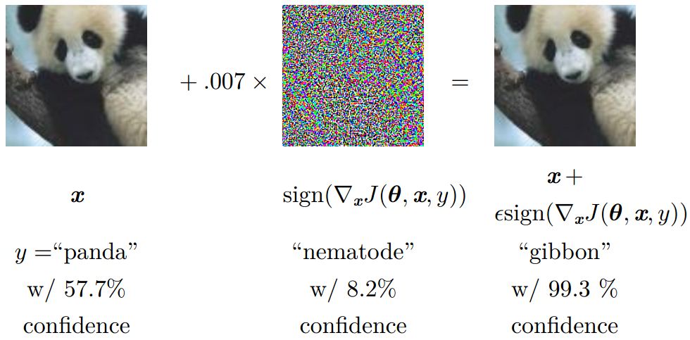

# 对抗训练

在许多情况下，神经网络在独立同分布的测试集上进行评估已经达到人类表现。因此，我们自然要怀疑这些模型在这些任务上是否获得了真正的人类层次的理解。为了探索网络对底层任务的理解层次，我们可以探索这个模型错误分类的例子。在精度达到人类水平的神经网络上通过优化过程故意构造数据点，其上的误差率接近 $$100\%$$ ，模型在这个输入点 $$x'$$ 的输出与附近的数据点 $$x$$ 非常不同。在许多情况下， $$x'$$ 与 $$x$$ 非常近似，人类观察者不会察觉原始样本和对抗样本之间的差异，但是网络会作出非常不同的预测。如下图，模型可以判断出是熊猫，但是稍加噪音，就严重影响精度，上图例子加了噪音后模型将熊猫\(panda\)判断成了长臂猿\(gibbon\)。

对抗样本在很多领域有许多影响，例如计算机安全等。它们在正则化的背景下很有意思，因为我们可以通过对抗训练减少原有独立同分布的测试集的错误率——在对抗扰动的训练集样本上训练网络。

神经网络主要是基于线性块构建的。因此在一些实验中，它们实现的整体函数被证明是高度线性的。这些线性函数很容易优化。不幸的是，如果一个线性函数具有许多输入，那么它的值可以非常迅速地改变。如果我们用 $$\epsilon$$ 改变每个输入，那么权重为 $$w$$ 的线性函数可以改变 $$\epsilon||w||_1$$ 之多，如果 $$w$$ 是高维的，这会是一个非常大的数。对抗训练通过鼓励网络在训练数据附近的局部区域恒定来限制这一高度敏感的局部线性行为。这可以被看做是一种明确地向监督神经网络引入局部恒定先验的方法。

对抗训练有助于体现积极正则化与大型函数族结合的力量。纯粹的线性模型，如逻辑回归，由于它们被限制为线性而无法抵抗对抗样本。神经网络能够将函数从接近线性转化为局部近似恒定，从而可以灵活地捕获到训练数据中的线性趋势同时学习抵抗局部扰动。

对抗样本也提供了一种实现半监督学习的方法。在与数据集中的标签不相关联的点 $$x$$ 处，模型本身为其分配一些标签 $$\hat{y}$$ 。模型的标记 $$\hat{y}$$ 未必是真正的标签，但如果模型是高品质的，那么 $$\hat{y}$$ 提供正确标签的可能性很大。我们可以搜索一个对抗样本 $$x'$$ ，导致分类器输出一个标签 $$y'$$ 且 $$y'\neq \hat{y}$$ 。不使用真正的标签，而是由训练好的模型提供标签产生的对抗样本被称为虚拟对抗样本。我们可以训练分类器为 $$x$$ 和 $$x'$$ 分配相同的标签。这鼓励分类器学习一个沿着未标签数据所在流形上任意微小变化都很鲁棒的函数。驱动这种方法的假设是，不同的类通常位于分离的流形上，并且小扰动不会使数据点从一个类的流形跳到另一个类的流行形。

