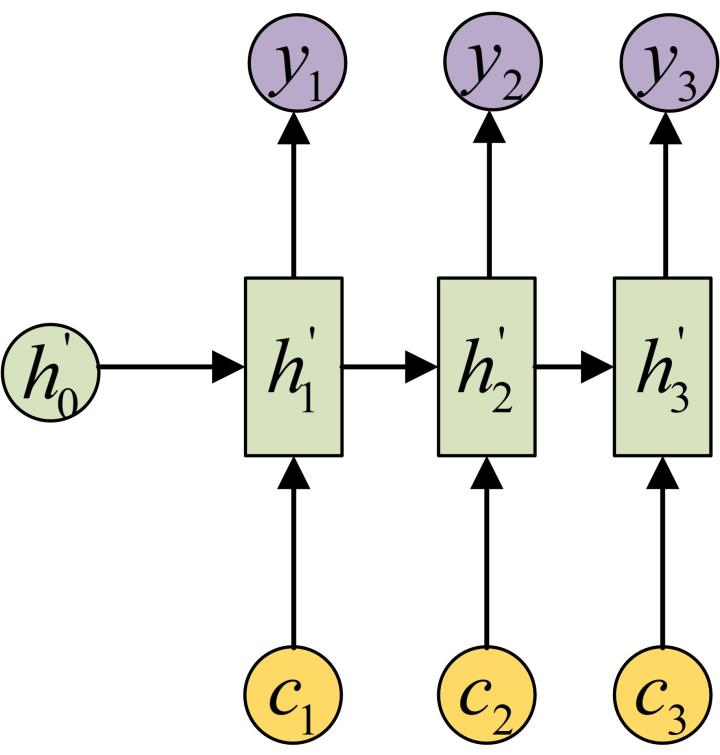
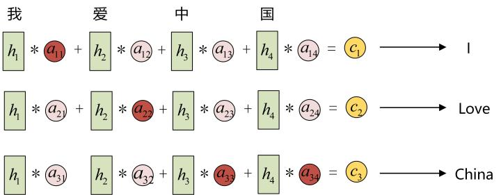

# 注意力机制

在Encoder-Decoder结构（即Seq2Seq，N vs. M）中，Encoder把所有的输入序列都编码成一个统一的语义特征 $$c$$ 再解码，因此， $$c$$ 中必须包含原始序列中的所有信息，它的长度就成了限制模型性能的瓶颈。如机器翻译问题，当要翻译的句子较长时，一个 $$c$$ 可能存不下那么多信息，就会造成翻译精度的下降。

                 或    

Attention机制通过在每个时间输入不同的 $$c$$ 来解决这个问题，下图是带有Attention机制的Decoder：

每一个 $$c$$ 会自动去选取与当前所要输出的 $$y$$ 最合适的上下文信息。具体来说，我们用 $$a_{ij}$$ 衡量Encoder中第 $$j$$ 阶段的 $$h_j$$ 和解码时第 $$i$$ 阶段的相关性，最终Decoder中第i阶段的输入的上下文信息 $$c_i$$ 就来自于所有 $$h_j$$ 对 $$a_{ij}$$ 的加权和。

以机器翻译为例（将中文翻译成英文）：

输入的序列是“我爱中国”，因此，Encoder中的 $$h_1,h_2,h_3,h_4$$ 就可以分别看做是“我”、“爱”、“中”、“国”所代表的信息。在翻译成英语时，第一个上下文 $$c_1$$ 应该和“我”这个字最相关，因此对应的 $$a_{11}$$ 就比较大，而相应的 $$a_{12},a_{13},a_{14}$$ 就比较小。 $$c_2$$ 应该和“爱”最相关，因此对应的 $$a_{22}$$ 就比较大。最后的 $$c_3$$ 和 $$h_3,h_4$$ 最相关，因此 $$a_{33},a_{34}$$ 的值就比较大。

至此，关于Attention模型，我们就只剩最后一个问题了，那就是：这些权重 $$a_{ij}$$ 是怎么来的？

事实上， $$a_{ij}$$ 同样是从模型中学出的，它实际和Decoder的第 $$i-1$$ 阶段的隐状态、Encoder第 $$j$$ 个阶段的隐状态有关。

同样还是拿上面的机器翻译举例， $$a_{ij}$$ 的计算（此时箭头就表示对 $$h'_{i-1}$$ 和 $$h_j$$ 同时做变换）：

$$a_{1j}$$ 计算：  

$$a_{2j}$$ 计算：  

$$a_{3j}$$ 计算：  

 以上就是带有Attention的Encoder-Decoder模型计算的全过程。

## Source



