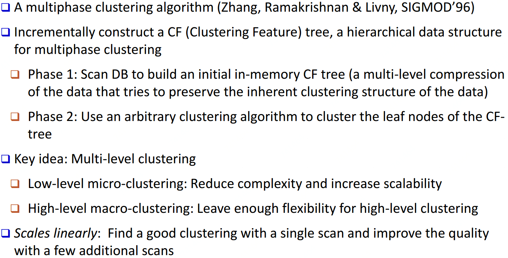
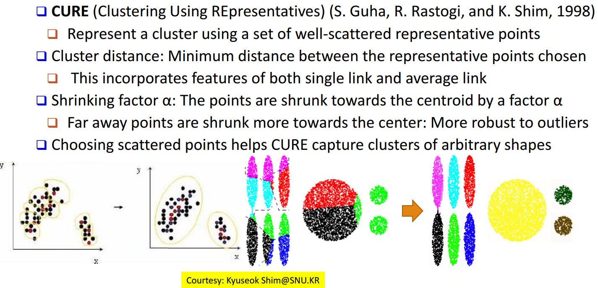
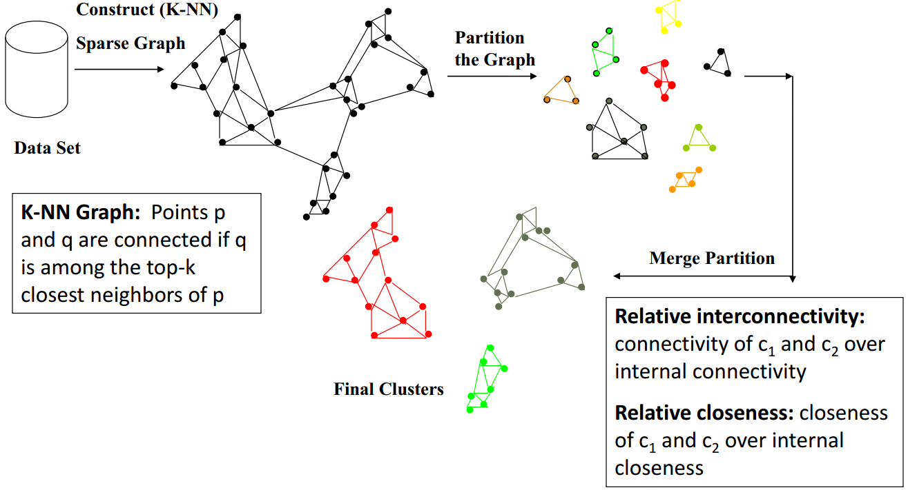
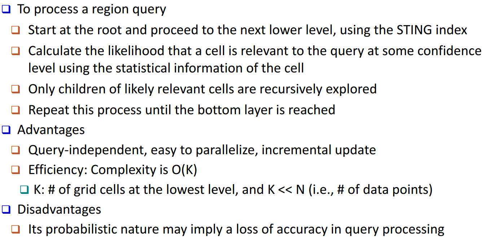
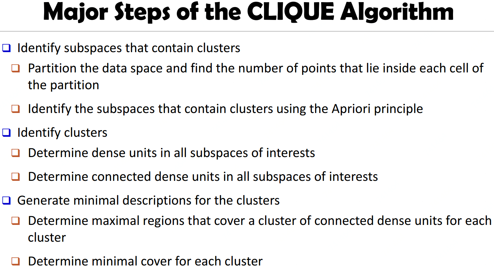

# 聚类分析

## 性能度量

聚类是将样本集 $$D$$ 划分为若干不想交的子集，即样本簇。那么，什么样的聚类结果比较好呢？直观上看，我们希望“物以类聚”，即同一簇的样本尽可能彼此相似，不同簇的样本尽可能不同。换言之，聚类结果的“簇内相似度”高且“簇间相似度”低。

聚类性能度量大致有两大类，一类是将聚类结果与某个“参考模型”进行比较，称为“外部指标”；另一类是直接考察聚类结果而不利用任何参考模型，称为“内部指标”。

### 外部指标

Jaccard系数\(Jaccard Coefficient, JC\)： $$JC=\frac{a}{a+b+c}$$ 

FM指数\(Fowlkes and Mallows Index, FMI\)： $$FMI = \sqrt{\frac{a}{a+b}\cdot \frac{a}{a+c}}$$ 

Rand指数\(Rand Index, RI\)： $$RI=\frac{2(a+d)}{m(m-1)}$$ 

显然，上述性能度量的结果值均在 $$[0,1]$$ 区间，值越大越好

### 内部指标

DB指数\(Davies-Bouldin Index, DBI\)： $$DBI=\frac{1}{k}\sum\limits_{i=1}^k(\frac{avg(C_i)+avg(C_j)}{f_{cen}(\mu_i,\mu_j)})$$ 

Dunn指数\(Dunn Index, DI\)： $$DI=\min\limits_{1\leq i\leq k}\{\min\limits_{j\neq i}(\frac{d_{\min}(C_i,C_j)}{\max_{1\leq l\leq k}diam(C_l)})\}$$ 

显然，DBI的值越小越好，而DI则相反，值越大越好

## 划分聚类\(Partitioning Methods\)

### K-Means

K-Means即每一簇类使用类的均值来表示

输入：样本集 $$D=\{x_1,x_2,\dots,x_m\}$$ ，聚类簇数 $$k$$ 

过程：

* 从 $$D$$ 中随机选取 $$k$$ 个样本作为初始均值向量 $$\{\mu_1,\mu_2,\dots,\mu_k\}$$ 
* repeat：
*             令 $$C_i=\varnothing(1\leq i \leq k)$$ 
*             for $$j = 1,2,\dots,m$$：
*                         计算样本 $$x_j$$ 与各均值向量 $$\mu_i(1\leq i \leq k)$$ 的距离 $$d_{ji}=||x_j-x_i||_2$$ 
*                         根据距离最近的均值向量确定 $$x_j$$ 的簇标记 $$\lambda_j=\arg\min_{i\in \{1,2,\dots,k\}}d_{ji}$$ 
*                         将样本 $$x_j$$ 划入相应的簇 $$C_{\lambda_j}=C_{\lambda_j}\cup\{x_j\}$$ 
*             for $$i = 1,2,\dots,k$$ ：
*                         计算新均值向量 $$\mu'_i=\frac{1}{|C_i|}\sum_{x\in C_i}x$$ 
*                         if $$\mu'_i \neq \mu_i$$ ：
*                                     将当前均值向量 $$\mu_i$$ 更新为 $$\mu'_i$$ 
*                         else：
*                                     保持当前均值向量不变
* until：当前均指向量均未更新


### K-Medoids

K-Means对异常值敏感，如果一个极端值会干扰结果。这时可以使用K-Medoids

```text
初始化：从数据点集中随机选择k个点，作为初始中心点；将待聚类的数据点集中的点，指派到最近的中心点
迭代(收敛或变化小于阈值停止)：
    对每中心点，和其每一个非中心点交换，计算交换后划分所生成的代价值，若交换造成代价增加，则取消交换
```


### K-Medians&K-Modes

相较均值\(mean\)，中位数\(median\)更不易被异常值影响，所以也可使用K-Medians，即将均值换为中位数

K-Means不好处理类别数据\(不好计算距离\)，此时可使用K-Modes\(众数\)。 K-Modes是用每个聚类中的众数（mode）做中心点。距离的定义也不同，通常K-Means较多使用欧式距离，K-Modes一般是汉明距离，也就是对于每个特征来说，如果不同记为1，相同则为0。

#### [K-Modes例子](http://sofasofa.io/forum_main_post.php?postid=1000500)

| 手机 | 国家 | 人群 | 颜色 |
| :---: | :---: | :---: | :---: |
| 1 | 中 | 青年 | 白 |
| 2 | 日 | 青年 | 黑 |
| 3 | 中 | 青年 | 蓝 |
| 4 | 中 | 青年 | 黑 |
| 5 | 日 | 青年 | 白 |
| 6 | 日 | 中年 | 黑 |
| 7 | 美 | 中年 | 蓝 |
| 8 | 美 | 中年 | 白 |
| 9 | 中 | 中年 | 黑 |
| 10 | 美 | 中年 | 黑 |

 假定我们选择聚类的数量K=2，初始点为手机1（中，青年，白）和手机6（日，中年，黑），得到

|  | 与手机1距离 | 与手机6距离 |
| :---: | :---: | :---: |
| 2 | 2 | 1 |
| 3 | 1 | 3 |
| 4 | 1 | 2 |
| 5 | 1 | 2 |
| 7 | 3 | 2 |
| 8 | 2 | 2 |
| 9 | 2 | 1 |
| 10 | 3 | 1 |

距离越小属于同一类别，若到距离相同则可以随机归于一类。

### Kernel K-Means

对于非凸簇类，可使用核函数映射到高维，再进行聚类。


## 层次聚类\(Hierarchical Methods\)

生成一个聚类层级（用树状图展示），聚合方法：AGNES，分裂方法：DIANA，其他层级方法：BIRCH、CURE、CHAMELEON


### AGNES\(Agglomerative Nesting\)

AGNES是一种采用自底向上聚合策略的层次聚类算法。它先将数据集中的每个样本看作一个初始聚类簇，然后在算法运行的每一步中找出距离最近的两个聚类簇进行合并，该过程不断重复，直至达到预设的聚类簇个数。


### DIANA\(Divisive Analysis\)


### BIRCH\(Balanced Iterative Reducing and Clustering Using Hierarchies\)



### CURE\(Clustering Using Representatives\)



### CHAMELEON\(Hierarchical Clustering Using Dynamic Modeling\)




## 基于密度/网格聚类\(Density- and Grid-Based Methods\)

基于密度方法：DBSCAN、OPTICS    基于网格方法：STING、CLIQUE

### DBSCAN\(Density-Based Spatial Clustering of Applications with Noise\)


### OPTICS\(Ordering Points To Identify Clustering Structure\)


### STING\(A Statistical Information Grid Approach\)




### CLIQUE\(Grid-Based Subspace Clustering\)




## Source






