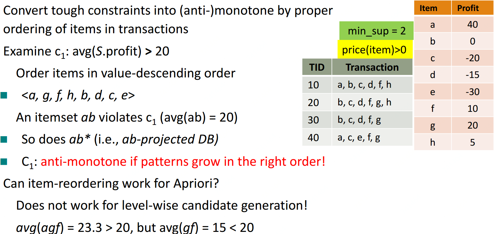
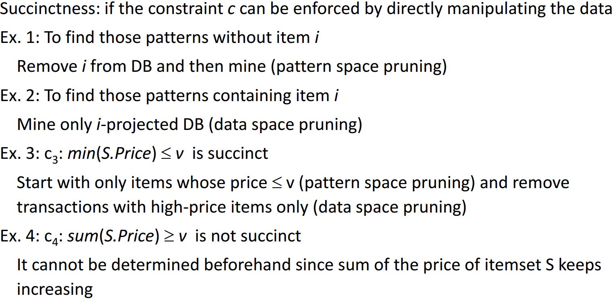
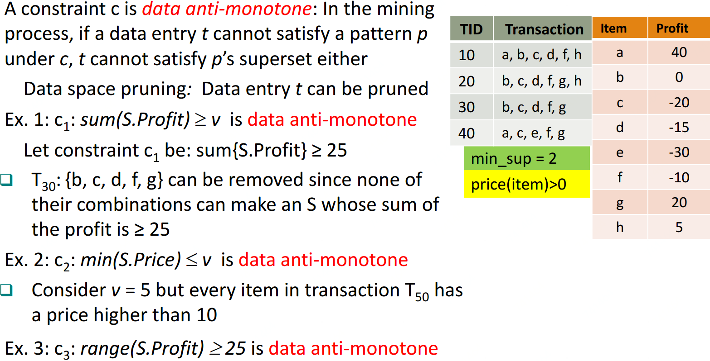

# 基于约束的频繁项集

有时我们并不关心所有的频繁项集，只想了解我们关心的。加约束条件去挖掘既灵活又可加快速度。

## 模式空间剪枝约束

#### **Anti-monotonic:** If constraint $$c$$ is violated, its further mining can be terminated

#### **Monotonic:** If $$c$$ is satisfied, no need to check $$c$$ again

#### **Succinct:** If the constraint $$c$$ can be enforced by directly manipulating the data

#### **Convertible:**$$c$$ can be converted to monotonic or anti-monotonic if items can be ordered in processing

## 数据空间剪枝约束

#### **Data succinct:** Data space can be pruned at the initial pattern mining process

#### **Data anti-monotonic:** If a transaction $$t$$ does not satisfy $$c$$ ,then $$t$$ can be pruned to reduce data processing effort

## 

