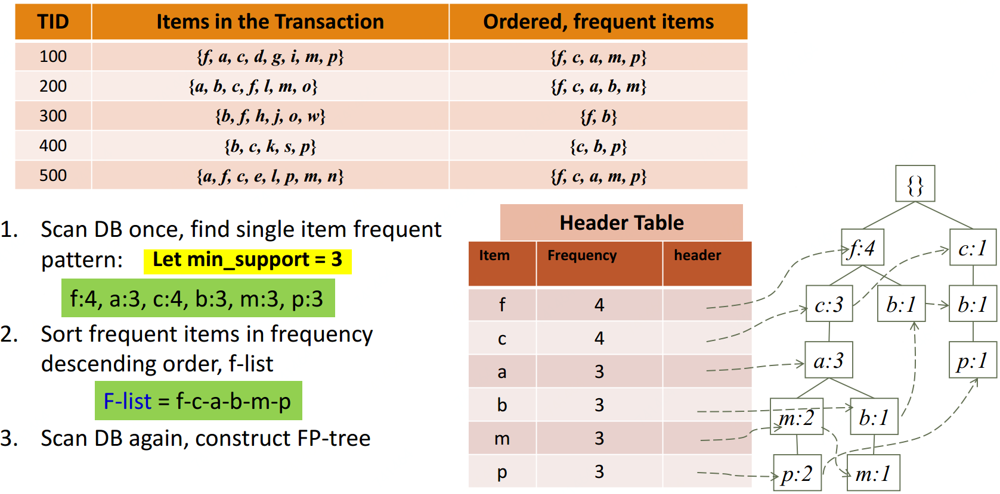

# 频繁项集

## Apriori

找到支持度大于 $$\sigma_{threshold}$$ 的项集，若 $$s({a,b})<\sigma_{threshold}$$ 了，那 $$s(a,b,c)$$ 更小，所以 $$(a,b,c)$$ 不可能是频繁项集，所以就不用计算了。反之， $$s(a,b,c)\geq \sigma_{threshold}$$ 那肯定 $$s(a,b)\geq \sigma_{threshold}$$。Apriori就基于此思想迭代和剪枝

```text
扫描数据库，生成高频1-项集(只有1项的)
while:
     根据上一轮k-项集生成(k+1)-项集作为候选集
     扫描数据库测试生成的(k+1)-项集候选集是否高频(这里构造时，新加的项必须也满足支持度)
     k = k+1
     Until: 没有大于阈值的 或 没有新候选集可生成
return: 返回所有满足频繁项集
```


## FP-Growth

也基于了若k-项集都不满足支持度，那含k-项集的\(k+1\)项集也不满足的思想




## 项集衡量


## 

