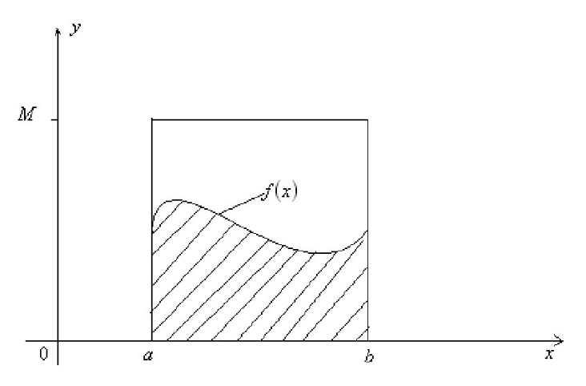

# 数据采样

## [蒙特卡罗 vs 拉斯维加斯](https://www.zhihu.com/question/20254139)

我们知道，随机算法在采样不全时，通常不能保证找到最优解，只能说是尽量找。那么根据怎么个“尽量”法儿，我们我们把随机算法分成两类：

* 蒙特卡罗算法：采样越多，越**近似**最优解；
* 拉斯维加斯算法：采样越多，越**有机会找到**最优解；

举个例子，假如筐里有100个苹果，让我每次闭眼拿1个，挑出最大的。于是我随机拿1个，再随机拿1个跟它比，留下大的，再随机拿1个……我每拿一次，留下的苹果都至少不比上次的小。拿的次数越多，挑出的苹果就越大，但我除非拿100次，否则无法肯定挑出了最大的。这个挑苹果的算法，就属于蒙特卡罗算法——**尽量找好的，但不保证是最好的**。

而拉斯维加斯算法，则是另一种情况。假如有一把锁，给我100把钥匙，只有1把是对的。于是我每次随机拿1把钥匙去试，打不开就再换1把。我试的次数越多，打开（最优解）的机会就越大，但在打开之前，那些错的钥匙都是没有用的。这个试钥匙的算法，就是拉斯维加斯的——**尽量找最好的，但不保证能找到**。

这两类随机算法之间的选择，往往受到问题的局限。如果问题要求在有限采样内，必须给出一个解，但不要求是最优解，那就要用蒙特卡罗算法。反之，如果问题要求必须给出最优解，但对采样没有限制，那就要用拉斯维加斯算法。

比如机器下棋的算法本质都是搜索树，围棋难在它的树宽可以达到好几百。在有限时间内要遍历这么宽的树，就只能牺牲深度（俗称“往后看几步”），但围棋又是依赖远见的游戏，甚至不仅是看“几步”的问题。所以，要想保证搜索深度，就只能放弃遍历，改为随机采样——这就是为什么在没有MCTS（蒙特卡罗搜树）类的方法之前，机器围棋的水平几乎是笑话。而采用了MCTS方法后，搜索深度就大大增加了。

## 采样和蒙特卡罗方法

有许多原因使我们希望从某个分布中采样。当我们需要以较小的代价近似许多项或某个积分时，采样是一种很灵活的选择。有时候，我们使用它加速一些很费时却易于处理的求和估计，就像我们使用小批量对整个训练代价进行子采样一样。在其他情况下，我们需要近似一个难以处理的求和或积分，例如估计一个无向模型中配分函数对数的梯度时。在许多其他情况下，抽样实际上是我们的目标，例如我们想训练一个可以从训练分布采样的模型。

### 蒙特卡罗采样的基础

蒙特卡罗原来是一个赌场的名称，用它作为名字大概是因为蒙特卡罗方法是一种随机模拟的方法，这很像赌博场里面的扔骰子的过程。最早的蒙特卡罗方法都是为了求解一些不太好求解的求和或者积分问题。比如积分：

                                                                      $$\theta=\int_a^bf(x)dx$$ 

如果我们很难求解出 $$f(x)$$ 的原函数，那么这个积分比较难求解。当然我们可以通过蒙特卡罗方法来模拟求解近似值。如何模拟呢？假设我们函数图像如下图：

一个简单的近似求解方法是在 $$[a,b]$$ 之间随机的采样一个点。比如 $$x_0$$ ，然后用 $$f(x_0)$$ 代表在 $$[a,b]$$ 区间上所有的 $$f(x)$$ 的值。那么上面的定积分的近似求解为：

                                                                          $$(b-a)f(x_0)$$ 

当然，用一个值代表 $$[a,b]$$ 区间上所有的 $$f(x)$$ 的值太粗糙了。我们可以采样 $$[a,b]$$ 区间的 $$n$$ 个值： $$x_0,x_1,\dots,x_{n-1}$$ ，用它们的均值来代表 $$[a,b]$$ 区间上所有的 $$f(x)$$ 的值。这样我们上面的定积分的近似求解为：

                                                                         $$\frac{b-a}{n}\sum\limits_{i=0}^{n-1}f(x_i)$$ 

虽然上面的方法可以一定程度上求解出近似的解，但是它隐含了一个假定，即 $$x$$ 在 $$[a,b]$$ 之间是均匀分布的，而绝大部分情况， $$x$$ 在 $$[a,b]$$ 之间不是均匀分布的。如果我们用上面的方法，则模拟求出的结果很可能和真实值相差甚远。

如果我们可以得到 $$x$$ 在 $$[a,b]$$ 的概率分布函数 $$p(x)$$ ，那么我们的定积分求和可以这样进行：

                                              $$\theta=\int_a^bf(x)dx=\int_a^b\frac{f(x)}{p(x)}p(x)dx\approx\frac{1}{n}\sum\limits_{i=0}^{n-1}\frac{f(x_i)}{p(x_i)}$$ 

上式最右边的这个形式就是蒙特卡罗方法的一般形式。当然这里是连续函数形式的蒙特卡罗方法，但是在离散时一样成立。关于上式，我们可以这么理解最后一步转换：由于 $$\int_a^b\frac{f(x)}{p(x)}p(x)dx$$ 可以看做是 $$\frac{f(x)}{p(x)}$$ 基于概率分布 $$p(x)$$ 的期望，那么我们可以用期望的方法来求这个式子的值。而计算期望的一个近似方法是取 $$\frac{f(x)}{p(x)}$$ 的若干个基于分布 $$p(x)$$ 的采样点，然后求平均值得到。

#### 举例如下

假设 $$f(x)$$ 的取值只有 $$2$$ 个， $$x = 1,2$$ 。对应的 $$y$$ 值分别是 $$f(1)=1,f(2)=4$$ 。其中 $$x$$ 的取值不是平均的，取 $$x = 1$$ 的概率 $$p(1)=0.25$$ ，取 $$x = 2$$ 的概率 $$p(2)=0.75$$ 。

那么严格来说，根据 $$\theta=\int_a^bf(x)dx=\int_a^b\frac{f(x)}{p(x)}p(x)dx\approx\frac{1}{n}\sum\limits_{i=0}^{n-1}\frac{f(x_i)}{p(x_i)}$$ ，对应的 $$f(x)$$ 的积分等于 $$\frac{f(x)}{p(x)}$$ 基于概率分布 $$p(x)$$ 的期望，根据公式，则有 $$\frac{1}{0.25}*0.25+\frac{4}{0.75}*0.75=5$$ 。

此时我们采样三次，期望求近似结果。假设第一次采样到 $$1$$ ，第二三次采样到 $$2$$ ，那么最后的近似结果是

$$\frac{1}{3}(\frac{1}{0.25}+\frac{4}{0.75}+\frac{4}{0.75})=4.89$$ 。这个 $$4.89$$ 就是我们 $$5$$ 的近似。虽然有些距离，但是由于采样太少原因。若我们采样100次，得到26次 $$1$$ ，74次 $$2$$ ，那么近似结果是 $$\frac{1}{100}(26*\frac{1}{0.25}+74*\frac{4}{0.75})=4.99$$ 。可见结果越来越接近。接近的原因是随着采样数的增多，采样的样本分布越来越接近于 $$x$$ 本来的分布。

### 逆采样\(Inverse Sampling\)

在蒙特卡罗方法中，有一个关键的问题需要解决，即如何基于概率密度函数去采得 $$n$$ 个 $$x$$ 的样本。

逆采样\(Inverse Sampling\)和拒绝采样\(Reject Sampling\)就是用于解决这个问题的。

我们知道，对于常见的均匀分布 $$\text{uniform}(0,1)$$ 是非常容易采样的，一般通过[线性同余发生器](https://baike.baidu.com/item/%E7%BA%BF%E6%80%A7%E5%90%8C%E4%BD%99%E5%8F%91%E7%94%9F%E5%99%A8/22674963?fr=aladdin)就可以很方便的生成 $$(0,1)$$ 之间的伪随机数样本。而其他常见的概率分布，无论是离散的分布还是连续的分布，它们的样本都可以通过 $$\text{uniform}(0,1)$$ 的样本转换而得。那么应该如何得到呢？这就是逆采样。

下面我们以指数分布为例，说明如何通过均匀分布来采样服从指数分布的样本集。指数分布的概率密度函数PDF为：

                                                       $$p_{\exp}(x)=\begin{cases} \lambda\exp(-\lambda x),\ \ \ \ x\geq0\\ 0\ \ \ \  \ \ \  \ \ \ \ \ \ \ \ \ \ \ ,\ \ \ \ x<0 \end{cases}$$ 

那么它的概率分布函数为：

                                                                  $$F(x) = \int_{-\infty}^{\infty}p(x)dx$$ 

下图为指数分布和均匀分布的CDF图。从左图上看，在 $$x\geq 0$$ 的部分是一个单调递增的函数（在定义域上单调非减），定义于和值域是 $$[0,\infty)\to[0,1)$$ ，在 $$p(x)$$ 大的地方它增长快，反之亦然。

因为它是唯一映射的（在 $$>0$$ 的部分，接下来我们只考虑这一部分），所以它的反函数可以表示为 $$F^{-1}(a), a \in [0,1)$$ ，值域为 $$[0,\infty)$$ 。因为 $$F$$ 单调递增，所以 $$F^{-1}$$ 也是单调递增的：

                                                               $$x\leq y  \Rightarrow F(x)\leq F(y)$$ 

                                                             $$a\leq b \Rightarrow F^{-1}(a)\leq F^{-1}(b)$$ 

利用反函数的定义，我们有：

                                                             $$F^{-1}(a)<x,\ \text{iff}\ a<F(x)$$ 

接下来，我们定义一下 $$[0,1]$$ 均匀分布的CDF，这个很好理解：

                                                        $$P(a\leq x)=H(x)=\begin{cases}1\ \ ,x\geq 1\\ x\ \ ,0\leq x\leq1\\ 0\ \ ,x<0\end{cases}$$ 

根据上两式，有：

                                                  $$P(F^{-1}(a)\leq x)=P(a\leq F(x))=H(F(x))$$ 

因为 $$F(x)$$ 的值域 $$a = b$$ ，根据均匀分布的CDF，上式可改写为：

                                                        $$P(F^{-1}(a)\leq x)=H(F(x))=F(x)$$ 

据 $$F(x)$$ 的定义，它是 $$\exp$$ 分布的CDF，所以上式的意思是 $$F^{-1}(a)$$ 符合 $$\exp$$ 分布，我们通过 $$F$$ 的反函数将一个 $$0$$ 到 $$1$$ 均匀分布的随机数转换成了符合 $$\exp$$ 分布的随机数，注意，以上推导对于CDF可逆的分布都是一样的。对于 $$\exp$$ 来说，它的反函数的形式是：

                                                               $$F^{-1}_{\exp}(a)=-\frac{1}{\lambda}*\log(1-a)$$ 

具体的映射关系可以看下图\(a\)，我们从y轴0-1的均匀分布样本\(绿色\)映射得到了服从指数分布的样本\(红色\)

最后绘制出来的直方图可以看出来就是 $$\exp$$ 分布图，见上图\(b\)。可以看到随着采样数量的变多，概率直方图和真实的CDF就越接近。以上就是逆采样的过程。我们的结论是：因为CDF是单调函数\(累积的概率只能越来越大，直到为1\)，因此，只要某分布的CDF可逆，那么就可以通过均匀分布来采样服从该分布的样本集

### 拒绝采样\(Reject Sampling\)

对于常见的分布，如均匀分布，高斯分布，指数分布，t分布，F分布，Beta分布，Gamma分布等，可以采用逆采样的方法进行采样；不过很多时候，我们的概率分布不是常见的分布，这些分布的概率分布函数CDF 不可逆，因此没有办法用逆采样来采样，这意味着我们没法方便的得到这些非常见的概率分布的样本集。拒绝采样就是用来解决这个问题的 一种随机采样方法。

我们以求圆周率 $$\pi$$ 的例子入手，讲解拒绝采样的思想。通过采样的方法来计算$$\pi$$值，也就是在一个$$1\times 1$$ 的范围内随机采样一个点，如果它到原点的距离小于 $$1$$ ，则说明它在 $$1/4$$ 圆内，则接受它，最后通过接受的占比来计算 $$1/4$$ 圆形的面积，从而根据公式反算出预估 $$\hat{\pi}$$ 的值，随着采样点的增多，最后的结果 $$\hat{\pi}$$ 会愈加准确。

上面这个例子里说明一个问题，我们想求一个空间里均匀分布的集合面积，可以尝试在更大范围内按照均匀分布随机采样，如果采样点在集合中，则接受，否则拒绝。最后的接受概率就是集合在”更大范围“的面积占比。接下来，我们来形式化地说明拒绝采样。

给定一个概率分布 $$p(z)=\frac{1}{Z_p}\tilde{p}(z)$$ ，其中， $$\tilde{p}(z)$$ 已知， $$Z_p$$ 为归一化常数，未知。要对该分布 $$p(z)$$ 进行拒绝采样，首先需要借用一个简单的参考分布\(proposal distribution\)，记为 $$q(x)$$ ，该分布的采样易于实现，如均匀分布、高斯分布。然后引入常数 $$k$$ ，使得对所有的 $$z$$ ，满足 $$kq(z)\geq\tilde{p}(z)$$ ，如下图所示，红色的曲线为 $$\tilde{p}(z)$$ ，蓝色的曲线为 $$kq(z)$$ 。

### MCMC采样

### M-H采样

### 吉布斯采样\(Gibbs sampling\)

## Source







