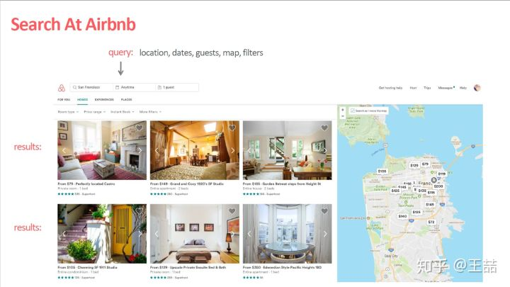
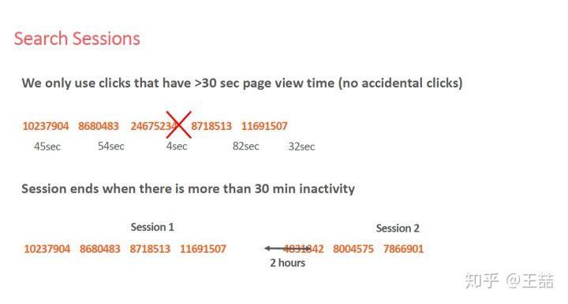

# 搜索排序中的Embedding

这里主要基于[王喆](https://github.com/wzhe06)对于2018年[KDD Best Paper](https://dl.acm.org/citation.cfm?id=3219885)的分析进行整理。

## 业务场景

Airbnb作为全世界最大的短租网站，提供了一个连接房主（host）挂出的短租房（listing）和主要是以旅游为目的的租客（guest/user）的中介平台。这样一个中介平台的交互方式比较简单，guest输入地点，价位，关键词等等，Airbnb会给出listing的搜索推荐列表：

容易想见，接下来guest和host之间的交互方式无非有这样几种：

1. guest点击listing （click）
2. guest预定lising （book）
3. host有可能拒绝guest的预定请求 （reject）

基于这样的场景，利用几种交互方式产生的数据，Airbnb的search团队要构建一个real time的ranking model。为了捕捉到用户short term以及long term的兴趣，Airbnb并没有把user history的clicked listing ids或者booked listing ids直接输入ranking model，而是先对user和listing进行了embedding，进而利用embedding的结果构建出诸多feature，作为ranking model的输入。这篇文章的核心内容就是介绍如何生成listing和user的embedding。

## Embedding

具体到embedding上，文章通过两种方式生成了两种不同的embedding分别capture用户的short term和long term的兴趣。

1. 一是通过click session数据生成listing的embedding，生成这个embedding的目的是为了进行listing的相似推荐，以及对用户进行session内的实时个性化推荐。
2. 二是通过booking session生成user-type和listing-type的embedding，目的是捕捉不同user-type的long term喜好。由于booking signal过于稀疏，Airbnb对同属性的user和listing进行了聚合，形成了user-type和listing-type这两个embedding的对象。

### [通过click session数据生成embedding](https://zhuanlan.zhihu.com/p/55149901)

Airbnb采用了click session数据对listing进行embedding，其中click session指的是一个用户在一次搜索过程中，点击的listing的序列，这个序列需要满足两个条件，一个是只有停留时间超过30s的listing page才被算作序列中的一个数据点，二是如果用户超过30分钟没有动作，那么这个序列会断掉，不再是一个序列。

这么做的目的无可厚非，一是清洗噪声点和负反馈信号，二是避免非相关序列的产生。

有了由clicked listings组成的sequence，就像我们在之前专栏文章中讲过的item2vec方法一样，我们可以把这个sequence当作一个“句子”样本，开始embedding的过程。Airbnb不出意外的选择了word2vec的skip-gram model作为embedding方法的框架。通过修改word2vec的objective使其靠近Airbnb的业务目标。

我们假设大家已经具备了基本知识，这里直接列出word2vec的skip-gram model的objective如下：

在采用negative sampling的训练方式之后，objective转换成了如下形式：

其中 $$\sigma$$ 函数代表的就是我们经常见到的sigmoid函数， $$D$$ 是正样本集合， $$D'$$ 是负样本集合。我们再详细看一下上面word2vec这个objective function，其中前面的部分是正样本的形式，后面的部分是负样本的形式（仅仅多了一个负号）。

为什么原始的objective可以转换成上面的形式，其实并不是显然的，感兴趣的同学可以参考这篇文章， [Negative-Sampling Word-Embedding Method](https://github.com/wzhe06/Reco-papers/blob/master/Famous%20Machine%20Learning%20Papers/%5BW2V%5DNegative-Sampling%20Word-Embedding%20Method.pdf)。这里，我们就以word2vec的objective function为起点，开始下面的内容。

转移到Airbnb这个问题上，正样本很自然的取自click session sliding window里的两个listing，负样本则是在确定central listing后随机从语料库（这里就是listing的集合）中选取一个listing作为负样本。

因此，Airbnb初始的objective function几乎与word2vec的objective一模一样，形式如下：

（给大家出个脑筋急转弯，为啥Airbnb objective的正样本项前面是负号，原始的word2vec objective反而是负样本项前面是负号，是Airbnb搞错了吗？）

在原始word2vec embedding的基础上，针对其业务特点，Airbnb的工程师希望能够把booking的信息引入embedding。这样直观上可以使Airbnb的搜索列表和similar item列表中更倾向于推荐之前booking成功session中的listing。从这个motivation出发，Airbnb把click session分成两类，最终产生booking行为的叫booked session，没有的称做exploratory session。

因为每个booked session只有最后一个listing是booked listing，所以为了把这个booking行为引入objective，我们不管这个booked listing在不在word2vec的滑动窗口中，我们都会假设这个booked listing与滑动窗口的中心listing相关，所以相当于引入了一个global context到objective中，因此，objective就变成了下面的样子

其中最后一项的lb就是代表着booked listing，因为booking是一个正样本行为，这一项前也是有负号的。

需要注意的是最后一项前是没有sigma符号的，前面的sigma符号是因为滑动窗口中的中心listing与所有滑动窗口中的其他listing都相关，最后一项没有sigma符号直观理解是因为booked listing只有一个，所以central listing只与这一个listing有关。

但这里的objective的形式我仍让是有疑问的，因为这个objective写成这种形式应该仅代表了一个滑动窗口中的objective，并不是整体求解的objective。如果是整体的objective，理应是下面的形式：

其中Db代表了所有booked session中所有滑动窗口中central listing和booked listing的pair集合。

下面这一项就比较容易理解了，为了更好的发现同一市场（marketplace）内部listing的差异性，Airbnb加入了另一组negative sample，就是在central listing同一市场的listing集合中进行随机抽样，获得一组新的negative samples。同理，我们可以用跟之前negative sample同样的形式加入到objective中。

其中Dmn就是新的同一地区的negative samples的集合。

至此，lisitng embedding的objective就定义完成了，embedding的训练过程就是word2vec negative sampling模型的标准训练过程，这里不再详述。

### 通过booking session数据生成embedding

## 冷启动问题

文章多介绍了一下cold start的问题。简言之，如果有new listing缺失embedding vector，就找附近的3个同样类型、相似价格的listing embedding进行平均得到，不失为一个实用的工程经验。

为了对embedding的效果进行检验，Airbnb还实现了一个tool，我们简单贴一个相似embedding listing的结果。

从中可以看到，embedding不仅encode了price，listing-type等信息，甚至连listing的风格信息都能抓住，说明即使我们不利用图片信息，也能从用户的click session中挖掘出相似风格的listing。

至此我们介绍完了Airbnb利用click session信息对listing进行embedding的方法。写到这里笔者基本要断气了，下一篇我们再接着介绍利用booking session进行user-type和listing-type embedding的方法，以及Airbnb如何把这些embedding feature整合到最终的search ranking model中的方法。

## Source



