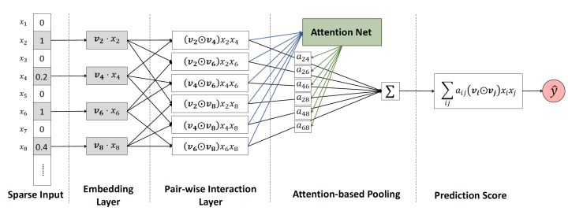

# AFM

[AFM](https://github.com/wzhe06/Reco-papers/blob/master/Deep%20Learning%20Recommender%20System/%5BAFM%5D%20Attentional%20Factorization%20Machines%20-%20Learning%20the%20Weight%20of%20Feature%20Interactions%20via%20Attention%20Networks%20%28ZJU%202017%29.pdf)的全称是Attentional Factorization Machines，通过前面的介绍我们很清楚的知道，FM其实就是经典的Wide&Deep结构，其中Wide部分是FM的一阶部分，Deep部分是FM的二阶部分，而**AFM顾名思义，就是引入Attention机制的FM**，具体到模型结构上，AFM其实是对FM的二阶部分的每个交叉特征赋予了权重，这个权重控制了交叉特征对最后结果的影响，也就非常类似于NLP领域的注意力机制（Attention Mechanism）。为了训练Attention权重，AFM加入了Attention Net，利用Attention Net训练好Attention权重后，再反向作用于FM二阶交叉特征之上，使FM获得根据样本特点调整特征权重的能力。

## Source



