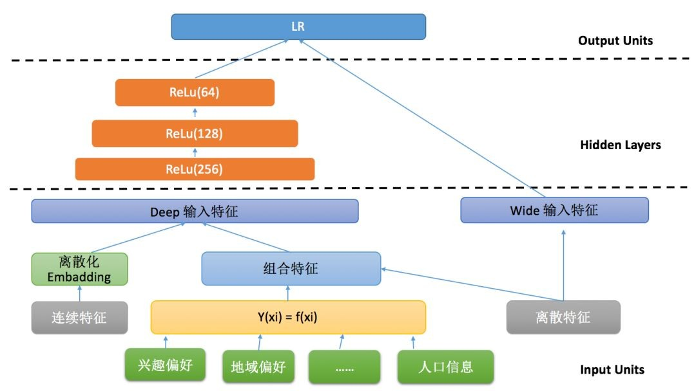

# Wide&Deep Learning

Google [Wide&Deep](https://github.com/wzhe06/Reco-papers/blob/master/Deep%20Learning%20Recommender%20System/%5BWide%26Deep%5D%20Wide%20%26%20Deep%20Learning%20for%20Recommender%20Systems%20%28Google%202016%29.pdf)模型的主要思路正如其名，**把单输入层的Wide部分和经过多层感知机的Deep部分连接起来，一起输入最终的输出层**。其中Wide部分的主要作用是让模型具有记忆性（Memorization），单层的Wide部分善于处理大量稀疏的id类特征，便于让模型直接“记住”用户的大量历史信息；Deep部分的主要作用是让模型具有“泛化性”（Generalization），利用DNN表达能力强的特点，挖掘藏在特征后面的数据模式。最终利用LR输出层将Wide部分和Deep部分组合起来，形成统一的模型。Wide&Deep对之后模型的影响在于——大量深度学习模型采用了两部分甚至多部分组合的形式，利用不同网络结构挖掘不同的信息后进行组合，充分利用和结合了不同网络结构的特点。

与阿里同时期，Google推出了Wide & Deep Learning（WDL）模型，一个非常出名的模型。详细内容可以从论文中查询Cheng et al, “Wide & deep learning for recommender systems” 。WDL模型也非常简单，但巧妙的将传统的特征工程与深度模型进行了强强联合。Wide部分是指人工先验的交叉特征，通过LR模型的形式做了直接的预测。右边是Deep部分，与GwEN网络结构一样，属于分组的学习方式。WDL相当于LR模型与GwEN结合训练的网络结构。

wide端对应的线性模型，输入特征可以是连续特征，也可以是稀疏的离散特征，离散特征之间进行进行交叉后可以构成更高维的特征，通过L1正则化能够很快收敛到有效的特征组合中。

deep端对应的是DNN模型，每个特征对应一个低维的稠密向量，我们称之为特征的embedding，DNN能够通过反向传播调整隐藏层的权重，并且更新特征的embedding

比如，在实际的新闻推荐场景中，wide model侧主要包含文章分类id、topic id、曝光位置以及其他部分离散特征，主要为了提高模型的记忆能力；deep model侧主要包含离散特征和部分连续特征，例如UserID、DocId、用户位置、分类ID、关键词ID以及各种统计类特征离散化结果，这些特征通常需要embedding向量然后拼接进行信息融合。

## Source











