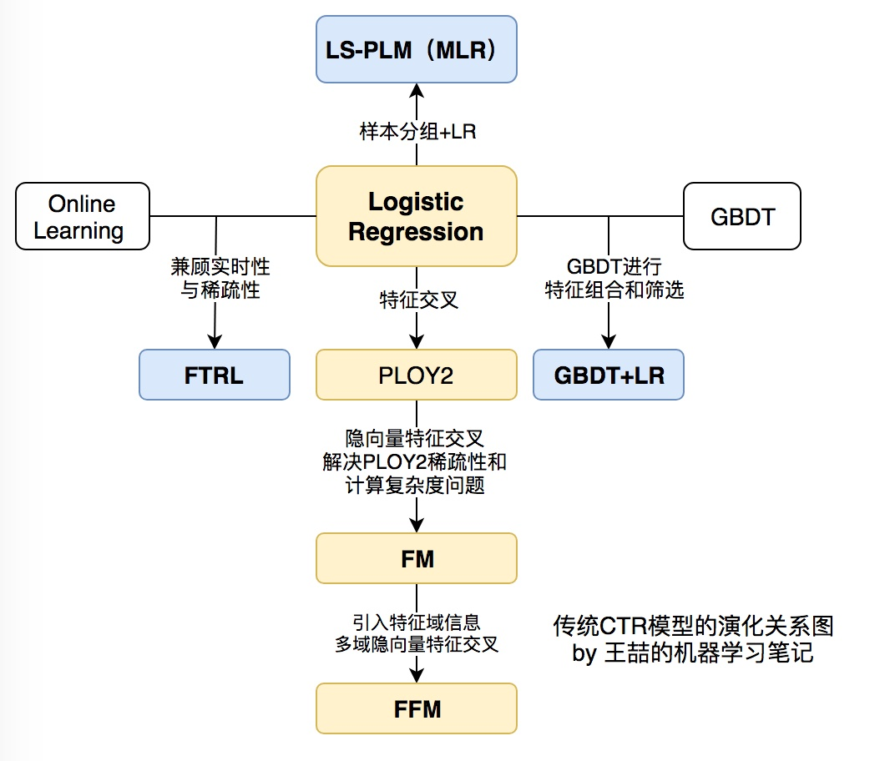

# 前深度学习时代CTR

我想所有从业者谈起深度学习CTR预估模型都有一种莫名的兴奋，但在这之前，认真的回顾前深度学习时代的CTR模型仍是非常必要的。原因有两点：

1、即使是深度学习空前流行的今天，**LR、FM等传统CTR模型仍然凭借其可解释性强、轻量级的训练部署要求、便于在线学习等不可替代的优势，拥有大量适用的应用场景。**模型的应用不分新旧贵贱，熟悉每种模型的优缺点，能够灵活运用和改进不同的算法模型是算法工程师的基本要求。

2、**传统CTR模型是深度学习CTR模型的基础。**深度神经网络（Deep Nerual Network，DNN）从一个神经元生发而来，而LR正是单一神经元的经典结构；此外，影响力很大的FNN，DeepFM，NFM等深度学习模型更是与传统的FM模型有着千丝万缕的联系；更不要说各种梯度下降方法的一脉相承。所以说传统CTR模型是深度学习模型的地基和入口。

下面，我们用传统CTR模型演化的关系图来正式开始技术部分的内容。

看到上面的关系图，有经验的同学可能已经对各模型的细节和特点如数家珍了。中间位置的LR模型向四个方向的延伸分别代表了传统CTR模型演化的四个方向。

1、向下为了解决特征交叉的问题，演化出PLOY2，FM，FFM等模型；

2、向右为了使用模型化、自动化的手段解决之前特征工程的难题，Facebook将LR与GBDT进行结合，提出了GBDT+LR组合模型；

3、向左Google从online learning的角度解决模型时效性的问题，提出了FTRL；

4、向上阿里基于样本分组的思路增加模型的非线性，提出了LS-PLM（MLR）模型。

## Source



