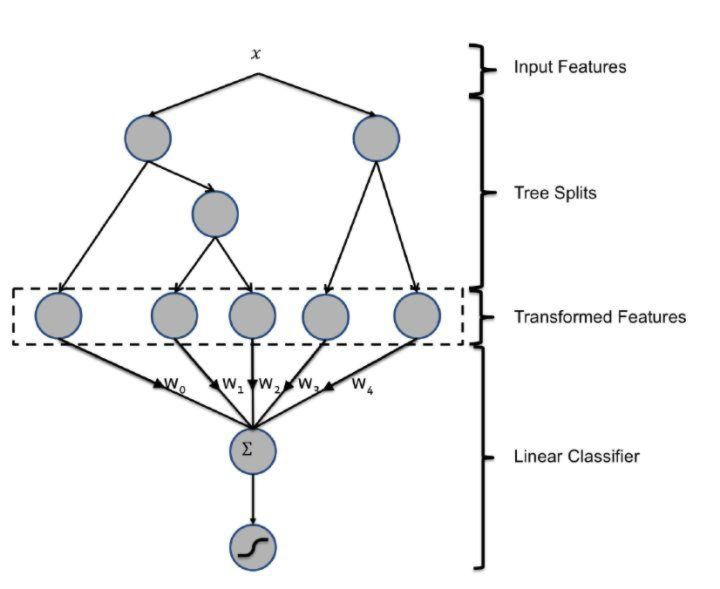
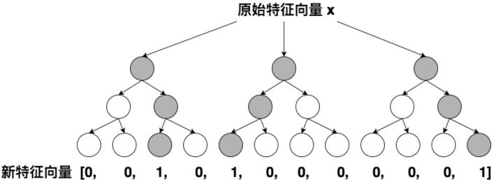
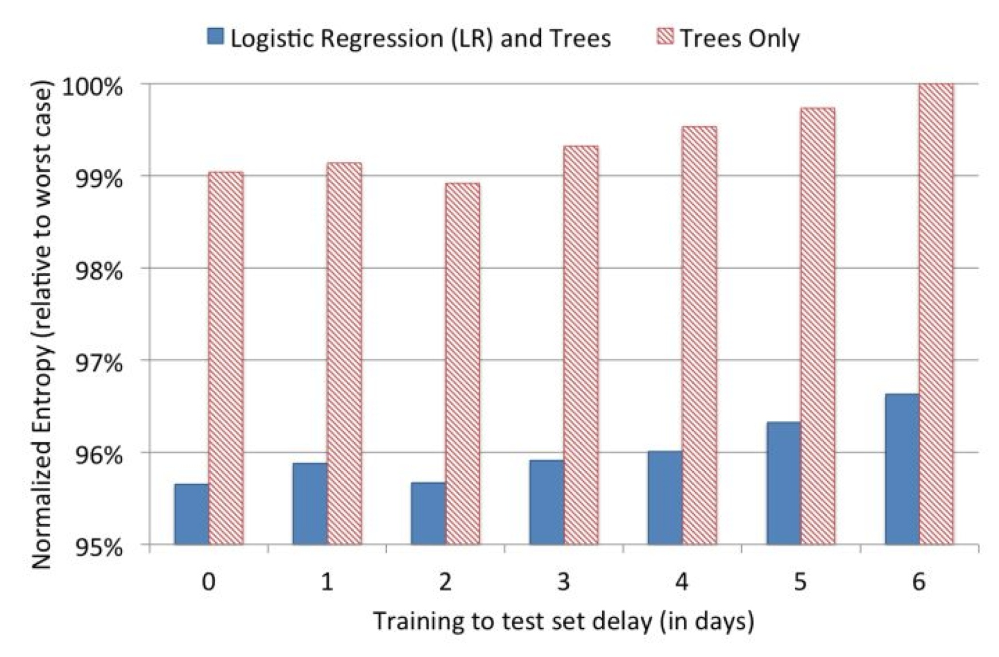

# 特征工程模型化的开端

## GBDT+LR—特征工程模型化的开端

FFM模型采用引入特征域的方式增强了模型的表达能力，但无论如何，FFM只能够做二阶的特征交叉，如果要继续提高特征交叉的维度，不可避免的会发生组合爆炸和计算复杂度过高的情况。那么有没有其他的方法可以有效的处理高维特征组合和筛选的问题？2014年，Facebook提出了基于GBDT+LR组合模型的解决方案。

简而言之，Facebook提出了一种利用GBDT自动进行特征筛选和组合，进而生成新的离散特征向量，再把该特征向量当作LR模型输入，预估CTR的模型结构。

需要强调的是，用GBDT构建特征工程，和利用LR预估CTR两步是独立训练的。所以自然不存在如何将LR的梯度回传到GBDT这类复杂的问题，而利用LR预估CTR的过程前面已经有所介绍，在此不再赘述，下面着重讲解如何利用GBDT构建新的特征向量。

大家知道，GBDT是由多棵回归树组成的树林，后一棵树利用前面树林的结果与真实结果的残差做为拟合目标。每棵树生成的过程是一棵标准的回归树生成过程，因此每个节点的分裂是一个自然的特征选择的过程，而多层节点的结构自然进行了有效的特征组合，也就非常高效的解决了过去非常棘手的特征选择和特征组合的问题。

利用训练集训练好GBDT模型之后，就可以利用该模型完成从原始特征向量到新的离散型特征向量的转化。具体过程是这样的，一个训练样本在输入GBDT的某一子树后，会根据每个节点的规则最终落入某一叶子节点，那么我们把该叶子节点置为 $$1$$ ，其他叶子节点置为 $$0$$ ，所有叶子节点组成的向量即形成了该棵树的特征向量，把GBDT所有子树的特征向量连接起来，即形成了后续LR输入的特征向量。

举例来说，如上图所示，GBDT由三颗子树构成，每个子树有4个叶子节点，一个训练样本进来后，先后落入“子树1”的第3个叶节点中，那么特征向量就是\[0,0,1,0\]，“子树2”的第1个叶节点，特征向量为\[1,0,0,0\]，“子树3”的第4个叶节点，特征向量为\[0,0,0,1\]，最后连接所有特征向量，形成最终的特征向量\[0,0,1,0,1,0,0,0,0,0,0,1\]。

由于决策树的结构特点，事实上，决策树的深度就决定了特征交叉的维度。如果决策树的深度为4，通过三次节点分裂，最终的叶节点实际上是进行了3阶特征组合后的结果，如此强的特征组合能力显然是FM系的模型不具备的。但由于GBDT容易产生过拟合，以及GBDT这种特征转换方式实际上丢失了大量特征的数值信息，因此我们不能简单说GBDT由于特征交叉的能力更强，效果就比FFM好，在模型的选择和调试上，永远都是多种因素综合作用的结果。

GBDT+LR比FM重要的意义在于，**它大大推进了特征工程模型化这一重要趋势**，某种意义上来说，之后深度学习的各类网络结构，以及embedding技术的应用，都是这一趋势的延续。

在之前所有的模型演化过程中，实际上是从特征工程这一角度来推演的。接下来，我们从时效性这个角度出发，看一看模型的更新频率是如何影响模型效果的。

在模型更新这个问题上，我们的直觉是模型的训练时间和serving时间之间的间隔越短，模型的效果越好，为了证明这一点，facebook的工程师还是做了一组实效性的实验（如上图），在结束模型的训练之后，观察了其后6天的模型loss（这里采用normalized entropy作为loss）。可以看出，模型的loss在第0天之后就有所上升，特别是第2天过后显著上升。因此daily update的模型相比weekly update的模型效果肯定是有大幅提升的。

如果说日更新的模型比周更新的模型的效果提升显著，我们有没有方法实时引入模型的效果反馈数据，做到模型的实时更新从而进一步提升CTR模型的效果呢？Google 2013年应用的FTRL给了我们答案。

## Source



