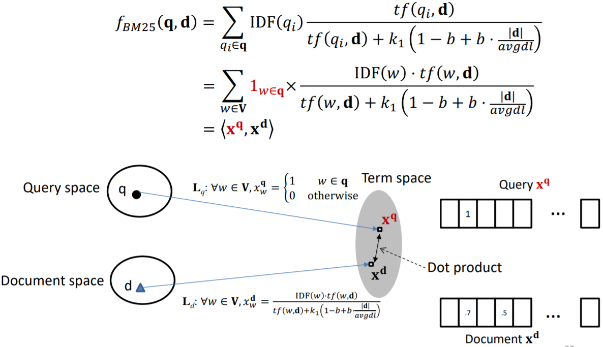

# 传统匹配模型

## 匹配与排序关系

在传统的信息检索\(Information Retrieval\)领域，排序和匹配基本可以划等号：

                                     $$f(q,d)=f_{\text{BM25}}(q,d)$$ 或者 $$f(q,d)=f_{\text{LMIR}}(d|q)$$

在Web搜索中，排序和匹配是分开的，比如Learning to rank将匹配作为排序的特征：

                                      $$f(q,d)=f_{\text{BM25}}(q,d)+\text{PageRank}(d)+\cdots$$ 

## Matching by query formulation

## Matching with term dependency

## Matching with topic model

## Matching in latent space model

### BM25: Matching in Term Space

### Matching in Latent Space

## Matching with translation model

## Source







