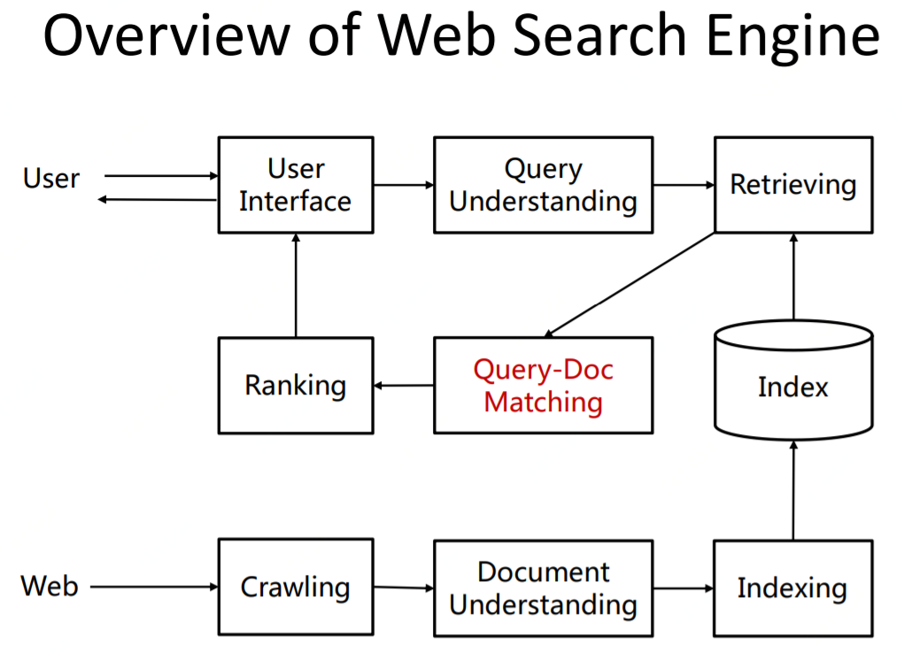
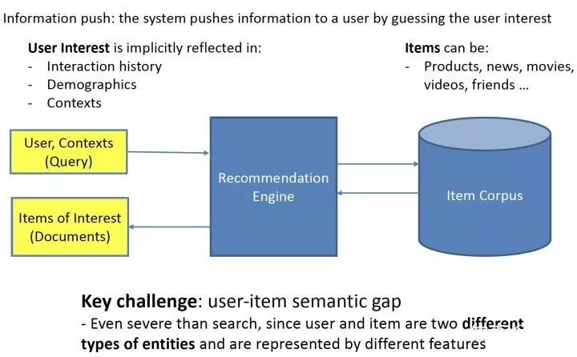
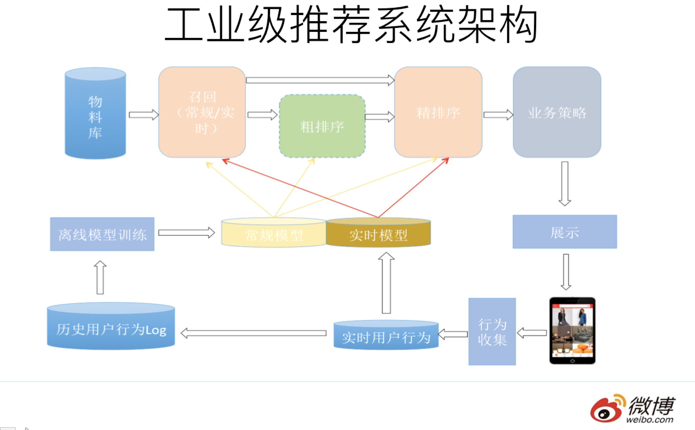
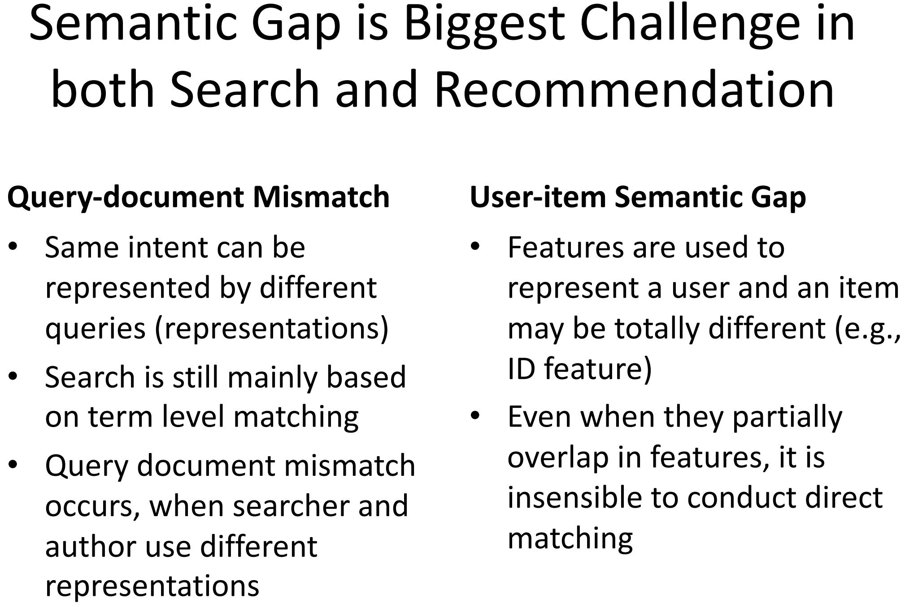

# 搜索推荐

## 搜索架构

搜索引擎的总体架构如下图，根据用户的特定需求返回相应的信息，即有特定query：

最为广泛的应用即网站搜索引擎，如Google、Bing、百度等，总体流程如下：

1. 第一步：先爬取线上各种网站，进行内容理解后建立索引放入存储。
2. 第二步：用户输入query，进行query理解后进行query-doc匹配从存储中获取内容之后进行排序推送给用户。

## 推荐架构

推荐系统是由系统来根据用户过去的行为、用户的属性（年龄、性别、职业等）、上下文等来猜测用户的兴趣，给用户推送物品（包括电商的宝贝、新闻、电影等）。推荐一般是非主动触发的，和搜索的主动触发不一样（搜索一般有主动提供的query）；也有小部分情况，用户有提供query：例如用户在电商里搜索一个商品后，结果页最底下推荐给用户的商品，这种情况算是有提供query。

直观写成公式，即 $$f(X_{\text{User Feature}},Y_{\text{Item Feature}})\to 0/1$$ 。通过用户特征信息和候选推荐品找到这样一个映射， $$0$$ 表示未点击或未购买等， $$1$$ 表示点击有浏览了或下单购买了。

推荐系统涉及到的两大实体：user和item往往是不同类型的东西，例如user是人，item是电商的宝贝，他们表面上的特征可能是没有任何的重叠的，这不同于搜索引擎里的query和doc都是文本：

正是由于user和item不同类型的东西，所以推荐里匹配可能比搜索里的更难。

### 推荐系统架构

推荐算法的核心主要分为两个阶段：召回阶段（retrieval）和排序阶段（ranking）。之所以分为两个阶段，主要是从性能考虑。召回阶段面临的是百万级别甚至千万级别的文章，单篇文章的性能开销必须要小；而排序阶段的算法则非常消耗资源，不可能对所有文章都算一遍，也没有必要这样做，因为一般来说通不过召回粗选的文章，大部分在排序阶段排名也会很低。

召回阶段，根据用户的历史行为和短期行为，分析用户的兴趣偏好，从千万级的文章库中挑选出一个小的候选集（通常几百到几千篇文章），这些候选集都是用户感兴趣的内容集合。

排序阶段，在召回集的基础上进行更加精准的个性化计算，给每篇文章进行精确打分，这个分值就是文章与用户的个性化匹配分值，利用该分值进行排序，进而从几千篇文章中选出用户最感兴趣的几篇或者几十篇少量高质量内容。

推荐算法的核心部分两个阶段组成如图所示，大致包含： 

（1）用户画像：包含用户的人口属性（性别，学历等）、历史行为、短期行为、兴趣内容和个人偏好等多个维度的数据，是给用户做个性化推荐的基础。

（2）特征工程：包含文章的类别属性、主题属性、关键词信息、内容分析、人群偏好和统计特征等比较全面的描述和度量，是新闻内容和质量分析的基础，也是做好用户与文章个性化匹配的基础。

（3）召回算法：包含多个通道的召回模型，例如协同过滤（itemcf、usercf等）、主题模型、内容召回、矩阵分解等。

（4）排序算法：对多个通道召回的内容进行统一的打分排序，选出最优的少量结果，这里常用的模型有lr、gbdt、fm以及DNN的一些模型。

除此之外，推荐系统一般还要有一个rerank的过程，要兼顾推荐结果的多样性、新鲜度、惊喜度以及部分的人工的产品逻辑等多个维度，更能够满足用户个性化的需求。

一个典型的工业级推荐系统整体架构可以参考上图，一般分为在线部分，近线部分和离线部分。

对于在线部分来说，一般要经历几个阶段。首先通过召回环节，将给用户推荐的物品降到千以下规模；如果召回阶段返回的物品还是太多，可以加入粗排阶段，这个阶段是可选的，粗排可以通过一些简单排序模型进一步减少往后续环节传递的物品；再往后是精排阶段，这里可以使用复杂的模型来对少量物品精准排序。对某个用户来说，即使精排推荐结果出来了，一般并不会直接展示给用户，可能还要上一些业务策略，比如去已读，推荐多样化，加入广告等各种业务策略。之后形成最终推荐结果，将结果展示给用户。

对于近线部分来说，主要目的是实时收集用户行为反馈，并选择训练实例，实时抽取拼接特征，并近乎实时地更新在线推荐模型。这样做的好处是用户的最新兴趣能够近乎实时地体现到推荐结果里。

对于离线部分而言，通过对线上用户点击日志的存储和清理，整理离线训练数据，并周期性地更新推荐模型。对于超大规模数据和机器学习模型来说，往往需要高效地分布式机器学习平台来对离线训练进行支持

因为粗排是可选的，对于大多数推荐系统来说，通常在线部分的主体分为两个阶段就够，第一个阶段是召回，第二个阶段是排序。因为个性化推荐需要给每个用户展现不同的信息流或者物品流，而对于每个用户来说，可供推荐的物品，在具备一定规模的公司里，是百万到千万级别，甚至上亿。所以对于每一个用户，如果对于千万级别物品都使用先进的模型挨个进行排序打分，明显速度上是算不过来的，资源投入考虑这么做也不划算。从这里可以看出，召回阶段的主要职责是：从千万量级的候选物品里，采取简单模型将推荐物品候选集合快速筛减到千级别甚至百级别，这样将候选集合数量降下来，之后在排序阶段就可以上一些复杂模型，细致地对候选集进行个性化排序。

从上面在线推荐两阶段任务的划分，我们可以看出，召回阶段因为需要计算的候选集合太大，所以要想速度快，就只能上简单模型，使用少量特征，保证泛化能力，尽量让用户感兴趣的物品在这个阶段能够找回来；而排序阶段核心目标是要精准，因为它处理的物品数据量小，所以可以采用尽可能多的特征，使用比较复杂的模型，一切以精准为目标。

### 召回阶段

召回最重要的要求是性能要好，一般不超过30ms。 召回策略的种类有很多，我们主要用的是倒排的思路：离线维护一个倒排索引，这个倒排的key可以是分类，topic，关键词，媒体来源等文章属性；也可以是协同过滤计算的结果，排序时需要考虑点击率、时效性、相关性等。线上召回可以迅速从倒排中根据用户的画像标签对内容进行截断召回，高效地从很大的内容库中筛选和用户比较匹配的一小部分内容。

#### 基于内容的召回

基于内容的召回（content-base），是根据文章内容本身的语义特征或者字面特征做召回，这类特征通常有关键词，topic，分类，媒体来源等。

#### 基于协同过滤召回

协同过滤算法（CF）的原理是汇总所有用户（user）和文章（item）的行为，利用集体智慧进行推荐。主要分为两大类，User-CF和Item-CF。

User-CF，就像朋友推荐，比如通过用户点击的文章进行分析，发现用户A和用户B很相似，就可以把A点击文章而用户B还未点击的，推荐给用户B，这里重点是找出用户的朋友，即相似用户。

Item-CF，分析每篇文章的点击行为，可以得出所有文章之间的相似度，找出与当前点击的文章最相似的N篇文章推荐给用户。

#### 基于矩阵分解召回

协同过滤的核心是相似度计算，比较依赖用户行为，而在实际应用中，一方面，用户行为矩阵比较稀疏，计算结果不稳定，另一方面如果用户u没有对文章i的相似度得分，那么这个协同结果差异会很大。而这些问题在矩阵分解中可以得到很好的解决。

矩阵分解，直观上就是把稀疏的用户评分矩阵近似的分解成两个小矩阵的乘积，在推荐计算时不再使用大矩阵而是使用分解得到的两个小矩阵。

常用的矩阵分解算法有SVD、SVD++、timeSVD++以及Spark自带的SparkALS等，学习过程基本相同，大致如下： 

（1）准备好用户文章评分矩阵，点击曝光数据模拟评分（1、0） 

（2）随机初始化来构造矩阵U和V 

（3）用U和V计算预测后的分数，然后计算与实际分数的误差 

（4）按照梯度下降方式更新U和V的元素值 

（5）重复步骤3和4直到到达停止条件

最后会生成user\_weight user\_vector和doc\_weight doc\_vector的模型文件，在召回计算的时候使用user向量矩阵和doc向量矩阵做内积，排序取topN。矩阵分解相比CF预测精度更高，但其缺点也很明显，推荐结果的解释性不好而且受限于矩阵维度。

#### 基于热点召回

热点召回一般用来做兜底，但是热点不能单纯的按ctr排序，因为文章的曝光不同，ctr不具有可比性，通常的做法有威尔逊置信区间、贝叶斯平滑、时间衰减等

#### 多路召回策略

目前工业界的推荐系统，在召回阶段，一般都采取多路召回策略。上图展示了一个简化版本的例子，以微博信息流排序为例，不同业务召回路数不太一样，但是常用的召回策略，基本都会包含，比如兴趣标签，兴趣Topic，兴趣实体，协同过滤，热门，相同地域等，多者几十路召回，少者也有7／8路召回。

对于每一路召回，会拉回K条相关物料，这个K值是个超参，需要通过线上AB测试来确定合理的取值范围。如果你对算法敏感的话，会发现这里有个潜在的问题，如果召回路数太多，对应的超参就多，这些超参组合空间很大，如何设定合理的各路召回数量是个问题。另外，如果是多路召回，这个超参往往不太可能是用户个性化的，而是对于所有用户，每一路拉回的数量都是固定的，这里明显有优化空间。按理说，不同用户也许对于每一路内容感兴趣程度是不一样的，更感兴趣的那一路就应该多召回一些，所以如果能把这些超参改为个性化配置是很好的，但是多路召回策略下，虽然也不是不能做，但是即使做，看起来还是很Trick的。

### 排序阶段

## 搜索推荐对比及难点

### 搜索推荐对比

### 最大难点-语义差距

## 机器学习的应用

## Source









