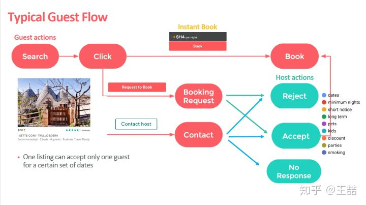
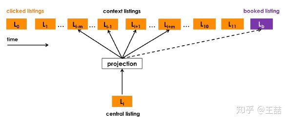
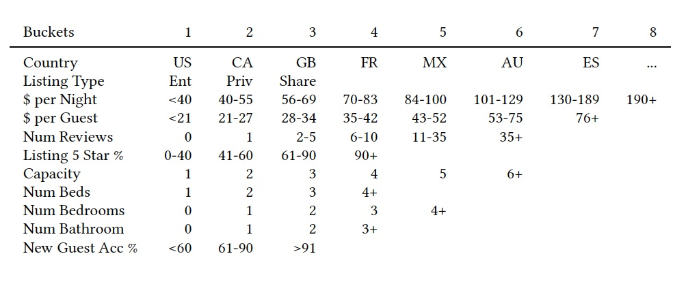
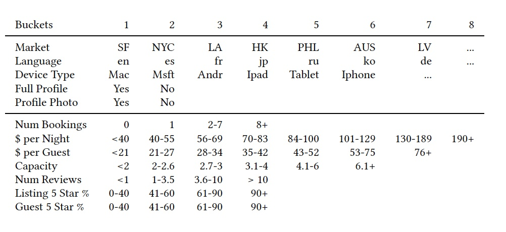
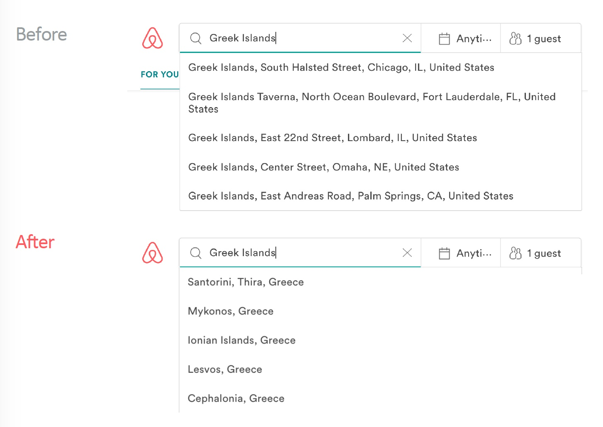
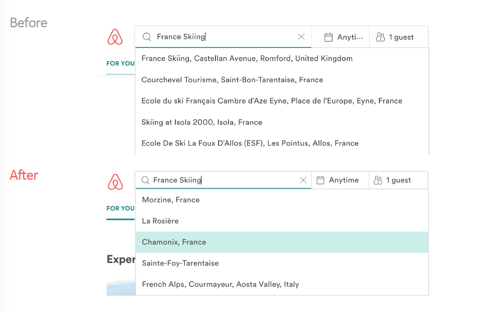
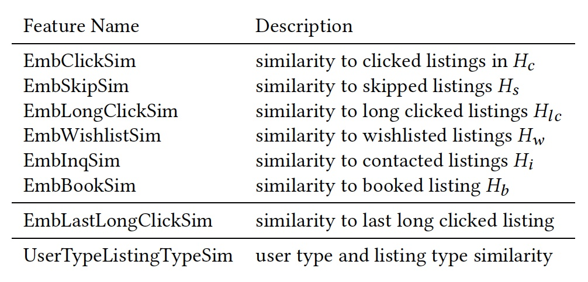
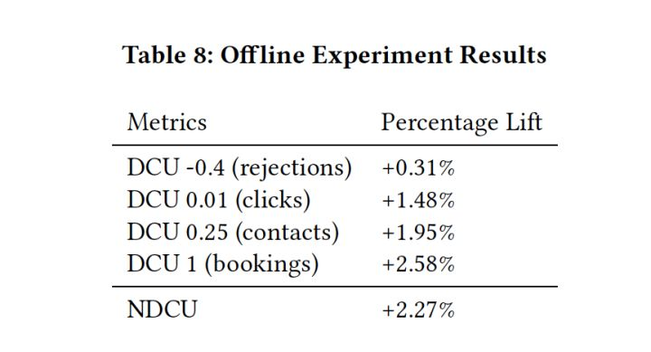
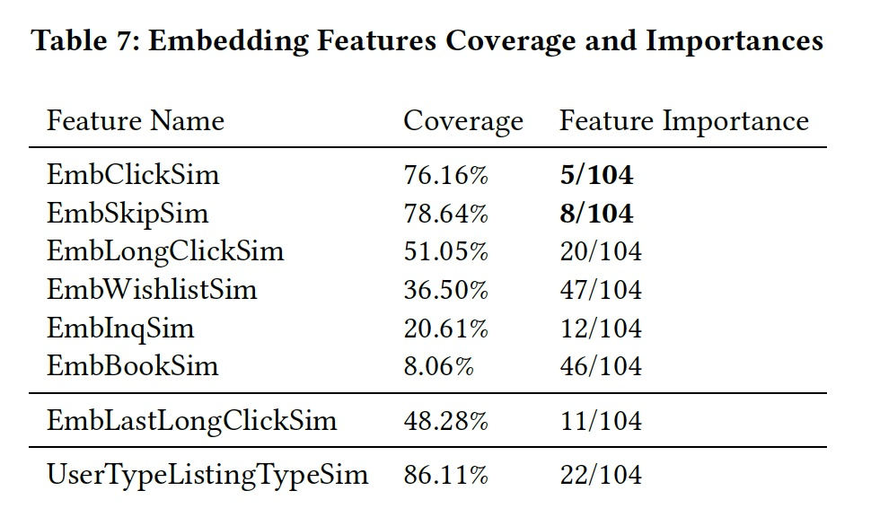
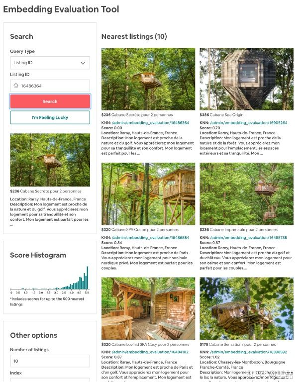

# Embedding应用

这里主要基于[王喆](https://github.com/wzhe06)对于2018年[KDD Best Paper](https://dl.acm.org/citation.cfm?id=3219885)的分析进行整理。airbnb并没有直接把embedding similarity直接得到搜索结果，而是基于embedding得到不同的user-listing pair feature，然后输入搜索排序模型，得到最终的排序结果。

## 业务场景

Airbnb作为全世界最大的短租网站，提供了一个连接房主（host）挂出的短租房（listing）和主要是以旅游为目的的租客（guest/user）的中介平台。这样一个中介平台的交互方式比较简单，guest输入地点，价位，关键词等等，Airbnb会给出listing的搜索推荐列表：

容易想见，接下来guest和host之间的交互方式无非有这样几种：

1. guest点击listing （click）
2. guest预定lising （book）
3. host有可能拒绝guest的预定请求 （reject）

基于这样的场景，利用几种交互方式产生的数据，Airbnb的search团队要构建一个real time的ranking model。为了捕捉到用户short term以及long term的兴趣，Airbnb并没有把user history的clicked listing ids或者booked listing ids直接输入ranking model，而是先对user和listing进行了embedding，进而利用embedding的结果构建出诸多feature，作为ranking model的输入。这篇文章的核心内容就是介绍如何生成listing和user的embedding。

## Embedding

具体到embedding上，文章通过两种方式生成了两种不同的embedding分别capture用户的short term和long term的兴趣。

1. 一是通过click session数据生成listing的embedding，生成这个embedding的目的是为了进行listing的相似推荐，以及对用户进行session内的实时个性化推荐。
2. 二是通过booking session生成user-type和listing-type的embedding，目的是捕捉不同user-type的long term喜好。由于booking signal过于稀疏，Airbnb对同属性的user和listing进行了聚合，形成了user-type和listing-type这两个embedding的对象。

### [通过click session数据生成embedding捕捉短期兴趣](https://zhuanlan.zhihu.com/p/55149901)

Airbnb采用了click session数据对listing进行embedding，其中click session指的是一个用户在一次搜索过程中，点击的listing的序列，这个序列需要满足两个条件，一个是只有停留时间超过30s的listing page才被算作序列中的一个数据点，二是如果用户超过30分钟没有动作，那么这个序列会断掉，不再是一个序列。

这么做的目的无可厚非，一是清洗噪声点和负反馈信号，二是避免非相关序列的产生。

有了由clicked listings组成的sequence，就像我们在之前专栏文章中讲过的item2vec方法一样，我们可以把这个sequence当作一个“句子”样本，开始embedding的过程。Airbnb不出意外的选择了word2vec的skip-gram model作为embedding方法的框架。通过修改word2vec的objective使其靠近Airbnb的业务目标。

我们假设大家已经具备了基本知识，这里直接列出word2vec的skip-gram model的objective如下：

在采用negative sampling的训练方式之后，objective转换成了如下形式：

其中 $$\sigma$$ 函数代表的就是我们经常见到的sigmoid函数， $$D$$ 是正样本集合， $$D'$$ 是负样本集合。我们再详细看一下上面word2vec这个objective function，其中前面的部分是正样本的形式，后面的部分是负样本的形式（仅仅多了一个负号）。

为什么原始的objective可以转换成上面的形式，其实并不是显然的，感兴趣的同学可以参考这篇文章， [Negative-Sampling Word-Embedding Method](https://github.com/wzhe06/Reco-papers/blob/master/Famous%20Machine%20Learning%20Papers/%5BW2V%5DNegative-Sampling%20Word-Embedding%20Method.pdf)。这里，我们就以word2vec的objective function为起点，开始下面的内容。

转移到Airbnb这个问题上，正样本很自然的取自click session sliding window里的两个listing，负样本则是在确定central listing后随机从语料库（这里就是listing的集合）中选取一个listing作为负样本。

因此，Airbnb初始的objective function几乎与word2vec的objective一模一样，形式如下：

（给大家出个脑筋急转弯，为啥Airbnb objective的正样本项前面是负号，原始的word2vec objective反而是负样本项前面是负号，是Airbnb搞错了吗？）

在原始word2vec embedding的基础上，针对其业务特点，Airbnb的工程师希望能够把booking的信息引入embedding。这样直观上可以使Airbnb的搜索列表和similar item列表中更倾向于推荐之前booking成功session中的listing。从这个motivation出发，Airbnb把click session分成两类，最终产生booking行为的叫booked session，没有的称做exploratory session。

因为每个booked session只有最后一个listing是booked listing，所以为了把这个booking行为引入objective，我们不管这个booked listing在不在word2vec的滑动窗口中，我们都会假设这个booked listing与滑动窗口的中心listing相关，所以相当于引入了一个global context到objective中，因此，objective就变成了下面的样子

其中最后一项的lb就是代表着booked listing，因为booking是一个正样本行为，这一项前也是有负号的。

需要注意的是最后一项前是没有sigma符号的，前面的sigma符号是因为滑动窗口中的中心listing与所有滑动窗口中的其他listing都相关，最后一项没有sigma符号直观理解是因为booked listing只有一个，所以central listing只与这一个listing有关。

但这里的objective的形式我仍让是有疑问的，因为这个objective写成这种形式应该仅代表了一个滑动窗口中的objective，并不是整体求解的objective。如果是整体的objective，理应是下面的形式：

其中 $$D_b$$ 代表了所有booked session中所有滑动窗口中central listing和booked listing的pair集合。

下面这一项就比较容易理解了，为了更好的发现同一市场（marketplace）内部listing的差异性，Airbnb加入了另一组negative sample，就是在central listing同一市场的listing集合中进行随机抽样，获得一组新的negative samples。同理，我们可以用跟之前negative sample同样的形式加入到objective中。

其中 $$D_{m_n}$$ 就是新的同一地区的negative samples的集合。

至此，lisitng embedding的objective就定义完成了，embedding的训练过程就是word2vec negative sampling模型的标准训练过程，这里不再详述。

### [通过booking session数据生成embedding捕捉长期兴趣](https://zhuanlan.zhihu.com/p/57313656)

为了捕捉用户的长期偏好，airbnb在这里使用了booking session序列。比如用户j在过去1年依次book过5个listing，那么其booking session就是 $$s_j=(l_{j1}, l_{j2}, l_{j3}, l_{j4}, l_{j5})$$ 。既然有了booking session的集合，我们是否可以像之前对待click session一样拿直接应用w2v的方法得到embedding呢？答案是否定的，因为我们会遇到非常棘手的数据稀疏问题。

具体来讲booking session的数据稀疏问题表现在下面三点上：

1. book行为的总体数量本身就远远小于click的行为，所以booking session集合的大小是远远小于click session的
2. 单一用户的book行为很少，大量用户在过去一年甚至只book过一个房源，这导致很多booking session sequence的长度为1
3. 大部分listing被book的次数也少的可怜，大家知道word2vec要训练出较稳定有意义的embedding，item最少需要出现5-10次，但大量listing的book次数少于5次，根本无法得到有效的embedding。

Airbnb如何解决如此严重的数据稀疏问题，训练出有意义的user embedding和listing embedding呢？

 他们给出的答案是**基于某些属性规则做相似user和相似listing的聚合**。

举例来说，listing的属性如下表所示：

那么我们就可以用属性名和bucket id组成一个属性标识，比如说某个listing的国家是US，类型（listing type）是Ent（bucket 1），每晚的价格（per night）是56-59美金（bucket3），那么就可以用US\_lt1\_pn3来表示该listing的listing\_type。

user\_type的定义同理，我们可以看一下airbnb用了什么用户属性，从上表中我们看到有device type，是否填了简介，有没有头像照片，之前定过的平均价位等等，可以看出都是一些非常基础和通用的属性，这对于我们来说也有借鉴意义，因为任何网络服务都可以很容易的找出这些属性。

有了user type和listing type之后，一种直观的生成新的booking session sequence的方式是这样，直接把user type当作原来的user id，生成一个由listing type组成的booking session。这种方法能够解决数据稀疏性的问题，却无法直接得到user type embedding。为了让user type embedding和listing type embedding在同一个vector space中生成，airbnb采用了一种比较“反直觉”的方式。

针对某一user id按时间排序的booking session， $$(l_1,l_2,...,l_M)$$ ，我们用（user\_type, listing\_type）组成的元组替换掉原来的listing item，因此sequence变成$$((u_{type1},l_{type1}),(u_{type2},l_{type2}),\dots,(u_{typeM},l_{typeM})) $$，这里 __$$ l_{type1}$$ 指的就是listing l1对应的listing type， $$u_{type1} $$ 指的是该user在book listing l1时的user type，由于某一user的user\_type会随着时间变化，所以 __$$u_{type1},u_{type2}$$ 不一定相同。

有了该sequence的定义，下面的问题就是如何训练embedding使得user type和listing type在一个空间内了。训练所用的objective完全沿用了上一篇文章的objective的形式，但由于我们用一个（user type，listing type）的元组替换掉了原来的listing，如何确定central item就成为了一个核心问题。针对该问题，文章的原话是这么说的。

> instead of listing l , the center item that needs to be updated is either user\_type \(ut\) or listing\_type \(lt\) depending on which one is caught in the sliding window.

这个表述很有意思但也比较模糊，就是说在通过sliding window的形式计算objective的时候，central item可以是user type 也可以是listing type，这取决于我们在sliding window中“抓住”了哪个。

**什么叫“抓住”？如何“抓住”，文章没有给出精确的定义，非常欢迎大家作出自己的解读。**这里我先给出我的猜测。

因为文章之后列出了central item分别是user type和item type时的objective如下

其中 $$ D_{book} $$ 是central item附近的user type和item type的集合。如果这样的话，这两个objective是完全一样的。

所以我推测airbnb应该是把所有元组扁平化了一下，把user type和item type当作完全相同的item去训练embedding了，如果是这样的话二者当然是在一个vector space中。虽然整个过程就很tricky，但也不失为一个好的工程解决办法。

接下来为了引入“房主拒绝”（reject）这个action，airbnb又在objective中加入了reject这样一个negative signal，方法与上一篇文章中加入negative signal的方法相同，在此不再赘述。

其实除了计算user embedding外，airbnb在分享的slides中提到他们还直接把query embedding了，从最后的搜索效果来看，query embedding跟listing embedding也是处于一个vector space，大家可以从下图中看出embedding方法的神奇。

可以看到，在引入embedding之前，搜索结果只能是文本上的关键词搜索，引入embedding之后，搜索结果甚至能够捕捉到搜索词的语义信息。比如输入France Skiing，虽然结果中没有一个listing带有Skiing这个关键词，但这个结果无一例外都是法国的滑雪胜地，这无疑是更接近用户动机的结果。

在这篇Slides中Airbnb并没有具体介绍是如何生成query embedding，大家可以思考一下query embedding的具体生成过程。

## 排序搜索模型和特征

airbnb采用的搜索排序模型是一个pairwise的支持Lambda Rank的GBDT模型。该模型已经由airbnb的工程师开源，感兴趣的同学可以去学习一下（[github地址](https://github.com/yarny/gbdt)）。至于什么是pairwise，什么是LambdaRank，不是本文的重点，不做过多介绍，感兴趣的同学可以自行学习。

我们关注的重点回到特征工程上来，airbnb基于embedding生成了哪些feature呢？这些feature又是如何驱动搜索结果的“实时”个性化呢？

下面列出了基于embedding的所有feature

我们可以很清楚的看到，最后一个feature UserTypeListingTypeSim指的是 user type和listing type的similarity，该feature使用了我们这篇文章介绍的包含用户长期兴趣的embedding，除此之外的其他feature都是基于上篇文章介绍的listing embedding。比如EmbClickSim指的是candidate listing与用户最近点击过的listing的相似度。

这里我想我们可以回答这个问题了，为什么airbnb在文章题目中强调是real time personalization？原因就是由于在这些embedding相关的feature中，我们加入了“最近点击listing的相似度”，“最后点击listing的相似度”这类特征，由于这类特征的存在，用户在点击浏览的过程中就可以得到实时的反馈，搜索结果也是实时地根据用户的点击行为而改变，所以这无疑是一个real time个性化系统。

最后贴出引入embedding前后airbnb搜索排序模型的效果提升以及各feature的重要度，大家可以做参考。

## 冷启动问题

文章多介绍了一下cold start的问题。简言之，如果有new listing缺失embedding vector，就找附近的3个同样类型、相似价格的listing embedding进行平均得到，不失为一个实用的工程经验。

为了对embedding的效果进行检验，Airbnb还实现了一个tool，我们简单贴一个相似embedding listing的结果。

从中可以看到，embedding不仅encode了price，listing-type等信息，甚至连listing的风格信息都能抓住，说明即使我们不利用图片信息，也能从用户的click session中挖掘出相似风格的listing。

至此我们介绍完了Airbnb利用click session信息对listing进行embedding的方法。写到这里笔者基本要断气了，下一篇我们再接着介绍利用booking session进行user-type和listing-type embedding的方法，以及Airbnb如何把这些embedding feature整合到最终的search ranking model中的方法。

## Source





