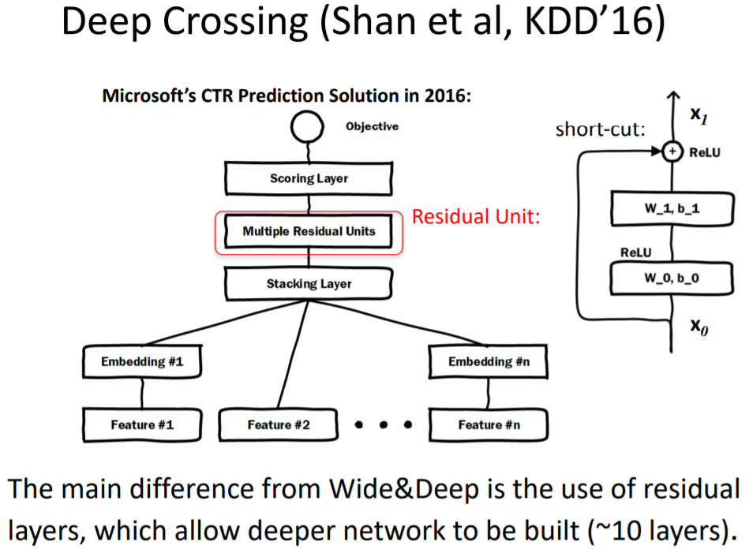
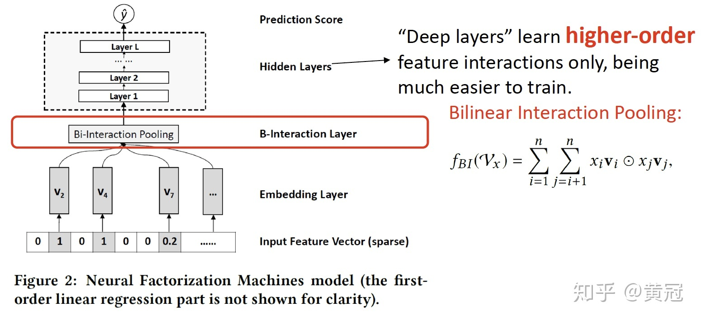

# 基于特征

推荐里的特征向量往往是高维稀疏的，例如CF中feature vector = user\_ID + item\_ID。对于这些高维稀疏特征来说，抓取特征特征之间的组合关系非常关键：

* 二阶特征组合：

  * users like to use food delivery apps at meal-time
  * app category和time之间的二阶组合

  三阶特征组合：

  * male teenagers like shooting games
  * gender, age, 和app category之间的三阶组合

对于feature-based的方法来说，能抓取特征的交互作用和关系非常重要。

## **Based on Multi-Layer Perceptron**

### \*\*\*\*[**Wide&Deep \(Cheng et al, Recsys’16\)**](https://arxiv.org/abs/1606.07792)\*\*\*\*

这个模型主要是将LR和DNN一起联合训练，注意是联合训练，一般的ensemble是两个模型是单独训练的。思想主要是：

* LR擅长记忆；DNN擅长泛化（包括抓取一些难以人工设计的交叉特征）

  LR部分需要大量的人工设计的feature，包括交叉特征

### \*\*\*\*[**Deep Crossing \(Shan et al, KDD’16\)**](https://www.kdd.org/kdd2016/papers/files/adf0975-shanA.pdf)\*\*\*\*

这篇论文和wide&deep的主要差别是加了残差连接：

### **Empirical Evidence \(He and Chua, SIGIR’17\)**

这篇论文主要想说明两点：

* 如果只有raw feature，如果没有人工设计的特征，DNN效果并不够好

  如果没有很好的初始化，DNN可能连FM都打不过。如果用FM的隐向量来初始化DNN，则DNN的效果比FM好

## **Based on Factorization Machines\(FM\)**

### **NFM: Neural Factorization Machine\(He and Chua, SIGIR’17\)**

这个模型主要是，将FM里的二阶特征组合放到NN里，后面再接几层FC学习更高阶的特征组合。具体方法是：两两特征进行组合，即进行element-wise dot，得到一个K维的向量，然后所有组合的K维向量进行加和，得到一个K维的向量，往后再接几个FC，模型结构图如下：

效果上，该模型完爆了之前没有手工做特征组合的模型和FM：

### **AFM: Attentional Factorization Machine\(Xiao et al, IJCAI’17\)**

这个模型主要是针对FM的不同特征的组合的结果的简单加和，变成加权平均，用attention来求权重（有利于提取重要的组合特征；NFM是使用MLP来学习不同特征组合的权重，且没有归一化的过程）：

模型的整体结构图如下：

效果上，不带隐层的AFM就能干掉带一层隐层的NFM。如果增加隐层，AFM的效果能进一步提升：

### **DeepFM \(Guo et al., IJCAI’17\)**

这一篇论文主要是将wide&deep的LR替换成FM，FM可以抓取二阶的特征组合关系，而DNN可以抓取更高阶的特征组合关系：

对上述的feature-based的方法做个简单总结：

* 特征交互对matching function learning非常关键

  早期的对raw feature进行交叉，对效果提升非常有用：

  * wide&deep是手工进行组合
  * FM-based的模型是自动进行组合

  用DNN可以用来学习高阶的特征组合，但可解释性差。怎么学习可解释性好的高阶组合特征，依然是一个大的挑战。

## Source





