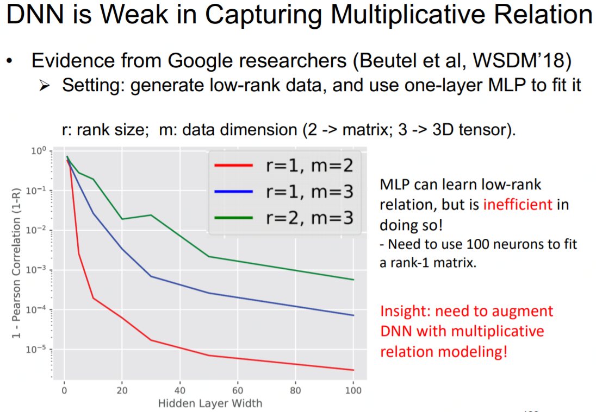
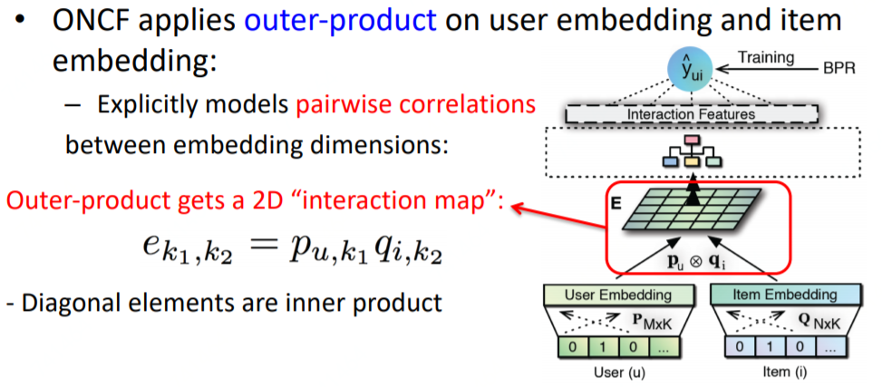
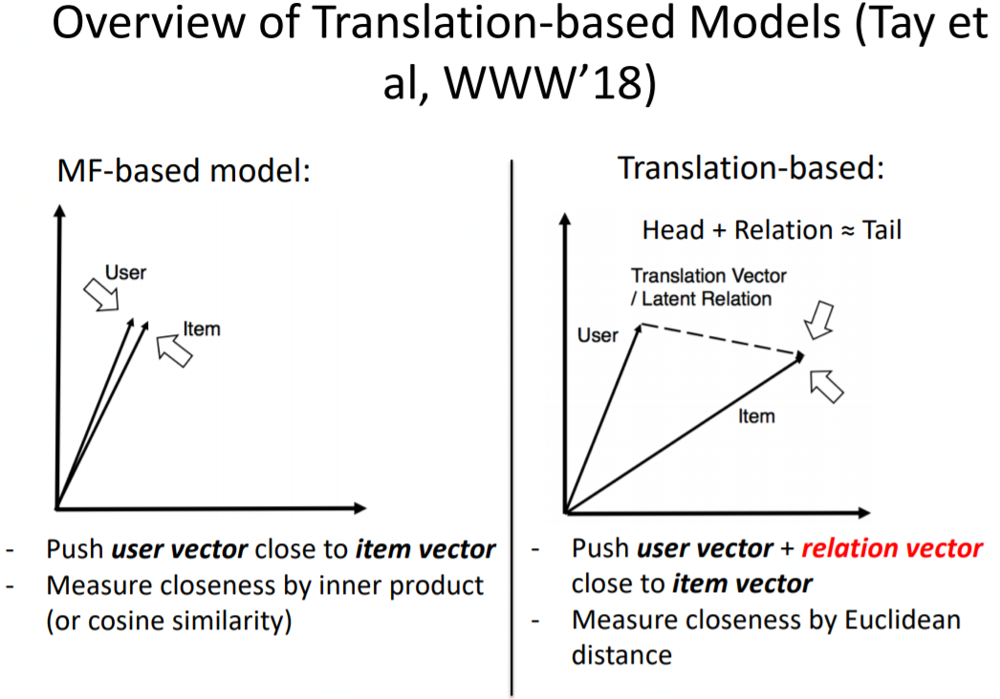
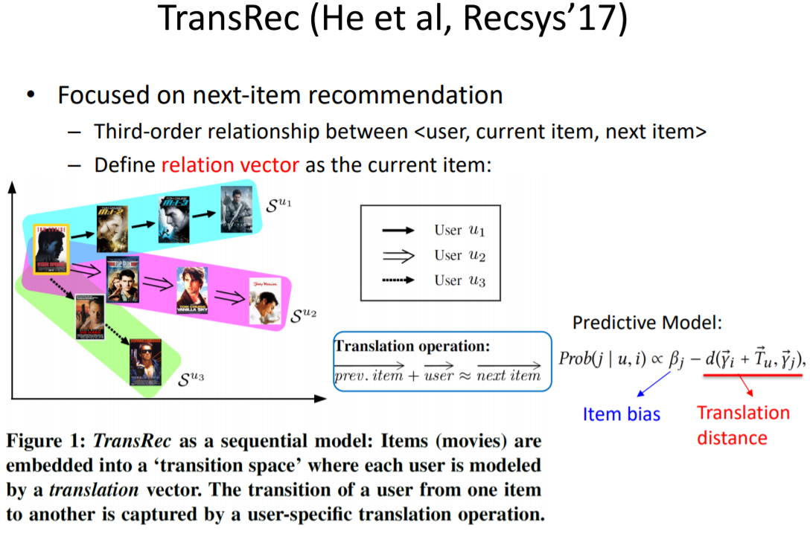

# 协同过滤

## **Based on Neural Collaborative Filtering\(NCF\) framework**

### [Neural Collaborative Filtering Framework \(He et al, WWW’17\)](https://www.comp.nus.edu.sg/~xiangnan/papers/ncf.pdf)

这篇论文是使用NN来学习match function的通用框架：

这篇论文的模型就是将user的embedding和item的embedding concat到一起，然后用几层FC来学习他们的匹配程度。

然而很不幸的是，MLP在抓取多阶信息的时候，表现并不好，MLP效果并没有比内积好。有一篇论文证明了，MLP在抓取多阶的信息的时候，表现并不好：

这篇论文要说的是，即使是二维的1阶的数据，也需要100个节点的一层FC才能比较好的拟合；而如果是2阶的数据，100个节点的一层FC拟合得非常差，所以MLP在抓取多阶信息上并不擅长。

#### [NeuMF: Neural Matrix Factorization \(He et al, WWW’17\)](http://papers.www2017.com.au.s3-website-ap-southeast-2.amazonaws.com/proceedings/p173.pdf)

这篇论文其实是MF和MLP的一个融合，MF适合抓取乘法关系，MLP在学习match function上更灵活：

user和item分别用一个单独的向量做内积（element-wise product，没求和）得到一个向量v1；然后user和item分别另外用一个单独的向量，通过几层FC，融合出另外一个向量v2，然后v1和v2拼接\(concat\)到一起，再接一个或多个FC就可以得到他们的匹配分。

### [ONCF: Outer-Product based NCF \(He et al, IJCAI’18\)](https://www.ijcai.org/proceedings/2018/0308.pdf)

上述的模型，user向量和item向量要不是element-wise product，要不是concat，这忽略了embedding的不同维度上的联系。一个直接的改进就是使用outer-product，也就是一个m维的向量和n维的向量相乘，得到一个m\*n的二维矩阵（即两个向量的每一个维度都两两相乘）:

其中也包含了内积的结果。

然后就得到一个mn的矩阵，然后就可以接MLP学习他们的匹配分。但是由于m\*n比较大，所以这样子是内存消耗比较大的：

很自然的一个改进就是将全连接，改成局部全连接，这就是CNN了。

使用CNN来处理上述的outer-product的二维矩阵，可以起到大大节省内存的效果：

效果上，ConvNCF要比NeuMF和MLP都要好：

## **Based on Translation framework**

MF-based的model是让user和他喜欢的item的向量更接近，而translation-based的模型是，让用户的向量加上一个relation vector尽量接近item的向量：

### [TransRec \(He et al, Recsys’17\)](https://arxiv.org/pdf/1707.02410.pdf)

这篇论文的主要思想是，item是在一个transition空间中的，用户下一次会喜欢的item和他上一个喜欢的item有很大关系。

这篇论文要解决的下一个物品的推荐问题，利用三元关系组来解决这个问题：，主要的思想是：

那么用户喜欢下一次物品的概率和下述式子成正比：

### [Latent Relational Metric Learning\(Tay et al, WWW’18\)](https://arxiv.org/pdf/1707.05176.pdf)

这个论文主要是relation vector通过若干个memory vector的加权求和得到，然后采用pairwise ranking的方法来学习。

首先和attention里的k、q、v类似，计算出attention weight:

其中p和q分别是user和item的向量。然后对memory vector进行加权求和得到relation vector\(该论文中用了6个memory vector\):

如果item\_q是user\_p喜欢的item，那么随机采样另一对p和q，就可以进行pairwise ranking的学习，即正样本的 $$|p+r-q|$$  （$$p$$ 喜欢 $$q$$）应该小于负样本的 $$|p'+r-q'|$$  \( $$p'$$ 不喜欢 $$q'$$ ，这里的正负样本用同一个 $$r$$ \)：

## Source





