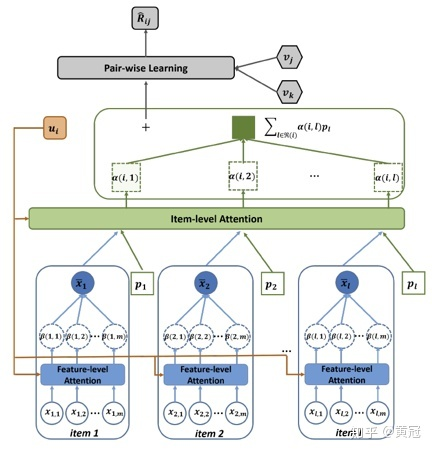
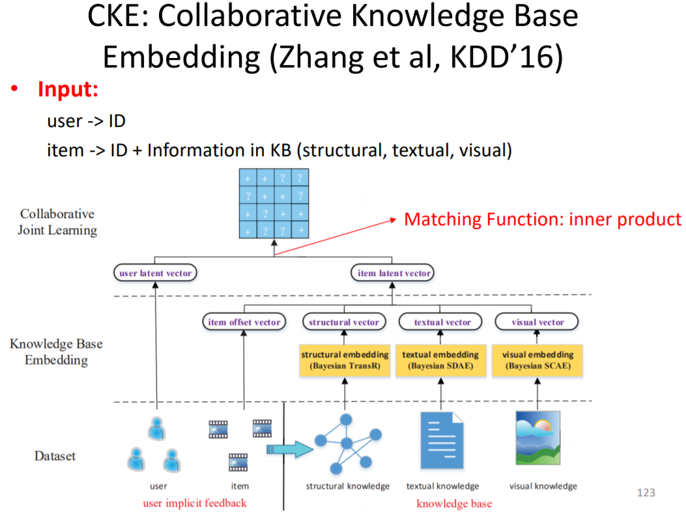

# 基于特征

## [Deep Collaborative Filtering via Marginalized DAE \(Li et al, CIKM’15\)](https://dl.acm.org/citation.cfm?id=2806527)

这个模型是分别单独用一个auto-encoder来学习user和item的向量表示（隐层），然后用内积表示他们的匹配分。

## [DUIF: Deep User and Image Feature Learning \(Geng et al, ICCV’15\)](https://www.cv-foundation.org/openaccess/content_iccv_2015/papers/Geng_Learning_Image_and_ICCV_2015_paper.pdf)

这篇论文比较简单，就是用一个CNN来学习item的表示（图像的表示），然后用MF的方法（内积）来表示他们的匹配分：

## [ACF: Attentive Collaborative Filtering\(Chen et al, SIGIR’17\)](https://dl.acm.org/citation.cfm?id=3080797)

这篇论文主要是根据SVD++进行改进，使用两层的attention。输入包括两部分：1、user部分，user\_ID以及该user对应的作用过的item；2、item部分，item\_ID和item的特征。

Component-level attention：不同的components 对item的embedding表示贡献程度不一样，表示用户对不同feature的偏好程度；由item的不同部分的特征，组合出item的表示：

attention weight由下述式子做归一化后得到：

其中u表示用户的向量，x\[l\]\[m\]表示物品的第m部分的特征。

Item-level attention：用户历史作用过的item，对用户的表示的贡献也不一样，表示用户对不同item的偏好程度；attention weight的计算公式如下，其中u表示用户的向量，v表示基础的item向量，p表示辅助的item向量，x表示由上述的component-level的attention计算出来的item的特征的表示向量：

然后使用svd++的方式计算用户的方式，只是这里的item部分不是简单的加和，而是加权平均：

这个论文是采用pairwise ranking的方法进行学习的，整个模型的结构图如下：

模型采用pairwise ranking的loss来学习：

## [CKE: Collaborative Knowledge Base Embedding \(Zhang et al, KDD’16\)](https://dl.acm.org/citation.cfm?id=2939673)

这篇论文比较简单，其实就是根据可以使用的side-info（文本、图像等），提取不同特征的表示：

##  Source





