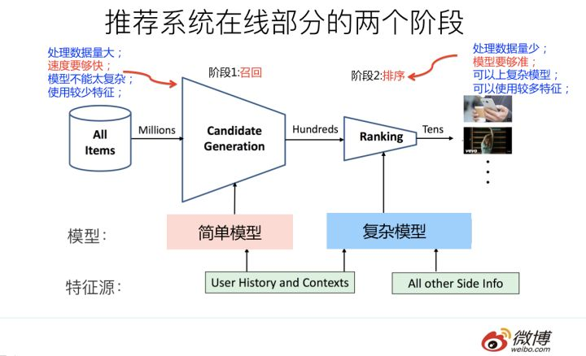
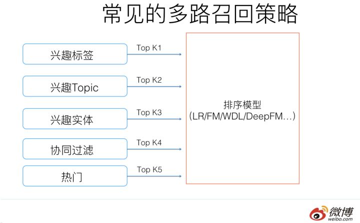

# 推荐系统

推荐系统是由系统来根据用户过去的行为、用户的属性（年龄、性别、职业等）、上下文等来猜测用户的兴趣，给用户推送物品（包括电商的宝贝、新闻、电影等）。推荐一般是非主动触发的，和搜索的主动触发不一样（搜索一般有主动提供的query）；也有小部分情况，用户有提供query：例如用户在电商里搜索一个商品后，结果页最底下推荐给用户的商品，这种情况算是有提供query。

直观写成公式，即 $$f(X_{\text{User Feature}},Y_{\text{Item Feature}})\to 0/1$$ 。通过用户特征信息和候选推荐品找到这样一个映射， $$0$$ 表示未点击或未购买等， $$1$$ 表示点击有浏览了或下单购买了。

推荐系统涉及到的两大实体：user和item往往是不同类型的东西，例如user是人，item是电商的宝贝，他们表面上的特征可能是没有任何的重叠的，这不同于搜索引擎里的query和doc都是文本：

正是由于user和item不同类型的东西，所以推荐里匹配可能比搜索里的更难。

## 工业推荐系统架构

一个典型的工业级推荐系统整体架构可以参考上图，一般分为在线部分，近线部分和离线部分。

对于在线部分来说，一般要经历几个阶段。首先通过召回环节，将给用户推荐的物品降到千以下规模；如果召回阶段返回的物品还是太多，可以加入粗排阶段，这个阶段是可选的，粗排可以通过一些简单排序模型进一步减少往后续环节传递的物品；再往后是精排阶段，这里可以使用复杂的模型来对少量物品精准排序。对某个用户来说，即使精排推荐结果出来了，一般并不会直接展示给用户，可能还要上一些业务策略，比如去已读，推荐多样化，加入广告等各种业务策略。之后形成最终推荐结果，将结果展示给用户。

对于近线部分来说，主要目的是实时收集用户行为反馈，并选择训练实例，实时抽取拼接特征，并近乎实时地更新在线推荐模型。这样做的好处是用户的最新兴趣能够近乎实时地体现到推荐结果里。

对于离线部分而言，通过对线上用户点击日志的存储和清理，整理离线训练数据，并周期性地更新推荐模型。对于超大规模数据和机器学习模型来说，往往需要高效地分布式机器学习平台来对离线训练进行支持

因为粗排是可选的，对于大多数推荐系统来说，通常在线部分的主体分为两个阶段就够，第一个阶段是召回，第二个阶段是排序。因为个性化推荐需要给每个用户展现不同的信息流或者物品流，而对于每个用户来说，可供推荐的物品，在具备一定规模的公司里，是百万到千万级别，甚至上亿。所以对于每一个用户，如果对于千万级别物品都使用先进的模型挨个进行排序打分，明显速度上是算不过来的，资源投入考虑这么做也不划算。从这里可以看出，召回阶段的主要职责是：从千万量级的候选物品里，采取简单模型将推荐物品候选集合快速筛减到千级别甚至百级别，这样将候选集合数量降下来，之后在排序阶段就可以上一些复杂模型，细致地对候选集进行个性化排序。

从上面在线推荐两阶段任务的划分，我们可以看出，召回阶段因为需要计算的候选集合太大，所以要想速度快，就只能上简单模型，使用少量特征，保证泛化能力，尽量让用户感兴趣的物品在这个阶段能够找回来；而排序阶段核心目标是要精准，因为它处理的物品数据量小，所以可以采用尽可能多的特征，使用比较复杂的模型，一切以精准为目标。

## 多路召回策略

目前工业界的推荐系统，在召回阶段，一般都采取多路召回策略。上图展示了一个简化版本的例子，以微博信息流排序为例，不同业务召回路数不太一样，但是常用的召回策略，基本都会包含，比如兴趣标签，兴趣Topic，兴趣实体，协同过滤，热门，相同地域等，多者几十路召回，少者也有7／8路召回。

对于每一路召回，会拉回K条相关物料，这个K值是个超参，需要通过线上AB测试来确定合理的取值范围。如果你对算法敏感的话，会发现这里有个潜在的问题，如果召回路数太多，对应的超参就多，这些超参组合空间很大，如何设定合理的各路召回数量是个问题。另外，如果是多路召回，这个超参往往不太可能是用户个性化的，而是对于所有用户，每一路拉回的数量都是固定的，这里明显有优化空间。按理说，不同用户也许对于每一路内容感兴趣程度是不一样的，更感兴趣的那一路就应该多召回一些，所以如果能把这些超参改为个性化配置是很好的，但是多路召回策略下，虽然也不是不能做，但是即使做，看起来还是很Trick的。

## Source







