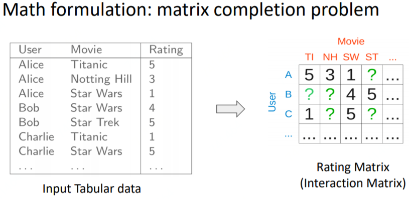
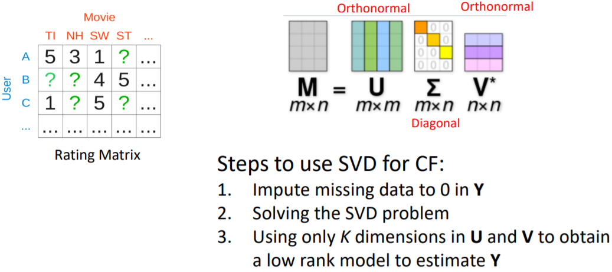
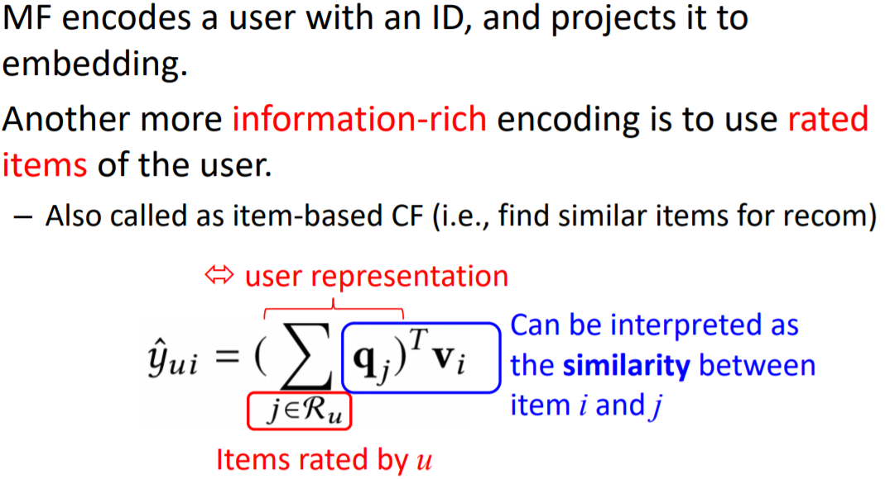
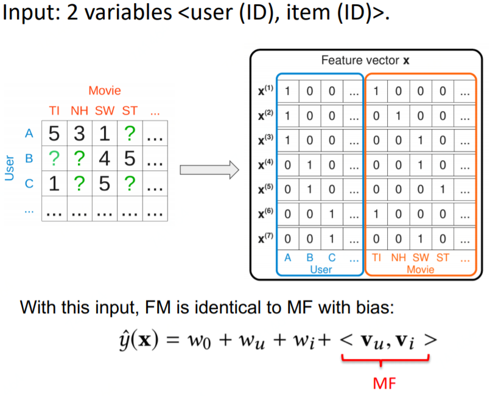
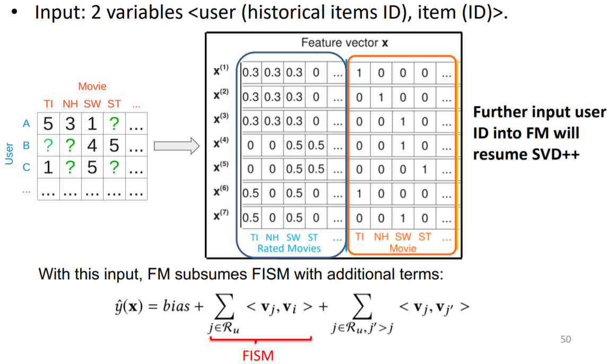
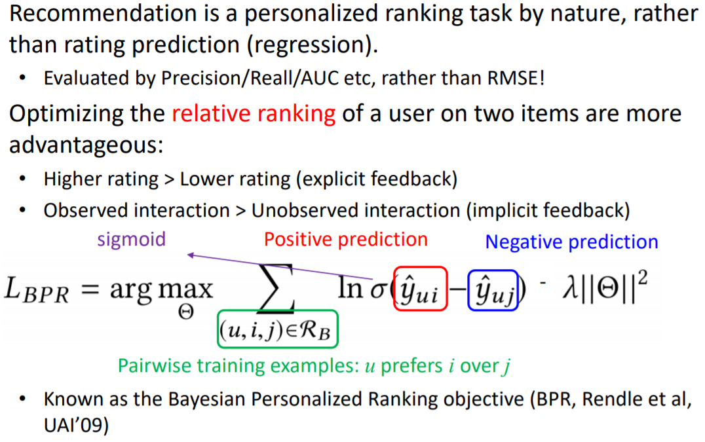

# 传统匹配模型

## 协同过滤\(**Collaborative Filtering Models\)**

协同过滤（CF）是推荐里最通用、最著名的算法了。CF的基本假设是：一个用户的行为，可以由跟他行为相似的用户进行推测。协同过滤一般分为user-based和item-based、model-based三类方法。user-based和item-based、model-based的协同过滤的算法的思想通俗的讲，就是：

* user-based：两个用户A和B很相似，那么可以把B购买过的商品推荐给A（如果A没买过）；例如你和你的师兄都是学机器学习的，那么你的师兄喜欢的书籍，你也很有可能喜欢
* item-based: 两个item：A和B很相似，那么某个用户购买过A，则可以给该用户推荐B。例如一个用户购买过《模式识别》这本书，它很有可能也喜欢《推荐系统》这本书。计算两个item是否相似的一种简单方法是，看看他们的共现概率，即他们被用户同时购买的概率
* model-based: 用机器学习的思想来建模解决，例如聚类、分类、PLSA、矩阵分解等

CF要解决的问题用数学化的语言来表达就是：一个矩阵的填充问题，已经打分的item为observed data，未打分的是missing data：

### SVD（Singular Value Decomposition）

既然是矩阵问题，首先想到的自然是用SVD去做，步骤如下

其实本质上来说，用SVD去尝试解决的是以下问题：

用SVD去做有两个缺点：1、missing data\(就是没打分的，占比99%\)和observed data（观测到的、已打分的）有一样的权重。2、没有加正则，容易过拟合。

### MF（Matrix Factorization，user-based CF）

针对SVD的问题，加以少许修改即构造了推荐系统中矩阵分解方法\(Matrix Factorization\)：

user和item分别用一个embedding表示，然后用户对item的偏好程度用这两个embedding的内积表示：

使用L2-loss（其它loss也可以）和正则：

### [Factored Item Similarity Model](https://dl.acm.org/citation.cfm?id=2487589)

Factored Item Similarity Model是用user作用过的item的embedding的和来表示user，item用另一套embedding下的一个embedding来表示，最后两者的内积表示user对该item的偏好。

这个模型也叫item-based的CF，因为把括号里的东西展开后，其实就是找用户作用过的item和item\[j\]的相似度。

### [SVD++](https://www.cs.rochester.edu/twiki/pub/Main/HarpSeminar/Factorization_Meets_the_Neighborhood-_a_Multifaceted_Collaborative_Filtering_Model.pdf)

SVD++用一个user的embedding，和上述的FISM的方法，融合来表示user。这曾经是netflix比赛中连续三年效果最好的单模型。

## 基于特征\(**Generic Feature-based Models\)**

协同过滤的方法只用了user-item交互矩阵，并没有用到user和item的特征

现代推荐系统框架大致如下：

### [Factorization Machines](https://ieeexplore.ieee.org/abstract/document/5694074)

Factorization Machines模型的最大的特点就是每一个特征都用要一个低维度的隐向量来表示（一般是10维左右），其实就是现在说的embedding；可以自动的做2阶的特征组合（自己和自己不组合）；并且很多其它的模型都是FM的特例。

当只有两个输入的时候：userID和itemID，FM就等价于MF\(matrix factorization\):

如果输入包含两个变量：1.用户的历史作用过的item 2.要预测的item的ID，那么FM也是包含了FISM模型的（Factored Item Similarity Model）：

而如果再加上user的embedding，那就包含了svd++。所以mf，fism和svd++都是fm的特例。

而实践证明用打分预测来解决推荐系统的排序问题，效果不好。可能的原因：

* 预测打分用的RMSE和排序指标有差异性
* 观测到的打分数据有bias，例如用户偏向对他们喜欢的item打分

所以一般用pairwise的ranking来解决推荐的排序问题：

## Source





