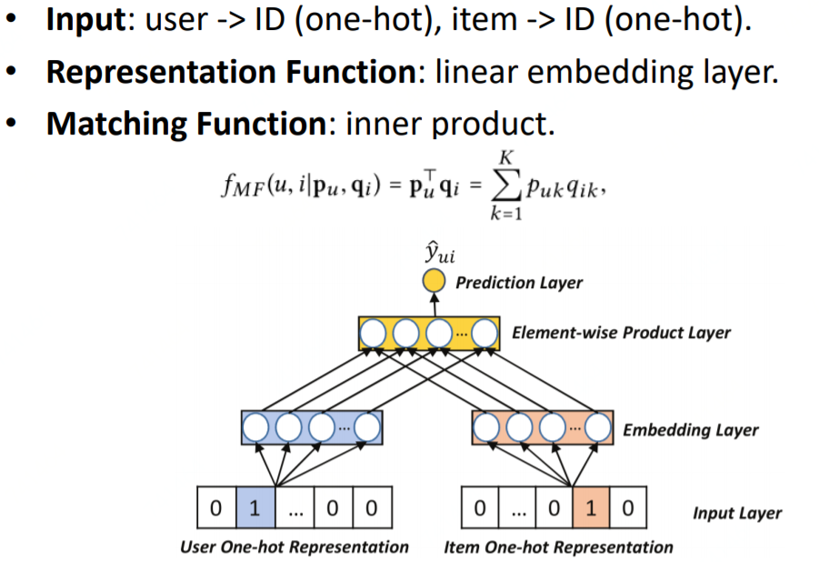
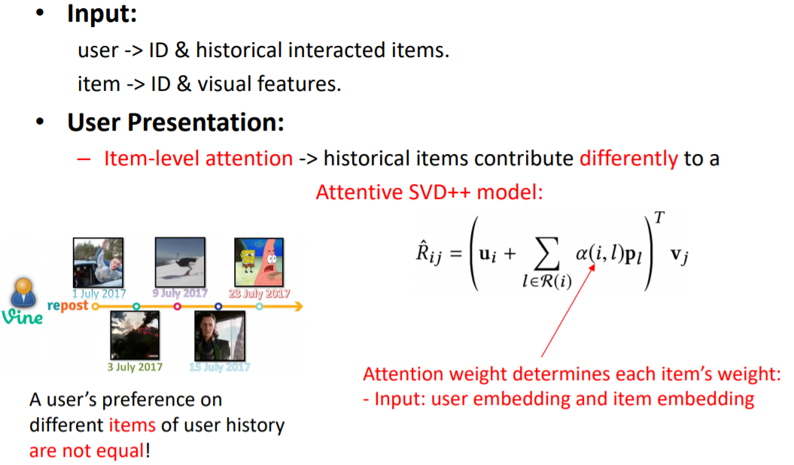

# 深度学习匹配模型

representation learning，这类方法是分别由NN，学习出user和item的embedding，然后由两者的embedding做简单的内积或cosine等，计算出他们的得分。

matching function learning，这类方法是不直接学习出user和item的embedding表示，而是由基础的匹配信号，由NN来融合基础的匹配信号，最终得到他们的匹配分。

## **基于representation learning的方法**

### **基于Collaborative Filtering的方法**

这类方法是仅仅建立在user-item的交互矩阵上。简单总结一下，基于Collaborative Filtering的做representation learning的特点：

* 用ID或者ID对应的历史行为作为user、item的profile
* 用历史行为的模型更具有表达能力，但训练起来代价也更大

而Auto-Encoder的方法可以等价为：

用MLP来进行representation learning（和MF不一样的是，是非线性的），然后用MF进行线性的match。

首先，简单复习一下MF，如果用神经网络的方式来解释MF，就是如下这样的：

输入只有userID和item\_ID，representation function就是简单的线性embedding层，就是取出id对应的embedding而已；然后matching function就是内积。

#### \*\*\*\*[**Deep Matrix Factorization\(Xue et al, IJCAI' 17\)**](https://pdfs.semanticscholar.org/35e7/4c47cf4b3a1db7c9bfe89966d1c7c0efadd0.pdf?_ga=2.148333367.182853621.1552882810-701334199.1540873247)\*\*\*\*

用user作用过的item的打分集合来表示用户，即multi-hot，例如\[0 1 0 0 4 0 0 0 5\]，然后再接几层MLP，来学习更深层次的user的embedding的学习。例如，假设item有100万个，可以这么设置layer：1000 \* 1000 -&gt;1000-&gt;500-&gt;250。

用对item作用过的用户的打分集合来表示item，即multi-hot，例如\[0 2 0 0 3 0 0 0 1\]，然后再接几层MLP，来学习更深层次的item的embedding的学习。例如，假设user有100万个，可以这么设置layer：1000 \* 1000 -&gt;1000-&gt;500-&gt;250。

得到最后的user和item的embedding后，用cosine计算他们的匹配分。这个模型的明显的一个缺点是，第一层全连接的参数非常大，例如上述我举的例子就是1000\*1000\*1000。

#### [AutoRec \(Sedhain et al, WWW’15\)](http://users.cecs.anu.edu.au/~u5098633/papers/www15.pdf)

这篇论文是根据auto-encoder来做的，auto-encoder是利用重建输入来学习特征表示的方法。auto-encoder的方法用来做推荐也分为user-based和item-based的，这里只介绍user-based。

先用user作用过的item来表示user，然后用auto-encoder来重建输入。然后隐层就可以用来表示user。然后输入层和输出层其实都是有V个节点（V是item集合的大小），那么每一个输出层的节点到隐层的K条边就可以用来表示item，那么user和item的向量表示都有了，就可以用内积来计算他们的相似度。值得注意的是，输入端到user的表示隐层之间，可以多接几个FC；另外，隐层可以用非线性函数，所以auto-encoder学习user的表示是非线性的。

#### [Collaborative Denoising Auto-Encoder\(Wu et al, WSDM’16\)](https://dl.acm.org/citation.cfm?id=2835837)

这篇论文和上述的auto-encoder的差异主要是输入端加入了userID，但是重建的输出层没有加user\_ID，这其实就是按照svd++的思路来的，比较巧妙，svd++的思想在很多地方可以用上：

### **基于Collaborative Filtering + Side Info的方法**

#### [Deep Collaborative Filtering via Marginalized DAE \(Li et al, CIKM’15\)](https://dl.acm.org/citation.cfm?id=2806527)

这个模型是分别单独用一个auto-encoder来学习user和item的向量表示（隐层），然后用内积表示他们的匹配分。

#### [DUIF: Deep User and Image Feature Learning \(Geng et al, ICCV’15\)](https://www.cv-foundation.org/openaccess/content_iccv_2015/papers/Geng_Learning_Image_and_ICCV_2015_paper.pdf)

这篇论文比较简单，就是用一个CNN来学习item的表示（图像的表示），然后用MF的方法（内积）来表示他们的匹配分：

#### [ACF: Attentive Collaborative Filtering\(Chen et al, SIGIR’17\)](https://dl.acm.org/citation.cfm?id=3080797)

这篇论文主要是根据SVD++进行改进，使用两层的attention。输入包括两部分：1、user部分，user\_ID以及该user对应的作用过的item；2、item部分，item\_ID和item的特征。

Component-level attention：不同的components 对item的embedding表示贡献程度不一样，表示用户对不同feature的偏好程度；由item的不同部分的特征，组合出item的表示：

attention weight由下述式子做归一化后得到：

其中u表示用户的向量，x\[l\]\[m\]表示物品的第m部分的特征。

Item-level attention：用户历史作用过的item，对用户的表示的贡献也不一样，表示用户对不同item的偏好程度；attention weight的计算公式如下，其中u表示用户的向量，v表示基础的item向量，p表示辅助的item向量，x表示由上述的component-level的attention计算出来的item的特征的表示向量：

然后使用svd++的方式计算用户的方式，只是这里的item部分不是简单的加和，而是加权平均：

这个论文是采用pairwise ranking的方法进行学习的，整个模型的结构图如下：

模型采用pairwise ranking的loss来学习：

#### [CKE: Collaborative Knowledge Base Embedding \(Zhang et al, KDD’16\)](https://dl.acm.org/citation.cfm?id=2939673)

这篇论文比较简单，其实就是根据可以使用的side-info（文本、图像等），提取不同特征的表示：

##  **基于matching function learning的方法**

##  **representation learning和matching function learning的融合**

## Source





