# 文本挖掘

不同于自然语言处理\(Natural Language Processing\)，数据挖掘领域对文本处理有自己的一套方法来避免自然语言处理中的两大限制：

1、标注花费高\(或者大量的数词个数等统计工作\)，新语言或领域扩展性不强

 2、不一定适用具体领域、动态、新兴应用\(比如Yelp,Twitter等\)

## 短语挖掘与主题模型

### 短语质量评价标准

Popularity: 更精确的好于较精确的，比如"information retrieval" vs. "cross-language information retrieval"

Concordance: 符合常规说法，比如浓茶一般说"strong tea"，遇到"powerful tea"就不太符合了

Informativeness: 含有信息量，比如"this paper"虽然高频出现但没信息量没区分度

Completeness: 要具有完整性，比如"vector machine" vs. "support vector machine"

### 方案1：短语与主题同时推断

基本思路：Generate bag-of-words -&gt; Generate sequence of tokens

缺点：这种方案复杂度高，运算慢，且易过拟合

**Bigram Topic Model\[Wallach'06\]：**概率生成模型，下一词的生成基于前一个词和主题的条件概率

**Topic N-Grams\(TNG\)\[Wang, et al.'07\]：**根据文本顺序生成词语的概率模型，通过连接连续的bigram\(通过Bigram Topic Model生成\)来创建n-grams

**Phrase-Discovering LDA\(PDLDA\)\[Lindsey, et al.'12\]：**将每个句子视为一个词语的时间序列，PDLDA假定生成参数\(主题\)周期性变化，基于之前 $$m$$ 个词与当前短语主题生成每个词

### 方案2：先主题生成后短语构建

基本思路：Post bag-of-words model inference, visualize topics with n-grams，短语构建作为LDA之后步骤

缺点：这个方案中的符记在同一个短语中可能被赋予不同的主题，短语质量依赖于词的主题标签准不准

#### TurboTopic\[Blei&Lafferty'09\]

```text
在语料中执行LDA模型来给每个符记赋一个主题标签
将相连的相同主题标签
当全部有意义相连的词合并后终止合并迭代
```

#### KERT\[Danilevsky, et al.'14\]

```text
在每一个主题中运行频繁项集挖掘
基于四个评价标准(Popularity、Discriminativeness、Condordance、Completeness)执行短语排序
```

### 方案3：先短语挖掘后主题模型

基本思路：Prior bag-of-words model inference, mine phrases and impose on the bag-of-words model

缺点：主题推断依赖于文档的正确分割

#### ToPMine\[El-Kishky et al.VLDB'15\]

```text
执行高频连续频繁项集挖掘来获取候选短语和他们的频数
根据重要性得分，对相邻的unigrams进行凝聚合并(这一步切分每个文档放入"bag-of-phrases")
新形成的词组作为输入传递给PhraseLDA（这是一个扩展LDA，它限制短语中的所有单词，每个单词共享相同的潜在主题）
```

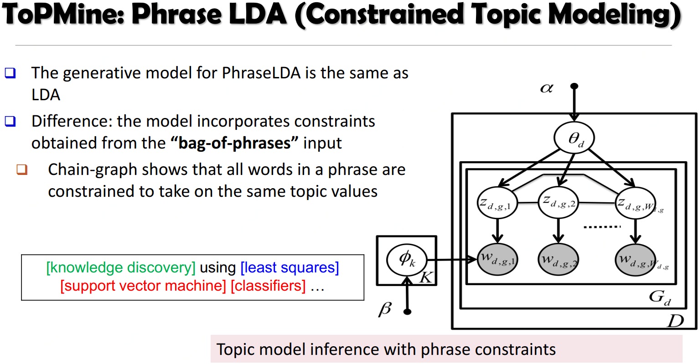

### [SegPhrase](https://github.com/shangjingbo1226/SegPhrase)

```text
ClassPhrase: 频繁项挖掘，特征抽取，分类
SegPhrase: 短语切分和短语质量估计
SegPhrase+: 多一轮迭代来加强以挖掘的短语质量
```


_ClassPhrase：_

1、频繁项集挖掘，挖掘频繁项作为候选短语集\(这一步可保证生成短语在输入语料库的Popularity\)

2.1、特征抽取，检查候选集里每个候选短语的置信度，看看他们一同出现的概率是不是比纯随机要高\(这一步保证Concordance\)，可采用Pointwise mutual information或者Pointwise KL divergence来判断

                                          $$\langle u_l,u_r\rangle = arg \mathop{min}\limits_{u_l\bigoplus u_r=v} \log\frac{p(v)}{p(u_l)p(u_r)}$$ 

              $$ PMI(u_l,u_r)=\log\frac{p(v)}{p(u_l)p(u_r)}\ \ \ \ \ \ \ \ \ \ \ \  PKL(v||\langle u_l,u_r\rangle) = p(v)\log\frac{p(v)}{p(u_l)p(u_r)}$$ 

2.2、特征抽取，检查Informativeness，比如是不是起止词都是非停用词，IDF值检验一下，有书名号，引号之类的连接的词

3、分类，用个分类器比如随机森林，分类短语质量"support vector machine":1，"the experiment shows":0

_SegPhrase:_ 解决合理切分问题

将一个句子用最大似然切割，过滤掉整流频率较低的短语\(不合理的短语应该很少出现在切分的结果中\)

_SegPhrase+:_ 多跑一轮以加强短语切分

用整改频率，重新计算之前基于原始频率计算的特征

### [AutoPhrase](https://github.com/shangjingbo1226/AutoPhrase)


## 实体识别与类型标记


### 传统的NER局限

1、领域受限：必须已经在NER工具中记录过的实体，在实体识别在才有可能被发掘。

2、名称多义：比如华盛顿，即使地名又是人名还是球队名...

3、文本稀疏：某些实体只有在少数文本中提及

### 基于关系图结构和传递性的实体提取与类型标记

### [ClusType: Effective Entity Recognition and Typing by Relation Phrase-Based Clustering](https://github.com/INK-USC/ClusType)


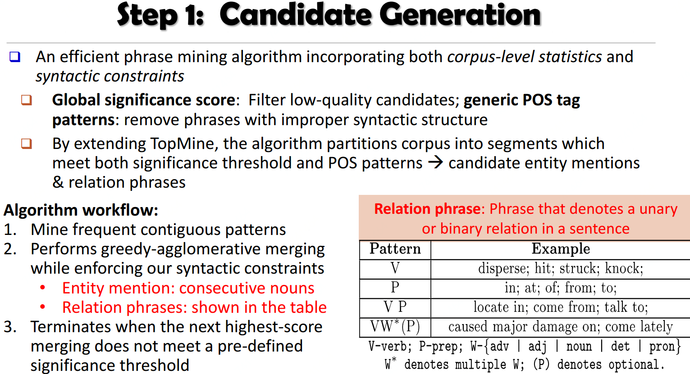


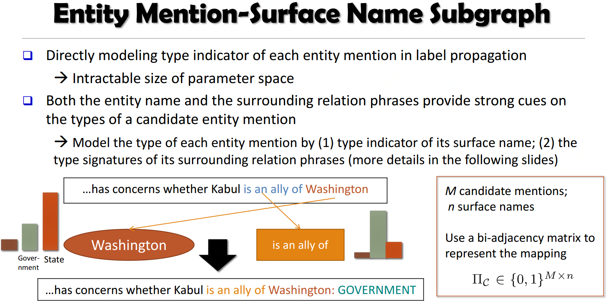


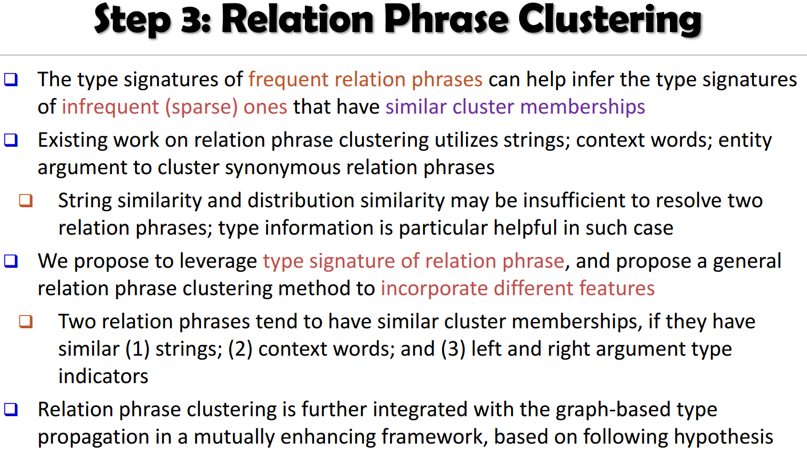


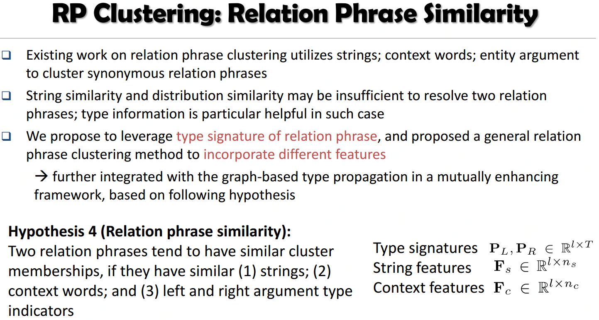

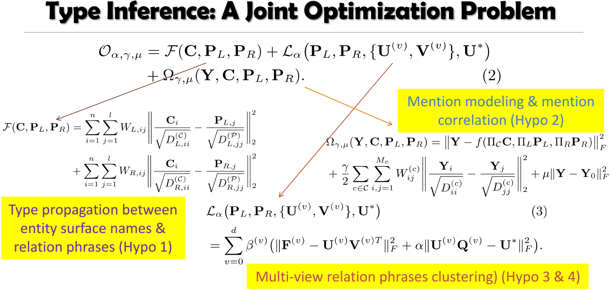


### 细粒度实体类型的标记


### [PLE\(Heterogeneous Partial-Label Embedding\)](https://github.com/INK-USC/PLE)

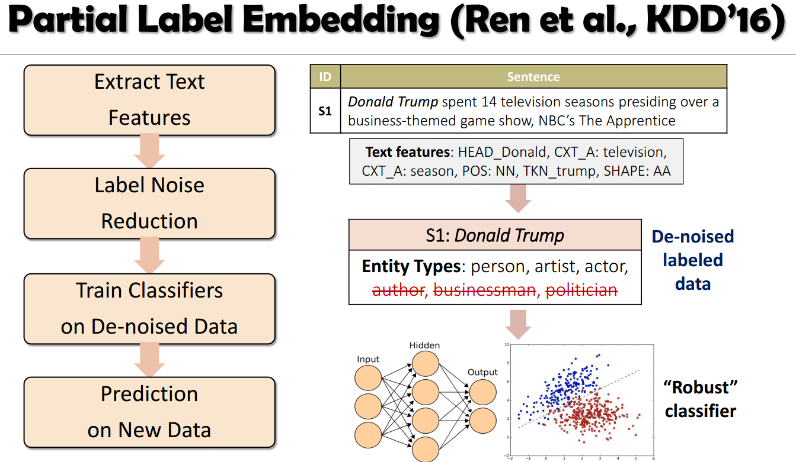


### [AFET\(Automatic Fine-Grained Entity Typing by Hierarchical Partial-Label Embedding\)](https://github.com/INK-USC/AFET)


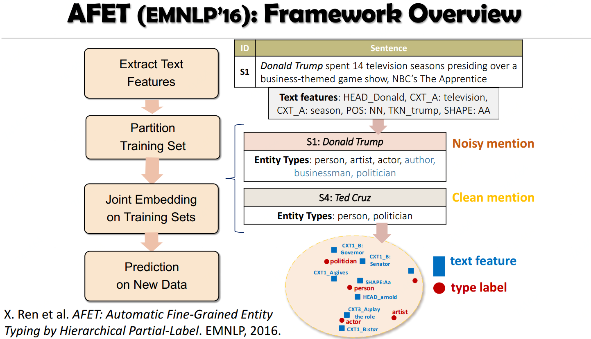


### 实体与相互间关系的联合类型标记

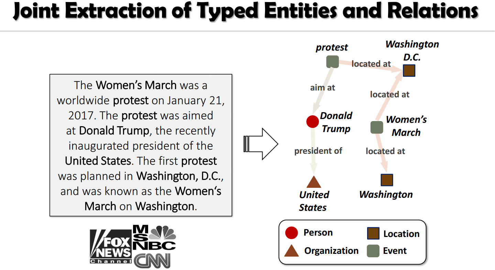


### [CoType: Joint Typing of Entities and Relations](https://github.com/INK-USC/DS-RelationExtraction)

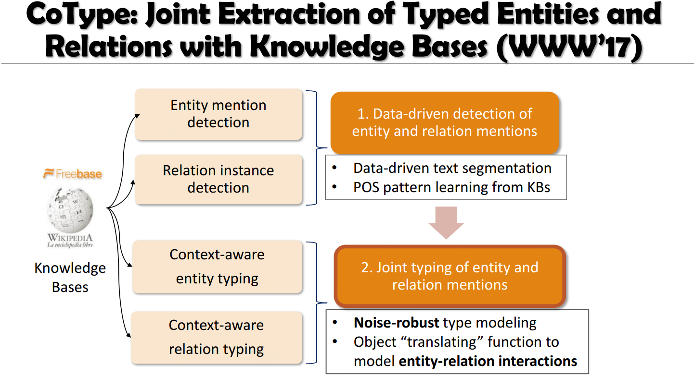

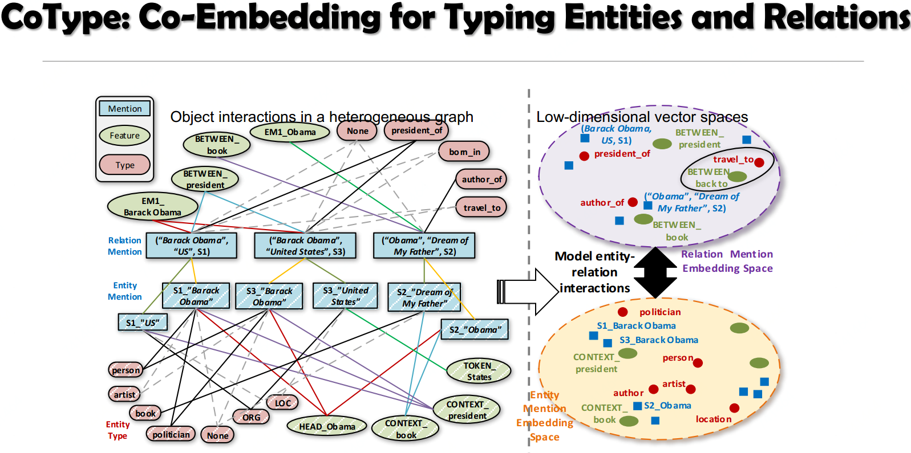


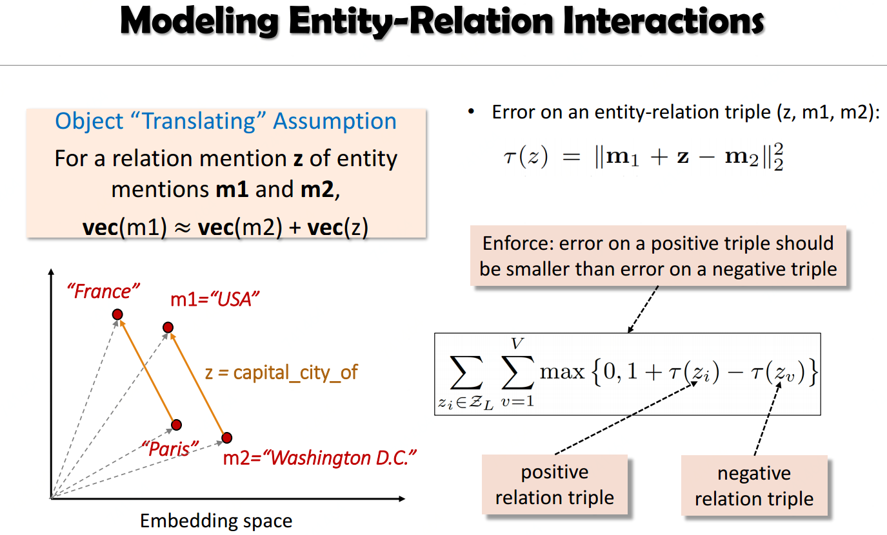

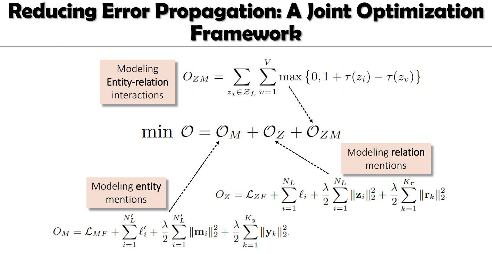


### 

