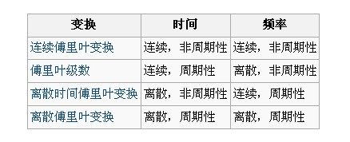
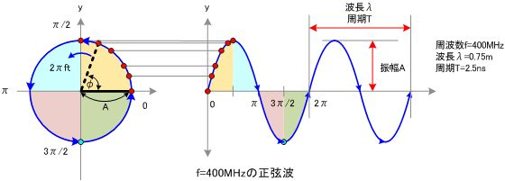
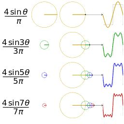
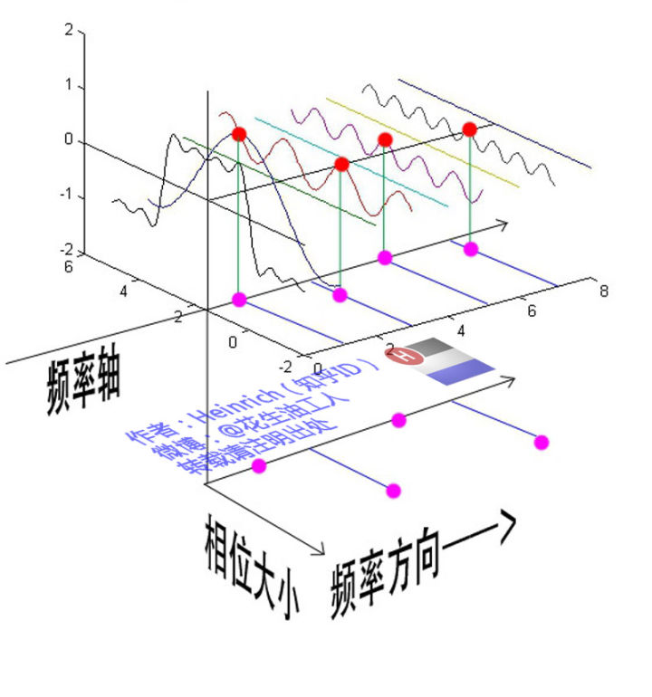
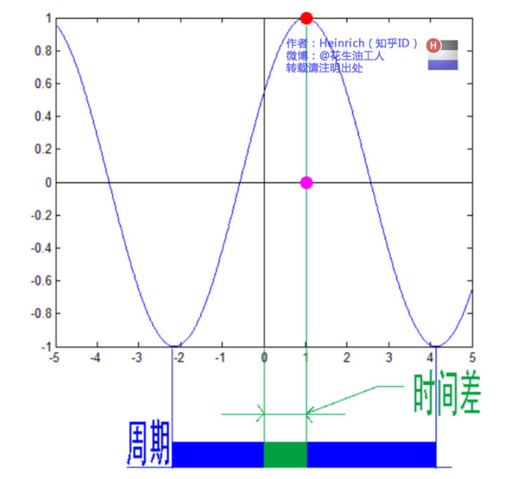
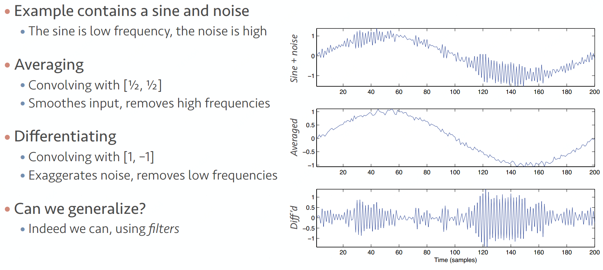

# 时间序列

## 时间序列的表示

### 频域

从我们出生，我们看到的世界都以时间贯穿，股票的走势、人的身高、汽车的轨迹都会随着时间发生改变。这种以时间作为参照来观察动态世界的方法我们称其为时域分析。而我们也想当然的认为，世间万物都在随着时间不停的改变，并且永远不会静止下来。但如果我告诉你，用另一种方法来观察世界的话，你会发现世界是永恒不变的，这个静止的世界就叫做频域。

先举一个公式上并非很恰当，但意义上再贴切不过的例子：在你的理解中，一段音乐是什么呢？

我们对音乐普遍理解，一个随着时间变化的震动。对于乐器小能手们来说，音乐更直观的理解是这样的：

上图是音乐在时域的样子，而下图则是音乐在频域的样子。将以上两图简化：

在时域，我们观察到钢琴的琴弦一会上一会下的摆动；而在频域，只有那一个永恒的音符。

傅里叶同学告诉我们，任何周期函数，都可以看作是不同振幅，不同相位正弦波的叠加。在第一个例子里我们可以理解为，利用对不同琴键不同力度，不同时间点的敲击，可以组合出任何一首乐曲。

### 时域、频域、谱图\(time/frequency\)

## [时域到频域\(傅里叶分析\)](https://zhuanlan.zhihu.com/p/19763358)

傅里叶分析是贯穿时域与频域的方法之一， 就是一种从时间到频率的变化或其相互转化。

傅里叶分析可分为傅里叶级数（Fourier Serie）和傅里叶变换\(Fourier Transformation\)。

傅里叶变换的3种变体： 连续傅里叶变换\(FFT\)、离散时域傅里叶变换\(DTFT\)、 离散傅里叶变换\(DFT\)

## 傅里叶级数\(Fourier Series\)的频谱及相位谱

#### 频谱：

如果我说能用前面说的正弦曲线波叠加出一个带90度角的矩形波，你会相信吗？你不会，但是看看下图：

第一幅图是一个郁闷的正弦波cos（x）；第二幅图是2个卖萌的正弦波的叠加cos\(x\)+a.cos\(3x\)

第三幅图是4个发春的正弦波的叠加；第四幅图是10个便秘的正弦波的叠加

随着正弦波数量逐渐的增长，他们最终会叠加成一个标准的矩形。随着叠加的递增，所有正弦波中上升的部分逐渐让原本缓慢增加的曲线不断变陡，而所有正弦波中下降的部分又抵消了上升到最高处时继续上升的部分使其变为水平线。一个矩形就这么叠加而成了。但是要多少个正弦波叠加起来才能形成一个标准90度角的矩形波呢？不幸的告诉大家，答案是无穷多个。

不仅仅是矩形，你能想到的任何波形都是可以如此方法用正弦波叠加起来的。这是没有接触过傅里叶分析的人在直觉上的第一个难点，但是一旦接受了这样的设定，游戏就开始有意思起来了。还是上图的正弦波累加成矩形波，我们换一个角度来看看：

在这几幅图中，最前面黑色的线就是所有正弦波叠加而成的总和，也就是越来越接近矩形波的那个图形。而后面依不同颜色排列而成的正弦波就是组合为矩形波的各个分量。这些正弦波按照频率从低到高从前向后排列开来，而每一个波的振幅都是不同的。每两个正弦波之间都还有一条直线，那并不是分割线，而是振幅为0的正弦波！也就是说，为了组成特殊的曲线，有些正弦波成分是不需要的。

这里，不同频率的正弦波我们成为频率分量。好了，关键的地方来了！！

如果我们把第一个频率最低的频率分量看作“1”，我们就有了构建频域的最基本单元。

对于我们最常见的有理数轴，数字“1”就是有理数轴的基本单元。

时域的基本单元就是“1秒”，如果我们将一个角频率为$$w_0$$ 的正弦波 $$cos(w_0t)$$看作基础，那么频域的基本单元就是 $$w_0$$ 。

有了“1”，还要有“0”才能构成世界，那么频域的“0”是什么呢？$$cos(0t)$$ 就是一个周期无限长的正弦波，也就是一条直线！所以在频域，0频率也被称为直流分量，在傅里叶级数的叠加中，它仅仅影响全部波形相对于数轴整体向上或是向下而不改变波的形状。

接下来，让我们回到初中，回忆一下老师是怎么定义正弦波的吧。

正弦波就是一个圆周运动在一条直线上的投影。所以频域的基本单元也可以理解为一个始终在旋转的圆

动图请戳：[File:Fourier series square wave circles animation.gif](https://link.zhihu.com/?target=http%3A//en.wikipedia.org/wiki/File%3AFourier_series_square_wave_circles_animation.gif)

                    [File:Fourier series sawtooth wave circles animation.gif](https://link.zhihu.com/?target=http%3A//en.wikipedia.org/wiki/File%3AFourier_series_sawtooth_wave_circles_animation.gif)

介绍完了频域的基本组成单元，我们就可以看一看一个矩形波，在频域里的另一个模样了：

这就是矩形波在频域的样子，是不是完全认不出来了？教科书一般就给到这里然后留给了读者无穷的遐想，以及无穷的吐槽，其实教科书只要补一张图就足够了：频域图像，也就是俗称的频谱，就是——

再清楚一点：

可以发现，在频谱中，偶数项的振幅都是0，也就对应了图中的彩色直线。振幅为0的正弦波。

动图请戳：[File:Fourier series and transform.gif](https://link.zhihu.com/?target=http%3A//en.wikipedia.org/wiki/File%3AFourier_series_and_transform.gif)

老实说，在我学傅里叶变换时，维基的这个图还没有出现，那时我就想到了这种表达方法，而且，后面还会加入维基没有表示出来的另一个谱——相位谱。

#### 相位谱

在这一章最开始，我想先回答很多人的一个问题：傅里叶分析究竟是干什么用的？这段相对比较枯燥，已经知道了的同学可以直接跳到下一个分割线。

先说一个最直接的用途。无论听广播还是看电视，我们一定对一个词不陌生——频道。频道频道，就是频率的通道，不同的频道就是将不同的频率作为一个通道来进行信息传输。下面大家尝试一件事：

先在纸上画一个$$sin(x)$$ ，不一定标准，意思差不多就行。不是很难吧。

好，接下去画一个$$sin(3x)+sin(5x)$$ 的图形。

别说标准不标准了，曲线什么时候上升什么时候下降你都不一定画的对吧？

好，画不出来不要紧，我把$$sin(3x)+sin(5x)$$ 的曲线给你，但是前提是你不知道这个曲线的方程式，现在需要你把$$sin(5x)$$ 给我从图里拿出去，看看剩下的是什么。这基本是不可能做到的。

但是在频域呢？则简单的很，无非就是几条竖线而已。

所以很多在时域看似不可能做到的数学操作，在频域相反很容易。这就是需要傅里叶变换的地方。尤其是从某条曲线中去除一些特定的频率成分，这在工程上称为滤波，是信号处理最重要的概念之一，只有在频域才能轻松的做到。

再说一个更重要，但是稍微复杂一点的用途——求解微分方程。（这段有点难度，看不懂的可以直接跳过这段）微分方程的重要性不用我过多介绍了。各行各业都用的到。但是求解微分方程却是一件相当麻烦的事情。因为除了要计算加减乘除，还要计算微分积分。而傅里叶变换则可以让微分和积分在频域中变为乘法和除法，大学数学瞬间变小学算术有没有。

通过时域到频域的变换，我们得到了一个从侧面看的频谱，但是这个频谱并没有包含时域中全部的信息。因为频谱只代表每一个对应的正弦波的振幅是多少，而没有提到相位。基础的正弦波$$A.sin(wt+\theta)$$中，振幅，频率，相位缺一不可，不同相位决定了波的位置，所以对于频域分析，仅仅有频谱（振幅谱）是不够的，我们还需要一个相位谱。那么这个相位谱在哪呢？我们看下图，这次为了避免图片太混论，我们用7个波叠加的图。

鉴于正弦波是周期的，我们需要设定一个用来标记正弦波位置的东西。在图中就是那些小红点。小红点是距离频率轴最近的波峰，而这个波峰所处的位置离频率轴有多远呢？为了看的更清楚，我们将红色的点投影到下平面，投影点我们用粉色点来表示。当然，这些粉色的点只标注了波峰距离频率轴的距离，并不是相位。

这里需要纠正一个概念：时间差并不是相位差。如果将全部周期看作 $$2\pi$$ 或者 $$360$$ 度的话，相位差则是时间差在一个周期中所占的比例。我们将时间差除周期再乘 $$2\pi$$ ，就得到了相位差。

在完整的立体图中，我们将投影得到的时间差依次除以所在频率的周期，就得到了最下面的相位谱。所以，**频谱是从侧面看，相位谱是从下面看**。

注意到，相位谱中的相位除了 $$0$$ ，就是 $$\pi$$ 。因为 $$cos(t+\pi) = -cos(t)$$，所以实际上相位为 $$\pi$$ 的波只是上下翻转了而已。对于周期方波的傅里叶级数，这样的相位谱已经是很简单的了。另外值得注意的是，由于 $$cos(t+2\pi) = cos(t)$$，所以相位差是周期的，$$\pi$$和$$3\pi$$，$$5\pi$$，$$7\pi$$都是相同的相位。人为定义相位谱的值域为$$(-\pi,\pi]$$ ，所以图中的相位差均为 $$\pi$$ 。

最后来一张大集合：

## \*\*\*\*[**傅里叶变换\(Fourier Transformation\)**](https://blog.csdn.net/v_JULY_v/article/details/6196862)\*\*\*\*

相信通过前面三章，大家对频域以及傅里叶级数都有了一个全新的认识。但是文章在一开始关于钢琴琴谱的例子我曾说过，这个栗子是一个公式错误，但是概念典型的例子。所谓的公式错误在哪里呢？

傅里叶级数的本质是将一个周期的信号分解成无限多分开的（离散的）正弦波，但是宇宙似乎并不是周期的。在这个世界上，有的事情一期一会，永不再来，并且时间始终不曾停息地将那些刻骨铭心的往昔连续的标记在时间点上。但是这些事情往往又成为了我们格外宝贵的回忆，在我们大脑里隔一段时间就会周期性的蹦出来一下，可惜这些回忆都是零散的片段，往往只有最幸福的回忆，而平淡的回忆则逐渐被我们忘却。因为，往昔是一个连续的非周期信号，而回忆是一个周期离散信号。

是否有一种数学工具将连续非周期信号变换为周期离散信号呢？抱歉，真没有。

比如傅里叶级数，在时域是一个周期且连续的函数，而在频域是一个非周期离散的函数。这句话比较绕嘴，实在看着费事可以干脆回忆第一章的图片。

而在我们接下去要讲的傅里叶变换，则是将一个时域非周期的连续信号，转换为一个在频域非周期的连续信号。

或者我们也可以换一个角度理解：傅里叶变换实际上是对一个周期无限大的函数进行傅里叶变换。

所以说，钢琴谱其实并非一个连续的频谱，而是很多在时间上离散的频率，但是这样的一个贴切的比喻真的是很难找出第二个来了。

因此在傅里叶变换在频域上就从离散谱变成了连续谱。那么连续谱是什么样子呢？为了方便大家对比，我们这次从另一个角度来看频谱，还是傅里叶级数中用到最多的那幅图，我们从频率较高的方向看。

以上是离散谱，那么连续谱是什么样子呢？想象这些离散的正弦波离得越来越近，逐渐变得连续，直到像波涛起伏的大海：

通过这样两幅图去比较，大家应该可以理解如何从离散谱变成了连续谱的了吧？原来离散谱的叠加，变成了连续谱的累积。所以在计算上也从求和符号变成了积分符号。

### 连续傅里叶变换\(FFT\)

一般情况下，若“傅里叶变换”一词不加任何限定语，则指的是“连续傅里叶变换”。连续傅里叶变换将平方可积的函数f（t）表示成复指数函数的积分或级数形式。

这是将频率域的函数F\(ω\)表示为时间域的函数f（t）的积分形式。

连续傅里叶变换的逆变换 \(inverse Fourier transform\)为：

即将时间域的函数f（t）表示为频率域的函数F\(ω\)的积分。

一般可称函数**f（t）**为原函数，而称函数**F\(ω\)**为傅里叶变换的像函数，原函数和像函数构成一个傅里叶变换对（transform pair）。

除此之外，还有其它型式的变换对，以下两种型式亦常被使用。在通信或是信号处理方面，常以来代换，而形成新的变换对：

 或者是因系数重分配而得到新的变换对：

 一种对连续傅里叶变换的推广称为分数傅里叶变换（Fractional Fourier Transform）。分数傅里叶变换\(fractional Fourier transform,FRFT\)指的就是傅里叶变换\(Fourier transform,FT\)的广义化。  
分数傅里叶变换的物理意义即做傅里叶变换 a 次，其中 a 不一定要为整数；而做了分数傅里叶变换之后，信号或输入函数便会出现在介于时域\(time domain\)与频域\(frequency domain\)之间的分数域\(fractional domain\)。

当f（t）为偶函数（或奇函数）时，其正弦（或余弦）分量将消亡，而可以称这时的变换为余弦变换（cosine transform）或正弦变换（sine transform）。另一个值得注意的性质是，当f（t）为纯实函数时，F\(−ω\) = F\*\(ω\)成立。

### 离散时域傅里叶变换\(DTFT\)

离散时间傅里叶变换（discrete-time Fourier transform, DTFT）针对的是定义域为Z的数列。设  为某一数列，则其DTFT被定义为

相应的逆变换为

DTFT在时域上离散，在[频域](https://baike.baidu.com/item/%E9%A2%91%E5%9F%9F)上则是周期的，它一般用来对离散时间信号进行频谱分析。DTFT可以被看作是傅里叶级数的逆。

### 离散傅里叶变换\(DFT\)

为了在科学计算和[数字信号处理](https://baike.baidu.com/item/%E6%95%B0%E5%AD%97%E4%BF%A1%E5%8F%B7%E5%A4%84%E7%90%86)等领域使用计算机进行傅里叶变换，必须将函数定义在离散点上而非连续域内，且须满足有限性或周期性条件。这种情况下，序列  的离散傅里叶变换（discrete Fourier transform, DFT）为

其逆变换为

直接使用DFT的定义计算的计算复杂度为  ，而快速傅里叶变换（fast Fourier transform, FFT）可以将复杂度改进为  。计算复杂度的降低以及数字电路计算能力的发展使得DFT成为在信号处理领域十分实用且重要的方法。

## **指数形式的傅里叶变换**

### 欧拉公式

虚数i这个概念大家在高中就接触过，但那时我们只知道它是-1的平方根，可是它真正的意义是什么呢?

这里有一条数轴，在数轴上有一个红色的线段，它的长度是1。当它乘以3的时候，它的长度发生了变化，变成了蓝色的线段，而当它乘以-1的时候，就变成了绿色的线段，或者说线段在数轴上围绕原点旋转了180度。我们知道乘-1其实就是乘了两次 i使线段旋转了180度，那么乘一次 i 呢？答案很简单——旋转了90度。

同时，我们获得了一个垂直的虚数轴。实数轴与虚数轴共同构成了一个复数的平面，也称复平面。这样我们就了解到，乘虚数i的一个功能——旋转。现在，就有请宇宙第一耍帅公式欧拉公式隆重登场——

这个公式在数学领域的意义要远大于傅里叶分析，但是乘它为宇宙第一耍帅公式是因为它的特殊形式——当x等于 $$\pi$$ 的时候。

这个公式关键的作用，是将正弦波统一成了简单的指数形式。我们来看看图像上的涵义：

欧拉公式所描绘的，是一个随着时间变化，在复平面上做圆周运动的点，随着时间的改变，在时间轴上就成了一条螺旋线。如果只看它的实数部分，也就是螺旋线在左侧的投影，就是一个最基础的余弦函数。而右侧的投影则是一个正弦函数。关于复数更深的理解，大家可以参考：[复数的物理意义是什么？](http://www.zhihu.com/question/23234701/answer/26017000)

### **指数形式的傅里叶变换**

有了欧拉公式的帮助，我们便知道：**正弦波的叠加**，也可以理解为**螺旋线的叠加**在实数空间的投影。而螺旋线的叠加如果用一个形象的栗子来理解是什么呢？ --- **光波**

高中时我们就学过，自然光是由不同颜色的光叠加而成的，而最著名的实验就是牛顿师傅的三棱镜实验：

所以其实我们在很早就接触到了光的频谱，只是并没有了解频谱更重要的意义。但不同的是，傅里叶变换出来的频谱不仅仅是可见光这样频率范围有限的叠加，而是频率从0到无穷所有频率的组合。

这里，我们可以用两种方法来理解正弦波：

第一种前面已经讲过了，就是螺旋线在实轴的投影。

另一种需要借助欧拉公式的另一种形式去理解：

将以上两式相加再除2，得到：

这个式子可以怎么理解呢？

我们刚才讲过，e^\(it\)可以理解为一条逆时针旋转的螺旋线，那么e^\(-it\)则可以理解为一条顺时针旋转的螺旋线。而cos\(t\)则是这两条旋转方向不同的螺旋线叠加的一半，因为这两条螺旋线的虚数部分相互抵消掉了！

举个例子的话，就是极化方向不同的两束光波，磁场抵消，电场加倍。

这里，逆时针旋转的我们称为正频率，而顺时针旋转的我们称为负频率（注意不是复频率）。  

好了，刚才我们已经看到了大海——连续的傅里叶变换频谱，现在想一想，连续的螺旋线会是什么样子：

你猜猜，这个图形在时域是什么样子？

哈哈，是不是觉得被狠狠扇了一个耳光。数学就是这么一个把简单的问题搞得很复杂的东西。顺便说一句，那个像大海螺一样的图，为了方便观看，我仅仅展示了其中正频率的部分，负频率的部分没有显示出来。如果你认真去看，海螺图上的每一条螺旋线都是可以清楚的看到的，每一条螺旋线都有着不同的振幅（旋转半径），频率（旋转周期）以及相位。而将所有螺旋线连成平面，就是这幅海螺图了。

好了，讲到这里，相信大家对傅里叶变换以及傅里叶级数都有了一个形象的理解了，我们最后用一张图来总结一下：

## 过滤\(Filtering\)

### 卷积\(Convolution\)

两个时间序列间运算：根据一个时间序列滑动或缩放另一个

                            定义： $$z = y \ast x$$ 

                                   $$z(t) = y(0)\cdot x(t)+y(1)\cdot x(t-1)+\cdots$$ 

                                   $$z(t) = \sum \limits_i y(i)x(t-i)$$ 

#### Averaging & Differentiating

#### Lowpass&Highpass&Bandpass&Band-reject/stop&Custom

### 快速卷积\(Fast convolution\)

卷积有时很慢，用 Fast Fourier Transform 进行加速

                                   $$F(x\ast y) = F(x)\odot F(y)$$ 

                                   $$F(x\odot y) = F(x) \ast F(y)$$ 

                                   $$x \ast y = F^{-1}(F(x)\odot F(y))$$ 

## 重采样\(Resampling\)

改变信号的样本率，比如4k vs. 720p的视频

#### Downsampling

#### Upsampling

## Source

{% embed url="https://github.com/chmx0929/UIUCclasses/blob/master/598MachLrngforSignalProcessng/Slide/Lecture%203%20-%20Time%20Series.pdf" %}







