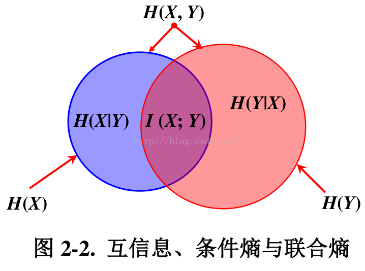

# 信息理论

信息论是应用数学的一个分支，主要研究的是对一个信号包含信息的多少进行量化。信息论的基本想法是一个不太可能发生的事件居然发生了，要比一个非常可能发生的事件发生，能提供更多的信息。消息说“今天早上太阳升起”，信息量是如此之少，但一条消息说“今天早上有日食”，信息量就很丰富了。我们想通过这种基本想法来量化信息。特别是：

* 1、非常可能发生的事件信息量比较少，并且极端情况下，确保能够发生的事件应该没有信息量。
* 2、较不可能发生的事件具有更高的信息量。
* 3、独立事件应具有增量的信息。比如投掷的硬币两次正面朝上传递的信息量，应是投掷一次正面朝上
*       的信息量的两倍。

## 信息熵

如果$$X$$是一个离散型随机变量，取值空间为 $$\mathbb{R}$$ ，其概率分布为 $$p(x)=P(X=x),x\in \mathbb{R}$$ ，那么熵：

                                                           $$H(X)=-\sum\limits_{x\in R}p(x)\log_2p(x)$$ 

熵又称为自信息，可以视为描述一个随机变量的不确定性的数量。它表示信号源 $$X$$ 每发一个符号所提供的的平均信息量。一个随机变量的熵越大，它的不确定性越大，那么正确估计其值的可能性就越小。越不确定的随机变量越需要大的信息量用以确定其值。

在只掌握关于未知分布的部分知识的情况下，符合已知知识的概率分布可能有多个，但使熵值最大的概率分布最真实地反映了事件的分布情况，因为熵定义了随机变量的不确定性，当熵最大时，随机变量最不确定，最难准确地预测其行为。也就是说，在已知部分知识的前提下，关于未知分布最合理的推断应该是符合已知知识最不确定或最大随机的推断。最大熵概念被广泛地应用于自然语言处理中，通常的做法是，根据已知样本设计特征函数，假设存在 $$k$$ 个特征函数 $$f_i(i=1,2,\dots,k)$$ ，它们都在建模过程中对输出有影响，那么，所建立的模型应满足所有这些特征的约束，即所建立的模型 $$p$$ 应该属于这 $$k$$ 个特征函数约束下所产生的所有模型的集合 $$C$$ 。使熵 $$H(P)$$ 值最大的模型用来推断某种语言现象存在的可能性，或者作为进行某种处理操作的可靠性依据，即：

                                                                      $$\hat{p}=\mathop{\arg\max}\limits_{p\in C}H(p)$$ 

#### 举例如下

设a,b,c,d,e,f这6个字符在某一简单的语言中随机出现，出现概率为1/8,1/4,1/8,1/4,1/8,1/8。每个字符的熵为

                 $$H(P)=-\sum\limits_{x\in\{a,b,c,d,e,f\}}p(x)\log_2 p(x)=-[4\times \frac{1}{8}\log_2\frac{1}{8}+2\times\frac{1}{4}\log_2\frac{1}{4}]=\frac{5}{2}$$ 

这个结果表明，我们可以设计一种编码，传输一个字符平均只需要2.5个比特

## 条件熵

给定随机变量 $$X$$ 的情况下，随机变量 $$Y$$ 的条件熵定义为：

                                         $$H(Y|X)=\sum\limits_{x\in X}p(x)H(Y|X=x)$$ 

                                                             $$=\sum\limits_{x\in X}p(x)[-\sum\limits_{y\in Y}p(y|x)\log p(y|x)]$$ 

                                                             $$=-\sum\limits_{x\in X}\sum\limits_{y\in Y}p(x,y)\log p(y|x)$$ 

## 联合熵

如果 $$X,Y$$ 是一对离散型随机变量 $$X,Y\sim p(x,y)$$ ， $$X,Y$$ 的联合熵 $$H(X,Y)$$ 定义为

                                            $$H(X,Y)=-\sum\limits_{x\in X}\sum\limits_{y\in Y}p(x,y)\log p(x,y)$$ 

联合熵实际上就是描述一对随机变量平均所需要的信息量。将上式中的联合概率 $$\log p(x,y)$$ 展开可得：

                                          $$H(X,Y)=-\sum\limits_{x\in X}\sum\limits_{y\in Y}p(x,y)\log p(x,y)$$ 

                                                               $$=-\sum\limits_{x\in X}\sum\limits_{y\in Y}p(x,y)\log [p(x)p(y|x)]$$ 

                                                              $$=-\sum\limits_{x\in X}\sum\limits_{y\in Y}p(x,y)[\log p(x)+\log p(y|x)]$$ 

                                                              $$=-\sum\limits_{x\in X}\sum\limits_{y\in Y}p(x,y)\log p(x) - \sum\limits_{x\in X}\sum\limits_{y\in Y}p(x,y)\log p(y|x)$$ 

                                                              $$=-\sum\limits_{x\in X}p(x)\log p(x) - \sum\limits_{x\in X}\sum\limits_{y\in Y}p(x,y)\log p(y|x)$$ 

                                                               $$= H(X)+H(Y|X) $$ 

我们称 $$H(X,Y)=H(X)+H(Y|X)$$ 为熵的连锁规则。推广到一般情况，有

                $$H(X_1,X_2,\dots,H_n)=H(X_1)+H(X_2|X_1)+\dots+H(X_n|X_1,X_2,\dots,X_{n-1})$$ 

#### 举例如下

假设某种语言的字符有元音和辅音两类，其中，元音随机变量 $$V=\{a,i,u\}$$ ，辅音随机变量 $$C = \{p,t,k\}$$ 。如果该语言的所有单词都由辅音-元音音节序列组成，其联合概率分布 $$P(C,V)$$如下

| 元/辅 | p | t | k |
| :---: | :---: | :---: | :---: |
| a | 1/16 | 3/8 | 1/16 |
| i | 1/16 | 3/16 | 0 |
| u | 0 | 3/16 | 1/16 |

我们不难算出p,t,k,a,i,u这6个字符的边缘概率\(就是单词中含有这个音的概率\)分别为： $$p=\frac{1}{16}+\frac{1}{16}+0=\frac{1}{8}$$ , 3/4, 1/8, 1/2, 1/4, 1/4。但需要注意的是，这些边缘概率是基于音节的，每个字符的概率是基于音节的边缘概率的 $$\frac{1}{2}$$ （即若选中t，前提是先选中辅音音节，又元-辅概率为 $$\frac{1}{2}$$ ），因此每个字符的概率值实际为：1/16, 3/8, 1/16, 1/4, 1/8, 1/8。现求联合熵：

 方法一（套公式）： 

                                    $$H(C,V)=-\sum\limits_{x\in\{p,t,k\}}\sum\limits_{y\in\{a,i,u\}}p(x,y)\log p(x,y)$$ 

           $$=-[(\frac{1}{16}\log\frac{1}{16}+\frac{1}{16}\log\frac{1}{16})+(\frac{3}{8}\log\frac{3}{8}+\frac{3}{16}\log\frac{3}{16}+\frac{3}{16}\log\frac{3}{16})+(\frac{1}{16}\log\frac{1}{16}+\frac{1}{16}\log\frac{1}{16})]$$

方法二（连锁规则）：

                                 $$H(C)=-\sum\limits_{c=p,t,k}p(c)\log p(c)=-2\times \frac{1}{8}\times \log \frac{1}{8}-\frac{3}{4}\times \log\frac{3}{4}$$ 

     $$H(V|C)=\sum\limits_{c=p,t,k}p(C=c)H(V|C=c)=\frac{1}{8}H(\frac{1}{2},\frac{1}{2},0)+\frac{3}{4}H(\frac{1}{2},\frac{1}{4},\frac{1}{4}+\frac{1}{8}H(\frac{1}{2},0,\frac{1}{2}))$$ 

                                                    $$H(C,V)=H(C)+H(V|C)$$ 

## 互信息

根据熵的连锁规则，有

                                     $$H(X,Y)=H(X)+H(Y|X)=H(Y)+H(X|Y)$$ 

因此，

                                                      $$H(X)-H(X|Y)=H(Y)-H(Y|X)$$ 

这个差叫做 $$X$$ 和 $$Y$$ 的互信息\(Mutual Information, MI\)，记作 $$I(X;Y)$$ 。或者定义为：如果 $$(X,Y)\sim p(x,y)$$ ，则 $$X,Y$$ 之间的互信息 $$I(X;Y)=X(X)-H(X|Y)$$ 

$$I(X;Y)$$ 反映的是在知道了 $$Y$$ 的值以后 $$X$$ 的不确定性的减少量。可以理解为 $$Y$$ 的值透露了多少关于 $$X$$ 的信息量。

互信息度量的是两个随机变量之间的统计相关性，是从随机变量整体角度，在平均的意义上观察问题，因此通常称之为平均互信息。平均互信息是非负的额，即 $$I(X;Y)\geq 0$$ 。在自然语言处理中通常利用这一测度判断两个对象之间的关系，如根据主题类别和词之间互信息大小进行特征词提取。互信息在词汇聚类、汉语自动分词、词义消歧、文本分类和聚类等问题研究中有重要通途。

## 相对熵

相对熵又称KL散度，是衡量相同事件空间里两个概率分布相对差距的测度。两个概率分布 $$p(x)$$ 和 $$q(x)$$ 的相对熵定义为

                                                       $$D(p||q)=\sum\limits_{x\in X}p(x)\log \frac{p(x)}{q(x)}$$ 

该定义中约定 $$0\log(0/q)=0,\ p\log(p/0)=\infty$$ 。表示成期望为：

                                                           $$D(q||p)=E_p(\log\frac{p(X)}{q(X)})$$ 

显然，当两个随机分布完全相同时，即 $$p = q$$ ，其相对熵为 $$0$$ 。当两个随机分布的差别增大时，其相对熵期望值也增大。

互信息实际上就是衡量一个联合分布与独立性差距多大的测度：

                                    $$I(X;Y)=H(X)-H(X|Y)$$ 

                                                      $$= -\sum\limits_{x\in X}p(x)\log p(x)+\sum\limits_{x\in X}\sum\limits_{y\in Y}p(x,y)\log p(x|y)$$ 

                                                      $$=\sum\limits_{x\in X}\sum\limits_{y\in Y}p(x,y)\log \frac{p(x|y)}{p(x)}$$ 

                                                      $$=\sum\limits_{x\in X}\sum\limits_{y\in Y}p(x,y)\log \frac{p(x,y)}{p(x)p(y)}$$ 

                                                      $$=D(p(x,y)||p(x)p(y))$$ 

## 交叉熵

根据前面熵的定义，知道熵是一个不确定性的测度，也就是说，我们对于某件事情知道得越多，那么，熵就越小，因而对于试验的结果我们越不感到意外。交叉熵的概念就是用来衡量估计模型与真实概率分布之间差异情况的。

如果一个随机变量 $$X\sim p(x)$$ ， $$q(x)$$ 为用于近似 $$p(x)$$ 的概率分布，那么，随机变量 $$X$$ 和模型 $$q$$ 之间的交叉熵定义为：

                           $$H(X,q)=H(X)+D(p||q)=-\sum\limits_xp(x)\log q(x)=E_p(\log\frac{1}{q(x)})$$ 

